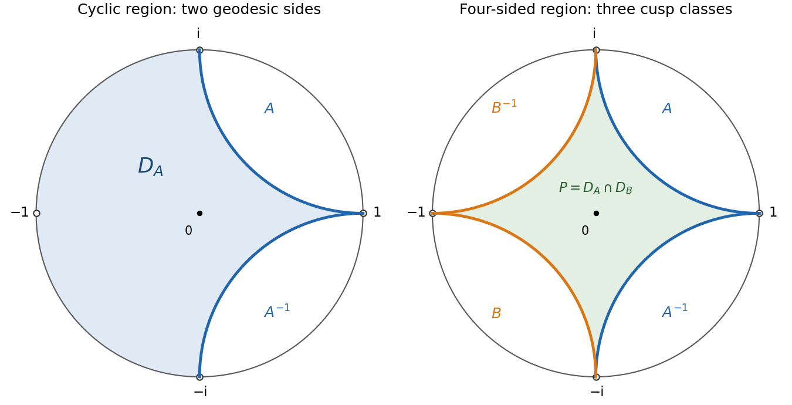

# Paper 11

↑ **Parent:** [Iii](../iii.md)

[https://www.maths.cam.ac.uk/postgrad/part-iii/files/pastpapers/2007/Paper11.pdf](https://www.maths.cam.ac.uk/postgrad/part-iii/files/pastpapers/2007/Paper11.pdf)

**Table of contents**

- [1](#1)
  - [Solution](#1/solution)
- [2](#2)
  - [Solution](#2/solution)
- [3](#3)
  - [a](#3/a)
    - [Solution](#3/a/solution)
  - [b](#3/b)
    - [Solution](#3/b/solution)
  - [Solution](#3/solution)
- [4](#4)
  - [Solution](#4/solution)
- [5](#5)
  - [Solution](#5/solution)
- [6](#6)
  - [Solution](#6/solution)

## 1

↑ **Parent:** [Paper 11](paper-11.md)

<h3 id="1/solution">Solution</h3>

↑ **Parent:** [1](#1)

The complement of $D$ is nonempty and closed. Take points $w_j$ in that complement with $|z_0-w_j|\to\delta(z_0)$. This sequence is bounded, so a subsequence converges to a point $w_0\notin D$. Continuity of distance gives $|z_0-w_0|=\delta(z_0)>0$.

Put $t=(z_0-w_0)/(z-w_0)$. On the indicated exterior region $|t|<1$, and $f=1-t$ lies in the right half-plane. Its principal [holomorphic logarithm](../../../complex-analysis.md#holomorphic-logarithm) is therefore the [power series](../../../real-analysis.md#power-series)

$$
\log f(z)=-\sum_{k=1}^{\infty}\frac{t^k}{k}.
$$

On each compact subset of that region, $|t|\leq q<1$, so the series has [locally uniform convergence](../../../real-analysis.md#locally-uniform-convergence) by comparison with $\sum q^k/k$. It does **not converge uniformly on the whole region**: choose $z=w_0+(z_0-w_0)/s$ with $0<s<1$. Then $t=s$; as $s\uparrow1$, $\log(1-s)$ tends to minus infinity while each fixed partial sum stays bounded. In particular, the remainder after any fixed number of terms is unbounded.

The [boundary-adapted holomorphic zero factor](../../../complex-analysis.md#boundary-adapted-holomorphic-zero-factor) $E_0$ is holomorphic throughout $D$, since its only possible denominator singularity is at $w_0\notin D$. The exponential never vanishes, so its only zero is $z_0$, and

$$
E_0'(z_0)=\frac{1}{z_0-w_0}\exp\left(\sum_{k=1}^K\frac1k\right)\ne0.
$$

On $|z-w_0|>2\delta(z_0)$, cancellation of the first $K$ logarithmic terms gives a [holomorphic logarithm](../../../complex-analysis.md#holomorphic-logarithm) of this zero-free restriction with

$$
\boxed{\left|\log E_0(z)\right|\leq\sum_{k>K}\frac{2^{-k}}k\leq\frac{2^{-K}}{K+1}.}
$$

Choose $K$ so that the final bound is smaller than the prescribed error. This logarithm is only asserted on the exterior region; a function with a zero cannot have a logarithm on all of $D$.

For each $z_n$, construct a [boundary-adapted holomorphic zero factor](../../../complex-analysis.md#boundary-adapted-holomorphic-zero-factor) $E_n$ whose logarithmic error is smaller than $2^{-n}$. If $L\subset D$ is compact, write $d_L=\operatorname{dist}(L,\mathbb C\setminus D)>0$. For all sufficiently large $n$, $2\delta(z_n)<d_L\leq|z-w_n|$ for every $z\in L$. Hence $\sum\log E_n$ converges absolutely and uniformly on $L$ after discarding finitely many terms. Consequently

$$
\boxed{F(z)=\prod_{n=1}^{\infty}E_n(z)}
$$

is a [holomorphic function](../../../complex-analysis.md#holomorphic-function). Its tail is the exponential of a convergent logarithmic sum and is nonzero. The finite initial product has precisely its prescribed [simple zeros](../../../complex-analysis.md#simple-zero). Since $\delta(z_n)\to0$, only finitely many $z_n$ lie in any compact subset of $D$, and this proves that $F$ has exactly the desired [simple zeros](../../../complex-analysis.md#simple-zero).

For the final [meromorphic function](../../../isolated-singularity.md#meromorphic-function) assertion, poles escaping to infinity need additional care: a locally finite pole sequence need not satisfy $\delta(z_n)\to0$. Here is the required extension of the product argument. Split the distinct poles $a$ into two sets according as

$$
\delta(a)\leq\frac{1}{1+|a|}\quad\hbox{or}\quad\delta(a)>\frac{1}{1+|a|}.
$$

In the first set, for each $\varepsilon>0$ the poles with $\delta(a)\geq\varepsilon$ are in a bounded closed subset lying at least $\varepsilon$ from the complement. Local finiteness makes this a finite set. Thus the boundary distances tend to zero. In the second set, poles in $|a|\leq R$ are at least $1/(1+R)$ from the complement, so there are finitely many of them. Thus their moduli tend to infinity.

Use the preceding factors for the first set. For the second set use the [Weierstrass elementary factors](../../../real-analysis.md#weierstrass-elementary-factor)

$$
P_K(z/a)=(1-z/a)\exp\left(\sum_{k=1}^K\frac{(z/a)^k}{k}\right).
$$

For $|z|<|a|/2$ these have the same logarithmic-tail bound as above. If a pole has order $m$, choose the factor's error smaller than $2^{-n}/m$ and raise it to the power $m$. A possible pole at zero is handled by a finite polynomial factor. On every compact subset the resulting logarithmic tails are uniformly summable, so their product $q$ is holomorphic with zeros of exactly the pole orders and no other zeros. If $M$ is the original [meromorphic function](../../../isolated-singularity.md#meromorphic-function), the product $Mq$ extends holomorphically across every pole. Writing that extension as $p$ gives the concise conclusion

$$
\boxed{M=p/q,\qquad p,q\text{ holomorphic on }D,\quad q\not\equiv0.}
$$

## 2

↑ **Parent:** [Paper 11](paper-11.md)

<h3 id="2/solution">Solution</h3>

↑ **Parent:** [2](#2)

For a continuous boundary function $g(e^{i\theta})$, its [Poisson integral on the unit disk](../../../partial-differential-equation.md#poisson-integral-on-the-unit-disk) is

$$
V(z)=\frac1{2\pi}\int_0^{2\pi}g(e^{i\theta})\frac{1-|z|^2}{|e^{i\theta}-z|^2}\,d\theta,\qquad |z|<1.
$$

The kernel is the real part of the [holomorphic function](../../../complex-analysis.md#holomorphic-function) $(e^{i\theta}+z)/(e^{i\theta}-z)$, so differentiation under the integral on compact subsets shows that $V$ is harmonic. The kernel is positive and has integral $2\pi$: expand the holomorphic fraction as $1+2\sum_{n\geq1}z^ne^{-in\theta}$ and integrate. As $z$ approaches a boundary point, the mass outside any fixed arc around that point tends to zero. Uniform continuity of $g$ therefore shows that $V$ extends continuously with boundary values $g$.

Apply this with $g=u|_{\partial\mathbb D}$. The [maximum principle for harmonic functions](../../../partial-differential-equation.md#maximum-principle-for-harmonic-functions) applied to the harmonic difference $u-V$, which vanishes on the boundary, gives

$$
\boxed{u(z)=\frac1{2\pi}\int_0^{2\pi}u(e^{i\theta})\frac{1-|z|^2}{|e^{i\theta}-z|^2}\,d\theta.}
$$

At boundary points the formula is understood through its continuous interior limit.

Now suppose a continuous function has the [mean value property](../../../partial-differential-equation.md#mean-value-property-for-harmonic-functions) and has a local maximum $M=u(z)$ at $z$. Shrink the neighborhood so that $u\leq M$ there and all sufficiently small centered circles satisfy the [mean value property](../../../partial-differential-equation.md#mean-value-property-for-harmonic-functions). On each such circle the average is $M$. If one value were smaller than $M$, continuity would make it smaller on an arc of positive length, contradicting this average. Thus every sufficiently small circle, and hence an entire neighborhood of $z$, has value $M$.

A [harmonic function](../../../partial-differential-equation.md#harmonic-function) has the [mean value property](../../../partial-differential-equation.md#mean-value-property-for-harmonic-functions). Indeed, if $m(r)$ is its average on a circle centered at $z$, the [divergence theorem](../../../calculus.md#divergence-theorem) gives

$$
m'(r)=\frac1{2\pi r}\int_{|w-z|<r}\Delta u(w)\,dA(w)=0.
$$

As $r\downarrow0$, $m(r)\to u(z)$, giving the asserted equality.

Conversely, suppose $u$ is continuous and has the [mean value property](../../../partial-differential-equation.md#mean-value-property-for-harmonic-functions). On an arbitrary closed disk compactly contained in its domain, form the harmonic [Poisson integral](../../../partial-differential-equation.md#poisson-integral) $V$ with boundary values $u$. The difference $w=u-V$ is continuous, has the [mean value property](../../../partial-differential-equation.md#mean-value-property-for-harmonic-functions), and vanishes on the boundary. If its maximum were positive, it would be attained inside. The set attaining that maximum is relatively closed and, by the local argument already proved, relatively open. [Connectedness](../../../geometry-and-topology.md#connected-space) of the disk makes $w$ constant, contradicting its boundary value. Thus $w\leq0$. Applying the same argument to $-w$ gives $w\geq0$. Therefore $u=V$ on every such disk, proving

$$
\boxed{u\text{ has the mean value property}\ \Longleftrightarrow\ u\text{ is harmonic}.}
$$

## 3

↑ **Parent:** [Paper 11](paper-11.md)

<h3 id="3/a">a</h3>

↑ **Parent:** [3](#3)

<h4 id="3/a/solution">Solution</h4>

↑ **Parent:** [A](#3/a)

Use the curvature $-1$ [hyperbolic metric](../../../geometry-and-topology.md#hyperbolic-metric) $ds=2|dz|/(1-|z|^2)$. For the disk [Möbius transformation](../../../group-theory.md#mobius-transformation) $\phi_w(z)=(z-w)/(1-\overline wz)$, set $r_w(z)=|\phi_w(z)|$. The [hyperbolic distance](../../../geometry-and-topology.md#hyperbolic-distance) satisfies

$$
\rho(w,z)=\log\frac{1+r_w(z)}{1-r_w(z)},\qquad e^{-\rho(w,z)}=\frac{1-r_w(z)}{1+r_w(z)}.
$$

The [triangle inequality](../../../topological-analysis.md#triangle-inequality) gives

$$
e^{-\rho(v,w)}e^{-\rho(w,z)}\leq e^{-\rho(v,z)}\leq e^{\rho(v,w)}e^{-\rho(w,z)}.
$$

Thus convergence of the exponential sum is independent of the base point. Taking the base point zero, it is equivalent to the [Blaschke condition](../../../complex-analysis.md#blaschke-condition) $\sum_n(1-|z_n|)<\infty$. This condition implies that only finitely many terms lie in any compact subdisk, including finitely many repetitions of any point.

To construct the required [holomorphic function](../../../complex-analysis.md#holomorphic-function), for $a\ne0$ define the [Blaschke factor](../../../group-theory.md#blaschke-factor)

$$
b_a(z)=\frac{|a|}{a}\frac{a-z}{1-\overline az},\qquad b_0(z)=z.
$$

For $|z|\leq R<1$, writing $a=|a|e^{i\alpha}$ gives

$$
1-b_a(z)=(1-|a|)\frac{1+e^{-i\alpha}z}{1-\overline az},\qquad |1-b_a(z)|\leq(1-|a|)\frac{1+R}{1-R}.
$$

Consequently, after the finitely many factors corresponding to small $|a|$ are removed, the sum of $|1-b_a|$ converges uniformly on each compact subdisk. Those factors are uniformly close to one, so their logarithms form an absolutely convergent series there. Their product tail is holomorphic and nonvanishing. Including the finitely many removed factors gives the [Blaschke product](../../../complex-analysis.md#blaschke-product)

$$
B(z)=\prod_n b_{z_n}(z)
$$

with exactly the requested zero multiplicities. Each finite product has modulus at most one in the disk, so the limit does too. Hence **$f=B/2$ maps into the open disk and has exactly the prescribed zeros**, proving the implication from the summability condition.

<h3 id="3/b">b</h3>

↑ **Parent:** [3](#3)

<h4 id="3/b/solution">Solution</h4>

↑ **Parent:** [B](#3/b)

Let $f$ be the nonzero bounded [holomorphic function](../../../complex-analysis.md#holomorphic-function) in the zero-set condition. Choose $v$ with $f(v)\ne0$ and compose with a disk [Möbius transformation](../../../group-theory.md#mobius-transformation) carrying zero to $v$. Call the resulting function $g$ and its zeros $a_n$, counted with multiplicity. Then $g(0)\ne0$ and $|g|\leq1$.

For a radius $r$ with no zero on its circle, [Jensen's formula](../../../complex-analysis.md#jensen-s-formula) gives

$$
\sum_{|a_n|<r}\log\frac r{|a_n|}=\frac1{2\pi}\int_0^{2\pi}\log|g(re^{i\theta})|\,d\theta-\log|g(0)|\leq-\log|g(0)|.
$$

To see the formula directly, divide $g$ by its finitely many interior zero factors. The logarithm of the modulus of the resulting zero-free [holomorphic function](../../../complex-analysis.md#holomorphic-function) is harmonic near the closed disk and satisfies the [mean value property](../../../partial-differential-equation.md#mean-value-property-for-harmonic-functions). The circle average of $\log|re^{i\theta}-a|$ for $|a|<r$ is $\log r$, obtained by expanding $\log(1-(a/r)e^{-i\theta})$. Subtracting its value at zero gives exactly the displayed zero sum.

Let $r\uparrow1$ through zero-free circles. Increasing limits of the nonnegative summands give

$$
\sum_n-\log|a_n|\leq-\log|g(0)|<\infty.
$$

Since $1-|a_n|\leq-\log|a_n|$, the [Blaschke condition](../../../complex-analysis.md#blaschke-condition) follows for the transformed sequence. The [hyperbolic metric](../../../geometry-and-topology.md#hyperbolic-metric) identity and the base-point comparison proved above give

$$
\boxed{\sum_n e^{-\rho(w,z_n)}<\infty\quad\text{for every }w\in\mathbb D.}
$$

This proves the reverse implication and completes the equivalence.

<h3 id="3/solution">Solution</h3>

↑ **Parent:** [3](#3)

The [Blaschke product](../../../complex-analysis.md#blaschke-product) here is taken over distinct points of the orbit; its existence is part of the hypothesis. It is not necessary to assert that every discrete orbit satisfies the [Blaschke condition](../../../complex-analysis.md#blaschke-condition).

The modulus of a [Blaschke factor](../../../group-theory.md#blaschke-factor) is the [pseudohyperbolic distance](../../../geometry-and-topology.md#pseudohyperbolic-distance). Thus, away from the orbit,

$$
|B(z)|=\prod_{a\in G(0)}\left|\frac{z-a}{1-\overline az}\right|=\prod_{a\in G(0)}\tanh\frac{\rho(z,a)}2.
$$

The logarithms converge absolutely at such a point, by the compact convergence estimate for the [Blaschke product](../../../complex-analysis.md#blaschke-product). Every $T\in G$ preserves the [hyperbolic metric](../../../geometry-and-topology.md#hyperbolic-metric) and permutes the orbit. Reindexing this convergent product yields $|B(Tz)|=|B(z)|$.

The functions $B\circ T$ and $B$ have the same simple zero set, since $T$ is a [biholomorphism](../../../complex-analysis.md#biholomorphism). Their quotient therefore extends holomorphically and without zeros across the orbit. It has modulus one everywhere. The [open mapping theorem](../../../complex-analysis.md#open-mapping-theorem-complex-analysis) makes it a constant, denoted $\chi(T)$. Finally

$$
B(STz)=\chi(S)B(Tz)=\chi(S)\chi(T)B(z).
$$

Since $B$ is not identically zero, cancellation gives

$$
\boxed{\chi(ST)=\chi(S)\chi(T),\qquad |\chi(T)|=1,\qquad B(Tz)=\chi(T)B(z).}
$$

This is the [automorphy character of an orbit Blaschke product](../../../complex-analysis.md#automorphy-character-of-an-orbit-blaschke-product). The equal-modulus argument is essential: equality of zero sets alone would not make the quotient of two bounded [holomorphic functions](../../../complex-analysis.md#holomorphic-function) constant.

## 4

↑ **Parent:** [Paper 11](paper-11.md)

<h3 id="4/solution">Solution</h3>

↑ **Parent:** [4](#4)

A representative of an element of $G$ is a determinant-one matrix $\left(\begin{smallmatrix}a&b\\\overline b&\overline a\end{smallmatrix}\right)$ over the [Gaussian integers](../../../commutative-algebra.md#gaussian-integer), considered up to its common sign. It acts by a [Möbius transformation](../../../group-theory.md#mobius-transformation) of the disk. Since $T(0)=b/\overline a$ and $|a|^2-|b|^2=1$, we have

$$
|a|^2=\frac1{1-|T(0)|^2}.
$$

Only finitely many Gaussian-integer pairs $(a,b)$ can have $T(0)$ in a fixed compact subdisk. More generally, if $T$ carries some point of a compact set $K$ into $K$, and $K$ lies in the hyperbolic ball of radius $R$ about zero, the [triangle inequality](../../../topological-analysis.md#triangle-inequality) gives $\rho(0,T0)\leq2R$. Thus there are only finitely many such $T$. This proves the [properly discontinuous group action](../../../geometric-group-theory.md#properly-discontinuous-group-action), and in particular discreteness. The specified $A,B$ belong to $G$, so their subgroup $H$ is discrete as well.

The fixed-point equations reduce to $-i(z-1)^2=0$ for $A$ and $i(z+1)^2=0$ for $B$. Thus their unique fixed points are respectively $1$ and $-1$ on the ideal boundary. Neither transformation is the identity; their displayed determinant-one representatives have trace two. They are therefore [parabolic Möbius transformations](../../../geometry-and-topology.md#parabolic-element-of-psl2-r).

To find the [Dirichlet domains](../../../geometric-group-theory.md#dirichlet-domain), use the [Möbius transformation](../../../group-theory.md#mobius-transformation)

$$
C(z)=i\frac{1+z}{1-z},\qquad C(0)=i.
$$

It takes the disk to the upper half-plane, and direct substitution gives

$$
CAC^{-1}(w)=w-2,\qquad CBC^{-1}(w)=\frac{w}{2w+1}.
$$

For $w=x+iy$ and $v$ in the upper half-plane, the [hyperbolic distance](../../../geometry-and-topology.md#hyperbolic-distance) obeys $\cosh\rho(w,v)=1+|w-v|^2/(2y\operatorname{Im}v)$. Since $C(A^k0)=i-2k$, the distance inequalities are equivalent to

$$
x^2+(y-1)^2\leq(x+2k)^2+(y-1)^2\quad(k\in\mathbb Z).
$$

These reduce to $kx+k^2\geq0$ for all integers $k$. The cases $k=1,-1$ imply $-1\leq x\leq1$, which also suffices for every other $k$. Therefore the cyclic [Dirichlet domain](../../../geometric-group-theory.md#dirichlet-domain) becomes the strip $|\operatorname{Re}w|\leq1$.

The two vertical [hyperbolic geodesics](../../../geometry-and-topology.md#geodesic-in-the-poincare-half-plane-model) pull back to arcs joining $1$ to $i$ and $1$ to $-i$. In disk coordinates they are the circles $|z-(1+i)|=1$ and $|z-(1-i)|=1$, restricted to the disk. Thus

$$
\boxed{D_A=\{z\in\mathbb D:|z-(1+i)|\geq1,\ |z-(1-i)|\geq1\}.}
$$

Conjugating by $z\mapsto-z$ gives $B$, so its two [hyperbolic geodesics](../../../geometry-and-topology.md#geodesic-in-the-poincare-half-plane-model) join $-1$ to $i$ and $-1$ to $-i$, and

$$
\boxed{D_B=\{z\in\mathbb D:|z-(-1+i)|\geq1,\ |z-(-1-i)|\geq1\}.}
$$

The requested drawing and their intersection are shown below.

**[Figure 1](#4/image-cyclic-parabolic-dirichlet-region-and-the-four-sided-region-for-the-two-generators). Cyclic parabolic Dirichlet region and the four-sided region for the two generators**.

For any $z_0$, the orbit points satisfying $\rho(0,Tz_0)\leq\rho(0,z_0)$ form a nonempty finite set, by proper discontinuity and compactness of closed hyperbolic balls. Choose a closest one, $q=Tz_0$. For every integer $k$, its minimality gives

$$
\rho(0,q)\leq\rho(0,A^{-k}q)=\rho(A^k0,q),
$$

and the same inequality with $B$. Hence $q$ lies in the [ideal hyperbolic quadrilateral](../../../geometry-and-topology.md#ideal-hyperbolic-quadrilateral)

$$
\boxed{P=D_A\cap D_B=\{z\in\mathbb D:|z-(\varepsilon+i\eta)|\geq1\text{ for }\varepsilon,\eta\in\{1,-1\}\}.}
$$

Its ideal vertices are $1,i,-1,-i$.

For the quotient identification, it remains to justify that this covering region is a fundamental polygon. The four open corner caps excluded by $P$ are pairwise disjoint inside the disk. The transformation $A$ carries the exterior of the lower-right cap into the upper-right cap; $A^{-1}$ reverses the pairing. Similarly $B$ carries the exterior of the upper-left cap into the lower-left cap, and $B^{-1}$ reverses this. These assertions follow either from the upper-half-plane formulas or by mapping their boundary circles and testing zero: $A0=(1+i)/2$ and $B0=(-1-i)/2$.

Apply a reduced word in $A^{\pm1},B^{\pm1}$ from right to left to a point in the interior of $P$. The first letter puts it into its target cap. Every subsequent letter can do the same, since its inverse cap is distinct from the preceding target cap unless the word cancels. Thus the final point lies in the target cap of the leftmost letter, never in the interior of $P$. This [ping-pong lemma](../../../geometric-group-theory.md#ping-pong-lemma) argument proves freeness and disjointness of distinct translated interiors. Together with orbit coverage it makes $P$ a fundamental polygon. The corresponding argument on closed caps shows that boundary identifications are generated by the stated side pairings.

The generator $A$ pairs the side from $1$ to $-i$ with the side from $1$ to $i$, fixing the ideal endpoint $1$ and sending $-i$ to $i$. The generator $B$ pairs the side from $-1$ to $i$ with the side from $-1$ to $-i$, fixing $-1$ and sending $i$ to $-i$. There are three ideal-vertex classes: $\{1\}$, $\{-1\}$ and $\{i,-i\}$. The first two give parabolic ends from $A,B$; the third does too, since $AB$ is a nonidentity parabolic transformation fixing $i$. Adding one point at each end produces an oriented closed surface with one face, two edges and three vertices. Its [Euler characteristic](../../../homology.md#euler-characteristic) is $1-2+3=2$, so it is a sphere. Removing the three added points gives a [thrice-punctured sphere](../../../topology.md#thrice-punctured-sphere), proving

$$
\boxed{\mathbb D/H\text{ is homeomorphic to a thrice-punctured sphere}.}
$$

## 5

↑ **Parent:** [Paper 11](paper-11.md)

<h3 id="5/solution">Solution</h3>

↑ **Parent:** [5](#5)

On a connected [Riemann surface](../../../complex-analysis.md#riemann-surfaces) $R$, a [Perron family of subharmonic functions](../../../analysis.md#perron-family-of-subharmonic-functions) is a nonempty family $\mathcal P$ of real continuous [subharmonic functions](../../../partial-differential-equation.md#subharmonic-function) closed under pairwise maxima and under harmonic lifting on every relatively compact coordinate disk. A [harmonic lifting of a continuous subharmonic function](../../../partial-differential-equation.md#harmonic-lifting-of-a-continuous-subharmonic-function) replaces its values inside such a disk by the harmonic [Poisson integral](../../../partial-differential-equation.md#poisson-integral) of its boundary values, leaving the function unchanged outside. Harmonic comparison shows that the lift dominates the original function. The lift is continuous and remains subharmonic by harmonic comparison across the circle.

Write $U=\sup_{v\in\mathcal P}v$. Because the family is nonempty and its members are finite, $U$ cannot be minus infinity. Suppose first $U(p)<\infty$, and choose a relatively compact coordinate disk $V$ containing $p$. Choose $v_n\in\mathcal P$ approaching $U(p)$ at $p$. Lift $v_1$ on $V$ to get $h_1$, and recursively lift $\max(h_{n-1},v_n)$ to get $h_n$. These are members of the family, harmonic on $V$, and increasing. Also $h_n(p)\to U(p)$.

The nonnegative [harmonic functions](../../../partial-differential-equation.md#harmonic-function) $h_n-h_1$ are bounded at $p$. The [Harnack inequality for harmonic functions](../../../partial-differential-equation.md#harnack-inequality-for-harmonic-functions), on chains of compact subdisks, bounds them uniformly on every compact subset of $V$. The [Poisson integral](../../../partial-differential-equation.md#poisson-integral) then bounds their derivatives on smaller subdisks. Compact convergence and the [mean value property](../../../partial-differential-equation.md#mean-value-property-for-harmonic-functions) show that their increasing limit is finite and harmonic; denote the limit of $h_n$ by $h$.

Fix an arbitrary $v\in\mathcal P$, and let $k_n$ be the lift of $\max(v,h_n)$ on $V$. These functions increase, are harmonic on $V$, and satisfy $h_n\leq k_n\leq U$. They are bounded at $p$, so the same [Harnack inequality for harmonic functions](../../../partial-differential-equation.md#harnack-inequality-for-harmonic-functions) argument gives a harmonic limit $k$. At $p$, $k(p)=h(p)=U(p)$, whereas $k\geq h$ on $V$. The nonnegative harmonic difference has an interior zero, so the [strong maximum principle for harmonic functions](../../../partial-differential-equation.md#strong-maximum-principle-for-harmonic-functions) gives $k=h$. Since $v\leq k_n$, we have $v\leq h$. Taking the supremum over $v$ gives $U\leq h$, and $h_n\leq U$ gives the opposite inequality. Thus $U=h$ on $V$.

The finite locus of $U$ is open by this argument. It is also closed: if a point is a limit of finite points, choose a coordinate disk around it and a finite point in that disk; the preceding argument applied with that finite point shows that $U$ is finite on the entire disk. [Connectedness](../../../geometry-and-topology.md#connected-space) now proves the dichotomy

$$
\boxed{U\equiv+\infty\quad\text{or}\quad U\text{ is finite and harmonic on }R.}
$$

Both occur. The family of all continuous [subharmonic functions](../../../partial-differential-equation.md#subharmonic-function) bounded above by zero is a [Perron family of subharmonic functions](../../../analysis.md#perron-family-of-subharmonic-functions), since the [maximum principle for harmonic functions](../../../partial-differential-equation.md#maximum-principle-for-harmonic-functions) keeps every lift below zero; it contains zero, so its supremum is zero. The family of constant functions with positive integer values is also a [Perron family of subharmonic functions](../../../analysis.md#perron-family-of-subharmonic-functions), and its supremum is everywhere infinite.

For the final application, the radius must enclose the evaluation point. For $|z|<r<1$ set

$$
H_r(z)=\frac1{2\pi}\int_0^{2\pi}u(re^{i\theta})\frac{r^2-|z|^2}{|re^{i\theta}-z|^2}\,d\theta.
$$

This is the [harmonic lifting of a continuous subharmonic function](../../../partial-differential-equation.md#harmonic-lifting-of-a-continuous-subharmonic-function) on the radius-$r$ disk. Hence $H_r\geq u$ there. If $|z|<r<s<1$, $H_s\geq u=H_r$ on the radius-$r$ boundary, so harmonic comparison gives $H_s\geq H_r$ throughout the smaller disk. The increasing limit is either everywhere infinite or finite and harmonic, by the preceding Harnack argument and propagation across overlapping disks. In the finite case it dominates $u$. Any [harmonic majorant](../../../partial-differential-equation.md#harmonic-majorant) $h$ of $u$ dominates $H_r$ by boundary comparison and therefore dominates their limit. Thus the precise conclusion is

$$
\boxed{h_{\min}(z)=\lim_{r\uparrow1}H_r(z)=\sup_{|z|<r<1}H_r(z),}
$$

provided a finite [harmonic majorant](../../../partial-differential-equation.md#harmonic-majorant) exists. This is the [least harmonic majorant by expanding disk lifts](../../../partial-differential-equation.md#least-harmonic-majorant-by-expanding-disk-lifts).

There are two necessary qualifications to the printed formula. First, the supremum cannot include $r<|z|$. For example, if $u\equiv-1$ and $z\ne0$, the kernel has normalized integral $1$ for $r>|z|$ and $-1$ for $r<|z|$. The displayed integral is consequently $-1$ in the first case and $+1$ in the second. The unrestricted supremum would be $+1$, although the least [harmonic majorant](../../../partial-differential-equation.md#harmonic-majorant) is $-1$; at $r=|z|$ the kernel is undefined. Second, a finite [harmonic majorant](../../../partial-differential-equation.md#harmonic-majorant) need not exist. The continuous [subharmonic function](../../../partial-differential-equation.md#subharmonic-function)

$$
u(z)=\frac1{1-|z|^2},\qquad \Delta u(z)=\frac{4(1+|z|^2)}{(1-|z|^2)^3}>0,
$$

has $H_r\equiv(1-r^2)^{-1}\to+\infty$. If $h\geq u$ were harmonic, its centered circular means would equal $h(0)$ and dominate $(1-r^2)^{-1}$ for every $r$, an impossibility. In this case the limit formula holds only in the extended sense, with value $+\infty$ and no finite least [harmonic majorant](../../../partial-differential-equation.md#harmonic-majorant).

## 6

↑ **Parent:** [Paper 11](paper-11.md)

<h3 id="6/solution">Solution</h3>

↑ **Parent:** [6](#6)

A [hyperbolic Riemann surface in potential theory](../../../complex-analysis.md#hyperbolic-riemann-surface-in-potential-theory) is a noncompact [Riemann surface](../../../complex-analysis.md#riemann-surfaces) admitting a positive [Green function on a Riemann surface](../../../analysis.md#green-function-on-a-riemann-surface). With pole $p$, this is a positive function harmonic off $p$, having local form $-\log|\zeta|$ plus a harmonic function in a coordinate $\zeta(p)=0$, and obtained as the minimal such positive function by exhaustion. This is a noncircular definition for the present proof. For a simply connected surface it is equivalent to disk conformal type; for arbitrary surfaces potential-theoretic hyperbolicity and disk universal-cover type should be distinguished.

The [unit disk](../../../geometry-and-topology.md#unit-disk) is an example. At pole zero its function is $G(z,0)=-\log|z|$: it is positive in the punctured disk, harmonic there, has the correct logarithmic singularity, and tends to zero at the boundary. If another positive function has the same singularity and is harmonic elsewhere, subtract $G$ and apply the [maximum principle for harmonic functions](../../../partial-differential-equation.md#maximum-principle-for-harmonic-functions) on disks of radius $r<1$; the boundary lower bound is $\log r$. Letting $r\uparrow1$ shows that the other function dominates $G$. Thus $G$ is indeed the positive [Green function on a Riemann surface](../../../analysis.md#green-function-on-a-riemann-surface). At a general pole it is

$$
\boxed{G(z,p)=\log\left|\frac{1-\overline pz}{z-p}\right|.}
$$

Here is a [Green-function exhaustion proof of disk uniformization](../../../complex-analysis.md#green-function-exhaustion-proof-of-disk-uniformization). The main analytic idea is to build conformal maps on bordered disks from their Green functions and pass to an extremal limit. The positive global Green function prevents that limit from becoming constant.

First exhaust the noncompact simply connected surface $R$ by relatively compact domains $R_n$ containing $p$, each with a smooth Jordan boundary. This topological step does not use conformal uniformization: take regular neighborhoods of finitely many coordinate disks covering successive compact sets and fill bounded complementary components. Simple connectedness and the [Jordan curve theorem](../../../topology.md#jordan-curve-theorem) make the filled neighborhoods topological disks; enlarge them to be nested.

Each $R_n$ has a zero-boundary [Green function on a Riemann surface](../../../analysis.md#green-function-on-a-riemann-surface) $G_n(\cdot,p)$. One analytic construction, independent of conformal uniformization, is as follows. Equip the compact bordered domain with a smooth [conformal metric](../../../complex-analysis.md#conformal-metric). Multiply $-\log|\zeta|$ by a smooth [cutoff function](../../../distribution-theory.md#cutoff-function) equal to one near $p$ and zero near the boundary; call the result $s$. Distributionally

$$
-\Delta s=2\pi\delta_p+k,
$$

where $k$ is smooth and supported away from $p$. Solve $\Delta v=k$ with zero boundary data. This auxiliary [Dirichlet problem](../../../analysis.md#dirichlet-problem) can be obtained by minimizing $\frac12\int|\nabla v|^2+\int kv$ over functions with zero boundary trace: the [Poincaré inequality](../../../sobolev-space.md#poincare-inequality) gives [coercivity](../../../real-analysis.md#coercive-function), minimization in a [Hilbert space](../../../hilbert-space.md) gives a [weak solution](../../../partial-differential-equation.md#weak-solution), and interior and smooth-boundary [elliptic regularity](../../../distribution-theory.md#elliptic-regularity) give a smooth solution. Then $G_n=s+v$ is harmonic away from $p$, has the logarithmic pole, and vanishes at the boundary. It is positive by the [maximum principle for harmonic functions](../../../partial-differential-equation.md#maximum-principle-for-harmonic-functions), applied after removing a sufficiently small circle around its positive pole. This construction uses ordinary linear elliptic existence, not the desired uniformization theorem. Equivalently, the same bordered-domain Green functions can be constructed by the [Perron method for the Dirichlet problem](../../../analysis.md#perron-method) using local logarithmic barriers.

On $R_n\setminus\{p\}$ choose local [harmonic conjugates](../../../partial-differential-equation.md#harmonic-conjugate) $G_n^*$. Their period around the pole is $-2\pi$, and every closed loop is homologous to an integer multiple of that loop. Therefore

$$
f_n=\exp(-G_n-iG_n^*)
$$

is a single-valued [holomorphic function](../../../complex-analysis.md#holomorphic-function). It extends across $p$ with one simple zero and has no others. Since $G_n>0$, $|f_n|<1$; since $G_n=0$ on the boundary, $|f_n|\to1$ there. Thus $f_n:R_n\to\mathbb D$ is proper. For any $a\in\mathbb D$, choose a smooth interior contour sufficiently close to the boundary that $|f_n|>|a|$ everywhere on it. The contour surrounds $p$ and all possible preimages of $a$, because $|f_n|>|a|$ throughout a thin boundary collar. By [Rouché's theorem](../../../complex-analysis.md#rouche-s-theorem), $f_n-a$ has the same number of zeros inside as $f_n$, namely one. Hence $f_n$ is onto and one-to-one, with nonzero derivative: it is a [biholomorphism](../../../complex-analysis.md#biholomorphism) from $R_n$ to the disk.

Write near $p$

$$
G_n=-\log|\zeta|+c_n+o(1).
$$

Multiply $f_n$ by a unit constant so that, in the fixed coordinate, $f_n'(p)=e^{-c_n}>0$. Domain monotonicity gives $G_n\leq G_{n+1}$: their difference is harmonic even at $p$ and nonnegative on $\partial R_n$. The global positive [Green function on a Riemann surface](../../../analysis.md#green-function-on-a-riemann-surface) $G_R$ similarly majorizes every $G_n$. Comparing the regular parts shows that $c_n$ increases and is bounded above by the finite regular part of $G_R$ at $p$. Consequently

$$
f_n'(p)\longrightarrow d>0.
$$

On each fixed compact subdomain, the $f_n$ are eventually bounded [holomorphic functions](../../../complex-analysis.md#holomorphic-function). [Montel theorem](../../../complex-dynamics.md#montel-s-theorem) and a diagonal subsequence therefore give a [locally uniform convergence](../../../real-analysis.md#locally-uniform-convergence) limit $F:R\to\mathbb D$ with $F(p)=0$ and $F'(p)=d>0$. The [maximum modulus principle](../../../complex-analysis.md#maximum-modulus-principle) keeps its values strictly inside the disk. It is injective: for fixed $q$, the functions $f_n-f_n(q)$ have no zeros away from $q$; [Hurwitz's theorem](../../../complex-analysis.md#hurwitz-s-theorem) implies that their nonconstant limit has no other zeros. This is the [locally uniform limit of univalent functions](../../../complex-analysis.md#locally-uniform-limit-of-univalent-functions) argument.

There is also an extremality property. For any [holomorphic function](../../../complex-analysis.md#holomorphic-function) $g:R\to\mathbb D$ with $g(p)=0$, the function $g\circ f_n^{-1}$ is a disk self-map fixing zero. The [Schwarz lemma](../../../analysis.md#schwarz-lemma) gives $|g'(p)|\leq f_n'(p)$. Passing to the limit yields $|g'(p)|\leq d=F'(p)$.

Finally suppose $F$ omits $a\in\mathbb D$. Necessarily $a\ne0$. Apply the disk [Möbius transformation](../../../group-theory.md#mobius-transformation) $\phi_a(w)=(w-a)/(1-\overline aw)$. The nowhere-zero function $\phi_a\circ F$ has a global [holomorphic logarithm](../../../complex-analysis.md#holomorphic-logarithm) because $R$ is [simply connected](../../../algebraic-topology.md#simply-connected-space), hence a [holomorphic square root](../../../complex-analysis.md#holomorphic-square-root) $h$. It maps into the disk and $|h(p)|=\sqrt{|a|}$. Normalize it by setting $g=\phi_{h(p)}\circ h$, so $g(p)=0$. Direct differentiation gives

$$
|g'(p)|=\frac{1-|a|^2}{2\sqrt{|a|}(1-|a|)}|F'(p)|=\frac{1+|a|}{2\sqrt{|a|}}d>d.
$$

The strict inequality follows from $(1-\sqrt{|a|})^2>0$. This contradicts extremality. Therefore $F$ omits no point, and we conclude

$$
\boxed{R\text{ is conformally equivalent to }\mathbb D.}
$$

## ↑ Ancestors (8)

1. [Iii](../iii.md)
2. [2007](../../2007.md)
3. [Past exam of the mathematics course of the University of Cambridge](../../../past-exam-of-the-mathematics-course-of-the-university-of-cambridge.md)
4. [Mathematics course of the University of Cambridge](../../../university-of-cambridge.md#mathematics-course-of-the-university-of-cambridge)
5. [Course of the University of Cambridge](../../../university-of-cambridge.md#course-of-the-university-of-cambridge)
6. [University of Cambridge](../../../university-of-cambridge.md)
7. [List of universities](../../../README.md#list-of-universities)
8. [Codex Wiki](../../../README.md)
