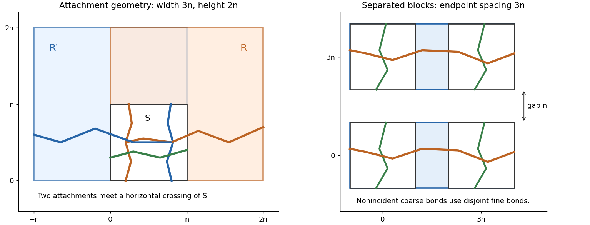

<h1 id="5/ii/solution">Solution</h1>

↑ **Parent:** [Ii](../ii.md)

We first derive the [reflected attachment estimate for percolation](../../../../../../reflected-attachment-estimate-for-percolation.md). Put $R=[0,m]\times[0,2n]$, $m\geq n$, and $S=[0,n]^2$. Let $X(R)$ require an open vertical crossing of $S$ together with an open path in $R$ attaching it to the right side of $R$. Then

$$
\mathbb P_p(X(R))\geq\frac12 h_p(m,2n)h_p(n,n).
$$

To prove this, explore the leftmost vertical open crossing $P$ of $S$, revealing bonds on $P$ and to its left, but none strictly to its right. One can implement this exploration by following the boundary of the set accessible from the left using closed dual bonds; its right boundary is the extremal open crossing when that crossing exists. Thus fixing its outcome leaves right-side bonds in their original independent distribution.

For each possible explored $P$, reflect its geometry in $y=n$ and join it to its reflection to obtain a bottom-to-top separator $L$ of $R$. This reflected portion is only a geometrical separator and is not presumed open. Let $Y_-$ and $Y_+$ mean that an open path from the right boundary reaches, respectively, the lower or upper half of $L$, staying to its right until its endpoint. Any horizontal open crossing of $R$, followed from right to left until its first meeting with $L$, witnesses at least one of these events. Reflection in $y=n$ swaps $Y_-$ and $Y_+$ and preserves the independent measure. Hence

$$
2\mathbb P_p(Y_-)\geq\mathbb P_p(Y_-\cup Y_+)\geq h_p(m,2n).
$$

The bonds tested by $Y_-$ remain unexposed after specifying $P$; conditional on that exploration its probability is still the unconditional one for this deterministic separator. Its occurrence attaches the genuinely open lower crossing $P$ to the right side. Average over $P$ to obtain the attachment estimate.

Now take $R=[0,2n]\times[0,2n]$ and $R'=[-n,n]\times[0,2n]$, with common corner square $S=[0,n]^2$. Use $X(R)$, its horizontal reflection in $R'$, and a horizontal open crossing of $S$. The last crossing meets the vertical crossings of $S$ in both attachment events, so these three events give a horizontal crossing of $R\cup R'$. All three events are [increasing events](../../../../../../increasing-event.md), so the [Harris lemma](../../../../../../harris-inequality.md) gives

$$
\begin{aligned}
h_{1/2}(3n,2n)
&\geq\left[\frac12h_{1/2}(2n,2n)h_{1/2}(n,n)\right]^2h_{1/2}(n,n)\\
&\geq(1/8)^2(1/2)=\boxed{2^{-7}}.
\end{aligned}
$$

**[Figure 1](#5/ii/image-reflected-crossing-attachments-and-separated-supports-for-coarse-bonds). Reflected crossing attachments and separated supports for coarse bonds**.

For all aspect ratios, glue a width-$m_1$, height-$2s$ rectangle to a width-$m_2$, height-$2s$ rectangle with an overlap square of side $2s$. Their horizontal crossings and an overlap vertical crossing imply a crossing of their union. Again the [Harris lemma](../../../../../../harris-inequality.md) gives

$$
h_{1/2}(m_1+m_2-2s,2s)\geq\frac12h_{1/2}(m_1,2s)h_{1/2}(m_2,2s).
$$

Adding a $3s$-wide rectangle therefore yields

$$
h_{1/2}(m+s,2s)\geq2^{-8}h_{1/2}(m,2s),
\qquad h_{1/2}(ks,2s)\geq2^{17-8k}\quad(k\geq3).
$$

For height $n\geq2$, let $s=\lfloor n/2\rfloor$, so $2s\leq n$ and $s\geq n/3$. Choose an integer $k\geq\max(3,3\lambda)$. For $m\leq\lambda n$, we have $m\leq ks$; restricting to height $2s$ and extracting a shorter horizontal crossing gives

$$
h_{1/2}(m,n)\geq h_{1/2}(ks,2s)\geq2^{17-8k}.
$$

For $n=1$, the horizontal bottom-row path gives $h_{1/2}(m,1)\geq2^{-\lceil\lambda\rceil}$ whenever the allowed integer $m\geq1$ exists. Thus **one may take $c_\lambda=\min(2^{17-8k},2^{-\lceil\lambda\rceil})>0$**. This proves the requested uniform [rectangle crossing in bond percolation](../../../../../../rectangle-crossing-in-bond-percolation.md) bound, rather than assuming the [Russo-Seymour-Welsh theorem](../../../../../../russo-seymour-welsh-theorem.md).

## ↑ Ancestors (11)

1. [Ii](../ii.md)
2. [5](../../5.md)
3. [Paper 13](../../../paper-13-split.md)
4. [Iii](../../../split.md)
5. [2007](../../../../split.md)
6. [Past exam of the mathematics course of the University of Cambridge](../../../../../split.md)
7. [Mathematics course of the University of Cambridge](../../../../../../mathematics-course-of-the-university-of-cambridge.md)
8. [Course of the University of Cambridge](../../../../../../course-of-the-university-of-cambridge.md)
9. [University of Cambridge](../../../../../../university-of-cambridge-split.md)
10. [List of universities](../../../../../../list-of-universities.md)
11. [Codex Wiki](../../../../../../split.md)
