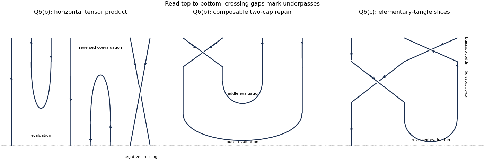

# Paper 2

↑ **Parent:** [Iii](../iii.md)

[https://www.maths.cam.ac.uk/postgrad/part-iii/files/pastpapers/2007/Paper2.pdf](https://www.maths.cam.ac.uk/postgrad/part-iii/files/pastpapers/2007/Paper2.pdf)

**Table of contents**

- [1](#1)
  - [a](#1/a)
    - [Solution](#1/a/solution)
  - [b](#1/b)
    - [Solution](#1/b/solution)
  - [c](#1/c)
    - [Solution](#1/c/solution)
- [2](#2)
  - [a](#2/a)
    - [Solution](#2/a/solution)
  - [b](#2/b)
    - [Solution](#2/b/solution)
- [3](#3)
  - [a](#3/a)
    - [Solution](#3/a/solution)
  - [b](#3/b)
    - [Solution](#3/b/solution)
  - [c](#3/c)
    - [Solution](#3/c/solution)
  - [d](#3/d)
    - [Solution](#3/d/solution)
- [4](#4)
  - [a](#4/a)
    - [Solution](#4/a/solution)
  - [b](#4/b)
    - [Solution](#4/b/solution)
  - [c](#4/c)
    - [Solution](#4/c/solution)
  - [d](#4/d)
    - [Solution](#4/d/solution)
- [5](#5)
  - [a](#5/a)
    - [Solution](#5/a/solution)
  - [b](#5/b)
    - [Solution](#5/b/solution)
  - [c](#5/c)
    - [Solution](#5/c/solution)
- [6](#6)
  - [a](#6/a)
    - [Solution](#6/a/solution)
  - [b](#6/b)
    - [Solution](#6/b/solution)
  - [c](#6/c)
    - [Solution](#6/c/solution)
  - [d](#6/d)
    - [Solution](#6/d/solution)

## 1

↑ **Parent:** [Paper 2](paper-2.md)

<h3 id="1/a">a</h3>

↑ **Parent:** [1](#1)

<h4 id="1/a/solution">Solution</h4>

↑ **Parent:** [A](#1/a)

Use $q\in k^\times$ and the [quantum plane](../../../noncommutative-algebra.md#quantum-plane) convention $yx=qxy$. In this convention $SL_q(2)$ is the [coordinate Hopf algebra of quantum SL2](../../../algebra.md#coordinate-hopf-algebra-of-quantum-sl2) with the catalog parameter replaced by $q^{-1}$. It is generated by $a,b,c,d$, subject to

$$
\begin{gathered}
ba=qab,\quad ca=qac,\quad db=qbd,\quad dc=qcd,\quad bc=cb,\\
da-ad=(q-q^{-1})bc,\qquad ad-q^{-1}bc=1.
\end{gathered}
$$

Equivalently the last determinant relation is $da-qbc=1$. The [quantum determinant](../../../algebra.md#quantum-determinant) convention is essential: these relations use the inverse of the parameter in the catalog's $ab=qba$ convention.

Writing $T=\left(\begin{smallmatrix}a&b\\c&d\end{smallmatrix}\right)$, the [comultiplication](../../../category-theory.md#comultiplication) is matrix multiplication, $\Delta t_{ij}=\sum_kt_{ik}\otimes t_{kj}$. Explicitly,

$$
\begin{aligned}
\Delta a&=a\otimes a+b\otimes c,&\Delta b&=a\otimes b+b\otimes d,\\
\Delta c&=c\otimes a+d\otimes c,&\Delta d&=c\otimes b+d\otimes d.
\end{aligned}
$$

The [counit](../../../category-theory.md#counit) is $\varepsilon(a)=\varepsilon(d)=1$, $\varepsilon(b)=\varepsilon(c)=0$. Extend $\Delta$ and $\varepsilon$ as unital [algebra homomorphisms over a field](../../../algebra.md#algebra-homomorphism-over-a-field). Matrix multiplication is associative, giving coassociativity; multiplication by the identity matrix gives the [counit](../../../category-theory.md#counit) laws. The [antipode](../../../algebra.md#antipode) is

$$
\boxed{S(T)=\begin{pmatrix}d&-qb\\-q^{-1}c&a\end{pmatrix}.}
$$

For example $(TS(T))_{11}=ad-q^{-1}bc=1$ and $(S(T)T)_{11}=da-qbc=1$, while the off-diagonal entries vanish by the commutation relations. Thus this is a [Hopf algebra](../../../algebra.md#hopf-algebra), not merely an algebra presentation.

<h3 id="1/b">b</h3>

↑ **Parent:** [1](#1)

<h4 id="1/b/solution">Solution</h4>

↑ **Parent:** [B](#1/b)

Take the right [coaction](../../../linear-algebra.md#coaction) of the [coordinate Hopf algebra of quantum SL2](../../../algebra.md#coordinate-hopf-algebra-of-quantum-sl2) on the [quantum plane](../../../noncommutative-algebra.md#quantum-plane) to be

$$
\delta(x)=x\otimes a+y\otimes c,\qquad
\delta(y)=x\otimes b+y\otimes d.
$$

It is extended multiplicatively and sends $1$ to $1\otimes1$. The matrix [comultiplication](../../../category-theory.md#comultiplication) and [counit](../../../category-theory.md#counit) verify the [coaction](../../../linear-algebra.md#coaction) identities on $x,y$. To check that it descends to the [quantum plane](../../../noncommutative-algebra.md#quantum-plane), expand

$$
\delta(y)\delta(x)-q\delta(x)\delta(y)
=x^2\otimes(ba-qab)+y^2\otimes(dc-qcd)
+xy\otimes[bc+q da-q ad-q^2cb]=0.
$$

The last bracket vanishes because $bc=cb$ and $da-ad=(q-q^{-1})bc$.

For the requested calculation, $ca=qac$ and $yx=qxy$ give

$$
\delta(x)^2=x^2\otimes a^2+(1+q^2)xy\otimes ac+y^2\otimes c^2.
$$

Multiply by $\delta(y)$, put all [monomials](../../../polynomial.md#monomial) into the order $x^ry^s$, and use $bc=cb$. The answer is

$$
\boxed{\begin{aligned}
\delta(x^2y)={}&x^3\otimes a^2b
+x^2y\otimes\bigl(a^2d+(1+q^2)abc\bigr)\\
&+xy^2\otimes\bigl((1+q^2)acd+q^2bc^2\bigr)
+y^3\otimes c^2d.
\end{aligned}}
$$

A left-[coaction](../../../linear-algebra.md#coaction) convention transposes where the matrix coefficients occur; the displayed answer fixes the right [coaction](../../../linear-algebra.md#coaction) throughout.

<h3 id="1/c">c</h3>

↑ **Parent:** [1](#1)

<h4 id="1/c/solution">Solution</h4>

↑ **Parent:** [C](#1/c)

An $R$-point means a unital [algebra homomorphism over a field](../../../algebra.md#algebra-homomorphism-over-a-field) $\alpha:k_q[x,y]\to R$, as in [points of a noncommutative algebra](../../../algebra.md#points-of-a-noncommutative-algebra). It is specified by $X=\alpha(x)$ and $Y=\alpha(y)$ satisfying $YX=qXY$. For $R=\mathbb C$ and $q$ not a [root of unity](../../../algebra.md#root-of-unity), $q\ne1$, so scalar commutativity gives $(1-q)XY=0$. Hence the **scalar points are the union of the two coordinate axes**:

$$
\boxed{\{(z,0):z\in\mathbb C\}\cup\{(0,w):w\in\mathbb C\}.}
$$

For matrix-valued [points of a noncommutative algebra](../../../algebra.md#points-of-a-noncommutative-algebra), put $H=\mathbb C^n$ and let $H_\lambda(X)=\ker(X-\lambda I)^n$ be a [generalized eigenspace](../../../linear-operator-theory.md#generalized-eigenspace). From $XY=q^{-1}YX$,

$$
(X-q^{-1}\lambda I)^nY=q^{-n}Y(X-\lambda I)^n.
$$

Therefore $YH_\lambda(X)\subseteq H_{q^{-1}\lambda}(X)$, interpreting a missing [eigenvalue](../../../linear-operator-theory.md#eigenvalue) as the zero space. In particular the [linear subspaces](../../../vector-space.md#vector-subspace) $V_X=\bigoplus_{\lambda\ne0}H_\lambda(X)$ and $H_0(X)$ are invariant under both matrices. If $\lambda\ne0$, the numbers $\lambda,q^{-1}\lambda,\ldots,q^{-n}\lambda$ are distinct. A nonzero vector $Y^nv$ with $v\in H_\lambda(X)$ would force all $n+1$ intervening [generalized eigenspaces](../../../linear-operator-theory.md#generalized-eigenspace) to be nonzero, impossible in dimension $n$. Thus $Y^nV_X=0$: **$Y$ is nilpotent on $V_X$**, although $X$ is invertible there.

Apply the same argument with $X,Y$ exchanged, using $XY=q^{-1}YX$. The sum $V_Y$ of the nonzero $Y$ [generalized eigenspaces](../../../linear-operator-theory.md#generalized-eigenspace) is invariant under both matrices, and $X$ is nilpotent on it. Consequently $V_Y\subseteq H_0(X)$. Conversely, since $Y$ is nilpotent on $V_X$, its nonzero [generalized eigenspaces](../../../linear-operator-theory.md#generalized-eigenspace) all lie in $H_0(X)$. Decompose the restriction of $Y$ to that invariant space into its nonzero and zero [generalized eigenspaces](../../../linear-operator-theory.md#generalized-eigenspace):

$$
H_0(X)=V_Y\oplus U,\qquad U=H_0(X)\cap H_0(Y).
$$

The zero [generalized eigenspace](../../../linear-operator-theory.md#generalized-eigenspace) of $Y$ is $X$-invariant by the scaling identity, so $U$ is invariant under both matrices. On $U$, both matrices have only zero [eigenvalues](../../../linear-operator-theory.md#eigenvalue), hence are [nilpotent matrices](../../../linear-operator-theory.md#nilpotent-matrix). This proves the [spectral decomposition of a quantum-plane point](../../../algebra.md#spectral-decomposition-of-a-quantum-plane-point):

$$
\boxed{\mathbb C^n=V_X\oplus V_Y\oplus U.}
$$

Here $V_X,V_Y$ mean sums of [generalized eigenspaces](../../../linear-operator-theory.md#generalized-eigenspace), not merely ordinary [eigenspaces](../../../linear-operator-theory.md#eigenspace); that distinction is necessary for non-diagonalizable points.

## 2

↑ **Parent:** [Paper 2](paper-2.md)

<h3 id="2/a">a</h3>

↑ **Parent:** [2](#2)

<h4 id="2/a/solution">Solution</h4>

↑ **Parent:** [A](#2/a)

Fix the [quantum enveloping algebra of sl2](../../../algebra.md#quantum-enveloping-algebra-of-sl2) convention

$$
KEK^{-1}=q^2E,\qquad KFK^{-1}=q^{-2}F,\qquad
EF-FE=\frac{K-K^{-1}}{q-q^{-1}},\qquad
[j]=\frac{q^j-q^{-j}}{q-q^{-1}}.
$$

The printed pair of matrices contains an error. On its first [basis](../../../vector-space.md#basis) vector, the printed matrices give $(EF-FE)v_0=\epsilon[2]^2v_0$, whereas the defining commutator gives $\epsilon[2]v_0$. Since $q$ is not a [root of unity](../../../algebra.md#root-of-unity), $[2]\ne0,1$: $[2]=0$ would give $q^2=-1$, and $[2]=1$ would give $q^2-q+1=0$. Thus **the two printed matrices cannot represent this algebra**. Keeping the printed $F$ matrix requires exchanging the two nonzero entries of the printed $E$ matrix. We derive that corrected pair rather than assume a classification theorem.

As $q$ is not a [root of unity](../../../algebra.md#root-of-unity), successive applications of $E$ multiply $K$ [eigenvalues](../../../linear-operator-theory.md#eigenvalue) by $q^2$. Finiteness of the [spectrum](../../../linear-operator-theory.md#spectrum-functional-analysis) therefore makes $E$ a [nilpotent operator](../../../linear-operator-theory.md#nilpotent-linear-map). Start from a $K$ [eigenvector](../../../linear-operator-theory.md#eigenvector) and apply $E$ until the last nonzero vector $v$; then $Ev=0$ and $Kv=\lambda v$, with $\lambda\ne0$. The defining commutator gives the [highest-weight string for quantum sl2](../../../algebra.md#highest-weight-string-for-quantum-sl2)

$$
EF^jv=[j]\frac{\lambda q^{1-j}-\lambda^{-1}q^{j-1}}{q-q^{-1}}F^{j-1}v.
$$

For completeness, at $j=1$ this is the commutator applied to $v$. To advance from $j$ to $j+1$, write $EF^{j+1}v=F(EF^jv)+(K-K^{-1})F^jv/(q-q^{-1})$, use $KF^jv=\lambda q^{-2j}F^jv$, and combine the two coefficients; their sum is the displayed coefficient at $j+1$.

Let $N$ be the first index with $F^Nv=0$. Such an index exists because nonzero $F^jv$ have distinct $K$ [eigenvalues](../../../linear-operator-theory.md#eigenvalue) $\lambda q^{-2j}$. The [linear span](../../../vector-space.md#linear-span) of $v,Fv,\ldots,F^{N-1}v$ is stable under $K,E,F$, so simplicity makes it all of $V$. The distinct [eigenvalues](../../../linear-operator-theory.md#eigenvalue) make these vectors independent; hence $N=3$. Applying the string formula to $F^3v=0$ gives

$$
0=[3]\frac{\lambda q^{-2}-\lambda^{-1}q^2}{q-q^{-1}}F^2v.
$$

As $[3]\ne0$ and $F^2v\ne0$, $\lambda^2=q^4$, so $\lambda=\epsilon q^2$ with $\epsilon=\pm1$.

Choose the [basis](../../../vector-space.md#basis) $v_0=v$, $v_1=Fv/[2]$, $v_2=F^2v/[2]$. Then $Fv_0=[2]v_1$, $Fv_1=v_2$, $Ev_1=\epsilon v_0$ and $Ev_2=\epsilon[2]v_1$. The correct matrices in this [basis](../../../vector-space.md#basis) are

$$
\boxed{E=\epsilon\begin{pmatrix}0&1&0\\0&0&[2]\\0&0&0\end{pmatrix},\quad
F=\begin{pmatrix}0&0&0\\{[2]}&0&0\\0&1&0\end{pmatrix},\quad
K=\epsilon\begin{pmatrix}q^2&0&0\\0&1&0\\0&0&q^{-2}\end{pmatrix}.}
$$

Alternatively, preserving the printed $E$ instead requires $F_{21}=1$, $F_{32}=[2]$. Both corrected pairs are related by a diagonal change of [basis](../../../vector-space.md#basis).

<h3 id="2/b">b</h3>

↑ **Parent:** [2](#2)

<h4 id="2/b/solution">Solution</h4>

↑ **Parent:** [B](#2/b)

Use the [comultiplication](../../../category-theory.md#comultiplication) $\Delta E=E\otimes K+1\otimes E$, $\Delta F=F\otimes1+K^{-1}\otimes F$, $\Delta K=K\otimes K$ of the [quantum enveloping algebra of sl2](../../../algebra.md#quantum-enveloping-algebra-of-sl2). Choose a [basis](../../../vector-space.md#basis) $u_0,u_1$ for $V_{1,1}$ with $Fu_0=u_1$, $Eu_1=u_0$, and $Ku_i=q^{1-2i}u_i$. Choose a [basis](../../../vector-space.md#basis) $w_0,w_1,w_2$ for $V_{1,2}$ with

$$
Fw_0=w_1,\quad Fw_1=[2]w_2,\quad
Ew_1=[2]w_0,\quad Ew_2=w_1,\quad Kw_j=q^{2-2j}w_j,
$$

and all terminal raising or lowering actions zero. This is one of the corrected [bases](../../../vector-space.md#basis) from part (a).

In the [tensor product of modules](../../../module-theory.md#tensor-product-of-modules), put

$$
\begin{aligned}
z_0&=u_0\otimes w_0,\\
z_1&=u_1\otimes w_0+q^{-1}u_0\otimes w_1,\\
z_2&=u_1\otimes w_1+q^{-2}u_0\otimes w_2,\\
z_3&=u_1\otimes w_2.
\end{aligned}
$$

The vector $z_0$ is killed by $E$ and has $K$ [eigenvalue](../../../linear-operator-theory.md#eigenvalue) $q^3$. Direct application of the [comultiplication](../../../category-theory.md#comultiplication) gives

$$
Fz_0=z_1,\quad Fz_1=[2]z_2,\quad Fz_2=[3]z_3,\quad Fz_3=0,
$$

and the string formula gives $Ez_1=[3]z_0$, $Ez_2=[2]z_1$, $Ez_3=z_2$. Also $Kz_i=q^{3-2i}z_i$. Thus $W_3=\langle z_0,z_1,z_2,z_3\rangle$ is a [submodule](../../../module-theory.md#submodule) isomorphic to $V_{1,3}$.

The other highest vector and its lowered partner are

$$
\begin{aligned}
h_0&=[2]u_1\otimes w_0-q^2u_0\otimes w_1,\\
h_1=Fh_0&=u_1\otimes w_1-q[2]u_0\otimes w_2.
\end{aligned}
$$

Indeed $Eh_0=([2]q^2-q^2[2])u_0\otimes w_0=0$, $Kh_0=qh_0$, $Kh_1=q^{-1}h_1$, $Eh_1=h_0$ and $Fh_1=0$. Therefore $W_1=\langle h_0,h_1\rangle$ is a [submodule](../../../module-theory.md#submodule) isomorphic to $V_{1,1}$.

To verify that this is a direct sum, in the $q$ [weight space](../../../semisimple-lie-algebra.md#weight-space) the determinant of the coefficients of $z_1,h_0$ is $-q^2-q^{-1}[2]=-[3]\ne0$. In the $q^{-1}$ [weight space](../../../semisimple-lie-algebra.md#weight-space), the coefficient determinant of $z_2,h_1$ is $-q[2]-q^{-2}=-[3]\ne0$. The extreme [weight spaces](../../../semisimple-lie-algebra.md#weight-space) are spanned by $z_0,z_3$. Hence these six vectors form a [basis](../../../vector-space.md#basis) of the entire [tensor product of modules](../../../module-theory.md#tensor-product-of-modules). Each summand is a [simple module](../../../module-theory.md#irreducible-module): projecting a nonzero vector onto one of its distinct $K$ [weight spaces](../../../semisimple-lie-algebra.md#weight-space) and applying the nonzero raising and lowering coefficients recovers its entire [basis](../../../vector-space.md#basis). Consequently

$$
\boxed{V_{1,1}\otimes V_{1,2}=W_3\oplus W_1\cong V_{1,3}\oplus V_{1,1}.}
$$

## 3

↑ **Parent:** [Paper 2](paper-2.md)

<h3 id="3/a">a</h3>

↑ **Parent:** [3](#3)

<h4 id="3/a/solution">Solution</h4>

↑ **Parent:** [A](#3/a)

A [cobraided bialgebra](../../../commutative-algebra.md#cobraided-bialgebra) is a [bialgebra](../../../commutative-algebra.md#bialgebra) $H$ equipped with a convolution-invertible bilinear form $r:H\otimes H\to k$ satisfying the following identities, in [Sweedler notation](../../../linear-algebra.md#sweedler-notation):

$$
\begin{aligned}
r(ab,c)&=\sum r(a,c_{(1)})r(b,c_{(2)}),\\
r(a,bc)&=\sum r(a_{(1)},c)r(a_{(2)},b),\\
\sum r(a_{(1)},b_{(1)})a_{(2)}b_{(2)}
&=\sum b_{(1)}a_{(1)}r(a_{(2)},b_{(2)}),\\
r(1,a)&=r(a,1)=\varepsilon(a).
\end{aligned}
$$

Convolution invertibility means there is $\bar r$ with $\sum r(a_{(1)},b_{(1)})\bar r(a_{(2)},b_{(2)})=\varepsilon(a)\varepsilon(b)$, and likewise with $r,\bar r$ interchanged. This is a [coquasitriangular structure](../../../category-theory.md#coquasitriangular-structure). On right [comodules](../../../linear-algebra.md#comodule) it induces the [braiding](../../../category-theory.md#braiding)

$$
c(v\otimes w)=\sum w_{(0)}\otimes v_{(0)}r(v_{(1)},w_{(1)}).
$$

The third identity makes this a [comodule](../../../linear-algebra.md#comodule) map, the first two give its two hexagon identities, and the convolution inverse gives the inverse [braiding](../../../category-theory.md#braiding).

<h3 id="3/b">b</h3>

↑ **Parent:** [3](#3)

<h4 id="3/b/solution">Solution</h4>

↑ **Parent:** [B](#3/b)

For an invertible [braiding](../../../category-theory.md#braiding) $C$ satisfying the braid equation on $V\otimes V$, begin with the free associative [algebra over a field](../../../algebra.md#algebra-over-a-field) on matrix coefficients $t_{ij}$, with $\Delta t_{ij}=\sum_kt_{ik}\otimes t_{kj}$ and $\varepsilon(t_{ij})=\delta_{ij}$. Impose precisely the coefficients of

$$
\delta_{V\otimes V}C=(C\otimes1)\delta_{V\otimes V},\qquad
\delta(e_i)=\sum_j e_j\otimes t_{ji}.
$$

This quotient is the [FRT bialgebra](../../../algebra.md#frt-bialgebra), or [Faddeev-Reshetikhin-Takhtajan construction](../../../algebra.md#rtt-construction). The relations form a [coideal](../../../linear-algebra.md#coideal) because composing two [coactions](../../../linear-algebra.md#coaction) that preserve $C$ again preserves $C$; the trivial [coaction](../../../linear-algebra.md#coaction) also preserves it, so the [counit](../../../category-theory.md#counit) descends. Universality follows because any such [coaction](../../../linear-algebra.md#coaction) must satisfy exactly these coefficient relations.

For the given $C$, take $t_{11}=a$, $t_{12}=b$, $t_{21}=c$, $t_{22}=d$. Thus $\delta(e_1)=e_1\otimes a+e_2\otimes c$ and $\delta(e_2)=e_1\otimes b+e_2\otimes d$. The coefficient relations, after cancellation of $q^{-1/2}$, are

$$
\boxed{ba=qab,\ ca=qac,\ db=qbd,\ dc=qcd,\ bc=cb,\ da-ad=(q-q^{-1})bc.}
$$

These are exactly the defining relations of $M_q(2)$ in the inverse-parameter convention of Question 1, without setting the [quantum determinant](../../../algebra.md#quantum-determinant) equal to one. They therefore define mutually inverse [algebra homomorphisms](../../../algebra.md#algebra-homomorphism-over-a-field): each named generator maps to the corresponding $t_{ij}$, and conversely. The matrix [comultiplication](../../../category-theory.md#comultiplication) and [counit](../../../category-theory.md#counit) are the same, so the isomorphism is also one of [bialgebras](../../../commutative-algebra.md#bialgebra).

Here is the requested check of $ba=qab$ directly from $C$. Apply colinearity to $e_1\otimes e_2$ and compare the coefficient of $e_1\otimes e_1$. On the left, $C(e_1\otimes e_2)=q^{-1/2}e_2\otimes e_1$, giving $q^{-1/2}ba$. On the right, the corresponding term of $\delta(e_1\otimes e_2)$ is $e_1\otimes e_1\otimes ab$, and $C(e_1\otimes e_1)=q^{1/2}e_1\otimes e_1$. Hence $q^{-1/2}ba=q^{1/2}ab$, proving the relation. The other coefficient comparisons give the remaining displayed relations; no additional determinant relation is imposed in an [FRT bialgebra](../../../algebra.md#frt-bialgebra).

<h3 id="3/c">c</h3>

↑ **Parent:** [3](#3)

<h4 id="3/c/solution">Solution</h4>

↑ **Parent:** [C](#3/c)

With the right-[comodule](../../../linear-algebra.md#comodule) [braiding](../../../category-theory.md#braiding) convention in part (a), the defining formula is

$$
C(e_i\otimes e_j)=\sum_{k,l}e_l\otimes e_k\,r(t_{ki},t_{lj}).
$$

Consequently the scalar form on generators is the following table, with row the first argument and column the second:

$$
\boxed{\begin{array}{c|rrrr}
r&a&b&c&d\\\hline
a&q^{1/2}&0&0&q^{-1/2}\\
b&0&0&q^{-1/2}(q-q^{-1})&0\\
c&0&0&0&0\\
d&q^{-1/2}&0&0&q^{1/2}
\end{array}.}
$$

For example, the extra $e_2\otimes e_1$ component of $C(e_2\otimes e_1)$ is $r(b,c)=q^{-1/2}(q-q^{-1})$. The other off-diagonal component gives $r(d,a)=q^{-1/2}$.

For arbitrary elements of the [FRT bialgebra](../../../algebra.md#frt-bialgebra), extend this table by bilinearity, the unit rule $r(1,z)=r(z,1)=\varepsilon(z)$, and

$$
r(uv,z)=\sum r(u,z_{(1)})r(v,z_{(2)}),\qquad
r(u,vw)=\sum r(u_{(1)},w)r(u_{(2)},v).
$$

These are an explicit recursive algorithm for any two words in the generators, so the table determines the entire [cobraiding](../../../category-theory.md#coquasitriangular-structure). The braid equation for $C$ ensures the algorithm annihilates the defining coefficient relations in either argument: moving one crossing past two successive crossings gives precisely the two reductions of a quadratic colinearity relation. Thus it descends from the free [algebra over a field](../../../algebra.md#algebra-over-a-field) to the [FRT bialgebra](../../../algebra.md#frt-bialgebra). For the convolution inverse, use the inverse of $R=\tau C$, where $\tau$ flips the tensor factors: its coefficients are $\bar r(t_{ki},t_{lj})=(R^{-1})_{kl,ij}$. Equivalently, in the flipped coefficient formula use $\tau C^{-1}\tau$, not $C^{-1}$ alone. This gives $\bar r(a,a)=\bar r(d,d)=q^{-1/2}$, $\bar r(a,d)=\bar r(d,a)=q^{1/2}$, $\bar r(b,c)=-q^{1/2}(q-q^{-1})$, and all other generator values zero. This specifies the [coquasitriangular structure](../../../category-theory.md#coquasitriangular-structure) completely, not just its values on degree-one elements.

<h3 id="3/d">d</h3>

↑ **Parent:** [3](#3)

<h4 id="3/d/solution">Solution</h4>

↑ **Parent:** [D](#3/d)

Use the multiplicativity rule for the [cobraided bialgebra](../../../commutative-algebra.md#cobraided-bialgebra) and $\Delta b=a\otimes b+b\otimes d$:

$$
r(a^2,b)=r(a,b_{(1)})r(a,b_{(2)})
=r(a,a)r(a,b)+r(a,b)r(a,d).
$$

The generator table has $r(a,b)=0$, so

$$
\boxed{r(a^2\otimes b)=0.}
$$

Here the tensor notation means the value of the scalar form on the two displayed arguments, not multiplication within $M_q(2)$.

## 4

↑ **Parent:** [Paper 2](paper-2.md)

<h3 id="4/a">a</h3>

↑ **Parent:** [4](#4)

<h4 id="4/a/solution">Solution</h4>

↑ **Parent:** [A](#4/a)

Use the [quantum plane](../../../noncommutative-algebra.md#quantum-plane) $A=k\langle x,y\rangle/(yx-qxy)$ and the [quantum enveloping algebra of sl2](../../../algebra.md#quantum-enveloping-algebra-of-sl2) [comultiplication](../../../category-theory.md#comultiplication) from Question 2. The generator actions are $Kx=qx$, $Ky=q^{-1}y$, $Ex=0$, $Ey=x$, $Fx=y$, $Fy=0$. Extend them by the [module algebra](../../../algebra.md#module-algebra) rules

$$
E(ab)=(Ea)(Kb)+a(Eb),\qquad
F(ab)=(Fa)b+(K^{-1}a)(Fb),\qquad K(ab)=(Ka)(Kb).
$$

These descend to $A$: $E(yx)=qx^2=E(qxy)$ and $F(yx)=qy^2=F(qxy)$, while $K$ preserves $yx-qxy$. For the ordered [monomial basis](../../../vector-space.md#monomial-basis), induction with $[s+1]=q^{-1}[s]+q^s$ gives the [quantum enveloping algebra action on the quantum plane](../../../noncommutative-algebra.md#quantum-enveloping-algebra-action-on-the-quantum-plane)

$$
\boxed{K(x^ry^s)=q^{r-s}x^ry^s,\quad
E(x^ry^s)=[s]x^{r+1}y^{s-1},\quad
F(x^ry^s)=[r]x^{r-1}y^{s+1}.}
$$

Terms with a negative exponent have zero coefficients and are interpreted as zero.

We now verify the defining relations explicitly on every [basis](../../../vector-space.md#basis) vector, rather than infer them merely from the generator actions. The $K$ [weight](../../../semisimple-lie-algebra.md#weight-representation-theory) changes by $q^2$ under $E$ and $q^{-2}$ under $F$, so $KE=q^2EK$ and $KF=q^{-2}FK$. Also

$$
\begin{aligned}
(EF-FE)(x^ry^s)
&=\bigl([r][s+1]-[s][r+1]\bigr)x^ry^s\\
&=[r-s]x^ry^s
=\frac{K-K^{-1}}{q-q^{-1}}(x^ry^s).
\end{aligned}
$$

The middle identity follows by inserting $[j]=(q^j-q^{-j})/(q-q^{-1})$ and cancelling the terms $q^{r+s+1}$ and $q^{-r-s-1}$; the remaining numerator is $(q-q^{-1})(q^{r-s}-q^{s-r})$. Finally $KK^{-1}=1$. Thus all the rank-one defining relations hold. The phrase “Serre relations” here refers to these rank-one presentation relations; there are no additional relations involving distinct simple roots for $\mathfrak{sl}_2$.

<h3 id="4/b">b</h3>

↑ **Parent:** [4](#4)

<h4 id="4/b/solution">Solution</h4>

↑ **Parent:** [B](#4/b)

Every ordered [monomial](../../../polynomial.md#monomial) in the degree-$n$ homogeneous component has the form $x^{n-j}y^j$, $0\le j\le n$. The formulas in part (a) show

$$
\begin{aligned}
K(x^{n-j}y^j)&=q^{n-2j}x^{n-j}y^j,\\
E(x^{n-j}y^j)&=[j]x^{n-j+1}y^{j-1},\\
F(x^{n-j}y^j)&=[n-j]x^{n-j-1}y^{j+1}.
\end{aligned}
$$

Each nonzero image still has total degree $n$; $K^{-1}$ does too. Since $E,F,K,K^{-1}$ generate the [quantum enveloping algebra of sl2](../../../algebra.md#quantum-enveloping-algebra-of-sl2), **the degree-$n$ component is a [submodule](../../../module-theory.md#submodule)**, with [basis](../../../vector-space.md#basis) $x^n,x^{n-1}y,\ldots,y^n$ and dimension $n+1$.

<h3 id="4/c">c</h3>

↑ **Parent:** [4](#4)

<h4 id="4/c/solution">Solution</h4>

↑ **Parent:** [C](#4/c)

The root-of-unity specialization requires $q\ne1$: we take $q$ to be a primitive cube [root of unity](../../../algebra.md#root-of-unity). The displayed presentation contains $(q-q^{-1})^{-1}$, so substituting $q=1$ literally is undefined. Its classical $U(\mathfrak{sl}_2)$ limit instead has simple finite-dimensional [modules](../../../module-theory.md#module-mathematics) of arbitrarily large dimension. This is why the primitive-root qualification matters.

First consider [simple modules](../../../module-theory.md#irreducible-module) occurring in the [quantum plane](../../../noncommutative-algebra.md#quantum-plane). Here $[3]=0$, $K^3=1$, and

$$
E^3(x^ry^s)=[s][s-1][s-2]x^{r+3}y^{s-3}=0,
$$

with the analogous formula $F^3=0$. Thus the action factors through the finite-dimensional quotient with $E^3=F^3=0$, $K^3=1$, spanned by $F^iK^jE^l$ with $0\le i,j,l<3$. Any [simple module](../../../module-theory.md#irreducible-module) over this quotient is finite-dimensional, since it is generated by one vector. In a nonzero simple [submodule](../../../module-theory.md#submodule) choose a $K$ [eigenvector](../../../linear-operator-theory.md#eigenvector) $v$ in $\ker E$. This is possible because $E$ is nilpotent and its kernel is $K$-invariant. Then the [highest-weight string for quantum sl2](../../../algebra.md#highest-weight-string-for-quantum-sl2) shows that

$$
W=\langle v,Fv,F^2v\rangle
$$

is invariant under $E,K$, and $F^3v=0$ makes it $F$-invariant. Simplicity gives $W=V$, proving **$\dim V\le3$**.

The same bound holds even for arbitrary finite-dimensional [simple modules](../../../module-theory.md#irreducible-module) over the unrestricted [quantum enveloping algebra of sl2](../../../algebra.md#quantum-enveloping-algebra-of-sl2). Indeed $E^3,F^3,K^3$ are central: the string commutation identity has a factor $[3]=0$, and the $K$ commutation factors satisfy $q^6=1$. By [Schur lemma](../../../representation-theory.md#schur-s-lemma), they act as scalars $\alpha,\beta,\kappa$, with $\kappa\ne0$. The element

$$
\Omega=FE+\phi(K),\qquad \phi(K)=\frac{qK+q^{-1}K^{-1}}{(q-q^{-1})^2}
$$

is also central. For example $[E,FE]=(K-K^{-1})E/(q-q^{-1})$, while $[E,\phi(K)]=[\phi(q^{-2}K)-\phi(K)]E=-(K-K^{-1})E/(q-q^{-1})$; the $F$ commutator cancels in the same way. Let $\Omega$ act as $\gamma$.

If $\alpha=0$, choose the highest vector $v$ as above. Its three-vector $F$ string is invariant, now using $F^3v=\beta v$, so again its dimension is at most three. If $\alpha\ne0$, choose a $K$ [eigenvector](../../../linear-operator-theory.md#eigenvector) $v$. The space $W=\langle v,Ev,E^2v\rangle$ is stable under $E,K$ because $E^3=\alpha$, and it is stable under $F$ because

$$
F=(\gamma-\phi(K))E^{-1},\qquad E^{-1}=\alpha^{-1}E^2.
$$

It therefore equals the simple [module](../../../module-theory.md#module-mathematics) and has dimension at most three.

Over $\mathbb C$ this also excludes infinite-dimensional [simple modules](../../../module-theory.md#irreducible-module) of the unrestricted algebra. It is a finite [module](../../../module-theory.md#module-mathematics) over the central finitely generated commutative [algebra over a field](../../../algebra.md#algebra-over-a-field) $Z_0=\mathbb C[E^3,F^3,K^3,K^{-3}]$, using the same 27 ordered spanning elements. A simple [module](../../../module-theory.md#module-mathematics) $M$, generated by one vector, is consequently finite over $Z_0$. Choose a [maximal ideal](../../../commutative-algebra.md#maximal-ideal) $\mathfrak m$ in its support. [Nakayama lemma](../../../mathematics.md#nakayama-lemma) makes $M/\mathfrak mM\ne0$; since $\mathfrak mM$ is a [submodule](../../../module-theory.md#submodule), simplicity gives $\mathfrak mM=0$. The [Hilbert Nullstellensatz](../../../algebraic-geometry.md#hilbert-nullstellensatz) gives $Z_0/\mathfrak m=\mathbb C$, so $M$ is finite-dimensional and the preceding argument applies. Thus the usual complex, primitive-root interpretation yields

$$
\boxed{\text{every simple }U_q\text{-module has dimension at most }3.}
$$

<h3 id="4/d">d</h3>

↑ **Parent:** [4](#4)

<h4 id="4/d/solution">Solution</h4>

↑ **Parent:** [D](#4/d)

At a primitive cube [root of unity](../../../algebra.md#root-of-unity), $[1]=1$, $[2]=-1$, $[3]=0$. In the degree-three [quantum plane](../../../noncommutative-algebra.md#quantum-plane) [module](../../../module-theory.md#module-mathematics), put $z_0=x^3$, $z_1=x^2y$, $z_2=xy^2$, $z_3=y^3$. The complete actions are

$$
\begin{array}{c|rrrr}
&z_0&z_1&z_2&z_3\\\hline
K&z_0&qz_1&q^{-1}z_2&z_3\\
E&0&z_0&-z_1&0\\
F&0&-z_2&z_3&0
\end{array}.
$$

Hence $W=\langle z_0,z_3\rangle$ is a two-dimensional trivial [submodule](../../../module-theory.md#submodule); every line in $W$ is a [simple module](../../../module-theory.md#irreducible-module). The quotient by $W$ is a two-dimensional [simple module](../../../module-theory.md#irreducible-module), with distinct $K$ [eigenvalues](../../../linear-operator-theory.md#eigenvalue) $q,q^{-1}$ and nonzero maps connecting its two [weight spaces](../../../semisimple-lie-algebra.md#weight-space).

Let $S$ be a [simple module](../../../module-theory.md#irreducible-module) that is a [submodule](../../../module-theory.md#submodule) of this cubic component. If $S\cap W\ne0$, simplicity makes $S\subseteq W$, so $S$ is one of its lines. If $S\cap W=0$, the quotient map injects $S$ into the simple quotient. Its nonzero image is the entire quotient, so $\dim S=2$. Since $K$ is diagonalizable, such an $S$ must contain the unique $q$ [weight space](../../../semisimple-lie-algebra.md#weight-space) $\mathbb C z_1$. But $Ez_1=z_0\ne0$, which then belongs to $S\cap W$, a contradiction. Therefore the [cubic-root quantum-plane socle](../../../noncommutative-algebra.md#cubic-root-quantum-plane-socle) gives the complete answer:

$$
\boxed{S=\mathbb C(\alpha x^3+\beta y^3),\qquad(\alpha,\beta)\ne(0,0).}
$$

All simple [submodules](../../../module-theory.md#submodule) lie in the two-dimensional $W$, so their sum cannot equal the four-dimensional cubic component. **It is not a direct sum of simple modules.** The obstruction is the nonzero extension to the simple two-dimensional quotient, not a failure of that quotient to be simple.

## 5

↑ **Parent:** [Paper 2](paper-2.md)

<h3 id="5/a">a</h3>

↑ **Parent:** [5](#5)

<h4 id="5/a/solution">Solution</h4>

↑ **Parent:** [A](#5/a)

For unital [algebras over a field](../../../algebra.md#algebra-over-a-field) $A,B$, a [measuring coalgebra](../../../linear-algebra.md#measuring-coalgebra) is a [coalgebra](../../../linear-algebra.md#coalgebra) $C$ together with a linear map $p:C\to\operatorname{Hom}_k(A,B)$ such that, in [Sweedler notation](../../../linear-algebra.md#sweedler-notation),

$$
\boxed{p(c)(ab)=\sum p(c_{(1)})(a)p(c_{(2)})(b),\qquad
p(c)(1_A)=\varepsilon(c)1_B.}
$$

Thus a [group-like element](../../../linear-algebra.md#group-like-element) acts by a unital [algebra homomorphism over a field](../../../algebra.md#algebra-homomorphism-over-a-field), while skew-primitive elements give twisted product rules.

The [universal measuring coalgebra](../../../linear-algebra.md#universal-measuring-coalgebra) $P(A,B)$ has a universal measuring map $\pi:P(A,B)\to\operatorname{Hom}_k(A,B)$ with this property: for every measuring map $p$ from a [coalgebra](../../../linear-algebra.md#coalgebra) $C$, there is a unique [coalgebra](../../../linear-algebra.md#coalgebra) homomorphism $f:C\to P(A,B)$ satisfying $\pi f=p$. The uniqueness is among [coalgebra](../../../linear-algebra.md#coalgebra) homomorphisms; $\pi$ itself need not be an injective map of [vector spaces](../../../vector-space.md).

<h3 id="5/b">b</h3>

↑ **Parent:** [5](#5)

<h4 id="5/b/solution">Solution</h4>

↑ **Parent:** [B](#5/b)

The printed input $x^rx^s$ is a genuine typo in the PDF as well as in the TeX: $E$ annihilates every power of $x$, whereas the displayed right-hand side is generally nonzero. The intended input is $x^ry^s$, and the calculation below proves that corrected identity.

The given [comultiplications](../../../category-theory.md#comultiplication) make $C_q$ a [coalgebra](../../../linear-algebra.md#coalgebra), with [counit](../../../category-theory.md#counit) one on $K,K^{-1},I$ and zero on $E,F$. Write $I_0=p(I)$, $K_0=p(K)$ and $E_0=p(E)$, and similarly for $F$. The [measuring coalgebra](../../../linear-algebra.md#measuring-coalgebra) identities are

$$
E_0(ab)=E_0(a)K_0(b)+I_0(a)E_0(b),\qquad
F_0(ab)=F_0(a)I_0(b)+p(K^{-1})(a)F_0(b).
$$

The [group-like elements](../../../linear-algebra.md#group-like-element) act multiplicatively. Although the statement omits an explicit specification of $p(I)$, its identity action follows from the other data and the [quantum plane](../../../noncommutative-algebra.md#quantum-plane) relation. Applying $E_0$ to $yx=qxy$ gives $qx^2=qI_0(x)x$, so cancellation in the [noncommutative domain](../../../noncommutative-algebra.md#noncommutative-domain) gives $I_0(x)=x$. Applying $F_0$ to the same relation gives $qy^2=qyI_0(y)$, so $I_0(y)=y$. Thus $I_0$ is the identity on the entire [quantum plane](../../../noncommutative-algebra.md#quantum-plane).

Now $E_0(x^r)=0$ by induction. Suppose $E_0(y^{s-1})=[s-1]xy^{s-2}$. The measuring rule and $y^{s-1}x=q^{s-1}xy^{s-1}$ give

$$
\begin{aligned}
E_0(y^s)
&=E_0(y^{s-1})K_0(y)+y^{s-1}E_0(y)\\
&=\bigl(q^{-1}[s-1]+q^{s-1}\bigr)xy^{s-1}
=[s]xy^{s-1}.
\end{aligned}
$$

The induction starts with $E_0(y)=x$ and $[1]=1$. A final product rule gives

$$
\boxed{p(E)(x^ry^s)=x^r E_0(y^s)=[s]x^{r+1}y^{s-1}.}
$$

For $s=0$ the answer is zero. By contrast the literal printed input has $\boxed{p(E)(x^rx^s)=0}$; it cannot satisfy the printed right-hand side for $s=1$.

<h3 id="5/c">c</h3>

↑ **Parent:** [5](#5)

<h4 id="5/c/solution">Solution</h4>

↑ **Parent:** [C](#5/c)

Put $A=k_q[x,y]$. First describe the multiplication of the [universal measuring coalgebra](../../../linear-algebra.md#universal-measuring-coalgebra) $P(A,A)$. If $C,D$ measure $A$ into itself through $p_C,p_D$, then their [tensor product](../../../linear-algebra.md#tensor-product) [coalgebra](../../../linear-algebra.md#coalgebra) measures it by

$$
(c\otimes d)(a)=p_C(c)\bigl(p_D(d)(a)\bigr).
$$

Indeed applying both measuring product rules gives the product rule for the tensor [comultiplication](../../../category-theory.md#comultiplication), and the unit condition follows likewise. Apply universality with $C=D=P(A,A)$: composition induces a [coalgebra](../../../linear-algebra.md#coalgebra) homomorphism $\mu:P(A,A)\otimes P(A,A)\to P(A,A)$. The identity endomorphism induces the unit $k\to P(A,A)$. Associativity and the unit laws follow by uniqueness because both candidate [coalgebra](../../../linear-algebra.md#coalgebra) homomorphisms evaluate as the same compositions of endomorphisms. Thus $P(A,A)$ is a [bialgebra](../../../commutative-algebra.md#bialgebra).

The generator actions from Question 4 satisfy all defining relations of the [quantum enveloping algebra of sl2](../../../algebra.md#quantum-enveloping-algebra-of-sl2), so they define an action of $U_q$ on $A$. Its skew product rules are exactly the rules from $\Delta E=E\otimes K+1\otimes E$ and $\Delta F=F\otimes1+K^{-1}\otimes F$. Products of elements satisfying the [module algebra](../../../algebra.md#module-algebra) rule satisfy it as well: apply the two successive actions and use that $\Delta$ is multiplicative. Since the generators and unit satisfy it, the full action $p:U_q\to\operatorname{End}_k(A)$ is a measuring of $A$ into itself.

Universality therefore gives a unique [coalgebra](../../../linear-algebra.md#coalgebra) homomorphism $\rho:U_q\to P(A,A)$ inducing this action. To prove multiplicativity, compare the two [coalgebra](../../../linear-algebra.md#coalgebra) homomorphisms from $U_q\otimes U_q$ given by $\rho\mu_{U_q}$ and $\mu_{P}(\rho\otimes\rho)$. Both induce $(u\otimes v)(a)=u(va)$, so uniqueness makes them equal. The unit comparison is identical. Consequently

$$
\boxed{\rho:U_q\longrightarrow P(k_q[x,y],k_q[x,y])\text{ is a bialgebra homomorphism}.}
$$

This avoids assuming the universal measuring map is injective: equality is justified by its universal property for [coalgebra](../../../linear-algebra.md#coalgebra) maps.

## 6

↑ **Parent:** [Paper 2](paper-2.md)

<h3 id="6/a">a</h3>

↑ **Parent:** [6](#6)

<h4 id="6/a/solution">Solution</h4>

↑ **Parent:** [A](#6/a)

The [tangle category](../../../knot-theory.md#tangle-category) has objects finite words in the two orientations $\uparrow,\downarrow$, including the empty word. A morphism is an oriented compact one-dimensional manifold, embedded in a three-dimensional slab, whose boundary is the prescribed ordered set of top and bottom endpoints. Closed components are allowed. Two such embeddings represent the same morphism when they are ambient-isotopic relative to the boundary.

Read diagrams **from top to bottom** here, matching the maps drawn in part (d). Composition stacks diagrams with exactly matching intermediate boundary words; horizontal juxtaposition is the [tensor product](../../../linear-algebra.md#tensor-product). The empty word is its unit, and straight oriented strands are identities. Crossings, the two oriented evaluations and the two oriented coevaluations generate all morphisms: place an embedding in generic position and slice between its crossings and local extrema. The [Reidemeister moves](../../../knot-theory.md#reidemeister-move) and the cup/cap isotopies describe changes of diagrams without changing the underlying [tangle](../../../knot-theory.md#tangle). This is the ordinary unframed version; a framed [tangle category](../../../knot-theory.md#tangle-category) instead retains framing data and has a modified first-move rule.

In this reading convention an arch $\cap$ is a [coevaluation morphism](../../../category-theory.md#coevaluation-morphism) $\varnothing\to\uparrow\downarrow$, and a valley $\cup$ is an [evaluation morphism](../../../category-theory.md#evaluation-morphism) $\uparrow\downarrow\to\varnothing$. An overleft arrow reverses these strand orientations. We use $X_+$ for the crossing whose upper-left-to-lower-right strand passes over the other, and $X_-$ for its inverse; this geometric specification avoids ambiguity in sign conventions.

<h3 id="6/b">b</h3>

↑ **Parent:** [6](#6)

<h4 id="6/b/solution">Solution</h4>

↑ **Parent:** [B](#6/b)

Horizontal juxtaposition is the [tensor product](../../../linear-algebra.md#tensor-product) in the [tangle category](../../../knot-theory.md#tangle-category). The first panel gives a representative of the first expression: from left to right it consists of the upward identity, the ordinary [evaluation morphism](../../../category-theory.md#evaluation-morphism), the downward identity, the reversed [coevaluation morphism](../../../category-theory.md#coevaluation-morphism), and the negative crossing. The two arcs are disjoint from the other strands and the crossing is the only over/under intersection in that panel.

The second expression has a boundary-count defect **as printed**. Under the top-to-bottom convention fixed in part (a), $X_+\otimes\uparrow\otimes\uparrow$ has four input and four output endpoints, whereas $\downarrow\otimes\cap\otimes\uparrow$ has only two input and four output endpoints. Those successive boundary words cannot be glued. Reading bottom-to-top does not fix it: the middle factor then has four inputs and two outputs, but the final $\cup$ has no inputs. Thus there is no representative of that literal composite in the [tangle category](../../../knot-theory.md#tangle-category).

An explicit composable correction replaces the middle arch by an [evaluation morphism](../../../category-theory.md#evaluation-morphism) and orients both evaluations to match the strands. Write $e_{\downarrow\uparrow}=\overleftarrow{\cup}$. One such corrected morphism is

$$
\boxed{e_{\downarrow\uparrow}\circ
(\downarrow\otimes e_{\downarrow\uparrow}\otimes\uparrow)
\circ(X_+\otimes\uparrow\otimes\uparrow).}
$$

Its input word is $\downarrow\downarrow\uparrow\uparrow$. The crossing exchanges the first two downward strands, the middle evaluation removes strands two and three, and the outer evaluation removes the remaining downward/upward pair. The second panel is its original drawing. It has four top endpoints and no bottom endpoints. This is a qualified correction, not a claim that the ill-typed printed composite defines a morphism.

**[Figure 1](#6/b/image-oriented-tangle-representatives-a-composable-correction-of-the-printed-composite-and-elementary-slices-of-the-supplied-tangle). Oriented tangle representatives, a composable correction of the printed composite, and elementary slices of the supplied tangle**.

<h3 id="6/c">c</h3>

↑ **Parent:** [6](#6)

<h4 id="6/c/solution">Solution</h4>

↑ **Parent:** [C](#6/c)

Read the supplied [tangle](../../../knot-theory.md#tangle) from top to bottom. Its input word is $\downarrow\uparrow\downarrow$, and its output word is $\downarrow$. There are three successive events: the upper crossing of the rightmost two strands, the lower crossing of the leftmost two strands, and the right-hand oriented evaluation. At both crossings, the upper-left-to-lower-right strand passes over; both are therefore $X_+$ in the geometric convention of part (a). The evaluation joins a downward strand to an upward strand, so it is $\overleftarrow{\cup}$.

The elementary factorization is consequently

$$
\boxed{T=(\downarrow\otimes\overleftarrow{\cup})
\circ(X_+\otimes\uparrow)
\circ(\downarrow\otimes X_+).}
$$

Its boundary words give an explicit composition check:

$$
\downarrow\uparrow\downarrow
\longrightarrow\downarrow\downarrow\uparrow
\longrightarrow\downarrow\downarrow\uparrow
\longrightarrow\downarrow.
$$

The third panel in part (b) draws these slices. Sliding the right-hand evaluation downwards and straightening the identity portions gives the PDF diagram without changing either crossing's overpass. If the names $X_+,X_-$ are interchanged in another crossing convention, both displayed crossings must be renamed together; the stated overpasses determine the actual [tangle](../../../knot-theory.md#tangle) independently of those names.

<h3 id="6/d">d</h3>

↑ **Parent:** [6](#6)

<h4 id="6/d/solution">Solution</h4>

↑ **Parent:** [D](#6/d)

Let $n:k\to V^*\otimes V$ be the supplied [coevaluation morphism](../../../category-theory.md#coevaluation-morphism), $n(1)=x\otimes u+y\otimes v$, and let $e:V^*\otimes V\to k$ be the supplied [evaluation morphism](../../../category-theory.md#evaluation-morphism) with diagonal coefficients $A,B$. The [tangle](../../../knot-theory.md#tangle) obtained by inserting the given crossing between the created strand and a through strand, then evaluating, is a removable curl. The first [Reidemeister move](../../../knot-theory.md#reidemeister-move) gives the identity

$$
(e\otimes1_V)(1_{V^*}\otimes c)(n\otimes1_V)=1_V.
$$

We calculate this map on both [basis](../../../vector-space.md#basis) vectors. The crossing matrix gives

$$
\begin{aligned}
c(u\otimes u)&=q^{-1}u\otimes u,\\
c(u\otimes v)&=q^{-2}v\otimes u,\\
c(v\otimes u)&=q^{-2}u\otimes v+q^{-2}(q-q^{-1})v\otimes u,\\
c(v\otimes v)&=q^{-1}v\otimes v.
\end{aligned}
$$

For input $u$, applying $n$, then $c$, then $e$ gives

$$
\left[q^{-1}A+q^{-2}(q-q^{-1})B\right]u.
$$

For input $v$, the off-diagonal evaluation vanishes and the result is $q^{-1}Bv$. Therefore the removable-curl identity requires

$$
q^{-1}B=1,\qquad q^{-1}A+q^{-2}(q-q^{-1})B=1.
$$

Solve the first equation to obtain $B=q$; substitution in the second gives $A=q^{-1}$. Hence

$$
\boxed{A=q^{-1},\qquad B=q.}
$$

Finally the closed identity strand is represented by $e\circ n$. Its value is $e(x\otimes u+y\otimes v)=A+B$, so the [quantum dimension](../../../category-theory.md#quantum-dimension) is

$$
\boxed{\dim_q(V)=q^{-1}+q=[2].}
$$

It is a weighted categorical contraction, rather than the ordinary [vector space](../../../vector-space.md) dimension $2$. Using a framed category without imposing the removable-curl identity would require additional twist data; the ordinary [tangle category](../../../knot-theory.md#tangle-category) and the specified crossing normalization determine these coefficients.

## ↑ Ancestors (8)

1. [Iii](../iii.md)
2. [2007](../../2007.md)
3. [Past exam of the mathematics course of the University of Cambridge](../../../past-exam-of-the-mathematics-course-of-the-university-of-cambridge.md)
4. [Mathematics course of the University of Cambridge](../../../university-of-cambridge.md#mathematics-course-of-the-university-of-cambridge)
5. [Course of the University of Cambridge](../../../university-of-cambridge.md#course-of-the-university-of-cambridge)
6. [University of Cambridge](../../../university-of-cambridge.md)
7. [List of universities](../../../README.md#list-of-universities)
8. [Codex Wiki](../../../README.md)
