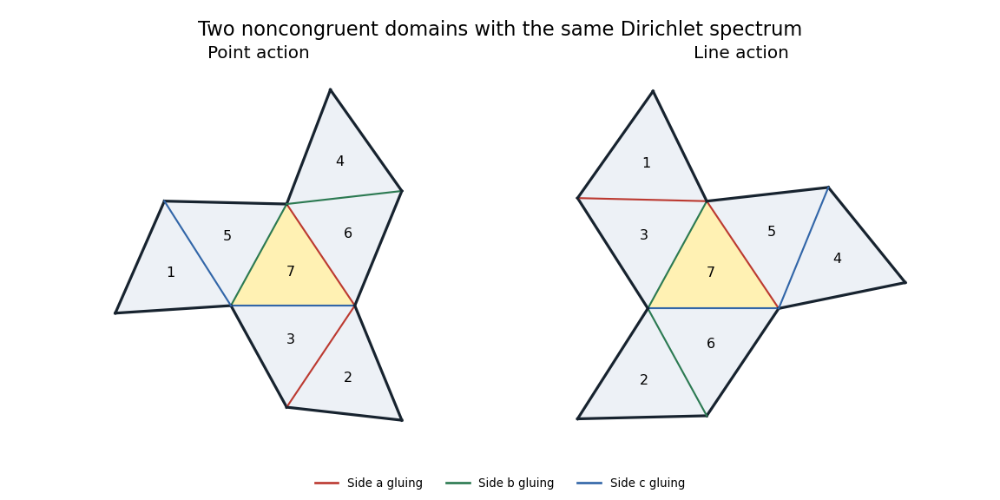

# Paper 20

↑ **Parent:** [Iii](../iii.md)

[https://www.maths.cam.ac.uk/postgrad/part-iii/files/pastpapers/2007/Paper20.pdf](https://www.maths.cam.ac.uk/postgrad/part-iii/files/pastpapers/2007/Paper20.pdf)

**Table of contents**

- [1](#1)
  - [Solution](#1/solution)
- [2](#2)
  - [Solution](#2/solution)
- [3](#3)
  - [Solution](#3/solution)
- [4](#4)
  - [Solution](#4/solution)
- [5](#5)
  - [Solution](#5/solution)

## 1

↑ **Parent:** [Paper 20](paper-20.md)

<h3 id="1/solution">Solution</h3>

↑ **Parent:** [1](#1)

Use the nonnegative convention for the [Laplace-Beltrami operator](../../../differential-geometry.md#laplace-beltrami-operator). For a smooth function $f$ on a [Riemannian manifold](../../../riemannian-geometry.md#riemannian-manifold) $(M,g)$, three intrinsic definitions are

$$
\boxed{\Delta f=d^*df=-\operatorname{div}(\operatorname{grad}f)=-\operatorname{tr}_g(\nabla df)}.
$$

Here $d$ is the [exterior derivative](../../../differential-form.md#exterior-derivative), $d^*$ its formal $L^2$ adjoint for the Riemannian volume density, $\operatorname{grad}f$ the [Riemannian gradient](../../../differential-geometry.md#riemannian-gradient), and $\nabla$ the [Levi-Civita connection](../../../general-relativity.md#levi-civita-connection). The bilinear form $\nabla df$ is the [Riemannian Hessian](../../../riemannian-geometry.md#riemannian-hessian). The equally common nonpositive convention negates all three definitions simultaneously.

In local coordinates let $g^{ij}$ be the inverse metric [matrix](../../../vector-space.md#matrix) and $\rho=\sqrt{\det(g_{ij})}$. By the defining relation $g(\operatorname{grad}f,V)=df(V)$,

$$
(\operatorname{grad}f)^i=g^{ij}\partial_jf.
$$

The [divergence of a Riemannian vector field](../../../calculus.md#divergence-of-a-riemannian-vector-field) can be defined by $\mathcal L_V(dV_g)=(\operatorname{div}V)dV_g$. Differentiating the coordinate volume density gives $\operatorname{div}V=\rho^{-1}\partial_i(\rho V^i)$. Thus the second definition becomes

$$
-\operatorname{div}(\operatorname{grad}f)
=-\frac1\rho\partial_i(\rho g^{ij}\partial_jf).
$$

For compactly supported smooth $h$, coordinate [integration by parts](../../../calculus.md#integration-by-parts) shows

$$
\int_M h\left[-\rho^{-1}\partial_i(\rho g^{ij}\partial_jf)\right]dV_g
=\int_M g^{ij}(\partial_i h)(\partial_jf)\,dV_g
=\langle dh,df\rangle_{L^2}
=\langle h,d^*df\rangle_{L^2}.
$$

Since this holds for every such $h$, the first and second definitions agree. This argument also works on a nonorientable [Riemannian manifold](../../../riemannian-geometry.md#riemannian-manifold), using its volume density; no global [orientation](../../../algebraic-topology.md#orientation-of-a-simplex) is needed.

For the third definition,

$$
(\nabla df)_{ij}=\partial_i\partial_jf-\Gamma^k_{ij}\partial_kf.
$$

The [Christoffel symbols](../../../riemannian-geometry.md#christoffel-symbol) satisfy $\Gamma^i_{ik}=\partial_k\log\rho$. This follows by tracing their formula and using $\partial_k\log\det g=\operatorname{tr}(g^{-1}\partial_kg)$. [Metric compatibility](../../../fiber-bundle.md#metric-compatibility) gives

$$
\partial_i g^{ij}+\Gamma^i_{ik}g^{kj}=-\Gamma^j_{ik}g^{ik}.
$$

Substitute both identities into the coordinate divergence expression to obtain

$$
-\rho^{-1}\partial_i(\rho g^{ij}\partial_jf)
=-g^{ij}\partial_i\partial_jf+g^{ij}\Gamma^k_{ij}\partial_kf
=-\operatorname{tr}_g(\nabla df).
$$

This proves all three definitions equivalent. In [geodesic normal coordinates](../../../riemannian-geometry.md#geodesic-normal-coordinates) at a point $p$, the common value is $-\sum_i\partial_i^2f(p)$. Finally, on a closed manifold,

$$
\int_M f\Delta f\,dV_g=\int_M|df|_g^2\,dV_g\geq0,
$$

confirming the chosen [positive Laplace-Beltrami operator](../../../differential-geometry.md#positive-laplace-beltrami-operator) sign convention.

## 2

↑ **Parent:** [Paper 20](paper-20.md)

<h3 id="2/solution">Solution</h3>

↑ **Parent:** [2](#2)

We construct the two domains explicitly from seven congruent [triangles](../../../geometry-and-topology.md#triangle). Let a scalene reference [triangle](../../../geometry-and-topology.md#triangle) have sides $a,b,c$ opposite its three labelled vertices. Choose its three side lengths in a small open neighbourhood of $(1,1,1)$, with a fixed strict ordering. Thus the three angles are distinct and lie between $\pi/4$ and $\pi/2$. Each copy keeps these side labels.

For the first assembly glue the following tile pairs, reflecting across the indicated side:

$$
\begin{array}{c|c|c}
\text{side}&\Omega_P&\Omega_L\\ \hline
a&(2,3),(6,7)&(1,3),(5,7)\\
b&(4,6),(5,7)&(2,6),(3,7)\\
c&(1,5),(3,7)&(4,5),(6,7)
\end{array}
$$

Each coloured adjacency graph is a tree with central tile $7$ and three two-tile arms. Place tile $7$ in the plane and obtain every other tile by the prescribed reflections. At the equilateral reference shape the copies have disjoint interiors and form a polygonal disk; the same holds throughout a sufficiently small neighbourhood, since the only contacts between tiles are the prescribed edges and their incident vertices. In particular each assembly is a bounded connected [planar domain](../../../geometry-and-topology.md#planar-domain).

**[Figure 1](#2/image-seven-triangle-point-and-line-assemblies-with-matching-dirichlet-spectra). Seven-triangle point and line assemblies with matching Dirichlet spectra**.

To prove equality of spectra, index tiles by the seven nonzero [vectors](../../../vector-space.md#vector) $x\in\mathbb F_2^3$, using $x=(x_1,x_2,x_3)$ with label $x_1+2x_2+4x_3$. Let

$$
s_a=I+E_{12},\qquad s_b=I+E_{23},\qquad s_c=I+E_{31}.
$$

These [involutions](../../../group-theory.md#involution) act on points by $x\mapsto s_sx$ and on nonzero [covectors](../../../linear-algebra.md#covector) by $y\mapsto s_s^{-T}y=s_s^Ty$. Their swaps are exactly the two columns of the table. Write $P_s,Q_s$ for the corresponding permutation [matrices](../../../vector-space.md#matrix). The [Fano plane](../../../projective-space.md#fano-plane) incidence [matrix](../../../vector-space.md#matrix)

$$
B_{y,x}=\mathbf1_{y\cdot x=0}
$$

satisfies $BP_s=Q_sB$, since incidence is preserved by a linear transformation and its inverse transpose. Each point lies on three lines, while two different points have one common line. Therefore

$$
B^TB=2I+J,
$$

where $J$ is the all-ones [matrix](../../../vector-space.md#matrix), proving that $B$ is invertible.

For the [Dirichlet boundary condition](../../../differential-equation.md#dirichlet-boundary-condition), a glued side has a positive swap and an exposed side has diagonal entry $-1$. Both trees have the same bipartition, with sign [matrix](../../../vector-space.md#matrix)

$$
D=\operatorname{diag}(1,1,-1,1,-1,-1,1).
$$

Their signed reflection [matrices](../../../vector-space.md#matrix) are $M_s=-DP_sD$ and $N_s=-DQ_sD$. On a glued edge its endpoint signs are opposite, so the off-diagonal entries are $+1$; on an exposed edge the entry is $-1$. Consequently the [invertible matrix](../../../linear-algebra.md#invertible-matrix) $C=DBD$ satisfies

$$
CM_s=N_sC\qquad(s=a,b,c).
$$

We spell out why this gives [isospectrality](../../../riemannian-geometry.md#isospectral-manifolds). Pull each function back from the seven tiles to the reference [triangle](../../../geometry-and-topology.md#triangle). Its seven boundary values along side $s$ form a [vector](../../../vector-space.md#vector) $u_s$ satisfying $M_su_s=u_s$: this imposes equal values at glued edges and zero values at exposed edges. Outward [normal derivatives](../../../differential-geometry.md#normal-derivative) of a smooth [eigenfunction](../../../linear-operator-theory.md#eigenfunction) satisfy $M_sv_s=-v_s$, giving opposite [normal derivatives](../../../differential-geometry.md#normal-derivative) on glued edges. The identities above preserve both conditions under $u\mapsto Cu$. Since $C$ is constant, it also commutes with the [scalar](../../../vector-space.md#scalar) [Laplacian](../../../calculus.md#laplacian) on each [triangle](../../../geometry-and-topology.md#triangle).

One can include all weak [eigenfunctions](../../../linear-operator-theory.md#eigenfunction) without any corner regularity issue by [orthogonalization of a transplantation matrix](../../../riemannian-geometry.md#orthogonalization-of-a-transplantation-matrix). The [matrix](../../../vector-space.md#matrix) $C^TC$ commutes with the symmetric $M_s$, so $O=C(C^TC)^{-1/2}$ is orthogonal and still intertwines $M_s,N_s$. On the disjoint tiles, $O$ preserves the $L^2$ norm and the sum of the [Dirichlet energies](../../../differential-geometry.md#dirichlet-energy); it maps the [trace](../../../linear-algebra.md#matrix-trace)-matching form domain $H_0^1(\Omega_P)$ bijectively to $H_0^1(\Omega_L)$. Thus it is a [unitary equivalence](../../../vector-space.md#unitary-equivalence) of the [Dirichlet Laplacians](../../../partial-differential-equation.md#dirichlet-laplacian), proving equality of every [eigenvalue](../../../linear-operator-theory.md#eigenvalue) with its multiplicity.

Finally, the only reentrant vertices of either polygon are the three vertices of tile $7$, with interior angles four times the corresponding reference-[triangle](../../../geometry-and-topology.md#triangle) angles. All other boundary angles are less than $\pi$. These three distinct angles force any hypothetical [isometry](../../../riemannian-geometry.md#isometry) to map each labelled central vertex to its counterpart. An [isometry](../../../riemannian-geometry.md#isometry) between connected open [planar domains](../../../geometry-and-topology.md#planar-domain) is a restriction of a rigid motion: its derivative is orthogonal, and preservation of the flat [Levi-Civita connection](../../../general-relativity.md#levi-civita-connection) makes that derivative constant. After aligning the two central [triangles](../../../geometry-and-topology.md#triangle), this rigid motion fixes three noncollinear points and is the identity. But the two domains do not coincide: the tile beyond side $a$ of the central [triangle](../../../geometry-and-topology.md#triangle) has its next attachment along $b$ in the point assembly and along $c$ in the line assembly. These occupy different open regions. This contradiction proves nonisometry.

Therefore **the three freely varying side lengths give a three-parameter family of nonisometric Dirichlet-isospectral bounded [planar domains](../../../geometry-and-topology.md#planar-domain)**. The parameters include scale; no congruence normalization removes it.

## 3

↑ **Parent:** [Paper 20](paper-20.md)

<h3 id="3/solution">Solution</h3>

↑ **Parent:** [3](#3)

On a closed compact [Riemannian manifold](../../../riemannian-geometry.md#riemannian-manifold), the [heat kernel](../../../diffusion-equation.md#heat-kernel) for the [positive Laplace-Beltrami operator](../../../differential-geometry.md#positive-laplace-beltrami-operator) is the smooth kernel $K_M(t,x,y)$ of $e^{-t\Delta_M}$ for $t>0$. It solves $(\partial_t+\Delta_x)K_M=0$ and tends to the delta kernel as $t\downarrow0$, so that

$$
u(t,x)=\int_M K_M(t,x,y)f(y)\,dV_M(y),\qquad u(0,x)=f(x).
$$

For an [orthonormal eigenbasis](../../../linear-operator-theory.md#orthonormal-eigenbasis) with [eigenvalues](../../../linear-operator-theory.md#eigenvalue) repeated according to multiplicity,

$$
K_M(t,x,y)=\sum_{j=0}^\infty e^{-t\lambda_j}\phi_j(x)\overline{\phi_j(y)},\qquad
Z_M(t)=\operatorname{Tr}(e^{-t\Delta_M})=\int_MK_M(t,x,x)\,dV_M(x).
$$

The exponential factors and [elliptic regularity](../../../distribution-theory.md#elliptic-regularity) ensure smooth convergence for positive time. If a boundary is present, the same construction uses a specified [boundary condition](../../../differential-equation.md#boundary-condition) preserved by the covering; the closed-manifold case is the one needed below.

Let $p:N\to M=N/U$ be the finite normal locally isometric [covering map](../../../algebraic-topology.md#covering-space). The [heat equation](../../../diffusion-equation.md#heat-equation) for $f\circ p$ on $N$ is the lift of the one for $f$ on $M$. Integrate the lifted solution over a [fundamental domain](../../../group-theory.md#fundamental-domain) for the [deck transformation group](../../../algebraic-topology.md#deck-transformation-group) $U$, splitting the integral over $N$ into its translates. This gives

$$
\boxed{K_M(t,px,py)=\sum_{u\in U}K_N(t,x,uy)}.
$$

There is no averaging factor in this kernel formula: each translate accounts for one lift of the integration variable. To verify it directly, the sum solves the lifted [heat equation](../../../diffusion-equation.md#heat-equation) and its integral against $f$ converges to $f(px)$; uniqueness of the heat solution identifies the kernel. Replacing either lift $x$ or $y$ only permutes the sum, since [isometries](../../../riemannian-geometry.md#isometry) preserve the [heat kernel](../../../diffusion-equation.md#heat-kernel).

Integrating the diagonal and using the covering degree gives the [heat trace](../../../riemannian-geometry.md#heat-trace) formula

$$
\boxed{Z_M(t)=\frac1{|U|}\sum_{u\in U}F_t(u)},\qquad
F_t(u)=\int_NK_N(t,x,ux)\,dV_N(x).
$$

Suppose $U$ is contained in a [finite group](../../../group.md#finite-group) $T$ of [isometries](../../../riemannian-geometry.md#isometry) of $N$. For $s\in T$, change variables $x=sy$ and use invariance of both volume and the [heat kernel](../../../diffusion-equation.md#heat-kernel). Then

$$
F_t(sus^{-1})=\int_NK_N(t,sy,suy)\,dV_N(y)=F_t(u).
$$

Thus $F_t$ is a [class function](../../../representation-theory.md#class-function) on $T$, and for its [conjugacy classes](../../../group-theory.md#conjugacy-class) $\mathcal C$,

$$
Z_{N/U}(t)=\frac1{|U|}\sum_{\mathcal C\subset T}|U\cap\mathcal C|\,F_t(c_{\mathcal C}).
$$

Consequently, if $U_1,U_2\leq T$ are [Gassmann equivalent](../../../representation-theory.md#gassmann-equivalence) and act freely, their orders are equal and the displayed class-by-class sums give $Z_{N/U_1}(t)=Z_{N/U_2}(t)$ for every $t>0$. Equal [heat traces](../../../riemannian-geometry.md#heat-trace) determine equal [eigenvalues](../../../linear-operator-theory.md#eigenvalue) with multiplicities: the least [eigenvalue](../../../linear-operator-theory.md#eigenvalue) at which the multiplicities differed would give a nonzero leading exponential in their [trace](../../../linear-algebra.md#matrix-trace) difference as $t\to\infty$, a contradiction. Hence **the two smooth quotient manifolds are isospectral**. This proves the [Sunada theorem](../../../riemannian-geometry.md#sunada-theorem), with the free-action hypothesis ensuring that the quotients are manifolds rather than [orbifolds](../../../geometry-and-topology.md#orbifold). The theorem alone makes no nonisometry claim.

## 4

↑ **Parent:** [Paper 20](paper-20.md)

<h3 id="4/solution">Solution</h3>

↑ **Parent:** [4](#4)

Let $V=\mathbb F_2^3$. Since $\mathbb F_2^\times=\{1\}$ and the [scalar](../../../vector-space.md#scalar) centre is trivial,

$$
G=\mathrm{PSL}(3,2)=\mathrm{GL}(3,2),\qquad |G|=(8-1)(8-2)(8-4)=168.
$$

Choose $U_1$ to stabilize a nonzero [vector](../../../vector-space.md#vector) and $U_2$ to stabilize a two-dimensional subspace. There are seven choices of either object, so both [subgroups](../../../group.md#subgroup) have index $7$ and order $24$.

Their coset [permutation characters](../../../representation-theory.md#permutation-character) agree. The number of nonzero [vectors](../../../vector-space.md#vector) fixed by $g$ is $2^{\dim\ker(g-I)}-1$. A two-dimensional subspace is the kernel of a unique nonzero [covector](../../../linear-algebra.md#covector), so its stabilizer action is the dual action $g^{-T}$. Its fixed-point count is

$$
2^{\dim\ker(g^{-T}-I)}-1=2^{\dim\ker(g-I)}-1,
$$

using equality of the [matrix ranks](../../../vector-space.md#matrix-rank) of a [matrix](../../../vector-space.md#matrix) and its transpose. For a [subgroup](../../../group.md#subgroup) $H$, counting the representatives of fixed cosets gives

$$
\chi_{G/H}(g)=\frac{|C_G(g)|}{|H|}\,|H\cap[g]_G|.
$$

Thus the equal characters and [subgroup](../../../group.md#subgroup) orders give equal intersection counts with every [conjugacy class](../../../group-theory.md#conjugacy-class). This proves **$U_1,U_2$ are [Gassmann equivalent](../../../representation-theory.md#gassmann-equivalence)**.

They are not conjugate. For example, the stabilizer of $e_1$ contains every [matrix](../../../vector-space.md#matrix) $\begin{pmatrix}1&b\\0&B\end{pmatrix}$ with $b\in\mathbb F_2^{1\times2}$ and $B\in\mathrm{GL}(2,2)$. An invariant plane containing $e_1$ would give an invariant line in $V/\langle e_1\rangle$, impossible for the full $\mathrm{GL}(2,2)$ action. An invariant plane not containing $e_1$ would be a complement to that line, but the arbitrary shears $b$ do not preserve any such complement. Hence a point stabilizer preserves no plane, whereas every conjugate of $U_2$ does. **The two [subgroups](../../../group.md#subgroup) are nonconjugate.**

We now use a [cone-torus construction of genus-four Sunada surfaces](../../../riemannian-geometry.md#cone-torus-construction-of-genus-four-sunada-surfaces). Let $B$ be a hyperbolic torus with one cone point of angle $2\pi/7$. Its [orbifold fundamental group](../../../geometry-and-topology.md#orbifold-fundamental-group) has presentation

$$
\Gamma=\langle a,d\mid[d,a]^7=1\rangle.
$$

Map $a,d$ to the supplied generators $A,D$ of $G$. Their commutator has exact order $7$, so this gives a surjection $\Gamma\to G$ with torsion-free kernel $K$: every finite-order element of $\Gamma$ is conjugate to a power of the cone generator, and no nonidentity such power lies in $K$. Thus $N=\mathbb H^2/K$ is a smooth closed [hyperbolic surface](../../../geometry-and-topology.md#hyperbolic-surface) with a $G$-action. Its quotients by $U_1,U_2$ are smooth too, since order-$24$ [subgroups](../../../group.md#subgroup) contain no element of order $7$ and therefore meet no cone stabilizer.

The [orbifold Euler characteristic](../../../geometry-and-topology.md#orbifold-euler-characteristic) of $B$ is $-(1-1/7)=-6/7$. Each quotient cover has degree $7$, so

$$
\chi(S_i)=7\chi_{\rm orb}(B)=-6=2-2g(S_i),\qquad
\boxed{g(S_1)=g(S_2)=4}.
$$

The [Sunada theorem](../../../riemannian-geometry.md#sunada-theorem) proved in Question 3 makes $S_1,S_2$ isospectral for every choice of the base [hyperbolic metric](../../../geometry-and-topology.md#hyperbolic-metric).

Here is an explicit supply of base metrics. A [hyperbolic trirectangle](../../../geometry-and-topology.md#lambert-quadrilateral) has three right angles and a fourth angle $\alpha=\pi/14$. If its sides adjacent to the opposite right-angle vertex have lengths $r,s$, the trirectangle identity is $\sinh r\sinh s=\cos\alpha$. Thus $r>0$ varies freely, with $s=\operatorname{arsinh}(\cos\alpha/\sinh r)$. Reflecting four copies about their two perpendicular centre lines gives a quadrilateral with four angles $\pi/14$ and opposite sides of equal length. Identifying opposite sides produces a cone torus: all four corners give total angle $2\pi/7$. Its two centre-line [geodesics](../../../riemannian-geometry.md#geodesic) intersect once and have lengths $2r,2s$. Cut along the shorter chosen [geodesic](../../../riemannian-geometry.md#geodesic) $d$ and reglue with a small twist $\tau$; this retains the cone angle and allows an additional metric parameter. The remaining cut surface has two equal-length [geodesic](../../../riemannian-geometry.md#geodesic) boundaries and the cone point.

We give a concrete [intersection test for nonisometric finite covers](../../../riemannian-geometry.md#intersection-test-for-nonisometric-finite-covers), rather than relying on [subgroup](../../../group.md#subgroup) nonconjugacy alone. Choose $\ell(d)=\varepsilon$ sufficiently small. The trirectangle geometry gives an embedded collar of width $\log(1/\varepsilon)+O(1)$ about $d$. The shortest perpendicular joining the two boundary components after cutting has length $\delta=2\log(1/\varepsilon)+O(1)$. At zero twist it closes to $a$, the unique shortest [closed geodesic](../../../riemannian-geometry.md#closed-geodesic) crossing $d$ once. Uniqueness follows from uniqueness of the shortest perpendicular; all other once-crossing classes have a positive length gap, since only finitely many [closed geodesics](../../../riemannian-geometry.md#closed-geodesic) have bounded length. For sufficiently small twists, the same marked class $a$ remains the unique shortest once-crossing [geodesic](../../../riemannian-geometry.md#geodesic). A [geodesic](../../../riemannian-geometry.md#geodesic) crossing $d$ at least twice traverses the collar at least twice, so for small $\varepsilon$ its length is greater than $\ell(a)$.

[Geodesics](../../../riemannian-geometry.md#geodesic) disjoint from $d$ remain entirely in the cut surface and have twist-independent lengths. In a bounded window around $\ell(a)$ they supply only finitely many possible length values, including lengths of iterates. Meanwhile $\ell(a)$ varies nontrivially with $\tau$ by the hyperbolic seam identity: its hyperbolic cosine has a positive multiple of $\cosh(\tau/2)$. Choose a small twist away from those finitely many coincidences. Then the only base [geodesic](../../../riemannian-geometry.md#geodesic) of length $\ell(a)$ is $a$, up to [orientation](../../../algebraic-topology.md#orientation-of-a-simplex). By taking $\varepsilon$ smaller if necessary, the only base [geodesics](../../../riemannian-geometry.md#geodesic) of length at most $2\varepsilon$ are powers of $d$: those crossing $d$ are long, and the nonperipheral [geodesics](../../../riemannian-geometry.md#geodesic) of the limiting two-cusped cone pair of pants have lengths bounded away from zero.

In each cover, primitive lift components of a base [geodesic](../../../riemannian-geometry.md#geodesic) are indexed by cycles of its [monodromy permutation](../../../algebraic-topology.md#monodromy-permutation), with length equal to the cycle size times its base length. The permutation of $A$ has a unique singleton $\{0\}$ in each action, so each $S_i$ has a uniquely length-identified primitive lift $\alpha_i$ of length $\ell(a)$. The permutation of $D$ has one two-cycle: it is $\{0,3\}$ for $U_1$ and $\{2,5\}$ for $U_2$. Hence each $S_i$ has a unique primitive lift $\beta_i$ of length $2\varepsilon$; the iterate of the singleton lift is not primitive. At the single base intersection of $a,d$, intersections of their lifted components are exactly their common sheet labels. Therefore

$$
\boxed{i(\alpha_1,\beta_1)=1,\qquad i(\alpha_2,\beta_2)=0}.
$$

An [isometry](../../../riemannian-geometry.md#isometry) would have to preserve the uniquely identified primitive lengths and their [geometric intersection numbers](../../../topology.md#geometric-intersection-number). This contradiction proves that $S_1$ and $S_2$ are not isometric, even allowing [orientation](../../../algebraic-topology.md#orientation-of-a-simplex) reversal.

Finally, let $\varepsilon$ range over a sufficiently small positive interval, choosing a permissible twist for each value. The singleton cycle of $D$ makes the [hyperbolic systole](../../../geometry-and-topology.md#hyperbolic-systole) of each cover equal to $\varepsilon$. Distinct values therefore give distinct [isometry](../../../riemannian-geometry.md#isometry) classes. We obtain **uncountably many pairs of nonisometric, isospectral [genus](../../../topology.md#genus-of-a-surface)-four [Riemann surfaces](../../../complex-analysis.md#riemann-surfaces)**.

## 5

↑ **Parent:** [Paper 20](paper-20.md)

<h3 id="5/solution">Solution</h3>

↑ **Parent:** [5](#5)

Throughout the hyperbolic discussion take curvature $-1$ and $g\geq2$. A [Y-piece](../../../topology.md#hyperbolic-y-piece) is a [pair of pants](../../../topology.md#pair-of-pants-mathematics) with a [hyperbolic metric](../../../geometry-and-topology.md#hyperbolic-metric) and three [geodesic](../../../riemannian-geometry.md#geodesic) boundary components. Three labelled positive boundary lengths $\ell_1,\ell_2,\ell_3$ determine it up to [isometry](../../../riemannian-geometry.md#isometry). To see existence and uniqueness, cut along the three shortest perpendicular seams. The two resulting [right-angled hyperbolic hexagons](../../../geometry-and-topology.md#right-angled-hyperbolic-hexagon) have alternating side lengths $\ell_i/2$, which determine each hexagon. Conversely, any three positive alternating lengths produce such a hexagon, and doubling along the other sides produces the desired [Y-piece](../../../topology.md#hyperbolic-y-piece). In particular the seam opposite $\ell_i$ satisfies

$$
\cosh s_i=\frac{\cosh(\ell_i/2)+\cosh(\ell_j/2)\cosh(\ell_k/2)}{\sinh(\ell_j/2)\sinh(\ell_k/2)}.
$$

An [X-piece](../../../topology.md#hyperbolic-x-piece) is a four-holed hyperbolic sphere with [geodesic](../../../riemannian-geometry.md#geodesic) boundaries, obtained by joining two [Y-pieces](../../../topology.md#hyperbolic-y-piece) along one pair of equal-length boundaries. For a chosen separating curve, it is determined by

$$
\boxed{\ell_1,\ell_2,\ell_3,\ell_4>0,\quad s>0,\quad\tau},
$$

where $s$ is the common gluing length and $\tau$ is the relative arclength twist, measured between chosen seam endpoints. The identification reverses [boundary orientation](../../../differential-geometry.md#boundary-orientation) so that the surface is oriented. For an unmarked gluing, $\tau$ is periodic modulo $s$; a marking retains $\tau\in\mathbb R$, because a full [Dehn twist](../../../topology.md#dehn-twist) changes the marking. These six parameters describe the [X-piece](../../../topology.md#hyperbolic-x-piece) with its chosen separating curve; different curve choices or boundary symmetries can describe the same unmarked surface.

Choose a [pants decomposition](../../../geometry-and-topology.md#pants-decomposition) of a closed oriented [genus](../../../topology.md#genus-of-a-surface)-$g$ surface. Each [Y-piece](../../../topology.md#hyperbolic-y-piece) has [Euler characteristic](../../../homology.md#euler-characteristic) $-1$, and gluing boundary circles does not change the total [Euler characteristic](../../../homology.md#euler-characteristic). Thus there are $2g-2$ pieces. Their $3(2g-2)$ boundary circles are paired, giving $3g-3$ gluing curves. Choose their disjoint [geodesic](../../../riemannian-geometry.md#geodesic) representatives, then prescribe each cuff length and its relative twist. The [Fenchel–Nielsen coordinates](../../../geometry-and-topology.md#fenchel-nielsen-coordinates) are

$$
\boxed{(\ell_i,\tau_i)_{i=1}^{3g-3}\in(0,\infty)^{3g-3}\times\mathbb R^{3g-3}}.
$$

They determine the marked [hyperbolic surface](../../../geometry-and-topology.md#hyperbolic-surface) and hence its unmarked [isometry](../../../riemannian-geometry.md#isometry) class, with $6g-6$ real parameters. One must also fix the combinatorial gluing pattern of the chosen [pants decomposition](../../../geometry-and-topology.md#pants-decomposition). Full twists and other changes of marking identify some parameter sets in unmarked [moduli space of Riemann surfaces](../../../geometry-and-topology.md#moduli-space-of-riemann-surfaces). The [genus](../../../topology.md#genus-of-a-surface) restriction matters: a sphere and a torus do not admit a closed curvature-$-1$ metric or such a decomposition into [geodesic](../../../riemannian-geometry.md#geodesic) [Y-pieces](../../../topology.md#hyperbolic-y-piece).

For a fixed oriented topological surface $S_g$, [Teichmüller space](../../../complex-analysis.md#teichmuller-space) $\mathcal T_g$ consists of marked [Riemann surfaces](../../../complex-analysis.md#riemann-surfaces) $(X,f:S_g\to X)$. Two markings represent the same point when a [conformal isomorphism](../../../complex-analysis.md#biholomorphism) between the surfaces carries one marking to the other up to [homotopy](../../../algebraic-topology.md#homotopy). By the [uniformization theorem](../../../complex-analysis.md#uniformization-theorem), for $g\geq2$ these are equivalently marked curvature-$-1$ metrics. The displayed [Fenchel–Nielsen coordinates](../../../geometry-and-topology.md#fenchel-nielsen-coordinates) identify $\mathcal T_g$ with a cell of real dimension $6g-6$; the [mapping class group](../../../topology.md#mapping-class-group) quotient gives the unmarked [moduli space of Riemann surfaces](../../../geometry-and-topology.md#moduli-space-of-riemann-surfaces).

The spectral version of the [Wolpert generic spectral rigidity theorem](../../../riemannian-geometry.md#wolpert-generic-spectral-rigidity-theorem) says that **outside a closed proper real-analytic exceptional subset of $\mathcal T_g$, the Laplace spectrum determines the [hyperbolic surface](../../../geometry-and-topology.md#hyperbolic-surface) up to [isometry](../../../riemannian-geometry.md#isometry)**. The exceptional subset has positive codimension and is invariant under changes of marking. [Orientation](../../../algebraic-topology.md#orientation-of-a-simplex) reversal must be allowed, since the [Laplacian](../../../calculus.md#laplacian) cannot detect [orientation](../../../algebraic-topology.md#orientation-of-a-simplex). Equivalently, a generic surface is determined by its unmarked [length spectrum](../../../geometry-and-topology.md#length-spectrum), counted with multiplicities. This is a generic uniqueness statement, not a claim that every isospectral pair is isometric; the construction in Question 4 lies in the exceptional locus.

Three major ingredients and their roles are as follows.

- The [Selberg trace formula](../../../geometry-and-topology.md#selberg-trace-formula) converts the [Laplacian](../../../calculus.md#laplacian) spectrum into the lengths and multiplicities of closed [geodesics](../../../riemannian-geometry.md#geodesic), and conversely. It moves the problem from [eigenvalues](../../../linear-operator-theory.md#eigenvalue) to geometric length data, where pants and twists can be used.
- [Finite length coordinates for hyperbolic surfaces](../../../geometry-and-topology.md#finite-length-coordinates-for-hyperbolic-surfaces) and real-analytic length functions reduce candidate spectral matchings to finitely many local analytic systems. The cuff lengths fix the [Y-pieces](../../../topology.md#hyperbolic-y-piece); two transverse curves at each cuff fix its twist, giving $9g-9$ labelled length functions. Hyperbolic holonomy gives $2\cosh(\ell_\gamma/2)=|\operatorname{tr}\rho(\gamma)|$, so these lengths obey analytic [trace](../../../linear-algebra.md#matrix-trace) relations. Discreteness of bounded length data, compactness in the thick part, and finite determination of those [trace](../../../linear-algebra.md#matrix-trace) relations control the locally possible unlabelled matchings. A matching that is not an identity therefore lies in a proper analytic zero set.
- Geometric decoding of the persistent identities uses the [collar lemma](../../../geometry-and-topology.md#collar-lemma) and variations of [Fenchel–Nielsen coordinates](../../../geometry-and-topology.md#fenchel-nielsen-coordinates). Pinching a cuff makes crossing curves long while disjoint ones remain bounded; twisting controls the transverse length relations. These behaviours recover the pants incidence and the twist data, and show that a matching persisting on an open parameter set comes from a change of marking, possibly with [orientation](../../../algebraic-topology.md#orientation-of-a-simplex) reversal. Thus any genuinely nonisometric matching is confined to the lower-dimensional exceptional analytic locus.

For completeness, a related finiteness statement sometimes grouped with this theorem is that a fixed closed [hyperbolic surface](../../../geometry-and-topology.md#hyperbolic-surface) has only finitely many isospectral [isometry](../../../riemannian-geometry.md#isometry) classes. Its short proof uses three particularly concrete tools: a common discrete [length spectrum](../../../geometry-and-topology.md#length-spectrum); [Mumford's compactness theorem](../../../geometry-and-topology.md#mumford-s-compactness-theorem), applied to the common positive systole; and finitely many determining marked lengths. Compactness would give an accumulation point if an isospectral family were infinite. Nearby markings make each determining length converge, while discreteness of the fixed spectrum makes it eventually constant. The determining lengths then force eventual equality of the marked surfaces, a contradiction. This [finiteness of isospectral hyperbolic surfaces](../../../riemannian-geometry.md#finiteness-of-isospectral-hyperbolic-surfaces) statement does not replace the stronger generic uniqueness assertion above.

## ↑ Ancestors (8)

1. [Iii](../iii.md)
2. [2007](../../2007.md)
3. [Past exam of the mathematics course of the University of Cambridge](../../../past-exam-of-the-mathematics-course-of-the-university-of-cambridge.md)
4. [Mathematics course of the University of Cambridge](../../../university-of-cambridge.md#mathematics-course-of-the-university-of-cambridge)
5. [Course of the University of Cambridge](../../../university-of-cambridge.md#course-of-the-university-of-cambridge)
6. [University of Cambridge](../../../university-of-cambridge.md)
7. [List of universities](../../../README.md#list-of-universities)
8. [Codex Wiki](../../../README.md)
