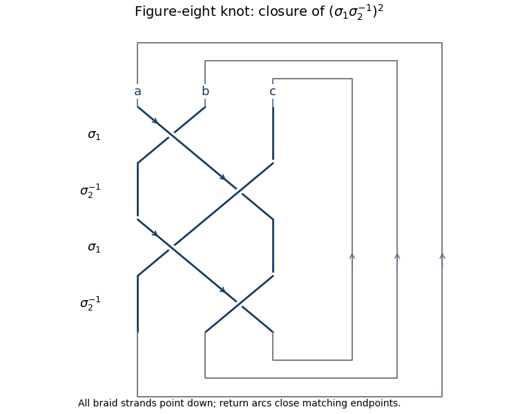

<h1 id="3/c/solution">Solution</h1>

↑ **Parent:** [C](../c.md)

Use the standard closed three-strand braid $B=(\sigma_1\sigma_2^{-1})^2$, a four-crossing diagram of the [figure-eight knot](../../../../../../figure-eight-knot.md). The diagram has two positive and two negative crossings, so $w(B)=0$.

**[Figure 1](#3/c/image-four-crossing-closed-braid-for-the-figure-eight-knot-with-three-starting-meridians). Four-crossing closed braid for the figure-eight knot, with three starting meridians**.

 We calculate its [Kauffman bracket](../../../../../../kauffman-bracket.md), making the inversion symmetry explicit rather than merely asserting amphichirality.

In the [Temperley-Lieb diagram algebra](../../../../../../temperley-lieb-diagram-algebra.md) on three strands put $u=e_1$, $v=e_2$. The relations are $u^2=\delta u$, $v^2=\delta v$, $uvu=u$, $vuv=v$. The bracket image of one two-crossing block is

$$
H=(A1+A^{-1}u)(A^{-1}1+Av)=1+A^{-2}u+A^2v+uv.
$$

Closing planar diagrams gives the [bracket trace on the three-strand Temperley-Lieb algebra](../../../../../../bracket-trace-on-the-three-strand-temperley-lieb-algebra.md):

$$
\operatorname{tr}(1)=\delta^2,\quad
\operatorname{tr}(u)=\operatorname{tr}(v)=\delta,\quad
\operatorname{tr}(uv)=\operatorname{tr}(vu)=1.
$$

These values follow because the closures have respectively three, two and one circles. Expanding and reducing $H^2$ gives

$$
\begin{aligned}
H^2={}&1+(3A^{-2}+\delta A^{-4})u+(3A^2+\delta A^4)v\\
&+[4+\delta(A^2+A^{-2})]uv+vu.
\end{aligned}
$$

Taking its trace and substituting $\delta=-A^2-A^{-2}$ yields

$$
\langle B\rangle=A^8-A^4+1-A^{-4}+A^{-8}.
$$

There is no [writhe](../../../../../../writhe.md) correction, so

$$
\boxed{V_K(t)=t^2-t+1-t^{-1}+t^{-2},\qquad V_K(t^{-1})=V_K(t).}
$$

The equality is immediate from the five displayed coefficients. The same braid model supplies the meridians used in part (d).

## ↑ Ancestors (11)

1. [C](../c.md)
2. [3](../../3.md)
3. [Paper 24](../../../paper-24-split.md)
4. [Iii](../../../split.md)
5. [2007](../../../../split.md)
6. [Past exam of the mathematics course of the University of Cambridge](../../../../../split.md)
7. [Mathematics course of the University of Cambridge](../../../../../../mathematics-course-of-the-university-of-cambridge.md)
8. [Course of the University of Cambridge](../../../../../../course-of-the-university-of-cambridge.md)
9. [University of Cambridge](../../../../../../university-of-cambridge-split.md)
10. [List of universities](../../../../../../list-of-universities.md)
11. [Codex Wiki](../../../../../../split.md)
