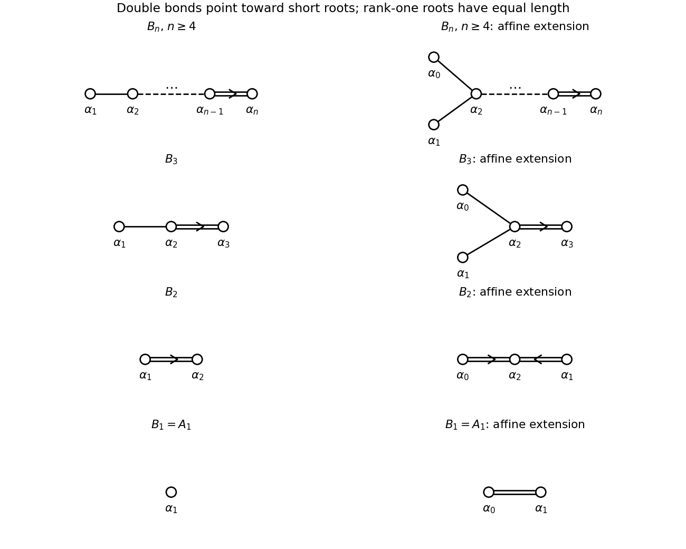

<h1 id="2/i/solution">Solution</h1>

↑ **Parent:** [I](../i.md)

Put $\bar i=2n+2-i$ and $o=n+1$. A [Cartan subalgebra](../../../../../../cartan-subalgebra.md) is

$$
\mathfrak t=\{H(t)=\operatorname{diag}(t_1,\ldots,t_n,0,-t_n,\ldots,-t_1)\},
\qquad e_i(H(t))=t_i.
$$

The defining matrix condition says $A_{ij}=-A_{\bar j,\bar i}$. Using the [matrix units](../../../../../../matrix-unit.md), the nonzero [root spaces](../../../../../../root-space.md) have the following generators:

$$
\begin{array}{c|c}
\text{root}&\text{generator}\\\hline
e_i-e_j\ (i\ne j)&E_{ij}-E_{\bar j,\bar i}\\
e_i+e_j\ (i<j)&E_{i,\bar j}-E_{j,\bar i}\\
-e_i-e_j\ (i<j)&E_{\bar j,i}-E_{\bar i,j}\\
e_i&E_{i,o}-E_{o,\bar i}\\
-e_i&E_{o,i}-E_{\bar i,o}
\end{array}
$$

Commuting each generator with $H(t)$ gives its stated [weight](../../../../../../weight-representation-theory.md). Together with $H_i=E_{ii}-E_{\bar i,\bar i}$, these matrices span the [Special orthogonal Lie algebra](../../../../../../special-orthogonal-lie-algebra.md); there are $n+2n^2=n(2n+1)$ independent generators. Thus its decomposition as a [Cartan subalgebra](../../../../../../cartan-subalgebra.md) module is

$$
\boxed{\mathfrak g=\mathfrak t\oplus\bigoplus_{\alpha\in R}\mathfrak g_\alpha,
\quad\dim\mathfrak g_\alpha=1,\quad
R=\{\pm e_i\pm e_j:i<j\}\cup\{\pm e_i\}.}
$$

This is the [Bn root system](../../../../../../bn-root-system.md). The upper-triangular generators select the [positive roots](../../../../../../positive-root.md)

$$
\boxed{R^+=\{e_i-e_j,e_i+e_j:i<j\}\cup\{e_i:1\le i\le n\}.}
$$

Its [simple roots](../../../../../../simple-root.md) and [highest root](../../../../../../highest-root.md), for $n\ge2$, are

$$
\boxed{\alpha_i=e_i-e_{i+1}\ (i<n),\quad\alpha_n=e_n,
\qquad\theta=e_1+e_2=\alpha_1+2\alpha_2+\cdots+2\alpha_n.}
$$

To see the simplicity assertion, $e_i=\alpha_i+\cdots+\alpha_n$, while $e_i-e_j=\alpha_i+\cdots+\alpha_{j-1}$ and $e_i+e_j=\alpha_i+\cdots+\alpha_{j-1}+2\alpha_j+\cdots+2\alpha_n$. The coefficient pattern for $\theta$ dominates those of every [positive root](../../../../../../positive-root.md).

Normalize the inner product so the $e_i$ are orthonormal. The [simple coroots](../../../../../../simple-coroot.md) are $\alpha_i^\vee=\alpha_i$ for $i<n$ and $\alpha_n^\vee=2e_n$. Solving $\langle\omega_j,\alpha_i^\vee\rangle=\delta_{ij}$ gives the [fundamental weights](../../../../../../fundamental-weight.md)

$$
\boxed{\omega_j=e_1+\cdots+e_j\ (j<n),\qquad
\omega_n=\frac12(e_1+\cdots+e_n).}
$$

In the half-sum of [positive roots](../../../../../../positive-root.md), the coordinate $e_i$ occurs with total coefficient $2(n-i)+1$. Hence the [Weyl vector](../../../../../../half-sum-of-positive-roots.md) is

$$
\boxed{\rho=\frac12\sum_{\alpha\in R^+}\alpha
=\sum_{i=1}^n\left(n-i+\frac12\right)e_i=\sum_{j=1}^n\omega_j.}
$$

The [Dynkin diagram](../../../../../../dynkin-diagram.md) is a chain $\alpha_1,\ldots,\alpha_n$, with single bonds up to $\alpha_{n-1}$ and a double last bond pointing towards the short root $\alpha_n$. In the [Extended Dynkin diagram](../../../../../../extended-dynkin-diagram.md), add $\alpha_0=-\theta$. For $n\ge3$, $(\alpha_0,\alpha_2)=-1$ and its inner product with every other [simple root](../../../../../../simple-root.md) is zero, so it attaches to $\alpha_2$ by a single bond. For $n=2$, both long nodes $0,1$ attach by double bonds to short node $2$. These rules give the [Bn Dynkin diagram and affine extension](../../../../../../bn-dynkin-diagram-and-affine-extension.md) drawn below.

For rank one, $R=\{\pm e_1\}$, $\alpha_1=\theta=e_1$, $\omega_1=e_1/2$, and $\rho=e_1/2$. The finite diagram is one node; its affine extension has two equal-length nodes joined by a double bond, without a short-root arrow.

**[Figure 1](#2/i/image-finite-and-extended-b-type-dynkin-diagrams-with-short-root-arrows-and-low-rank-exceptions). Finite and extended B-type Dynkin diagrams with short-root arrows and low-rank exceptions**.

## ↑ Ancestors (11)

1. [I](../i.md)
2. [2](../../2.md)
3. [Paper 4](../../../paper-4-split.md)
4. [Iii](../../../split.md)
5. [2007](../../../../split.md)
6. [Past exam of the mathematics course of the University of Cambridge](../../../../../split.md)
7. [Mathematics course of the University of Cambridge](../../../../../../mathematics-course-of-the-university-of-cambridge.md)
8. [Course of the University of Cambridge](../../../../../../course-of-the-university-of-cambridge.md)
9. [University of Cambridge](../../../../../../university-of-cambridge-split.md)
10. [List of universities](../../../../../../list-of-universities.md)
11. [Codex Wiki](../../../../../../split.md)
