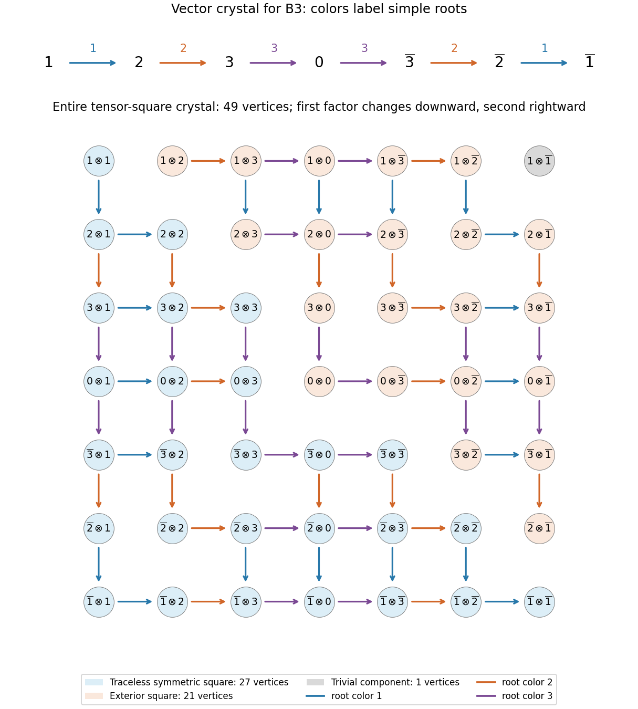

<h1 id="2/iv/solution">Solution</h1>

↑ **Parent:** [Iv](../iv.md)

Label the [weight](../../../../../../weight-representation-theory.md) vertices by $1,\ldots,n,0,\bar n,\ldots,\bar1$, with [weights](../../../../../../weight-representation-theory.md) $e_1,\ldots,e_n,0,-e_n,\ldots,-e_1$. The [crystal of the defining odd-orthogonal representation](../../../../../../crystal-of-the-defining-odd-orthogonal-representation.md) is the chain

$$
1\xrightarrow{1}2\xrightarrow{2}\cdots\xrightarrow{n-1}n
\xrightarrow{n}0\xrightarrow{n}\bar n
\xrightarrow{n-1}\overline{n-1}\longrightarrow\cdots\xrightarrow{1}\bar1.
$$

Each arrow of color $i$ subtracts the [simple root](../../../../../../simple-root.md) $\alpha_i$. The two arrows through zero form the length-two short-root string.

Here is a complete grid description of the [tensor product of crystals](../../../../../../tensor-product-of-crystals.md), valid for arbitrary $n$. Place the vertex $a\otimes b$ in row $a$, column $b$, in the above chain order; there are $(2n+1)^2$ vertices. Let $\varepsilon_i(a)$ and $\varphi_i(a)$ count incoming and outgoing steps along the color-$i$ string. For $i<n$, the two strings are $i\to i+1$ and $\overline{i+1}\to\bar i$, each of length one. For $i=n$, the string is $n\to0\to\bar n$, with pairs $(\varepsilon_n,\varphi_n)$ equal to $(0,2),(1,1),(2,0)$. Other vertices have both counts zero.

Using the [crystal tensor-product rule](../../../../../../crystal-tensor-product-rule.md), draw every color-$i$ edge by

$$
\boxed{\widetilde f_i(a\otimes b)=
\begin{cases}\widetilde f_i(a)\otimes b,&\varphi_i(a)>\varepsilon_i(b),\\
a\otimes\widetilde f_i(b),&\varphi_i(a)\le\varepsilon_i(b).
\end{cases}}
$$

The first case is a downward arrow to the next row and the second a rightward arrow to the next column; omit an arrow when its indicated factor has no outgoing edge. Thus the rule specifies every vertex and every arrow of the general tensor-square diagram, including the boundary nodes. The figure displays the resulting entire grid for $n=3$, alongside the vector crystal; the generator can draw any positive rank.

The raising rule chooses the first factor when $\varphi_i(a)\ge\varepsilon_i(b)$ and the second otherwise. For $n\ge2$, its only highest vertices are

$$
\boxed{1\otimes1:\ 2e_1,\qquad
1\otimes2:\ e_1+e_2,\qquad
1\otimes\bar1:\ 0.}
$$

Indeed a highest tensor must have highest first factor, hence $a=1$. For colors $i>1$, the second factor cannot have an incoming edge. For color one, its incoming count must be at most $\varphi_1(1)=1$. Inspecting the strings leaves precisely $b=1,2,\bar1$.

These three connected components encode the [Irreducible Lie algebra representations](../../../../../../irreducible-lie-algebra-representation.md)

$$
\boxed{V\otimes V\cong S^2_0V\oplus\Lambda^2V\oplus\mathbb C,
\quad\text{highest weights }2e_1,\ e_1+e_2,\ 0.}
$$

Here $S^2_0V$ is the traceless [symmetric square](../../../../../../symmetric-square.md), $\Lambda^2V$ is the [Adjoint representation](../../../../../../adjoint-representation-of-a-lie-algebra.md), and the invariant symmetric form supplies the trivial summand. Their [dimensions](../../../../../../dimension-vector-space.md) are $n(2n+3)$, $n(2n+1)$, and one, summing to $(2n+1)^2$. In fundamental-weight notation the [highest weights](../../../../../../highest-weight-of-a-representation.md) are $2\omega_1,\omega_2,0$ for $n\ge3$, but $2\omega_1,2\omega_2,0$ for $n=2$.

For $n=1$ the vector crystal is $1\xrightarrow{1}0\xrightarrow{1}\bar1$. The same tensor rule gives highest vertices $1\otimes1,1\otimes0,1\otimes\bar1$, of [weights](../../../../../../weight-representation-theory.md) $2e_1,e_1,0$, or $4\omega_1,2\omega_1,0$, respectively. Its summand [dimensions](../../../../../../dimension-vector-space.md) are $5,3,1$.

**[Figure 2](#2/iv/image-the-b3-vector-crystal-and-all-49-vertices-and-arrows-of-its-tensor-square). The B3 vector crystal and all 49 vertices and arrows of its tensor square**.

## ↑ Ancestors (11)

1. [Iv](../iv.md)
2. [2](../../2.md)
3. [Paper 4](../../../paper-4-split.md)
4. [Iii](../../../split.md)
5. [2007](../../../../split.md)
6. [Past exam of the mathematics course of the University of Cambridge](../../../../../split.md)
7. [Mathematics course of the University of Cambridge](../../../../../../mathematics-course-of-the-university-of-cambridge.md)
8. [Course of the University of Cambridge](../../../../../../course-of-the-university-of-cambridge.md)
9. [University of Cambridge](../../../../../../university-of-cambridge-split.md)
10. [List of universities](../../../../../../list-of-universities.md)
11. [Codex Wiki](../../../../../../split.md)
