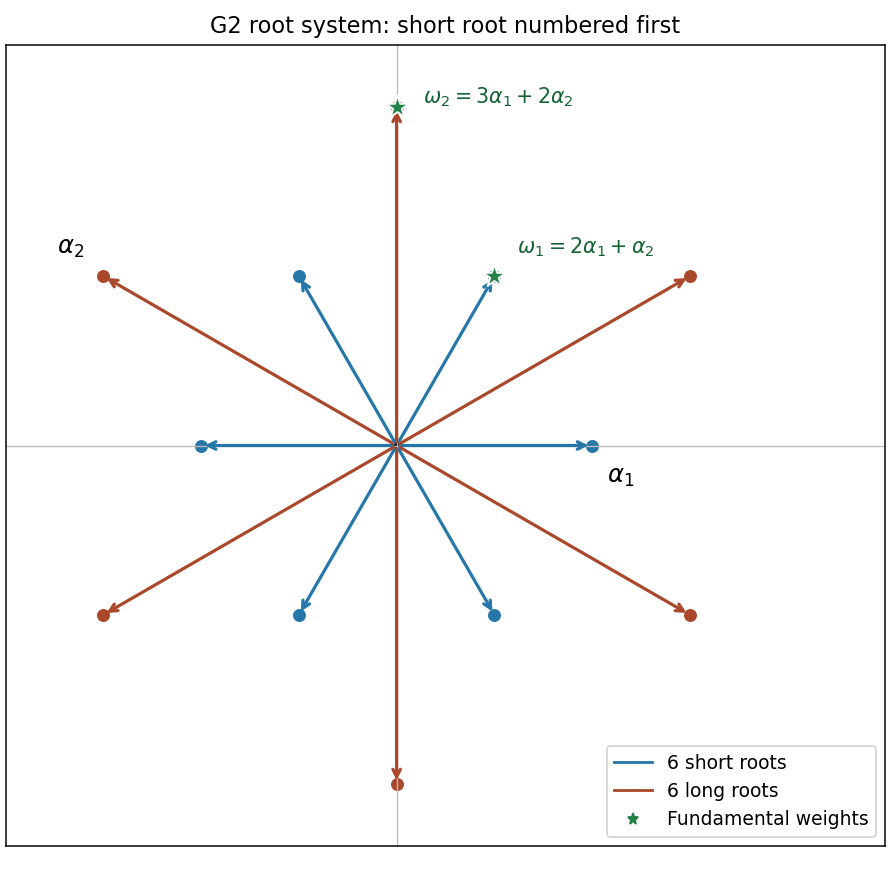

<h1 id="3/ii/solution">Solution</h1>

↑ **Parent:** [Ii](../ii.md)

Number the [simple roots](../../../../../../simple-root.md) of the [G2 root system](../../../../../../g2-root-system.md) so that $\alpha_1$ is short and $\alpha_2$ is long. In the Euclidean plane choose

$$
\alpha_1=(1,0),\qquad\alpha_2=(-3/2,\sqrt3/2).
$$

Their squared lengths are one and three, and their angle is $150$ degrees. The six [positive roots](../../../../../../positive-root.md) are

$$
\alpha_1,\quad\alpha_2,\quad\alpha_1+\alpha_2,\quad2\alpha_1+\alpha_2,
\quad3\alpha_1+\alpha_2,\quad3\alpha_1+2\alpha_2.
$$

Together with their negatives these form the twelve-root diagram: two regular hexagons of radii one and $\sqrt3$, rotated by $30$ degrees relative to one another. Solving the [fundamental weight](../../../../../../fundamental-weight.md) equations gives

$$
\boxed{\omega_1=2\alpha_1+\alpha_2=(1/2,\sqrt3/2),\qquad
\omega_2=3\alpha_1+2\alpha_2=(0,\sqrt3).}
$$

In particular $\omega_1$ is the highest short root and $\omega_2$ the highest long root. The root diagram below marks both [weights](../../../../../../weight-representation-theory.md).

To evaluate the [Weyl dimension formula](../../../../../../weyl-dimension-formula.md), put $a=n_1$, $b=n_2$ and $\lambda=a\omega_1+b\omega_2$. The [Weyl vector](../../../../../../half-sum-of-positive-roots.md) is $\rho=\omega_1+\omega_2$. In the order of [positive roots](../../../../../../positive-root.md) listed above, their [coroots](../../../../../../coroot.md) have simple-coroot coefficient pairs

$$
(1,0),\quad(0,1),\quad(1,3),\quad(2,3),\quad(1,1),\quad(1,2).
$$

For example the short root $\alpha_1+\alpha_2$ has [coroot](../../../../../../coroot.md) $\alpha_1^\vee+3\alpha_2^\vee$, while the long root $3\alpha_1+2\alpha_2$ has [coroot](../../../../../../coroot.md) $\alpha_1^\vee+2\alpha_2^\vee$. Pairing with $\lambda+\rho$ and dividing by the same factors at $a=b=0$ gives the [G2 dimension polynomial](../../../../../../g2-dimension-polynomial.md)

$$
\boxed{\dim L(a\omega_1+b\omega_2)=
\frac{(a+1)(b+1)(a+b+2)(a+2b+3)(a+3b+4)(2a+3b+5)}{120}.}
$$

The denominator is $1\cdot1\cdot2\cdot3\cdot4\cdot5$. As checks, the fundamental representations have [dimensions](../../../../../../dimension-vector-space.md) seven and fourteen, and $a=b=0$ gives the trivial representation of [dimension](../../../../../../dimension-vector-space.md) one.

**[Figure 3](#3/ii/image-the-twelve-g2-roots-and-the-short-first-fundamental-weights-omega-one-and-omega-two). The twelve G2 roots and the short-first fundamental weights omega one and omega two**.

## ↑ Ancestors (11)

1. [Ii](../ii.md)
2. [3](../../3.md)
3. [Paper 4](../../../paper-4-split.md)
4. [Iii](../../../split.md)
5. [2007](../../../../split.md)
6. [Past exam of the mathematics course of the University of Cambridge](../../../../../split.md)
7. [Mathematics course of the University of Cambridge](../../../../../../mathematics-course-of-the-university-of-cambridge.md)
8. [Course of the University of Cambridge](../../../../../../course-of-the-university-of-cambridge.md)
9. [University of Cambridge](../../../../../../university-of-cambridge-split.md)
10. [List of universities](../../../../../../list-of-universities.md)
11. [Codex Wiki](../../../../../../split.md)
