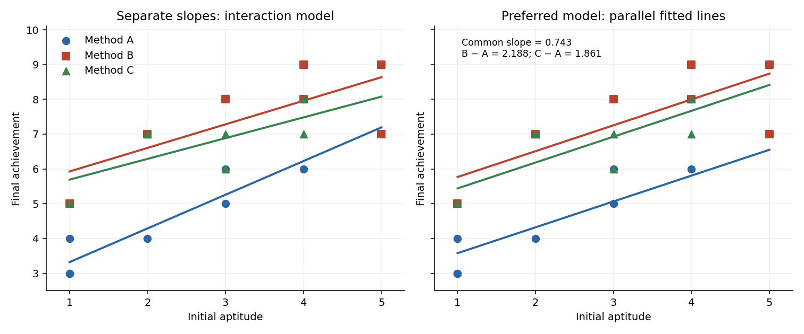

<h1 id="1/solution">Solution</h1>

↑ **Parent:** [1](../1.md)

This is an [analysis of covariance](../../../../../analysis-of-covariance.md): achievement is the response, aptitude is a quantitative [covariate](../../../../../covariate.md), and teaching method is a categorical explanatory variable. The usual [normal linear model](../../../../../normal-linear-model.md) assumes independent errors with common [variance](../../../../../variance-split.md) $\sigma^2$.

`read.table` reads the data with a header row; `attach` makes its columns directly accessible, and the two printed vectors confirm their ordering. `rep(1:3, each=7)` supplies the three group labels, and `factor` makes them categorical. The contrast option selects [treatment coding](../../../../../treatment-coding.md) for unordered factors, with method A as the first-level reference. The [polynomial](../../../../../polynomial-split.md) option would apply to ordered factors and has no role here.

The formula using `aptitude * Group` includes both main effects and their [interaction](../../../../../interaction-statistics.md). Writing $I_B,I_C$ for the method indicators, its fitted mean has the form

$$
E(Y_i)=\beta_0+\beta_1x_i+\tau_BI_{B,i}+\tau_CI_{C,i}+\gamma_Bx_iI_{B,i}+\gamma_Cx_iI_{C,i}.
$$

Thus A, B and C have separate intercepts and slopes. There are six coefficients and $21-6=15$ residual [statistical degrees of freedom](../../../../../statistical-degrees-of-freedom.md). The [analysis of variance](../../../../../analysis-of-variance.md) table uses [sequential sums of squares](../../../../../sequential-sum-of-squares.md): adding aptitude to an intercept-only model removes $36.57548$ from the [residual sum of squares](../../../../../residual-sum-of-squares.md); subsequently adding the two group indicators removes $16.93200$; adding the two slope [interactions](../../../../../interaction-statistics.md) removes only $0.66714$. The remaining sum of squares is $9.63490$, giving mean square $9.63490/15=0.64233$.

Each displayed [F-test](../../../../../f-test.md) divides the added term's sum of squares by its [statistical degrees of freedom](../../../../../statistical-degrees-of-freedom.md) and then by this full-model [residual mean square](../../../../../residual-estimate-of-gaussian-noise-variance.md). In particular the [interaction](../../../../../interaction-statistics.md) test is

$$
F=\frac{0.66714/2}{9.63490/15}=0.51932,\qquad p=0.60524.
$$

There is no evidence that the slopes differ, so the common-slope model is preferable among the fitted models. The small group $p$-value concerns differences after including aptitude, whereas the first aptitude row is sequential and does not adjust for Group. It should not be interpreted as the [covariate](../../../../../covariate.md) test after treatment adjustment.

The additive formula gives the parallel-lines model

$$
E(Y_i)=\beta_0+\beta_1x_i+\tau_BI_{B,i}+\tau_CI_{C,i}.
$$

It has four coefficients and $17$ residual [statistical degrees of freedom](../../../../../statistical-degrees-of-freedom.md). Removing the [interaction](../../../../../interaction-statistics.md) raises the [residual sum of squares](../../../../../residual-sum-of-squares.md) to $9.63490+0.66714=10.30204$, but lowers the [residual mean square](../../../../../residual-estimate-of-gaussian-noise-variance.md) to $10.30204/17=0.60600$. The sequential aptitude and group sums of squares are unchanged. The adjusted group test is now $F=(16.93200/2)/0.60600=13.97024$ on $(2,17)$ [statistical degrees of freedom](../../../../../statistical-degrees-of-freedom.md), with $p=0.0002579$: after allowing for initial aptitude, the methods are not all equally effective.

`summary(..., cor=F)` displays the fitted coefficients, their [standard errors](../../../../../standard-error.md), the individual $t$ statistics, and two-sided $p$-values; it omits the coefficient-correlation [matrix](../../../../../matrix.md). The intercept $2.8367$ is the fitted A mean at aptitude zero, which is outside the observed range and is mainly a parametrization device. The common slope $0.7429$ predicts about $0.74$ extra achievement units per aptitude unit, holding method fixed. Its adjusted $t$ test is $5.2267$ on $17$ [statistical degrees of freedom](../../../../../statistical-degrees-of-freedom.md), with $p$ about $0.0001$. The method coefficients are adjusted differences from A, not the B and C intercepts themselves. The three fitted lines are

$$
\boxed{\widehat y_A=2.8367+0.7429x,\quad\widehat y_B=5.0245+0.7429x,\quad\widehat y_C=4.6979+0.7429x.}
$$

The B-minus-A estimate is $2.1878$ with [standard error](../../../../../standard-error.md) $0.4545$ and $t=4.8139$; the C-minus-A estimate is $1.8612$ with [standard error](../../../../../standard-error.md) $0.4240$ and $t=4.3901$. Both comparisons are strongly significant.

The B-minus-C comparison needs its own [treatment contrast](../../../../../treatment-contrast.md); its significance cannot be read off either comparison with A. Reconstructing the coefficient [covariance](../../../../../covariance.md) from the design gives

$$
\widehat\tau_B-\widehat\tau_C=0.32653,\qquad\operatorname{se}=0.42831,\qquad t=0.7624,\quad p\simeq0.4563.
$$

Thus there is no detectable difference between B and C. This is consistent with pooling their effects in a further reduced model, but does not establish exact equality.

The [residual standard error](../../../../../residual-standard-error.md) is $\sqrt{0.60600}=0.7785$. The five-number residual summary shows deviations on both sides of zero, with the largest magnitude about $1.74$; it does not by itself verify constant [variance](../../../../../variance-split.md) or normality. The [coefficient of determination](../../../../../coefficient-of-determination.md) $R^2=0.8386$ means about $84\%$ of the achievement variation about its overall mean is explained. The overall $F=29.43$ compares all three nonintercept coefficients with zero, on $(3,17)$ [statistical degrees of freedom](../../../../../statistical-degrees-of-freedom.md); its $p$-value is $5.889\times10^{-7}$. Printed coefficient $p$-values rounded to `0.0000` are small, not literally zero.

The following original sketch shows the separate-slope model and the preferred parallel-line fit.

**[Figure 1](#1/image-observed-teaching-scores-and-separate-slope-versus-common-slope-fitted-models). Observed teaching scores and separate-slope versus common-slope fitted models**.

**At the same initial aptitude, B and C give higher predicted achievement than A, with no convincing difference between B and C.** Interpreting this adjusted association as a causal teaching effect additionally relies on the experimental allocation and error assumptions.

## ↑ Ancestors (10)

1. [1](../1.md)
2. [Paper 43](../../paper-43-split.md)
3. [Iii](../../split.md)
4. [2007](../../../split.md)
5. [Past exam of the mathematics course of the University of Cambridge](../../../../split.md)
6. [Mathematics course of the University of Cambridge](../../../../../mathematics-course-of-the-university-of-cambridge.md)
7. [Course of the University of Cambridge](../../../../../course-of-the-university-of-cambridge.md)
8. [University of Cambridge](../../../../../university-of-cambridge-split.md)
9. [List of universities](../../../../../list-of-universities.md)
10. [Codex Wiki](../../../../../split.md)
