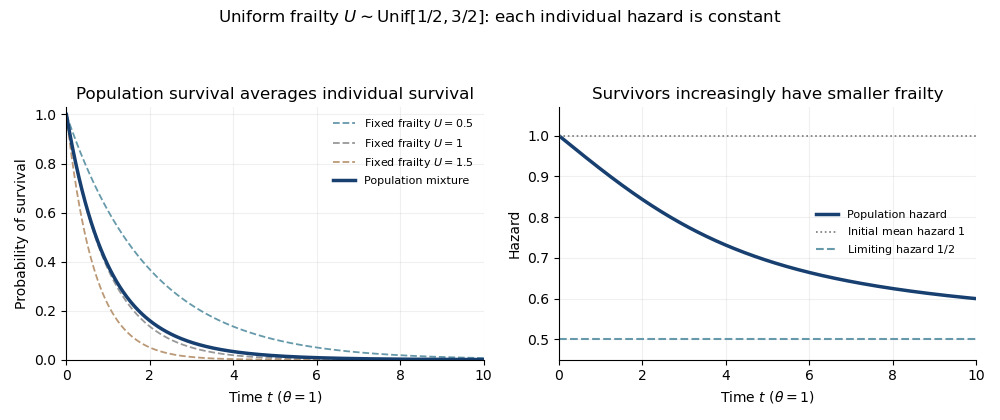

<h1 id="5/b/solution">Solution</h1>

↑ **Parent:** [B](../b.md)

At time zero there has been no survival selection, so the [population hazard of a survival mixture](../../../../../../population-hazard-of-a-survival-mixture.md) is the original mean individual hazard:

$$
\boxed{\overline h(0)=\theta\mathbb EU=\theta.}
$$

At very large times, surviving individuals overwhelmingly come from the smallest-frailty end of the distribution. Their hazards approach the lower endpoint $\theta/2$, so

$$
\boxed{\lim_{t\to\infty}\overline h(t)=\frac\theta2.}
$$

For a direct check, differentiating the logarithm of the [uniform frailty survival mixture](../../../../../../uniform-frailty-survival-mixture.md) gives

$$
\overline h(t)=\frac\theta2+\frac1t-\frac{\theta}{e^{\theta t}-1},\qquad t>0.
$$

Its expansion at zero is $\theta-\theta^2t/12+O(t^3)$, and its large-time limit is $\theta/2$. The changing population hazard does not imply that an individual's hazard declines. The [decreasing population hazard under constant individual hazards](../../../../../../decreasing-population-hazard-under-constant-individual-hazards.md) identity makes the selection mechanism precise: with $\Lambda=\theta U$,

$$
\overline h'(t)=-\operatorname{Var}(\Lambda\mid T>t)\leq0.
$$

It follows by differentiating the ratio $\mathbb E[\Lambda e^{-\Lambda t}]/\mathbb E[e^{-\Lambda t}]$. Thus the surviving mixture becomes less frail over time even though every conditional hazard is constant.

**[Figure 1](#5/b/image-uniform-frailty-survival-mixture-and-declining-population-hazard-despite-constant-individual-hazards). Uniform frailty survival mixture and declining population hazard despite constant individual hazards**.

The figure takes $\theta=1$. The population survivor curve averages conditional exponential curves, while its hazard falls from the initial mean to the minimum individual hazard.

## ↑ Ancestors (11)

1. [B](../b.md)
2. [5](../../5.md)
3. [Paper 46](../../../paper-46-split.md)
4. [Iii](../../../split.md)
5. [2007](../../../../split.md)
6. [Past exam of the mathematics course of the University of Cambridge](../../../../../split.md)
7. [Mathematics course of the University of Cambridge](../../../../../../mathematics-course-of-the-university-of-cambridge.md)
8. [Course of the University of Cambridge](../../../../../../course-of-the-university-of-cambridge.md)
9. [University of Cambridge](../../../../../../university-of-cambridge-split.md)
10. [List of universities](../../../../../../list-of-universities.md)
11. [Codex Wiki](../../../../../../split.md)
