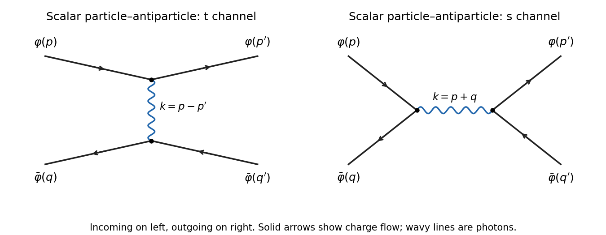

# Paper 50

↑ **Parent:** [Iii](../iii.md)

[https://www.maths.cam.ac.uk/postgrad/part-iii/files/pastpapers/2007/Paper50.pdf](https://www.maths.cam.ac.uk/postgrad/part-iii/files/pastpapers/2007/Paper50.pdf)

**Table of contents**

- [1](#1)
  - [a](#1/a)
    - [Solution](#1/a/solution)
  - [b](#1/b)
    - [Solution](#1/b/solution)
  - [c](#1/c)
    - [Solution](#1/c/solution)
  - [d](#1/d)
    - [i](#1/d/i)
      - [Solution](#1/d/i/solution)
    - [ii](#1/d/ii)
      - [Solution](#1/d/ii/solution)
- [2](#2)
  - [a](#2/a)
    - [Solution](#2/a/solution)
  - [b](#2/b)
    - [Solution](#2/b/solution)
  - [c](#2/c)
    - [Solution](#2/c/solution)
  - [d](#2/d)
    - [Solution](#2/d/solution)
- [3](#3)
  - [Solution](#3/solution)
  - [a](#3/a)
    - [Solution](#3/a/solution)
  - [b](#3/b)
    - [Solution](#3/b/solution)
  - [c](#3/c)
    - [Solution](#3/c/solution)
  - [d](#3/d)
    - [Solution](#3/d/solution)
- [4](#4)
  - [Solution](#4/solution)

## 1

↑ **Parent:** [Paper 50](paper-50.md)

<h3 id="1/a">a</h3>

↑ **Parent:** [1](#1)

<h4 id="1/a/solution">Solution</h4>

↑ **Parent:** [A](#1/a)

The [Pauli matrix multiplication law](../../../algebra.md#pauli-matrix-multiplication-law) is $\sigma_i\sigma_j=\delta_{ij}I_2+i\epsilon_{ijk}\sigma_k$, so $\{\sigma_i,\sigma_j\}=2\delta_{ij}I_2$. Block multiplication of the [chiral gamma-matrix representation](../../../algebra.md#chiral-gamma-matrix-representation) gives

$$
(\gamma^0)^2=I_4,\qquad \gamma^0\gamma^i=\begin{pmatrix}-\sigma_i&0\\0&\sigma_i\end{pmatrix},\qquad
\gamma^i\gamma^0=\begin{pmatrix}\sigma_i&0\\0&-\sigma_i\end{pmatrix},
$$

and

$$
\gamma^i\gamma^j=\begin{pmatrix}-\sigma_i\sigma_j&0\\0&-\sigma_i\sigma_j\end{pmatrix}.
$$

Thus the mixed anticommutators vanish and the spatial ones are $-2\delta_{ij}I_4$. With the [Minkowski metric](../../../special-relativity.md#minkowski-metric) convention $\eta=\operatorname{diag}(1,-1,-1,-1)$,

$$
\boxed{\{\gamma^\mu,\gamma^\nu\}=2\eta^{\mu\nu}I_4.}
$$

These matrices therefore represent the required [Clifford algebra](../../../algebra.md#clifford-algebra).

<h3 id="1/b">b</h3>

↑ **Parent:** [1](#1)

<h4 id="1/b/solution">Solution</h4>

↑ **Parent:** [B](#1/b)

Apply $i\gamma^\nu\partial_\nu+m$ to the [Dirac equation](../../../relativistic-quantum-field.md#dirac-equation). Since partial derivatives commute, only the symmetric part of the [gamma matrix](../../../algebra.md#gamma-matrices) product contributes:

$$
\begin{aligned}
0&=(i\gamma^\nu\partial_\nu+m)(i\gamma^\mu\partial_\mu-m)\psi\\
&=-\left(\tfrac12\{\gamma^\nu,\gamma^\mu\}\partial_\nu\partial_\mu+m^2\right)\psi
=-(\Box+m^2)\psi.
\end{aligned}
$$

Here $\Box=\partial_t^2-\nabla^2$ in the signature fixed above. The remaining operator is scalar in spinor indices, giving

$$
\boxed{(\Box+m^2)\psi_\alpha=0\quad\text{for each of the four components}.}
$$

This is the [Klein-Gordon equation](../../../wave-equation.md#klein-gordon-equation) for each component, although the first-order [Dirac equation](../../../relativistic-quantum-field.md#dirac-equation) additionally couples them.

<h3 id="1/c">c</h3>

↑ **Parent:** [1](#1)

<h4 id="1/c/solution">Solution</h4>

↑ **Parent:** [C](#1/c)

For positive frequency take $p^0=E=\sqrt{|\mathbf p|^2+m^2}>0$, with $m\geq0$. Lowering the index in $p_\mu\sigma^\mu$ is important: put

$$
A=p\cdot\sigma=E I_2-\mathbf p\cdot\boldsymbol\sigma,\qquad
B=p\cdot\bar\sigma=E I_2+\mathbf p\cdot\boldsymbol\sigma.
$$

These are commuting [Hermitian matrices](../../../hilbert-space.md#hermitian-operator) with $AB=(E^2-|\mathbf p|^2)I_2=m^2I_2$. Their [eigenvalues](../../../linear-operator-theory.md#eigenvalue) are $E\pm|\mathbf p|$, so they are positive definite for $m>0$ and [positive semidefinite matrices](../../../linear-algebra.md#positive-semidefinite-matrix) for $m=0$. [Simultaneous diagonalization](../../../mathematics.md#simultaneous-diagonalization) defines their positive [square roots of a matrix](../../../linear-algebra.md#square-root-of-a-matrix) and gives $\sqrt A\sqrt B=mI_2$.

The plane-wave ansatz reduces the [Dirac equation](../../../relativistic-quantum-field.md#dirac-equation) to $(\not p-m)u=0$, where

$$
\not p=\begin{pmatrix}0&A\\B&0\end{pmatrix}.
$$

For $u_L=\sqrt A\xi$ and $u_R=\sqrt B\xi$, commutativity gives $Au_R=m u_L$ and $Bu_L=m u_R$. Therefore

$$
\boxed{\psi_+(x)=\begin{pmatrix}\sqrt A\xi\\\sqrt B\xi\end{pmatrix}e^{-ip\cdot x}.}
$$

This is the [Hermitian square-root construction of Dirac plane waves](../../../relativistic-quantum-field.md#hermitian-square-root-construction-of-dirac-plane-waves).

For negative frequency retain the future-directed momentum label $p$ and use $\psi_-(x)=v(\mathbf p)e^{+ip\cdot x}$. The equation is now $(\not p+m)v=0$. Its general solution is

$$
\boxed{v(\mathbf p)=\begin{pmatrix}\sqrt A\zeta\\-\sqrt B\zeta\end{pmatrix},\qquad\psi_-(x)=v(\mathbf p)e^{+ip\cdot x},}
$$

with arbitrary two-spinor $\zeta$. The minus between its two blocks gives $Av_R=-m v_L$ and $Bv_L=-m v_R$. For $m>0$ these parametrizations span the two-dimensional positive- and negative-frequency solution spaces. At nonzero null momentum the square roots have complementary rank-one supports and still give the full two-dimensional kernels. If $\xi^\dagger\xi=\zeta^\dagger\zeta=1$, both spinors have norm squared $2E$; the positive one also has $\bar uu=2m$.

<h3 id="1/d">d</h3>

↑ **Parent:** [1](#1)

<h4 id="1/d/i">i</h4>

↑ **Parent:** [D](#1/d)

<h5 id="1/d/i/solution">Solution</h5>

↑ **Parent:** [I](#1/d/i)

Both blocks of the given rotation matrix carry the same [spin one-half](../../../quantum-mechanics.md#spin-one-half) representation, so a stationary spin-up state along the third axis uses the $+1$ eigenspinor $\xi_3=(1,0)^T$ of $\sigma_3$. At rest $A=B=mI_2$, giving

$$
\boxed{u_{3,+}(\mathbf0)=\sqrt m\begin{pmatrix}1\\0\\1\\0\end{pmatrix}.}
$$

For a massless particle moving along the positive third axis, $p=(E,0,0,E)$ with $E>0$, and

$$
A=\begin{pmatrix}0&0\\0&2E\end{pmatrix},\qquad B=\begin{pmatrix}2E&0\\0&0\end{pmatrix}.
$$

Keeping the same two-spinor label gives

$$
\boxed{u_{3,+}(E\widehat{\mathbf e}_3)=\sqrt{2E}\begin{pmatrix}0\\0\\1\\0\end{pmatrix}.}
$$

It has positive [helicity](../../../special-relativity.md#helicity) $+1/2$ and positive [chirality](../../../relativistic-quantum-field.md#chirality-physics) in the [Weyl representation](../../../algebra.md#chiral-gamma-matrix-representation).

<h4 id="1/d/ii">ii</h4>

↑ **Parent:** [D](#1/d)

<h5 id="1/d/ii/solution">Solution</h5>

↑ **Parent:** [Ii](#1/d/ii)

For spin-up along the first axis, take the normalized $+1$ eigenspinor of $\sigma_1$, namely $\xi_1=(1,1)^T/\sqrt2$. At rest this gives

$$
\boxed{u_{1,+}(\mathbf0)=\sqrt{\frac m2}\begin{pmatrix}1\\1\\1\\1\end{pmatrix}.}
$$

For momentum $(E,0,0,E)$, using the square roots displayed in part (i) with the same label gives

$$
\boxed{u_{1,\mathrm{label}}(E\widehat{\mathbf e}_3)=\sqrt E\begin{pmatrix}0\\1\\1\\0\end{pmatrix}.}
$$

This is the [massless limit of a transverse canonical-spin label](../../../relativistic-quantum-field.md#massless-limit-of-a-transverse-canonical-spin-label): it is the equal superposition of the negative-helicity left-chiral mode and the positive-helicity right-chiral mode. It solves the massless [Dirac equation](../../../relativistic-quantum-field.md#dirac-equation) and has norm squared $2E$.

A qualification is essential if “spin along the first axis” is interpreted literally at zero mass. The fixed transverse rotation generator is $\Sigma_1/2$, with $\Sigma_1=\operatorname{diag}(\sigma_1,\sigma_1)$, and the massless Hamiltonian at this momentum is $H=E\gamma^0\gamma^3$. They anticommute. If $Hu=Eu$ and $\Sigma_1u=u$ both held, then $H\Sigma_1u=-\Sigma_1Hu=-Eu$, whereas $H\Sigma_1u=Hu=Eu$, forcing $u=0$. Thus there is no nonzero positive-energy massless solution with that literal transverse-spin eigenvalue. The displayed nonzero spinor is the transported rest-spin label requested by the massive-to-massless construction, rather than a transverse-spin eigenstate.

## 2

↑ **Parent:** [Paper 50](paper-50.md)

<h3 id="2/a">a</h3>

↑ **Parent:** [2](#2)

<h4 id="2/a/solution">Solution</h4>

↑ **Parent:** [A](#2/a)

The normalized [Fock vacuum](../../../quantum-field-theory.md#fock-vacuum) obeys $a_{\mathbf p}|0\rangle=0$ for every momentum and $\langle0|0\rangle=1$. Taking adjoints gives $\langle0|a_{\mathbf p}^\dagger=0$. Of the four products in the mode expansion of $\phi(x)\phi(y)$, only $a_{\mathbf p}a_{\mathbf q}^\dagger$ has a nonzero [vacuum expectation value](../../../quantum-field-theory.md#vacuum-expectation-value). The [commutator](../../../lie-algebra.md#commutator) implies

$$
\langle0|a_{\mathbf p}a_{\mathbf q}^\dagger|0\rangle=(2\pi)^3\delta^{(3)}(\mathbf p-\mathbf q).
$$

Consequently

$$
\begin{aligned}
\langle0|\phi(x)\phi(y)|0\rangle
&=\int\frac{d^3p\,d^3q}{(2\pi)^6\sqrt{2E_{\mathbf p}\,2E_{\mathbf q}}}(2\pi)^3\delta^{(3)}(\mathbf p-\mathbf q)e^{-ipx+iqy}\\
&=\boxed{\int\frac{d^3p}{(2\pi)^3\,2E_{\mathbf p}}e^{-ip\cdot(x-y)}}.
\end{aligned}
$$

This unordered [Wightman function](../../../quantum-field-theory.md#wightman-function) differs from the time-ordered [Feynman propagator](../../../quantum-field-theory.md#feynman-propagator) when the temporal ordering is reversed.

<h3 id="2/b">b</h3>

↑ **Parent:** [2](#2)

<h4 id="2/b/solution">Solution</h4>

↑ **Parent:** [B](#2/b)

Write $t=x^0-y^0$ and $\mathbf r=\mathbf x-\mathbf y$. By [time ordering](../../../perturbative-quantum-field-theory.md#time-ordering) for a bosonic field,

$$
\Delta_F(x-y)=\theta(t)\int\frac{d^3p}{(2\pi)^3\,2E_p}e^{-iE_pt+i\mathbf p\cdot\mathbf r}
+\theta(-t)\int\frac{d^3p}{(2\pi)^3\,2E_p}e^{iE_pt-i\mathbf p\cdot\mathbf r}.
$$

Reverse $\mathbf p$ in the second integral. At fixed spatial momentum consider

$$
I(t)=\int_{-\infty}^{\infty}\frac{dp^0}{2\pi}\frac{i e^{-ip^0t}}{(p^0)^2-E_p^2+i0}.
$$

The [Feynman i-epsilon prescription](../../../quantum-field-theory.md#feynman-i-epsilon-prescription) places the poles at $+E_p-i0$ and $-E_p+i0$. For $t>0$, close in the lower half-plane, clockwise. The positive-energy residue and the orientation give $e^{-iE_pt}/(2E_p)$. For $t<0$, close counterclockwise in the upper half-plane; the negative pole has derivative denominator $-2E_p$, and its residue gives $e^{iE_pt}/(2E_p)$. Thus $I(t)=e^{-iE_p|t|}/(2E_p)$, reproducing the time-ordered mode expression. We obtain

$$
\boxed{\Delta_F(x-y)=\int\frac{d^4p}{(2\pi)^4}\frac{i e^{-ip\cdot(x-y)}}{p^2-\mu^2+i0}.}
$$

This is a distributional boundary value, not an absolutely convergent Fourier integral. As an independent normalization check, $I'(0^+)-I'(0^-)=-i$, so $(\Box+\mu^2)\Delta_F=-i\delta^{(4)}$; the numerator is $i$ with the question's definition of the propagator.

<h3 id="2/c">c</h3>

↑ **Parent:** [2](#2)

<h4 id="2/c/solution">Solution</h4>

↑ **Parent:** [C](#2/c)

The [Yukawa interaction](../../../standard-model.md#yukawa-interaction) has one real-scalar leg and an oriented [fermion](../../../quantum-mechanics.md#fermion) line at each vertex. At lowest connected order, two vertices exchange one scalar, so the diagrams are of order $\lambda^2$.

For two incoming [fermions](../../../quantum-mechanics.md#fermion), there are two pairings of the outgoing [fermions](../../../quantum-mechanics.md#fermion): the $t$ channel joins $p$ to $p'$ and $q$ to $q'$, with scalar momentum $p-p'$; the $u$ channel joins $p$ to $q'$ and $q$ to $p'$, with scalar momentum $p-q'$. [Fermion number conservation](../../../relativistic-quantum-field.md#dirac-fermion-number-conservation) excludes an annihilation channel for two particles carrying the same charge.

For an incoming [fermion](../../../quantum-mechanics.md#fermion) and [antiparticle](../../../relativistic-quantum-field.md#antiparticle), there is a $t$-channel scalar exchange with momentum $p-p'=q'-q$ and an $s$-channel annihilation and recreation diagram with momentum $p+q=p'+q'$. Arrows on [antiparticle](../../../relativistic-quantum-field.md#antiparticle) lines run opposite to the direction of physical propagation. These are the four [tree scattering in Yukawa theory](../../../standard-model.md#tree-scattering-in-yukawa-theory) diagrams shown below; all external momenta are labelled.

**[Figure 1](#2/c/image-tree-level-scalar-exchange-diagrams-for-fermion-fermion-and-fermion-antifermion-scattering-incoming-states-on-the-left). Tree-level scalar-exchange diagrams for fermion–fermion and fermion–antifermion scattering; incoming states on the left**.

The crossing in the $u$-channel drawing is not a vertex. Dashed internal lines are the [real scalar field](../../../scalar-field-theory.md#real-scalar-field); solid arrows show fermion-number flow.

<h3 id="2/d">d</h3>

↑ **Parent:** [2](#2)

<h4 id="2/d/solution">Solution</h4>

↑ **Parent:** [D](#2/d)

Use the [Feynman vertex](../../../perturbative-quantum-field-theory.md#interaction-vertex) $-i\lambda$ for the scalar [Yukawa coupling](../../../standard-model.md#yukawa-interaction), the internal [scalar propagator](../../../scalar-field-theory.md#scalar-propagator) $i/(k^2-\mu^2+i0)$, incoming factors $u_r(p)$ and outgoing [Dirac adjoints](../../../relativistic-quantum-field.md#dirac-adjoint) $\bar u_{r'}(p')$. Define $i\mathcal M$ as the coefficient in the connected [S-matrix](../../../quantum-mechanics.md#s-matrix) element after removing its overall momentum-conserving [Dirac delta function](../../../distribution-theory.md#dirac-delta-function). A direct pairing contributes

$$
i\mathcal M_t=(-i\lambda)^2\frac{i}{(p-p')^2-\mu^2+i0}\,[\bar u_{r'}(p')u_r(p)]\,[\bar u_{s'}(q')u_s(q)].
$$

The crossed pairing interchanges the identical outgoing [fermions](../../../quantum-mechanics.md#fermion) and therefore has a relative [fermionic sign](../../../perturbative-quantum-field-theory.md#fermionic-sign) of minus. With $t=(p-p')^2$ and $u=(p-q')^2$, the result is

$$
\boxed{\mathcal M=-\lambda^2\left[\frac{[\bar u_{r'}(p')u_r(p)][\bar u_{s'}(q')u_s(q)]}{t-\mu^2+i0}
-\frac{[\bar u_{s'}(q')u_r(p)][\bar u_{r'}(p')u_s(q)]}{u-\mu^2+i0}\right].}
$$

It changes sign under exchange of the two outgoing momenta and spin labels, as required for identical [fermions](../../../quantum-mechanics.md#fermion). No [fermion spin sum](../../../relativistic-quantum-field.md#fermion-spin-sum) or identical-particle phase-space factor belongs in this amplitude; those enter a [relativistic scattering cross-section](../../../quantum-mechanics.md#relativistic-scattering-cross-section) calculation.

## 3

↑ **Parent:** [Paper 50](paper-50.md)

<h3 id="3/solution">Solution</h3>

↑ **Parent:** [3](#3)

Use the same [Minkowski metric](../../../special-relativity.md#minkowski-metric) $\eta=\operatorname{diag}(1,-1,-1,-1)$ as in Question 1. For the conjugate charged field, the kinetic term means $(D_\mu\varphi)^*D^\mu\varphi$, with $(D_\mu\varphi)^*=(\partial_\mu-ieA_\mu)\varphi^*$. Thus the conjugate field has the opposite charge in the [gauge covariant derivative](../../../relativistic-quantum-field.md#gauge-covariant-derivative).

<h3 id="3/a">a</h3>

↑ **Parent:** [3](#3)

<h4 id="3/a/solution">Solution</h4>

↑ **Parent:** [A](#3/a)

For any real smooth function $\chi(x)$, make the local transformation

$$
\boxed{\varphi'(x)=e^{-ie\chi(x)}\varphi(x),\qquad A'_\mu=A_\mu+\partial_\mu\chi.}
$$

The [electromagnetic field tensor](../../../electromagnetism.md#electromagnetic-field-tensor) is unchanged because the mixed derivatives of $\chi$ commute. Directly,

$$
(\partial_\mu+ieA'_\mu)\varphi'
=e^{-ie\chi}(\partial_\mu+ieA_\mu)\varphi.
$$

Its conjugate transforms with the inverse phase, so $(D_\mu\varphi)^*D^\mu\varphi$ is invariant. The mass term depends only on $|\varphi|^2$ and is invariant as well. All terms of the action are therefore unchanged. This proves the local [U(1) gauge symmetry](../../../relativistic-quantum-field.md#u-1-gauge-symmetry) of [scalar electrodynamics](../../../relativistic-quantum-field.md#scalar-electrodynamics).

<h3 id="3/b">b</h3>

↑ **Parent:** [3](#3)

<h4 id="3/b/solution">Solution</h4>

↑ **Parent:** [B](#3/b)

A [gauge redundancy](../../../relativistic-quantum-field.md#gauge-redundancy) relates different field representatives of the same physical configuration. For example, the transformation just exhibited changes $A_\mu$ and the scalar phase but leaves $F_{\mu\nu}$, $|\varphi|^2$ and all other [gauge-invariant operators](../../../relativistic-quantum-field.md#gauge-invariant-operator) unchanged. Fixing a gauge removes this freedom; it does not remove a physical symmetry-related state. In [canonical quantization](../../../quantum-mechanics.md#canonical-quantization), local transformations trivial at the boundary are generated by the [Gauss law constraint in gauge theory](../../../relativistic-quantum-field.md#gauss-law-constraint-in-gauge-theory), and physical states satisfy that constraint.

A [global symmetry in field theory](../../../quantum-field-theory.md#global-symmetry-in-field-theory) instead has a spacetime-independent parameter and can act nontrivially on physical states. For a continuous [global symmetry in field theory](../../../quantum-field-theory.md#global-symmetry-in-field-theory), [Noether theorem](../../../calculus-of-variations.md#noether-theorem) gives a conserved charge that generates the transformation and labels the states; discrete global symmetries do not acquire a [Noether current](../../../quantum-field-theory.md#noether-current) from the same infinitesimal theorem. These are statements about physical transformations, rather than merely whether a parameter is written as a constant or a function.

Boundary conditions matter in [gauge theory](../../../quantum-field-theory.md#gauge-theory). [gauge transformations](../../../electromagnetism.md#gauge-transformation) that vanish at spatial infinity are redundancies, while transformations nontrivial at infinity may act through a physical electric charge. In particular a constant phase transformation can survive as a global charge symmetry rather than being quotiented out with the local [gauge redundancy](../../../relativistic-quantum-field.md#gauge-redundancy). Thus **local [gauge redundancy](../../../relativistic-quantum-field.md#gauge-redundancy) is a redundancy of description; genuine [global symmetry in field theory](../../../quantum-field-theory.md#global-symmetry-in-field-theory) can distinguish physical states and charges**, with the boundary qualification made explicit.

<h3 id="3/c">c</h3>

↑ **Parent:** [3](#3)

<h4 id="3/c/solution">Solution</h4>

↑ **Parent:** [C](#3/c)

Expand the [gauge covariant derivative](../../../relativistic-quantum-field.md#gauge-covariant-derivative) in the scalar kinetic term:

$$
(D_\mu\varphi)^*D^\mu\varphi
=\partial_\mu\varphi^*\partial^\mu\varphi
+ieA_\mu\bigl(\varphi\partial^\mu\varphi^*-\varphi^*\partial^\mu\varphi\bigr)
+e^2A_\mu A^\mu\varphi^*\varphi.
$$

The cubic interaction is therefore

$$
\boxed{\mathcal L_3=ieA_\mu(\varphi\partial^\mu\varphi^*-\varphi^*\partial^\mu\varphi).}
$$

For an incoming scalar momentum $p$ and outgoing momentum $q$, derivatives give $-ip$ on the incoming field and $+iq$ on its outgoing conjugate. Multiplication by the factor $i$ from the interaction action gives the [scalar electrodynamics three-point vertex](../../../perturbative-quantum-field-theory.md#scalar-electrodynamics-three-point-vertex) $-ie(p+q)_\mu$.

The other vertex comes from

$$
\boxed{\mathcal L_4=e^2A_\mu A^\mu\varphi^*\varphi.}
$$

Differentiating twice with respect to the identical photon fields gives a factor of two, so the [seagull vertex](../../../perturbative-quantum-field-theory.md#seagull-vertex) is $+2ie^2\eta_{\mu\nu}$. There is no additional factor of two from the scalar fields, since the [complex scalar field](../../../scalar-field-theory.md#complex-scalar-field) and its conjugate are distinct legs.

<h3 id="3/d">d</h3>

↑ **Parent:** [3](#3)

<h4 id="3/d/solution">Solution</h4>

↑ **Parent:** [D](#3/d)

At order $e^2$, scalar particle–[antiparticle](../../../relativistic-quantum-field.md#antiparticle) scattering has a $t$-channel photon exchange and an $s$-channel annihilation and recreation diagram. They are shown below, with incoming momenta $p,q$ and outgoing momenta $p',q'$. The [seagull vertex](../../../perturbative-quantum-field-theory.md#seagull-vertex) has only two scalar legs and does not yield a four-scalar tree diagram at this order.

**[Figure 2](#3/d/image-leading-scalar-particle-antiparticle-scattering-diagrams-with-exchanged-and-annihilation-channel-photons). Leading scalar particle–antiparticle scattering diagrams with exchanged and annihilation-channel photons**.

For the exchange graph, let $k=p-p'=q'-q$. Apart from overall charge signs, the two scalar currents are $J=p+p'$ and $K=q+q'$. The external [mass shell](../../../special-relativity.md#mass-shell) conditions give

$$
k\cdot J=p^2-p'^2=0,\qquad k\cdot K=q'^2-q^2=0.
$$

For the annihilation graph, $k=p+q=p'+q'$, with currents $J=p-q$ and $K=p'-q'$, again up to vertex signs. Their contractions are $p^2-q^2=0$ and $p'^2-q'^2=0$. Thus each graph couples the photon to [conserved currents](../../../quantum-field-theory.md#conserved-current), the relevant [scalar quantum electrodynamics Ward identity](../../../perturbative-quantum-field-theory.md#scalar-quantum-electrodynamics-ward-identity).

Write $k=(\omega,\mathbf k)$ and $\kappa^2=|\mathbf k|^2$. [conserved current](../../../quantum-field-theory.md#conserved-current) means $\mathbf k\cdot\mathbf J=\omega J^0$ and $\mathbf k\cdot\mathbf K=\omega K^0$. For $\kappa\ne0$, contraction with the [Coulomb-gauge photon propagator](../../../quantum-field-theory.md#coulomb-gauge-photon-propagator) gives, displaying the rational identity before the pole boundary limit,

$$
\begin{aligned}
J^\mu D^{\mathrm C}_{\mu\nu}K^\nu
&=\frac{iJ^0K^0}{\kappa^2}
+\frac{i}{k^2}\left(\mathbf J\cdot\mathbf K-\frac{(\mathbf J\cdot\mathbf k)(\mathbf K\cdot\mathbf k)}{\kappa^2}\right)\\
&=\frac{i\mathbf J\cdot\mathbf K}{k^2}
+\frac{iJ^0K^0}{\kappa^2}\left(1-\frac{\omega^2}{k^2}\right)\\
&=\frac{i}{k^2}\bigl(\mathbf J\cdot\mathbf K-J^0K^0\bigr)
=-\frac{i}{k^2}J\cdot K.
\end{aligned}
$$

We used $k^2=\omega^2-\kappa^2$. Restoring the common [Feynman i-epsilon prescription](../../../quantum-field-theory.md#feynman-i-epsilon-prescription) yields the [Coulomb-gauge propagator between conserved currents](../../../quantum-field-theory.md#coulomb-gauge-propagator-between-conserved-currents) result

$$
\boxed{J^\mu D^{\mathrm C}_{\mu\nu}K^\nu
=J^\mu\left(\frac{-i\eta_{\mu\nu}}{k^2+i0}\right)K^\nu.}
$$

Hence each on-shell tree amplitude can use the Lorentz-invariant propagator. This is equality after contraction, not equality of the gauge-dependent tensors. At $\mathbf k=0$, the separate Coulomb-gauge terms are ill-defined; combine them first and take the conserved-current limit. The combined expression has only the physical photon pole.

## 4

↑ **Parent:** [Paper 50](paper-50.md)

<h3 id="4/solution">Solution</h3>

↑ **Parent:** [4](#4)

**[Antiparticles](../../../relativistic-quantum-field.md#antiparticle) are positive-energy quanta of relativistic [quantum fields](../../../quantum-field-theory.md#quantum-field), not physical particles with negative energies.** The negative-frequency part of a [quantum field](../../../quantum-field-theory.md#quantum-field) creates these quanta; the distinction between its classical frequency and a state's excitation energy is central to their interpretation.

For a [real scalar field](../../../scalar-field-theory.md#real-scalar-field), Hermiticity identifies the two frequency branches:

$$
\phi(x)=\int\frac{d^3p}{(2\pi)^3\sqrt{2E_p}}\left(a_{\mathbf p}e^{-ipx}+a_{\mathbf p}^\dagger e^{ipx}\right).
$$

There is one species of excitation. Its particle is its own [antiparticle](../../../relativistic-quantum-field.md#antiparticle); a single Hermitian scalar cannot carry the nonzero continuous phase charge of a complex field. This does not prevent self-conjugate particles from having other [quantum numbers](../../../quantum-mechanics.md#quantum-number).

A [complex scalar field](../../../scalar-field-theory.md#complex-scalar-field) is not Hermitian. Its two independent sets of oscillators give

$$
\Phi(x)=\int\frac{d^3p}{(2\pi)^3\sqrt{2E_p}}\left(a_{\mathbf p}e^{-ipx}+b_{\mathbf p}^\dagger e^{ipx}\right),\qquad
\Phi^\dagger(x)=\int\frac{d^3p}{(2\pi)^3\sqrt{2E_p}}\left(a_{\mathbf p}^\dagger e^{ipx}+b_{\mathbf p}e^{-ipx}\right).
$$

The [canonical commutation relations](../../../quantum-mechanics.md#canonical-commutation-relation) make $a^\dagger$ and $b^\dagger$ create different positive-energy species. With charge convention fixed by $[Q,\Phi]=-q\Phi$, [normal ordering](../../../perturbative-quantum-field-theory.md#normal-ordering) gives

$$
H=\int\frac{d^3p}{(2\pi)^3}E_p(a_{\mathbf p}^\dagger a_{\mathbf p}+b_{\mathbf p}^\dagger b_{\mathbf p}),\qquad
Q=q\int\frac{d^3p}{(2\pi)^3}(a_{\mathbf p}^\dagger a_{\mathbf p}-b_{\mathbf p}^\dagger b_{\mathbf p}).
$$

Thus $a^\dagger|0\rangle$ and $b^\dagger|0\rangle$ have the same mass and spin but opposite charge. Although $b^\dagger e^{ipx}$ has negative classical frequency, $[H,b^\dagger]=E_pb^\dagger$, so it creates a positive-energy excitation. Two [real scalar fields](../../../scalar-field-theory.md#real-scalar-field) can be combined into one complex field; the particle–[antiparticle](../../../relativistic-quantum-field.md#antiparticle) basis diagonalizes the conserved phase charge. Neutrality alone does not require a particle to be self-conjugate.

Locality explains why both branches occur. For the [complex scalar field](../../../scalar-field-theory.md#complex-scalar-field),

$$
[\Phi(x),\Phi^\dagger(y)]=\int\frac{d^3p}{(2\pi)^3\,2E_p}\left(e^{-ip\cdot(x-y)}-e^{ip\cdot(x-y)}\right).
$$

At spacelike separation, [Lorentz invariance](../../../special-relativity.md#lorentz-invariance) of the [mass shell](../../../special-relativity.md#mass-shell) measure permits a frame with equal times; reversing $\mathbf p$ makes the two terms cancel. This is [microcausality](../../../relativistic-quantum-field.md#microcausality). If the [antiparticle](../../../relativistic-quantum-field.md#antiparticle) creation term were omitted, the [commutator](../../../lie-algebra.md#commutator) would be just a [Wightman function](../../../quantum-field-theory.md#wightman-function), generally nonzero at spacelike separation. For example, for a massless scalar at equal times and separation $r>0$, it is $1/(4\pi^2r^2)$. The cancellation is the role of [antiparticle modes and spacelike commutativity](../../../relativistic-quantum-field.md#antiparticle-modes-and-spacelike-commutativity). In a [real scalar field](../../../scalar-field-theory.md#real-scalar-field) its self-conjugate creation modes supply the same cancellation.

A [nonrelativistic particle field](../../../scalar-field-theory.md#nonrelativistic-particle-field) obeys a first-order time equation and need not contain an antiparticle-creation branch. For example,

$$
\mathcal L=i\Psi^\dagger\partial_t\Psi-\frac{|\nabla\Psi|^2}{2m},\qquad
i\partial_t\Psi=-\frac{\nabla^2}{2m}\Psi,
$$

allows an expansion using only $a_{\mathbf p}e^{-i\mathbf p^2t/(2m)+i\mathbf p\cdot\mathbf x}$ in $\Psi$; its adjoint creates those particles. The basic theory conserves particle number and does not impose a Lorentz-invariant [light cone](../../../special-relativity.md#light-cone) locality condition. It often arises from a relativistic [quantum field](../../../quantum-field-theory.md#quantum-field) by factoring out the rest-energy oscillation and restricting to a low-energy particle sector, where creation of particle–[antiparticle](../../../relativistic-quantum-field.md#antiparticle) pairs costs roughly $2m$. An [antiparticle](../../../relativistic-quantum-field.md#antiparticle) species can certainly also be treated nonrelativistically with its own field; [antiparticles](../../../relativistic-quantum-field.md#antiparticle) are simply not forced by this nonrelativistic [quantum field](../../../quantum-field-theory.md#quantum-field) equation.

Historically, the [Dirac equation](../../../relativistic-quantum-field.md#dirac-equation) has one-particle energy branches $\pm\sqrt{\mathbf p^2+m^2}$. Treating both as ordinary electron energies would leave no lowest-energy one-particle vacuum: an electron could fall through arbitrarily negative levels. The [Dirac sea](../../../relativistic-quantum-field.md#dirac-sea) interpretation fills every negative-energy electron level. The [Pauli exclusion principle](../../../quantum-mechanics.md#pauli-exclusion-principle) then blocks further occupation. A missing negative-energy electron is a hole: removing energy $-E$ increases energy by $E$, and removing charge $-e$ leaves charge $+e$. This predicts the positron's mass, spin and opposite electric charge.

The [quantum field theory](../../../quantum-field-theory.md) account quantizes a [Dirac field](../../../relativistic-quantum-field.md#dirac-field) instead:

$$
\psi(x)=\sum_r\int\frac{d^3p}{(2\pi)^3\sqrt{2E_p}}\left(a_r(\mathbf p)u_r(p)e^{-ipx}+b_r^\dagger(\mathbf p)v_r(p)e^{ipx}\right).
$$

The independent particle and [antiparticle](../../../relativistic-quantum-field.md#antiparticle) operators obey [canonical anticommutation relations](../../../quantum-mechanics.md#canonical-anticommutation-relations). Before [normal ordering](../../../perturbative-quantum-field-theory.md#normal-ordering), the negative-frequency contribution to the Dirac Hamiltonian has the form $-E_pb_rb_r^\dagger$. Anticommutation rewrites it as $+E_pb_r^\dagger b_r$ plus a vacuum constant. Removing the constant leaves positive particle and [antiparticle](../../../relativistic-quantum-field.md#antiparticle) energies. The charge has opposite signs on the two occupation numbers, and interactions permit pair creation and annihilation while conserving the relevant charges.

There is therefore no need for a literal infinitely populated material sea. The hole picture is a useful fermionic reinterpretation, but it cannot explain bosonic [antiparticles](../../../relativistic-quantum-field.md#antiparticle) through filled-level exclusion, since [bosons](../../../quantum-mechanics.md#boson) can multiply occupy a state. [Canonical quantization of a complex scalar field](../../../scalar-field-theory.md#canonical-quantization-of-a-complex-scalar-field) supplies them just as consistently. More generally [charge conjugation](../../../quantum-field-theory.md#charge-conjugation) relates field representations with opposite internal charges; [real scalar fields](../../../scalar-field-theory.md#real-scalar-field) and [Majorana fermions](../../../relativistic-quantum-field.md#majorana-spinor) are self-conjugate exceptions. The relativistic [Fock space](../../../quantum-field-theory.md#fock-space) description handles these cases, statistics and changing particle number within one framework.

## ↑ Ancestors (8)

1. [Iii](../iii.md)
2. [2007](../../2007.md)
3. [Past exam of the mathematics course of the University of Cambridge](../../../past-exam-of-the-mathematics-course-of-the-university-of-cambridge.md)
4. [Mathematics course of the University of Cambridge](../../../university-of-cambridge.md#mathematics-course-of-the-university-of-cambridge)
5. [Course of the University of Cambridge](../../../university-of-cambridge.md#course-of-the-university-of-cambridge)
6. [University of Cambridge](../../../university-of-cambridge.md)
7. [List of universities](../../../README.md#list-of-universities)
8. [Codex Wiki](../../../README.md)
