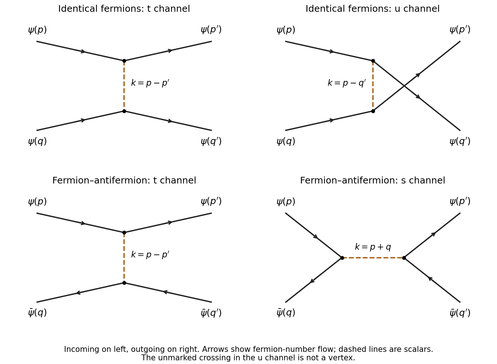

<h1 id="2/c/solution">Solution</h1>

↑ **Parent:** [C](../c.md)

The [Yukawa interaction](../../../../../../yukawa-interaction.md) has one real-scalar leg and an oriented [fermion](../../../../../../fermion.md) line at each vertex. At lowest connected order, two vertices exchange one scalar, so the diagrams are of order $\lambda^2$.

For two incoming [fermions](../../../../../../fermion.md), there are two pairings of the outgoing [fermions](../../../../../../fermion.md): the $t$ channel joins $p$ to $p'$ and $q$ to $q'$, with scalar momentum $p-p'$; the $u$ channel joins $p$ to $q'$ and $q$ to $p'$, with scalar momentum $p-q'$. [Fermion number conservation](../../../../../../dirac-fermion-number-conservation.md) excludes an annihilation channel for two particles carrying the same charge.

For an incoming [fermion](../../../../../../fermion.md) and [antiparticle](../../../../../../antiparticle.md), there is a $t$-channel scalar exchange with momentum $p-p'=q'-q$ and an $s$-channel annihilation and recreation diagram with momentum $p+q=p'+q'$. Arrows on [antiparticle](../../../../../../antiparticle.md) lines run opposite to the direction of physical propagation. These are the four [tree scattering in Yukawa theory](../../../../../../tree-scattering-in-yukawa-theory.md) diagrams shown below; all external momenta are labelled.

**[Figure 1](#2/c/image-tree-level-scalar-exchange-diagrams-for-fermion-fermion-and-fermion-antifermion-scattering-incoming-states-on-the-left). Tree-level scalar-exchange diagrams for fermion–fermion and fermion–antifermion scattering; incoming states on the left**.

The crossing in the $u$-channel drawing is not a vertex. Dashed internal lines are the [real scalar field](../../../../../../real-scalar-field.md); solid arrows show fermion-number flow.

## ↑ Ancestors (11)

1. [C](../c.md)
2. [2](../../2.md)
3. [Paper 50](../../../paper-50-split.md)
4. [Iii](../../../split.md)
5. [2007](../../../../split.md)
6. [Past exam of the mathematics course of the University of Cambridge](../../../../../split.md)
7. [Mathematics course of the University of Cambridge](../../../../../../mathematics-course-of-the-university-of-cambridge.md)
8. [Course of the University of Cambridge](../../../../../../course-of-the-university-of-cambridge.md)
9. [University of Cambridge](../../../../../../university-of-cambridge-split.md)
10. [List of universities](../../../../../../list-of-universities.md)
11. [Codex Wiki](../../../../../../split.md)
