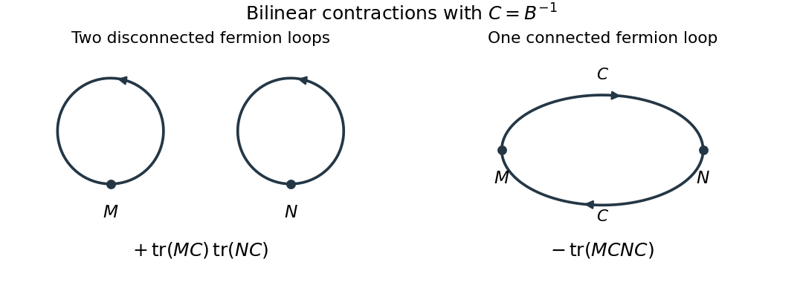

<h1 id="1/solution">Solution</h1>

↑ **Parent:** [1](../1.md)

For one [Grassmann variable](../../../../../grassmann-variable.md), define the [Berezin integral](../../../../../berezin-integral.md) by $\int d\theta\,1=0$ and $\int d\theta\,\theta=1$, extending linearly. Since $\theta^2=0$, these rules determine it on every polynomial. With several [Grassmann variables](../../../../../grassmann-variable.md), integrate from the rightmost differential first. Equivalently, $\int d\theta_n\cdots d\theta_1$ extracts the coefficient of $\theta_1\cdots\theta_n$ in that order. Repeated indices give zero, while permuting distinct generators gives the [fermionic sign](../../../../../fermionic-sign.md) of that permutation. Hence

$$
\int d\theta_n\cdots d\theta_1\,\theta_{i_1}\cdots\theta_{i_n}=\varepsilon_{i_1\cdots i_n},\qquad\varepsilon_{1\cdots n}=1,
$$

where $\varepsilon$ is the [Levi-Civita symbol](../../../../../levi-civita-symbol.md).

For the doubled variables, fix the paired measure orientation by

$$
\int\prod_{i=1}^n d\bar\theta_i\,d\theta_i\;\theta_1\bar\theta_1\cdots\theta_n\bar\theta_n=1.
$$

The exponential in the [Grassmann Gaussian integral](../../../../../grassmann-gaussian-integral.md) has a finite Taylor expansion. Only its term of degree $2n$ survives integration. Each barred and unbarred index must occur exactly once; the $n!$ orders of the even bilinears cancel the Taylor factorial. Reordering the unbarred indices gives the determinant permutation sign. Therefore

$$
Z(B)=\int\prod_i d\bar\theta_i\,d\theta_i\,e^{-\bar\theta B\theta}=\sum_{\sigma\in S_n}\operatorname{sgn}(\sigma)\prod_iB_{i\sigma(i)}=\boxed{\det B}.
$$

This identity holds even for a singular [matrix](../../../../../matrix.md). The normalized expectations below require $B$ invertible.

Put $C=B^{-1}$. Differentiating with respect to $B_{ji}$ inserts $-\bar\theta_j\theta_i=\theta_i\bar\theta_j$. The [derivative of a determinant](../../../../../derivative-of-the-determinant.md) then gives the [ordered Grassmann Gaussian contractions](../../../../../ordered-grassmann-gaussian-contractions.md)

$$
\boxed{\langle\theta_i\bar\theta_j\rangle=\frac1{\det B}\frac{\partial\det B}{\partial B_{ji}}=C_{ij}.}
$$

Differentiate once more, using $\partial C_{ij}/\partial B_{lk}=-C_{il}C_{kj}$. The result is

$$
\boxed{\langle\theta_i\bar\theta_j\theta_k\bar\theta_l\rangle=C_{ij}C_{kl}-C_{il}C_{kj}.}
$$

The minus sign is the interchange sign in the fermionic [Wick theorem](../../../../../wick-s-theorem.md). In particular $\langle\bar\theta M\theta\rangle=-\operatorname{tr}(MC)$. Reordering each barred-unbarred pair in the product and contracting the indices gives

$$
\boxed{\langle(\bar\theta M\theta)(\bar\theta N\theta)\rangle=\operatorname{tr}(MC)\operatorname{tr}(NC)-\operatorname{tr}(MCNC).}
$$

The [covariance of Grassmann bilinears](../../../../../covariance-of-grassmann-bilinears.md) is the connected second term. Its [Feynman diagram](../../../../../feynman-diagram.md) is one oriented [fermion loop](../../../../../fermion-loop.md) through both insertions; the first term has two separate [fermion loops](../../../../../fermion-loop.md), one at each insertion. Each closed [fermion loop](../../../../../fermion-loop.md) contributes a minus sign, so two loops give a plus and one gives a minus.

**[Figure 1](#1/image-connected-and-disconnected-contractions-of-grassmann-bilinears). Connected and disconnected contractions of Grassmann bilinears**.

For the [Dirac field](../../../../../dirac-field.md), write $D=\gamma\cdot\partial+m$ and use signature $(-,+,\ldots,+)$, consistent with the denominator in the question. A finite regulator turns the free [fermionic path integral](../../../../../fermionic-path-integral.md) into the same Gaussian problem with $B=iD$, because $e^{iS}=e^{-i\bar\psi D\psi}$. The [time-ordered product](../../../../../time-ordered-product.md) covariance is consequently $(iD_F)^{-1}=-iD_F^{-1}$, where the subscript specifies the [Feynman i-epsilon prescription](../../../../../feynman-i-epsilon-prescription.md).

With the [Fourier transform](../../../../../fourier-transform.md) convention $\psi(x)=\int d^dp\,(2\pi)^{-d}e^{ip\cdot x}\widetilde\psi(p)$, the derivative kernel is $i\gamma\cdot p+m$. The [gamma matrices](../../../../../gamma-matrices.md) obey

$$
(i\gamma\cdot p+m)(-i\gamma\cdot p+m)=(p^2+m^2)I,
$$

since their anticommutator makes $(\gamma\cdot p)^2=p^2I$. Thus the [mostly-plus Dirac propagator with a real derivative kernel](../../../../../mostly-plus-dirac-propagator-with-a-real-derivative-kernel.md) is

$$
\boxed{\langle T\psi(x)\bar\psi(0)\rangle=iS_F(x),\qquad\widetilde S_F(p)=\frac{-i\gamma\cdot p+m}{-p^2-m^2+i0}.}
$$

For $p^2=-p_0^2+\mathbf p^2$, the denominator is $p_0^2-\mathbf p^2-m^2+i0$. Its positive-energy pole is below and negative-energy pole above the real axis, giving [time ordering](../../../../../time-ordering.md). Here $S_F$ is defined without the leading factor $i$, as in the question; conventions that include that factor in the name [Dirac propagator](../../../../../dirac-propagator.md) give the same covariance.

## ↑ Ancestors (10)

1. [1](../1.md)
2. [Paper 51](../../paper-51-split.md)
3. [Iii](../../split.md)
4. [2007](../../../split.md)
5. [Past exam of the mathematics course of the University of Cambridge](../../../../split.md)
6. [Mathematics course of the University of Cambridge](../../../../../mathematics-course-of-the-university-of-cambridge.md)
7. [Course of the University of Cambridge](../../../../../course-of-the-university-of-cambridge.md)
8. [University of Cambridge](../../../../../university-of-cambridge-split.md)
9. [List of universities](../../../../../list-of-universities.md)
10. [Codex Wiki](../../../../../split.md)
