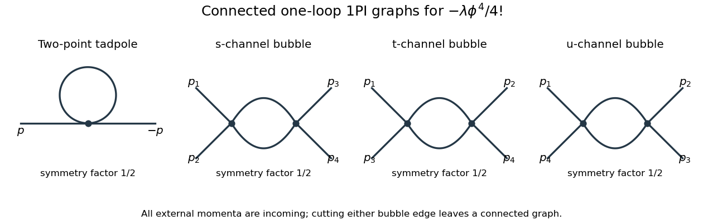
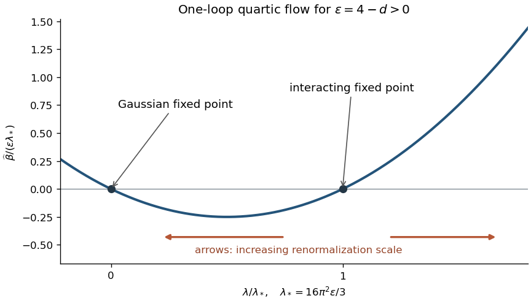

<h1 id="2/solution">Solution</h1>

↑ **Parent:** [2](../2.md)

For $m^2>0$ and initially $\Re n>d/2$, [Schwinger parameterization](../../../../../schwinger-parameterization.md) and the supplied [Gaussian integral](../../../../../gaussian-integral.md) give

$$
I_{d,n}(m)=\frac1{\Gamma(n)}\int_0^\infty d\alpha\,\alpha^{n-1}e^{-\alpha m^2}\int\frac{d^dk}{(2\pi)^d}e^{-\alpha k^2}=\frac1{(4\pi)^{d/2}\Gamma(n)}\int_0^\infty d\alpha\,\alpha^{n-d/2-1}e^{-\alpha m^2}.
$$

Substitute $u=\alpha m^2$ to obtain the [Euclidean massive loop integral](../../../../../euclidean-massive-loop-integral.md)

$$
\boxed{I_{d,n}(m)=\frac{\Gamma(n-d/2)}{(4\pi)^{d/2}\Gamma(n)}(m^2)^{d/2-n}.}
$$

For a positive integer $n$, $\Gamma(n)=(n-1)!$. Outside the convergence region this expression defines its [meromorphic continuation](../../../../../meromorphic-continuation.md), used in [dimensional regularization](../../../../../dimensional-regularization.md).

Combine the two denominators with a [Feynman parameter](../../../../../feynman-parameter.md) and shift $k$ by $(1-x)p$. This gives

$$
J_d(p)=\int_0^1dx\,I_{d,2}\bigl(\sqrt{m^2+x(1-x)p^2}\bigr)=\frac{\Gamma(\epsilon/2)}{(4\pi)^{2-\epsilon/2}}\int_0^1dx\,[m^2+x(1-x)p^2]^{-\epsilon/2}.
$$

The [gamma function](../../../../../gamma-function.md) has $\Gamma(\epsilon/2)=2/\epsilon+O(1)$, and the remaining factors tend to $(4\pi)^{-2}$ and one. Hence the [massive scalar bubble pole in four dimensions](../../../../../massive-scalar-bubble-pole-in-four-dimensions.md) is

$$
\boxed{J_{4-\epsilon}(p)=\frac1{8\pi^2\epsilon}+O(1).}
$$

The pole is independent of the external [momentum](../../../../../momentum.md), as required for a local quartic [counterterm](../../../../../counterterm.md).

Use the mostly-plus [Minkowski metric](../../../../../minkowski-metric.md) and expand $e^{iS}$. The momentum-space [Feynman rules](../../../../../feynman-rule.md) are: an internal [scalar propagator](../../../../../scalar-propagator.md) $i/(-p^2-m^2+i0)$; a four-scalar [interaction vertex](../../../../../interaction-vertex.md) $-i\mu^\epsilon\lambda$; a [momentum conservation](../../../../../momentum-conservation.md) delta function at each vertex; and $\int d^dk/(2\pi)^d$ per independent loop momentum. Divide by the [Feynman-diagram symmetry factor](../../../../../feynman-diagram-symmetry-factor.md). All momenta can be taken incoming. External propagators are omitted when computing an amputated [one-particle-irreducible vertex](../../../../../one-particle-irreducible-vertex.md).

The connected one-loop [one-particle-irreducible Feynman diagrams](../../../../../one-particle-irreducible-feynman-diagram.md) are the two-point [tadpole diagram](../../../../../tadpole-diagram.md) and the three four-point [bubble diagrams](../../../../../bubble-diagram.md), in the $s,t,u$ channels. Each has [symmetry factor](../../../../../feynman-diagram-symmetry-factor.md) $1/2$. A tadpole attached to an external leg through a single bridge would be reducible, so is excluded here.

**[Figure 2](#2/image-one-loop-two-point-and-four-point-one-particle-irreducible-graphs-in-quartic-scalar-theory). One-loop two-point and four-point one-particle-irreducible graphs in quartic scalar theory**.

The [Euclidean massive loop integral](../../../../../euclidean-massive-loop-integral.md) at $n=1$ has $\Gamma(-1+\epsilon/2)=-2/\epsilon+O(1)$, so $I_{d,1}=-m^2/(8\pi^2\epsilon)+O(1)$. [Wick rotation](../../../../../wick-rotation.md) and the propagator/vertex factors give the two-point loop amplitude $-i\lambda I_{d,1}/2$, whose pole is $+i\lambda m^2/(16\pi^2\epsilon)$. A mass [counterterm](../../../../../counterterm.md) contributes $-i\delta m^2$ and cancels it when $\delta m^2=\lambda m^2/(16\pi^2\epsilon)$.

Each four-point [bubble diagram](../../../../../bubble-diagram.md) has pole $+i\lambda^2J_d/2=i\lambda^2/(16\pi^2\epsilon)$, with the external coupling-dimension factor restored in the local vertex. Summing its three channels gives the quartic counterterm $\delta\lambda=3\lambda^2/(16\pi^2\epsilon)$. Therefore the [one-loop massive phi-fourth counterterms](../../../../../one-loop-massive-phi-fourth-counterterms.md) are exactly

$$
\boxed{\mathcal L_{\rm ct}=-\frac12\frac{\lambda m^2}{16\pi^2\epsilon}\phi^2-\frac{\mu^\epsilon}{4!}\frac{3\lambda^2}{16\pi^2\epsilon}\phi^4.}
$$

There is no one-loop [wave-function renormalization](../../../../../wave-function-renormalization.md), since the tadpole is independent of external momentum. Vacuum graphs would additionally require a vacuum-energy subtraction.

In the [minimal subtraction scheme](../../../../../minimal-subtraction-scheme.md), the bare coupling is

$$
\lambda_0=\mu^\epsilon\left(\lambda+\frac{3\lambda^2}{16\pi^2\epsilon}+O(\lambda^3)\right).
$$

Its dimension is $\epsilon$; the renormalized $\lambda$ is dimensionless. Differentiate at fixed $\lambda_0$, writing $b=3/(16\pi^2)$:

$$
0=\epsilon\left(\lambda+\frac{b\lambda^2}{\epsilon}\right)+\widehat\beta(\lambda)\left(1+\frac{2b\lambda}{\epsilon}\right)+O(\lambda^3).
$$

Solving through quadratic order gives the [engineering term in a dimensionally continued beta function](../../../../../engineering-term-in-a-dimensionally-continued-beta-function.md) and the [one-loop quartic scalar beta function](../../../../../one-loop-quartic-scalar-beta-function.md)

$$
\boxed{\widehat\beta(\lambda)=-\epsilon\lambda+\frac{3\lambda^2}{16\pi^2}+O(\lambda^3),\qquad\beta(\lambda)=\frac{3\lambda^2}{16\pi^2}+O(\lambda^3).}
$$

The first term comes from the coupling's [engineering dimension](../../../../../engineering-dimension.md); the second is the quantum contribution to the [renormalization-group beta function](../../../../../beta-function-physics.md).

For fixed $\epsilon>0$, the whole $\widehat\beta$ is not literally $O(\lambda^2)$ as $\lambda\to0$: its linear term is present. Interpret the final instruction as keeping terms through quadratic order. Set $\lambda_*=\epsilon/b=16\pi^2\epsilon/3$. Then $\widehat\beta=b\lambda(\lambda-\lambda_*)$ is an upward parabola, negative between its two zeros and positive above the interacting zero.

**[Figure 3](#2/image-quartic-beta-function-below-four-dimensions-with-arrows-toward-increasing-renormalization-scale). Quartic beta function below four dimensions, with arrows toward increasing renormalization scale**.

For positive initial coupling $\lambda_r=\lambda(\mu_r)$, the [quartic running coupling below four dimensions](../../../../../quartic-running-coupling-below-four-dimensions.md) follows by solving the linear equation for $1/\lambda$:

$$
\boxed{\lambda(\mu)=\frac{\lambda_*}{1+(\lambda_*/\lambda_r-1)(\mu/\mu_r)^\epsilon}.}
$$

If $0<\lambda_r<\lambda_*$, then $\lambda(\mu)\to\lambda_*$ as $\mu\to0$ and $\lambda(\mu)\to0$ as $\mu\to\infty$. If $\lambda_r=\lambda_*$ it stays fixed; the zero solution also stays fixed. If $\lambda_r>\lambda_*$, the infrared limit is still $\lambda_*$, but the ultraviolet evolution reaches a [Landau pole](../../../../../landau-pole.md) at the finite scale

$$
\boxed{\mu_L=\mu_r\left(\frac{\lambda_r}{\lambda_r-\lambda_*}\right)^{1/\epsilon}.}
$$

Thus this branch cannot be continued physically to $\mu=\infty$ using the one-loop approximation. These are statements about the quartic coupling direction. The [Wilson-Fisher fixed point](../../../../../wilson-fisher-fixed-point.md) of the full scalar theory also has a [thermal relevant direction at the Wilson-Fisher fixed point](../../../../../thermal-relevant-direction-at-the-wilson-fisher-fixed-point.md); approaching the critical theory requires mass tuning. For negative initial coupling, the quartic potential is unstable: the same formula tends to zero from below in the ultraviolet and reaches a pole at finite scale toward the infrared.

## ↑ Ancestors (10)

1. [2](../2.md)
2. [Paper 51](../../paper-51-split.md)
3. [Iii](../../split.md)
4. [2007](../../../split.md)
5. [Past exam of the mathematics course of the University of Cambridge](../../../../split.md)
6. [Mathematics course of the University of Cambridge](../../../../../mathematics-course-of-the-university-of-cambridge.md)
7. [Course of the University of Cambridge](../../../../../course-of-the-university-of-cambridge.md)
8. [University of Cambridge](../../../../../university-of-cambridge-split.md)
9. [List of universities](../../../../../list-of-universities.md)
10. [Codex Wiki](../../../../../split.md)
