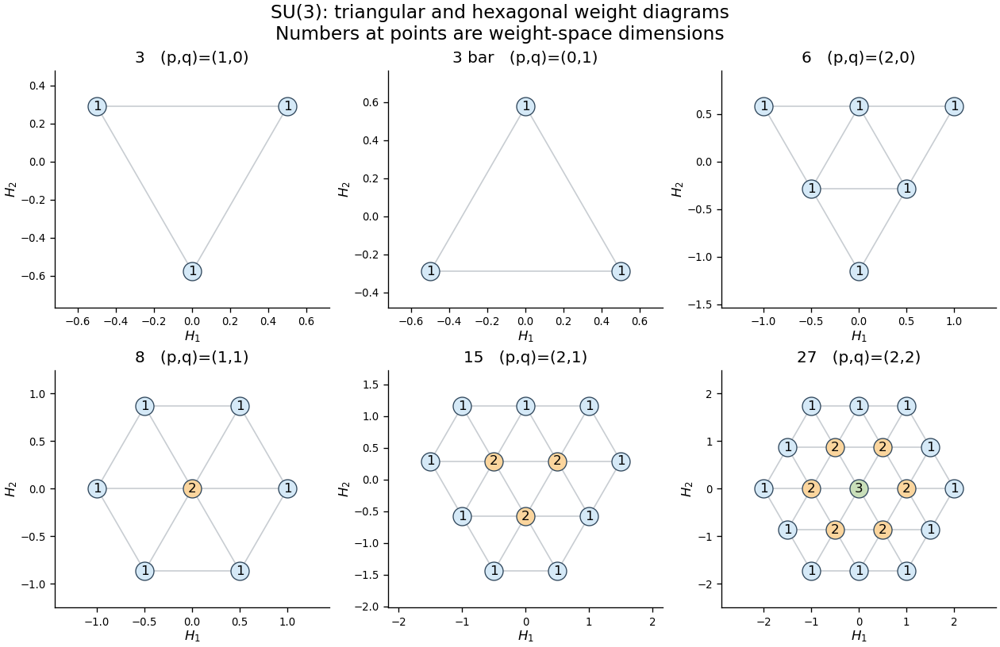
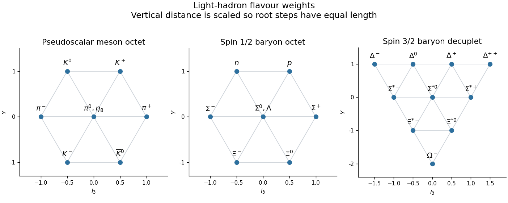

<h1 id="4/solution">Solution</h1>

↑ **Parent:** [4](../4.md)

The [SU(3) Lie algebra](../../../../../su-3-lie-algebra.md) is the compact real algebra of traceless [skew-Hermitian matrices](../../../../../skew-hermitian-matrix.md); its complexification is $\mathfrak{sl}_3(\mathbb C)$, a [special linear Lie algebra](../../../../../special-linear-lie-algebra.md). In an antihermitian [Lie algebra representation](../../../../../lie-algebra-representation.md), the two commuting Cartan operators $H_1,H_2$ are [Hermitian matrices](../../../../../hermitian-operator.md), and the root operators satisfy $(E_+^a)^\dagger=E_-^a$. Thus the [spectral theorem](../../../../../spectral-theorem.md) gives an orthogonal [weight-space decomposition](../../../../../weight-space-decomposition.md)

$$
V=\bigoplus_\mu V_\mu,\qquad H_rv=\mu_rv\quad(v\in V_\mu),\qquad \mu=(\mu_1,\mu_2)\in\mathbb R^2.
$$

A [weight diagram](../../../../../weight-diagram.md) plots the pairs $\mu$, recording the [weight multiplicity](../../../../../weight-multiplicity.md) $\dim V_\mu$ at each position. One point need not represent only one state. The commutators with $H_1,H_2$ give the [roots of a root system](../../../../../root-of-a-root-system.md)

$$
\alpha_1=(1,0),\qquad \alpha_2=\left(-\frac12,\frac{\sqrt3}2\right),\qquad \alpha_3=\alpha_1+\alpha_2.
$$

The [raising operators](../../../../../raising-operator.md) $E_+^a$ move a nonzero [weight vector](../../../../../weight-vector.md) by $+\alpha_a$ and the [lowering operators](../../../../../lowering-operator.md) move it by $-\alpha_a$. These six root directions form the [A2 root system](../../../../../a2-root-system.md). Each root and its negative generate an [SU(2) representation](../../../../../representation-theory-of-su-2.md) ladder; in particular the pairs with Cartan operators $H_1$ and $-H_1/2+\sqrt3H_2/2$ constrain the two simple-root strings.

Choose a linear functional positive on the three positive roots. A maximal [weight](../../../../../weight-representation-theory.md) for this ordering is killed by every [raising operator](../../../../../raising-operator.md). In an [Irreducible Lie algebra representation](../../../../../irreducible-lie-algebra-representation.md) it generates the entire representation by lowering, and its [weight space](../../../../../weight-space.md) has dimension one. The two [SU(2) representation](../../../../../representation-theory-of-su-2.md) strings show that its [Dynkin labels](../../../../../dynkin-label.md) are nonnegative integers:

$$
p=2\lambda_1,\qquad q=-\lambda_1+\sqrt3\lambda_2,\qquad p,q\in\mathbb Z_{\ge0}.
$$

Conversely, each such pair specifies exactly one finite-dimensional irreducible [highest-weight representation](../../../../../highest-weight-representation.md). Write it as $R(p,q)$. The [fundamental weights](../../../../../fundamental-weight.md) in these Cartesian coordinates are $\omega_1=(1/2,1/(2\sqrt3))$ and $\omega_2=(0,1/\sqrt3)$, so

$$
\lambda=p\omega_1+q\omega_2=\left(\frac p2,\frac{p+2q}{2\sqrt3}\right),\qquad
\boxed{\dim R(p,q)=\frac{(p+1)(q+1)(p+q+2)}2.}
$$

The dimension follows from the three positive-root factors in the [Weyl dimension formula](../../../../../weyl-dimension-formula.md): $p+1$, $q+1$, and $(p+q+2)/2$. The complex conjugate representation is $R(q,p)$, with every [weight](../../../../../weight-representation-theory.md) negated. The [SU(3) highest-weight coordinates](../../../../../su-3-highest-weight-coordinates.md) here use $(p,q)$ as Dynkin labels, not as the plotted Cartesian coordinates.

The [weight diagram](../../../../../weight-diagram.md) is invariant under the [Weyl group](../../../../../weyl-group.md), generated by reflections perpendicular to the two simple roots; its convex hull is the orbit polygon of the [highest weight](../../../../../highest-weight-of-a-representation.md). For $p=q=0$ it is a point, the trivial representation. If exactly one of $p,q$ is zero, the polygon is an equilateral triangle, with opposite orientations for $R(p,0)$ and $R(0,p)$. Its edge has $p$ root steps. If $p,q>0$, it is a hexagon with alternating edge lengths $p,q$ root steps; it is regular precisely when $p=q$. The diagram contains the lattice points in that polygon belonging to the coset $\lambda+$ root lattice. A point in a different [weight lattice](../../../../../weight-lattice.md) coset is not a weight merely because it lies inside the polygon.

The [shell multiplicities in an SU(3) weight diagram](../../../../../shell-multiplicities-in-an-su-3-weight-diagram.md) can be stated geometrically. The outer boundary has [weight multiplicity](../../../../../weight-multiplicity.md) one. Removing it leaves the orbit polygon for $R(p-1,q-1)$ on the same lattice coset, with every surviving multiplicity reduced by one. Repeating increases the actual [weight multiplicity](../../../../../weight-multiplicity.md) by one at each inward layer until the smaller label reaches zero. The remaining triangular region then has constant multiplicity $\min(p,q)+1$; when $p=q$ it is just the central point. A triangular [weight diagram](../../../../../weight-diagram.md) has multiplicity one everywhere. Thus $R(1,1)=\mathbf8$, the [adjoint representation of SU(3)](../../../../../adjoint-representation-of-su-3.md), has six root weights of multiplicity one and two independent zero-weight states; $R(2,1)=\mathbf{15}$ has an outer shell of multiplicity one and an inner triangle of multiplicity two; $R(2,2)=\mathbf{27}$ has twelve outer states, six positions of multiplicity two, and a central position of multiplicity three. The total is $12+6\cdot2+3=27$. The [dominant weight multiplicity formula for sl3](../../../../../dominant-weight-multiplicity-formula-for-sl3.md) is an algebraic expression of the same rule.

**[Figure 1](#4/image-triangular-and-hexagonal-su-3-weight-diagrams-with-each-weight-space-dimension-shown-at-its-point). Triangular and hexagonal SU(3) weight diagrams, with each weight-space dimension shown at its point**.

For a [tensor product of Lie algebra representations](../../../../../tensor-product-of-lie-algebra-representations.md), the Cartan operators add. Consequently its [tensor-product weight diagram](../../../../../tensor-product-weight-diagram.md) has [weights](../../../../../weight-representation-theory.md) $\mu+\nu$ and multiplicities

$$
m_{V\otimes W}(\rho)=\sum_{\mu+\nu=\rho}m_V(\mu)m_W(\nu).
$$

Geometrically, place a copy of the second [weight diagram](../../../../../weight-diagram.md) at every weight of the first, multiplying and adding coincident multiplicities. Because the representation is antihermitian, invariant subspaces have invariant orthogonal complements. To decompose the product, select a maximal remaining [dominant weight](../../../../../dominant-weight.md), identify its irreducible [highest-weight representation](../../../../../highest-weight-representation.md), subtract that representation's whole diagram with its [weight multiplicities](../../../../../weight-multiplicity.md), and repeat. This [highest-weight character subtraction](../../../../../highest-weight-character-subtraction.md) must exhaust every weight, not merely the corners. Unlike the [Clebsch-Gordan decomposition for SU2](../../../../../clebsch-gordan-decomposition-for-su2.md), an SU(3) product may contain repeated copies of an irreducible representation.

The two three-dimensional [Fundamental representations of sl3](../../../../../fundamental-representations-of-sl3.md) are $\mathbf3=R(1,0)$ and $\overline{\mathbf3}=R(0,1)$. In $\mathbf3\otimes\mathbf3$, the largest weight is $2\omega_1$, giving the six-dimensional triangle $R(2,0)$; subtracting it leaves the reversed three-dimensional triangle $R(0,1)$. The first summand consists of symmetric tensors and the second of antisymmetric tensors. In $\mathbf3\otimes\overline{\mathbf3}$, the weight sums give the six roots once and weight zero three times. Subtracting the octet, whose zero weight has multiplicity two, leaves a singlet. Hence the [octet and singlet in a fundamental SU3 tensor product](../../../../../octet-and-singlet-in-a-fundamental-su3-tensor-product.md) and the two-quark product are

$$
\boxed{\mathbf3\otimes\mathbf3=\mathbf6\oplus\overline{\mathbf3},\qquad
\mathbf3\otimes\overline{\mathbf3}=\mathbf8\oplus\mathbf1.}
$$

The first dimensions are $9=6+3$, and the second are $9=8+1$. Next $\mathbf6\otimes\mathbf3$ has highest weight $3\omega_1$, giving $R(3,0)=\mathbf{10}$. Subtraction leaves one $R(1,1)=\mathbf8$. Together with $\overline{\mathbf3}\otimes\mathbf3=\mathbf8\oplus\mathbf1$, this proves the [tensor cube of the defining SU(3) representation](../../../../../tensor-cube-of-the-defining-su-3-representation.md):

$$
\boxed{\mathbf3^{\otimes3}=\mathbf{10}\oplus\mathbf8\oplus\mathbf8\oplus\mathbf1,\qquad 27=10+8+8+1.}
$$

The decuplet is fully symmetric in the three factors, the singlet fully antisymmetric, and the two octets have mixed permutation symmetry.

For the [quark model](../../../../../quark-model.md), the relevant approximate [flavour symmetry](../../../../../flavor-symmetry.md) rotates the three light [quarks](../../../../../quark.md) $u,d,s$ in the fundamental $\mathbf3$. The [up quark](../../../../../up-quark.md), [down quark](../../../../../down-quark.md), and [strange quark](../../../../../strange-quark.md) basis states have the [weight diagram of the defining SU(3) representation](../../../../../weight-diagram-of-the-defining-su-3-representation.md). In physical coordinates define [isospin](../../../../../isospin.md) $I_3=H_1$ and [flavor hypercharge](../../../../../flavor-hypercharge.md) $Y=2H_2/\sqrt3$. Then

$$
\begin{array}{c|ccc}
 &u&d&s\\\hline
I_3&1/2&-1/2&0\\
Y&1/3&1/3&-2/3\\
Q&2/3&-1/3&-1/3
\end{array}
$$

The last row follows from the [Gell-Mann--Nishijima formula](../../../../../gell-mann-nishijima-formula.md) $Q=I_3+Y/2$, in units of the positive elementary [electric charge](../../../../../electric-charge.md). The [antiquarks](../../../../../antiquark.md) transform in $\overline{\mathbf3}$ and have the negatives of these additive quantum numbers. Each [quark](../../../../../quark.md) has [baryon number](../../../../../baryon-number.md) $B=1/3$; the [strange quark](../../../../../strange-quark.md) has [strangeness](../../../../../strangeness.md) $S=-1$, while $u,d$ have $S=0$. Thus $Y=B+S$, distinguishing [flavor hypercharge](../../../../../flavor-hypercharge.md) from electroweak hypercharge. The [Weyl group](../../../../../weyl-group.md) geometry is equilateral in $(H_1,H_2)$; using $(I_3,Y)$ rescales the vertical coordinate.

A conventional [meson](../../../../../meson.md) has valence content $q\bar q$, so its [flavour symmetry](../../../../../flavor-symmetry.md) gives a [meson octet](../../../../../meson-octet.md) and a singlet. For the light [pseudoscalar mesons](../../../../../pseudoscalar-meson.md), the octet contains the [pions](../../../../../pion.md) $\pi^+,\pi^0,\pi^-$ at $Y=0$ with [isospin](../../../../../isospin.md) $I=1$, the [kaons](../../../../../kaon.md) $K^+=u\bar s,K^0=d\bar s$ at $Y=1$, their antiparticles at $Y=-1$, and the $I=0,Y=0$ [Eta octet state](../../../../../eta-octet-state.md). The central [weight multiplicity](../../../../../weight-multiplicity.md) two is realized by

$$
\pi^0=\frac{u\bar u-d\bar d}{\sqrt2},\qquad
\eta_8=\frac{u\bar u+d\bar d-2s\bar s}{\sqrt6}.
$$

The orthogonal [eta singlet state](../../../../../eta-singlet-state.md) is $\eta_1=(u\bar u+d\bar d+s\bar s)/\sqrt3$. The [eta and eta prime mesons](../../../../../eta-and-eta-prime-mesons.md) are mixtures of $\eta_8,\eta_1$, rather than exact octet and singlet mass eigenstates; this gives the [pseudoscalar meson nonet](../../../../../pseudoscalar-meson-nonet.md). A different spin coupling of the same flavour product gives the [vector mesons](../../../../../vector-meson.md), again an octet and singlet, including the $\rho$, $K^*$, and neutral $\omega,\phi$ mixtures. The lowest orbital states have $J^P=0^-$ and $1^-$ respectively.

A conventional [baryon](../../../../../baryon.md) has three valence [quarks](../../../../../quark.md), so the tensor-cube decomposition supplies the flavour possibilities. The observed lowest [baryon octet](../../../../../baryon-octet.md) has spin $1/2$ and positive [parity](../../../../../parity.md). Its [isospin](../../../../../isospin.md) rows are $(Y,I)=(1,1/2),(0,1),(0,0),(-1,1/2)$: the [nucleons](../../../../../nucleon.md) $p,n$, the three [Sigma baryons](../../../../../sigma-baryon.md), the [Lambda baryon](../../../../../lambda-baryon.md), and the two [Xi baryons](../../../../../xi-baryon.md). The central states $\Sigma^0$ and $\Lambda$ have the same [weight](../../../../../weight-representation-theory.md) $(I_3,Y)=(0,0)$ but different total [isospin](../../../../../isospin.md); this is the physical meaning of the octet's central multiplicity two. The spin-$3/2$, positive-parity [baryon decuplet](../../../../../baryon-decuplet.md) is the triangle with rows

$$
\begin{array}{c|c|c}
Y&I&\text{states}\\\hline
1&3/2&\Delta^{++},\Delta^+,\Delta^0,\Delta^-\\
0&1&\Sigma^{*+},\Sigma^{*0},\Sigma^{*-}\\
-1&1/2&\Xi^{*0},\Xi^{*-}\\
-2&0&\Omega^-
\end{array}
$$

The [Delta baryons](../../../../../delta-baryon.md) form its top row, and the [Omega baryon](../../../../../omega-baryon.md) is the bottom $sss$ state. All ten [weights](../../../../../weight-representation-theory.md) have multiplicity one. Their [electric charges](../../../../../electric-charge.md) follow directly from the [Gell-Mann--Nishijima formula](../../../../../gell-mann-nishijima-formula.md); for example $\Delta^{++}$ has $I_3=3/2,Y=1$, so $Q=2$, and $\Omega^-$ has $I_3=0,Y=-2$, so $Q=-1$.

**[Figure 2](#4/image-light-pseudoscalar-meson-octet-spin-one-half-baryon-octet-and-spin-three-halves-baryon-decuplet-in-isospin-and-flavour-hypercharge-coordinates). Light pseudoscalar meson octet, spin-one-half baryon octet, and spin-three-halves baryon decuplet in isospin and flavour-hypercharge coordinates**.

The two algebraic octets do not mean that two independent ground-state octets must occur. A [three-quark colour singlet](../../../../../three-quark-colour-singlet.md) has a completely antisymmetric colour wavefunction. For a symmetric spatial ground state, the [Pauli exclusion principle](../../../../../pauli-exclusion-principle.md) therefore requires a symmetric combined spin-flavour wavefunction. The symmetric flavour decuplet pairs with symmetric spin $3/2$; mixed flavour octets pair with mixed spin $1/2$ in one symmetric combination. Equivalently, the [symmetric spin-flavour SU6 representation](../../../../../symmetric-spin-flavour-su6-representation.md) has

$$
\operatorname{Sym}^3(\mathbb C^3\otimes\mathbb C^2)
\cong(\mathbf{10},\mathbf4)\oplus(\mathbf8,\mathbf2),\qquad 56=10\cdot4+8\cdot2.
$$

The [three-quark flavour singlet](../../../../../three-quark-flavour-singlet.md) is the antisymmetric $uds$ combination. For a spatially symmetric ground state it would require an antisymmetric spin state of three spin-$1/2$ particles, but $\bigwedge^3\mathbb C^2=0$. The [Pauli constraint on three-quark flavour multiplets](../../../../../pauli-constraint-on-three-quark-flavour-multiplets.md) thus excludes it from this ground-state sector; orbital excitation permits other multiplets.

Finally, this [flavour symmetry](../../../../../flavor-symmetry.md) is approximate: the unequal light-quark masses, especially the larger strange-quark mass, and electromagnetic interactions split masses within the multiplets and permit octet-singlet mixing. The [weight diagrams](../../../../../weight-diagram.md) classify flavour states, rather than asserting exact equality of their masses. Colour [SU(3)](../../../../../su-3-group.md) is a separate gauge action on each flavour and supplies the colour-singlet constraint; it is not the approximate flavour action used in the [eightfold way](../../../../../eightfold-way.md). **The light conventional mesons organize into flavour octets and singlets, while the spatial ground-state three-quark baryons form one spin-$1/2$ octet and one spin-$3/2$ decuplet.**

## ↑ Ancestors (10)

1. [4](../4.md)
2. [Paper 52](../../paper-52-split.md)
3. [Iii](../../split.md)
4. [2007](../../../split.md)
5. [Past exam of the mathematics course of the University of Cambridge](../../../../split.md)
6. [Mathematics course of the University of Cambridge](../../../../../mathematics-course-of-the-university-of-cambridge.md)
7. [Course of the University of Cambridge](../../../../../course-of-the-university-of-cambridge.md)
8. [University of Cambridge](../../../../../university-of-cambridge-split.md)
9. [List of universities](../../../../../list-of-universities.md)
10. [Codex Wiki](../../../../../split.md)
