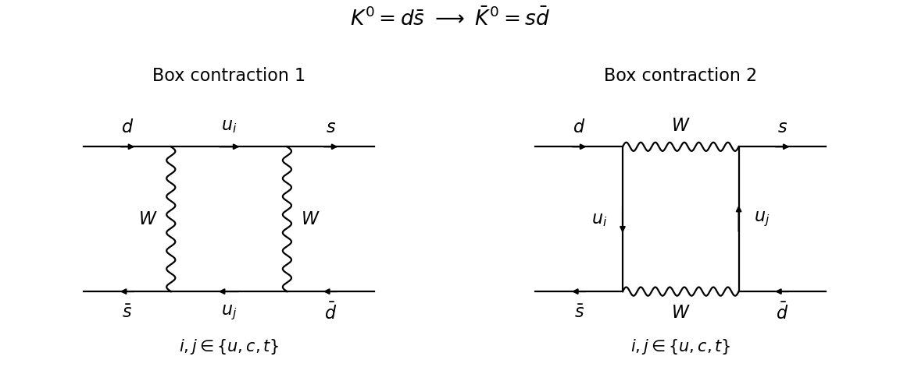
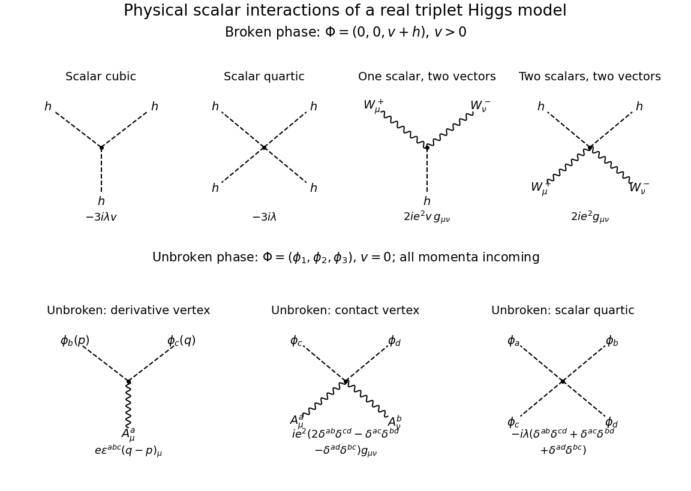

# Paper 53

↑ **Parent:** [Iii](../iii.md)

[https://www.maths.cam.ac.uk/postgrad/part-iii/files/pastpapers/2007/Paper53.pdf](https://www.maths.cam.ac.uk/postgrad/part-iii/files/pastpapers/2007/Paper53.pdf)

**Table of contents**

- [1](#1)
  - [Solution](#1/solution)
- [2](#2)
  - [Solution](#2/solution)
- [3](#3)
  - [Solution](#3/solution)
- [4](#4)
  - [Solution](#4/solution)

## 1

↑ **Parent:** [Paper 53](paper-53.md)

<h3 id="1/solution">Solution</h3>

↑ **Parent:** [1](#1)

Adopt the phase convention $CP|K^0\rangle=-|\bar K^0\rangle$ and $CP|\bar K^0\rangle=-|K^0\rangle$. Changing both phases changes the convention for the mixing parameter, not physical predictions. The flavor contents are $K^0=d\bar s$ and $\bar K^0=s\bar d$. A pair of [charged weak currents](../../../standard-model.md#charged-current) changes [strangeness](../../../standard-model.md#strangeness) by two units through the following box contractions, with $u_i,u_j=u,c,t$ summed over.

**[Figure 1](#1/image-charged-current-box-contractions-for-neutral-kaon-mixing-solid-arrows-carry-quark-number-and-wavy-lines-denote-w-bosons). Charged-current box contractions for neutral-kaon mixing; solid arrows carry quark number and wavy lines denote W bosons**.

The drawing uses [unitary gauge](../../../standard-model.md#unitary-gauge): the [W boson](../../../standard-model.md#w-boson) [gauge-boson propagator](../../../relativistic-quantum-field.md#gauge-boson-propagator) contains its longitudinal part. In a gauge of a [renormalizable quantum field theory](../../../perturbative-quantum-field-theory.md#renormalizable-quantum-field-theory), charged [Goldstone boson](../../../critical-phenomenon.md#goldstone-boson) boxes must also be included to obtain the same gauge-independent result. The external lines represent the valence [quarks](../../../standard-model.md#quark); the [meson](../../../physics.md#meson) [matrix element](../../../vector-space.md#matrix-element) also contains [strong interaction](../../../standard-model.md#strong-interaction) binding effects.

Put $\lambda_i=V_{is}^*V_{id}$, $x_i=m_i^2/m_W^2$ and $P_L=(1-\gamma^5)/2$. The [charged weak box contribution to kaon mixing](../../../physics.md#charged-weak-box-contribution-to-kaon-mixing) has the effective [four-fermion interaction](../../../quantum-field-theory.md#four-fermion-interaction) structure

$$
H_{\Delta S=2}=C(\bar s\gamma_\mu P_Ld)(\bar s\gamma^\mu P_Ld)+\text{h.c.},\qquad
C\sim\frac{G_F^2m_W^2}{16\pi^2}\sum_{i,j}\lambda_i\lambda_j S(x_i,x_j).
$$

Here $G_F$ is the [Fermi constant](../../../quantum-field-theory.md#fermi-constant), $V$ is the [CKM matrix](../../../standard-model.md#cabibbo-kobayashi-maskawa-matrix), and $S$ is a dimensionless loop function from a [Feynman integral](../../../perturbative-quantum-field-theory.md#feynman-integral); the estimate suppresses convention-dependent numerical factors. Four [weak interaction](../../../standard-model.md#weak-interaction) [Feynman vertices](../../../perturbative-quantum-field-theory.md#interaction-vertex) and a one-loop [Feynman integral](../../../perturbative-quantum-field-theory.md#feynman-integral) give the coupling and [loop order](../../../perturbative-quantum-field-theory.md#loop-order) suppression. [Unitarity](../../../vector-space.md#unitary-operator) of the [CKM matrix](../../../standard-model.md#cabibbo-kobayashi-maskawa-matrix) gives $\sum_i\lambda_i=0$, so the [GIM mechanism](../../../standard-model.md#gim-mechanism) cancels the [mass](../../../classical-mechanics.md#mass)-independent part. With a negligible [up quark](../../../standard-model.md#up-quark) [mass](../../../classical-mechanics.md#mass), the leading [charm quark](../../../standard-model.md#charm-quark) term has $S(x_c,x_c)\sim x_c$. Define $f_K$ by $\langle0|\bar s\gamma_\mu\gamma^5d|K^0(p)\rangle=if_Kp_\mu$. Estimating the hadronic [matrix element](../../../vector-space.md#matrix-element) by $f_K^2m_K B_K$, with the dimensionless [kaon bag parameter](../../../physics.md#kaon-bag-parameter) $B_K$ of order unity, gives

$$
\boxed{|H'_{21}|_{\rm charm}\sim
\frac{G_F^2m_c^2}{16\pi^2}|V_{cs}^*V_{cd}|^2 f_K^2m_K B_K}.
$$

The hadronic normalization includes division by $2m_K$ when relativistically normalized states are converted to the [effective Hamiltonian for neutral-meson mixing](../../../physics.md#effective-hamiltonian-for-neutral-meson-mixing). Since $|V_{cs}^*V_{cd}|\simeq\sin\theta_C\cos\theta_C$, the [Cabibbo suppression](../../../standard-model.md#cabibbo-suppression) is explicit. Illustrative scales $G_F\sim10^{-5}\,\mathrm{GeV}^{-2}$, $m_c\sim1\,\mathrm{GeV}$, $f_K\sim0.1\,\mathrm{GeV}$ and $m_K\sim0.5\,\mathrm{GeV}$ give an order $10^{-16}$ to $10^{-15}\,\mathrm{GeV}$ estimate. The full sum includes [charm quark](../../../standard-model.md#charm-quark)-[top quark](../../../standard-model.md#top-quark) and [top quark](../../../standard-model.md#top-quark)-[top quark](../../../standard-model.md#top-quark) terms, important for [CP violation](../../../quantum-field-theory.md#cp-violation); long-distance [strong interaction](../../../standard-model.md#strong-interaction) contributions prevent this dimensional estimate from being a precision prediction. A [meson](../../../physics.md#meson) [matrix element](../../../vector-space.md#matrix-element) necessarily needs hadronic input in addition to electroweak parameters.

For the decaying [kaon](../../../physics.md#kaon) system write $H'=M-i\Gamma/2$, where $M$ and $\Gamma$ are [Hermitian matrices](../../../hilbert-space.md#hermitian-operator). The entries denoted $M_{ij}$ in the question are entries of this [effective Hamiltonian for neutral-meson mixing](../../../physics.md#effective-hamiltonian-for-neutral-meson-mixing); they need not themselves form a [Hermitian matrix](../../../hilbert-space.md#hermitian-operator). [CPT](../../../quantum-field-theory.md#cpt-symmetry) invariance equates the diagonal [masses](../../../classical-mechanics.md#mass) and diagonal [decay widths](../../../relativistic-quantum-field.md#decay-width), giving

$$
\boxed{H'_{11}=H'_{22}}.
$$

One can see why there is no [complex conjugation](../../../complex-analysis.md#complex-conjugation) on the right as follows. In the flavor subspace let $J=\begin{pmatrix}0&1\\1&0\end{pmatrix}$ and represent the [antiunitary](../../../vector-space.md#antiunitary-operator) [CPT](../../../quantum-field-theory.md#cpt-symmetry) operation by $J$ followed by [complex conjugation](../../../complex-analysis.md#complex-conjugation). [CPT](../../../quantum-field-theory.md#cpt-symmetry) changes a projected forward propagator into its adjoint. Indeed, if $P$ projects onto the flavor subspace and $H_{\rm full}$ is the Hermitian microscopic generator, its invariance and the [antiunitary](../../../vector-space.md#antiunitary-operator) reversal of $i$ give $\Theta P e^{-iH_{\rm full}t}P\Theta^{-1}=P e^{+iH_{\rm full}t}P=(P e^{-iH_{\rm full}t}P)^\dagger$. In the time-independent two-state approximation, the effective generator this means $J{H'}^*J={H'}^\dagger$, whose diagonal entries give $(H'_{22})^*=(H'_{11})^*$; the off-diagonal entries impose no further condition. Equivalently, apply [CPT](../../../quantum-field-theory.md#cpt-symmetry) separately to the dispersive and absorptive [Hermitian matrices](../../../hilbert-space.md#hermitian-operator). Treating the decaying [effective Hamiltonian for neutral-meson mixing](../../../physics.md#effective-hamiltonian-for-neutral-meson-mixing) as a [Hermitian matrix](../../../hilbert-space.md#hermitian-operator) would incorrectly discard the absorptive part.

In the chosen flavor phase convention [CP](../../../quantum-field-theory.md#cp-symmetry) is represented by $-J$. Its invariance requires $JH'J=H'$. Thus it gives diagonal equality and additionally

$$
\boxed{H'_{12}=H'_{21}}.
$$

The normalized [CP eigenstates](../../../quantum-field-theory.md#cp-eigenstate) are

$$
\boxed{|K_1^0\rangle=\frac{|K^0\rangle-|\bar K^0\rangle}{\sqrt2},\qquad
|K_2^0\rangle=\frac{|K^0\rangle+|\bar K^0\rangle}{\sqrt2}}.
$$

Applying [CP](../../../quantum-field-theory.md#cp-symmetry) directly gives [eigenvalues](../../../linear-operator-theory.md#eigenvalue) $+1$ and $-1$ respectively.

Now use [CPT](../../../quantum-field-theory.md#cpt-symmetry) to put $H'=\begin{pmatrix}a&b\\c&a\end{pmatrix}$ and take correlated [square roots](../../../algebra.md#square-root) $\alpha=\sqrt b$, $\beta=\sqrt c$. Its [characteristic polynomial](../../../linear-operator-theory.md#characteristic-polynomial) equation is $(a-\mu)^2-bc=0$, and direct multiplication shows

$$
H'\binom{\alpha}{-\beta}=(a-\alpha\beta)\binom{\alpha}{-\beta},\qquad
H'\binom{\alpha}{\beta}=(a+\alpha\beta)\binom{\alpha}{\beta}.
$$

Expressing these two [eigenvectors](../../../linear-operator-theory.md#eigenvector) in the [CP eigenstate](../../../quantum-field-theory.md#cp-eigenstate) basis gives, respectively, coefficients proportional to $(\alpha+\beta,\alpha-\beta)$ and $(\alpha-\beta,\alpha+\beta)$. Therefore the [kaon CP mixing parameter](../../../physics.md#kaon-cp-mixing-parameter) is

$$
\epsilon=\frac{\alpha-\beta}{\alpha+\beta}
=\frac{\sqrt{M_{12}}-\sqrt{M_{21}}}{\sqrt{M_{12}}+\sqrt{M_{21}}},\qquad
\frac qp=\frac\beta\alpha=\frac{1-\epsilon}{1+\epsilon},
$$

and, because the [CP eigenstate](../../../quantum-field-theory.md#cp-eigenstate) basis is [orthonormal](../../../linear-algebra.md#orthonormal-set), the normalized states at production are

$$
\boxed{|K_S^0\rangle=\frac{|K_1^0\rangle+\epsilon|K_2^0\rangle}{\sqrt{1+|\epsilon|^2}},\qquad
|K_L^0\rangle=\frac{|K_2^0\rangle+\epsilon|K_1^0\rangle}{\sqrt{1+|\epsilon|^2}}}.
$$

The [kaon mixing square-root branch convention](../../../physics.md#kaon-mixing-square-root-branch-convention) correlates the roots continuously with the limit of conserved [CP](../../../quantum-field-theory.md#cp-symmetry) $b=c$, where $\alpha=\beta$ and $\epsilon=0$. Reversing one root interchanges the two [eigenstates](../../../quantum-mechanics.md#eigenstate). The labels short and long are fixed by their [decay widths](../../../relativistic-quantum-field.md#decay-width): their complex [eigenvalues](../../../linear-operator-theory.md#eigenvalue) are $\mu_{S,L}=m_{S,L}-i\Gamma_{S,L}/2$, and subsequent evolution supplies $e^{-i\mu_{S,L}t}$. The displayed formula assumes nonzero mixing and $\alpha+\beta\ne0$, as in the physical [kaon](../../../physics.md#kaon) system; degenerate or defective matrices require a separate limiting treatment.

## 2

↑ **Parent:** [Paper 53](paper-53.md)

<h3 id="2/solution">Solution</h3>

↑ **Parent:** [2](#2)

Use [metric signature](../../../topology.md#metric-signature) $(+---)$ and average over the four initial [spin](../../../quantum-mechanics.md#spin) states, summing over final [spins](../../../quantum-mechanics.md#spin) and the $N_c=3$ [quark](../../../standard-model.md#quark) [color charge](../../../standard-model.md#color-charge) states. The [Electrons](../../../physics.md#electron) carry no [color charge](../../../standard-model.md#color-charge), so their initial [color charge](../../../standard-model.md#color-charge) average is trivial. A final [color charge](../../../standard-model.md#color-charge) average would not give the inclusive [relativistic cross-section](../../../quantum-mechanics.md#relativistic-scattering-cross-section) requested.

[Photon](../../../quantum-mechanics.md#photon) exchange gives the tree amplitude, up to an irrelevant overall phase,

$$
\mathcal M=\frac{e^2Q_q}{s}\delta_{ab}
[\bar v(p_1)\gamma^\mu u(p_2)]
[\bar u(q_1)\gamma_\mu v(q_2)],\qquad e^2=4\pi\alpha.
$$

Massless [spin sums](../../../relativistic-quantum-field.md#spin-sum) give $\sum u\bar u=\not p$ and $\sum v\bar v=\not p$. Therefore

$$
\overline{|\mathcal M|^2}
=\frac{N_c e^4Q_q^2}{4s^2}
\operatorname{tr}(\not p_1\gamma^\mu\not p_2\gamma^\nu)
\operatorname{tr}(\not q_1\gamma_\mu\not q_2\gamma_\nu).
$$

The [color charge](../../../standard-model.md#color-charge) multiplicity is $\sum_{a,b}|\delta_{ab}|^2=N_c$, not $N_c^2$. Each [trace](../../../linear-algebra.md#matrix-trace) equals $4(a^\mu b^\nu+a^\nu b^\mu-g^{\mu\nu}a\cdot b)$. Contracting them, the terms proportional to $(p_1\cdot p_2)(q_1\cdot q_2)$ cancel, leaving $32[(p_1\cdot q_1)(p_2\cdot q_2)+(p_1\cdot q_2)(p_2\cdot q_1)]$. Thus

$$
\boxed{\overline{|\mathcal M|^2}
=\frac{384\pi^2\alpha^2Q_q^2}{s^2}
[(p_1\cdot q_2)(p_2\cdot q_1)+(p_2\cdot q_2)(p_1\cdot q_1)]}.
$$

In the [centre-of-momentum frame](../../../special-relativity.md#center-of-momentum-frame) every energy is $\sqrt s/2$. Let $\theta$ be the angle between $p_1$ and $q_2$. Then

$$
p_1\cdot q_2=p_2\cdot q_1=\frac s4(1-\cos\theta),\qquad
p_1\cdot q_1=p_2\cdot q_2=\frac s4(1+\cos\theta).
$$

Consequently $\overline{|\mathcal M|^2}=N_c e^4Q_q^2(1+\cos^2\theta)$.

The supplied [two-body Lorentz-invariant phase space](../../../relativistic-quantum-field.md#two-body-lorentz-invariant-phase-space) formula has a factor-of-two error. Deriving the normalization explicitly,

$$
d\Phi_2=\frac{d\Omega}{32\pi^2},\qquad
\text{incident flux}=4p_1\cdot p_2=2s,
$$

so the [massless two-body scattering flux normalization](../../../relativistic-quantum-field.md#massless-two-body-scattering-flux-normalization) is

$$
\frac{d\sigma}{d\Omega}
=\frac{\overline{|\mathcal M|^2}}{64\pi^2s}
=\frac{\overline{|\mathcal M|^2}}{128\pi^2p_1\cdot p_2}.
$$

For example, integrating the spatial [Dirac delta](../../../distribution-theory.md#dirac-delta-function) in $d\Phi_2$ leaves $[4(2\pi)^2]^{-1}dk\,d\Omega\,\delta(\sqrt s-2k)$; its radial integral supplies the factor $1/2$. The printed denominator $64\pi^2p_1\cdot p_2$ would double the [relativistic cross-section](../../../quantum-mechanics.md#relativistic-scattering-cross-section) and cannot reproduce the requested result with the standard [scattering amplitude](../../../quantum-mechanics.md#scattering-amplitude).

The correctly normalized differential and total results for [electron-positron annihilation into a quark pair](../../../perturbative-quantum-field-theory.md#electron-positron-annihilation-into-a-quark-pair) are

$$
\frac{d\sigma}{d\Omega}=\frac{3\alpha^2Q_q^2}{4s}(1+\cos^2\theta),\qquad
\int d\Omega(1+\cos^2\theta)=\frac{16\pi}{3},
$$

and hence

$$
\boxed{\sigma_q=\frac{4\pi\alpha^2}{s}Q_q^2}.
$$

At energies where [photon](../../../quantum-mechanics.md#photon) exchange and the [parton](../../../standard-model.md#parton) description apply, sum over kinematically accessible [quark](../../../standard-model.md#quark) flavors. The produced [quarks](../../../standard-model.md#quark) undergo [hadronization](../../../standard-model.md#hadronization), so the leading inclusive hadronic rate is

$$
\sigma_{\rm had}=\frac{4\pi\alpha^2}{s}\sum_qQ_q^2,\qquad
R(s)=\frac{\sigma_{\rm had}}{\sigma(e^+e^-\to\mu^+\mu^-)}
=3\sum_qQ_q^2.
$$

This is the [hadronic R ratio](../../../quantum-mechanics.md#hadronic-r-ratio). Perturbative [QCD](../../../standard-model.md#quantum-chromodynamics) adds a leading relative correction $\alpha_s(s)/\pi$; thresholds, narrow resonances and, near the [Z boson](../../../standard-model.md#z-boson) scale, electroweak exchange require additional treatment. The calculation is a [photon](../../../quantum-mechanics.md#photon)-exchange, massless result from a [tree-level Feynman diagram](../../../perturbative-quantum-field-theory.md#tree-level-feynman-diagram).

## 3

↑ **Parent:** [Paper 53](paper-53.md)

<h3 id="3/solution">Solution</h3>

↑ **Parent:** [3](#3)

[Quark mixing](../../../standard-model.md#quark-mixing) arises because the up-type and down-type [quark](../../../standard-model.md#quark) [Yukawa matrices](../../../standard-model.md#yukawa-matrix) need not be diagonal in the same [weak interaction](../../../standard-model.md#weak-interaction) basis. In the [Standard Model](../../../standard-model.md) the three left-handed [quark](../../../standard-model.md#quark) doublets $Q'_L$ transform as $(3,2,1/6)$ under $SU(3)_c\times SU(2)_L\times U(1)_Y$, whereas $u'_R$ and $d'_R$ transform as $(3,1,2/3)$ and $(3,1,-1/3)$. With a [Higgs doublet](../../../standard-model.md#higgs-field) $H$ and its conjugate $\widetilde H=i\sigma^2H^*$, the [gauge-invariant](../../../relativistic-quantum-field.md#gauge-invariance) [Yukawa interaction](../../../standard-model.md#yukawa-interaction) is

$$
\mathcal L_Y=-\bar Q'_L Y_dH d'_R-\bar Q'_L Y_u\widetilde H u'_R+\text{h.c.}
$$

The generation indices are matrix-multiplied. [Electroweak symmetry breaking](../../../standard-model.md#electroweak-symmetry-breaking), $\langle H\rangle=(0,v_H/\sqrt2)^T$, produces $M_u=v_HY_u/\sqrt2$ and $M_d=v_HY_d/\sqrt2$.

Each complex [fermion mass matrix](../../../standard-model.md#fermion-mass-matrix) admits a [biunitary diagonalization](../../../linear-algebra.md#singular-value-decomposition),

$$
U_{uL}^\dagger M_uU_{uR}=D_u,\qquad U_{dL}^\dagger M_dU_{dR}=D_d,
$$

where the diagonal entries are real nonnegative [quark](../../../standard-model.md#quark) [masses](../../../classical-mechanics.md#mass). Define $u'_L=U_{uL}u_L$ and $d'_L=U_{dL}d_L$, and similarly for right-handed fields. The [kinetic terms](../../../quantum-field-theory.md#kinetic-term) retain their canonical form because the transformations are [unitary matrices](../../../linear-operator-theory.md#unitary-matrix). However, the [weak charged current](../../../standard-model.md#charged-current) becomes

$$
\mathcal L_{\rm cc}=-\frac{g_2}{\sqrt2}\bar u_L\gamma^\mu Vd_LW^+_\mu+\text{h.c.},\qquad
\boxed{V=U_{uL}^\dagger U_{dL}}.
$$

This [unitary matrix](../../../linear-operator-theory.md#unitary-matrix) is the [Cabibbo-Kobayashi-Maskawa matrix](../../../standard-model.md#cabibbo-kobayashi-maskawa-matrix). Its entries multiply transitions between up-type and down-type [mass eigenstates](../../../numerical-analysis.md#mass-eigenstate). The minimal [Standard Model](../../../standard-model.md) has no analogous right-handed [charged weak current](../../../standard-model.md#charged-current).

[Quark mixing](../../../standard-model.md#quark-mixing) does not introduce tree-level [flavor-changing neutral currents](../../../standard-model.md#flavor-changing-neutral-current). [Photon](../../../quantum-mechanics.md#photon), [gluon](../../../standard-model.md#gluon) and [weak neutral current](../../../standard-model.md#neutral-current) couplings are proportional to the identity within each fixed-charge [quark](../../../standard-model.md#quark) sector, and $U^\dagger I U=I$. The single [Higgs doublet](../../../standard-model.md#higgs-field) also has diagonal neutral [scalar field](../../../quantum-field-theory.md#scalar-field) couplings after the same transformations that diagonalize the [masses](../../../classical-mechanics.md#mass). At higher [loop orders](../../../perturbative-quantum-field-theory.md#loop-order), flavor changes are possible. For example, an $s\to d$ amplitude contains $\sum_iV_{is}^*V_{id}f(m_i^2)$. [Unitarity](../../../vector-space.md#unitary-operator) of the [CKM matrix](../../../standard-model.md#cabibbo-kobayashi-maskawa-matrix) sets the sum of coefficients to zero, cancelling any [mass](../../../classical-mechanics.md#mass)-independent part. This is the [GIM mechanism](../../../standard-model.md#gim-mechanism); [mass](../../../classical-mechanics.md#mass) splittings leave a suppressed, generally nonzero amplitude.

For $N$ generations a [unitary matrix](../../../linear-operator-theory.md#unitary-matrix) has $N^2$ real parameters: $N(N-1)/2$ mixing angles and $N(N+1)/2$ phases. Rephasing the $N$ up-type and $N$ down-type [quark](../../../standard-model.md#quark) fields removes $2N-1$ phases; a common [baryon number](../../../standard-model.md#baryon-number) phase leaves every matrix entry unchanged. Hence the physical numbers are

$$
N_{\rm angles}=\frac{N(N-1)}2,\qquad
N_{\rm weak\ CP\ phases}=\frac{(N-1)(N-2)}2.
$$

Two generations therefore give a real Cabibbo rotation,

$$
V=\begin{pmatrix}\cos\theta_C&\sin\theta_C\\-\sin\theta_C&\cos\theta_C\end{pmatrix},
$$

with [strangeness](../../../standard-model.md#strangeness)-changing charged-current transitions suppressed by $\sin\theta_C$. Three generations have three mixing angles and one irreducible weak [CP](../../../quantum-field-theory.md#cp-symmetry) phase. This counting assumes nondegenerate [masses](../../../classical-mechanics.md#mass); degeneracies allow additional basis rotations.

Writing $s_{ij}=\sin\theta_{ij}$ and $c_{ij}=\cos\theta_{ij}$, a standard exact parametrization is

$$
V=\begin{pmatrix}
c_{12}c_{13}&s_{12}c_{13}&s_{13}e^{-i\delta}\\
-s_{12}c_{23}-c_{12}s_{23}s_{13}e^{i\delta}&c_{12}c_{23}-s_{12}s_{23}s_{13}e^{i\delta}&s_{23}c_{13}\\
s_{12}s_{23}-c_{12}c_{23}s_{13}e^{i\delta}&-c_{12}s_{23}-s_{12}c_{23}s_{13}e^{i\delta}&c_{23}c_{13}
\end{pmatrix}.
$$

Complex entries alone do not establish [CP violation](../../../quantum-field-theory.md#cp-violation), because [quark](../../../standard-model.md#quark) [quantum field rephasings](../../../quantum-field-theory.md#quantum-field-rephasing) can change their phases. For nondegenerate [quark](../../../standard-model.md#quark) [masses](../../../classical-mechanics.md#mass) the weak mixing sector conserves [CP](../../../quantum-field-theory.md#cp-symmetry) precisely when a basis makes $V$ real. A useful invariant test is the [Jarlskog invariant](../../../standard-model.md#jarlskog-invariant),

$$
J=\operatorname{Im}(V_{ud}V_{cs}V_{us}^*V_{cd}^*)
=c_{12}c_{23}c_{13}^2s_{12}s_{23}s_{13}\sin\delta.
$$

A nonzero $J$ requires all three mixing angles and a nontrivial phase. If two same-charge [quark](../../../standard-model.md#quark) [masses](../../../classical-mechanics.md#mass) coincide, the additional basis freedom removes the corresponding physical [CP](../../../quantum-field-theory.md#cp-symmetry) effect. The possible [QCD theta angle](../../../relativistic-quantum-field.md#qcd-theta-angle) is a separate [CP](../../../quantum-field-theory.md#cp-symmetry) parameter, not part of this weak-mixing count.

The [Wolfenstein parametrization](../../../standard-model.md#wolfenstein-parametrization) displays the hierarchy of [quark mixing](../../../standard-model.md#quark-mixing) economically. Put $\lambda_W=s_{12}$, $s_{23}=A\lambda_W^2$, and $s_{13}e^{i\delta}=A\lambda_W^3(\rho+i\eta)$. Expanding the exact matrix gives

$$
V=\begin{pmatrix}
1-\lambda_W^2/2&\lambda_W&A\lambda_W^3(\rho-i\eta)\\
-\lambda_W&1-\lambda_W^2/2&A\lambda_W^2\\
A\lambda_W^3(1-\rho-i\eta)&-A\lambda_W^2&1
\end{pmatrix}+O(\lambda_W^4).
$$

The observed pattern is predominantly diagonal, with $1$-$2$ mixing largest and $2$-$3$, $1$-$3$ mixing successively suppressed. The expansion implies $J\simeq A^2\lambda_W^6\eta$. The truncated matrix must not be treated as an exactly [unitary matrix](../../../linear-operator-theory.md#unitary-matrix).

Column [orthogonality](../../../linear-algebra.md#orthogonal-vectors) gives

$$
V_{ud}V_{ub}^*+V_{cd}V_{cb}^*+V_{td}V_{tb}^*=0.
$$

The three complex numbers form a [CKM unitarity triangle](../../../standard-model.md#ckm-unitarity-triangle), with area $|J|/2$. Dividing by $-V_{cd}V_{cb}^*$ puts its vertices at $0$, $1$ and $\bar\rho+i\bar\eta$, where $\bar\rho+i\bar\eta=-V_{ud}V_{ub}^*/(V_{cd}V_{cb}^*)$. The barred parameters include higher-order corrections to the Wolfenstein parameters. Comparing independent measurements of its sides and angles tests both [quark mixing](../../../standard-model.md#quark-mixing) and the absence of additional flavor dynamics.

Semileptonic [decay rates](../../../relativistic-quantum-field.md#decay-width) determine magnitudes of [CKM](../../../standard-model.md#cabibbo-kobayashi-maskawa-matrix) entries through factors $|V_{ij}|^2$ once hadronic [matrix elements](../../../vector-space.md#matrix-element) are controlled. Neutral [kaon](../../../physics.md#kaon) and neutral B-[meson](../../../physics.md#meson) mixing constrain products of entries through weak box [scattering amplitudes](../../../quantum-mechanics.md#scattering-amplitude). [CP](../../../quantum-field-theory.md#cp-symmetry) asymmetries probe their invariant relative phases, with [kaon](../../../physics.md#kaon) mixing providing indirect [CP violation](../../../quantum-field-theory.md#cp-violation) and [decay amplitudes](../../../relativistic-quantum-field.md#decay-amplitude) providing direct [CP violation](../../../quantum-field-theory.md#cp-violation). These processes complement tests of the [unitarity](../../../vector-space.md#unitary-operator) constraints on rows and columns. **The minimal three-generation [Standard Model](../../../standard-model.md) describes weak [quark mixing](../../../standard-model.md#quark-mixing) by a [unitary matrix](../../../linear-operator-theory.md#unitary-matrix) with three angles and one physical [CP](../../../quantum-field-theory.md#cp-symmetry) phase; it does not predict the [Yukawa couplings](../../../standard-model.md#yukawa-interaction) or their hierarchy.**

## 4

↑ **Parent:** [Paper 53](paper-53.md)

<h3 id="4/solution">Solution</h3>

↑ **Parent:** [4](#4)

There is a sign inconsistency in the printed model. For the ordinary [cross product](../../../vector-space.md#cross-product) let $J(a)z=a\times z$. The vector triple-product identity gives $[J(a),J(b)]=J(a\times b)$. Consequently the printed $D_\mu=\partial_\mu+eJ(A_\mu)$ has [gauge curvature](../../../relativistic-quantum-field.md#gauge-field-strength)

$$
[D_\mu,D_\nu]\Phi=eF^+_{\mu\nu}\times\Phi,\qquad
F^+_{\mu\nu}=\partial_\mu A_\nu-\partial_\nu A_\mu+eA_\mu\times A_\nu.
$$

Its [gauge curvature](../../../relativistic-quantum-field.md#gauge-field-strength) cannot instead contain the printed negative quadratic term. For a noncommuting [pure gauge potential](../../../relativistic-quantum-field.md#pure-gauge-potential) for this [gauge covariant derivative](../../../relativistic-quantum-field.md#gauge-covariant-derivative), $F^+=0$ whereas $F^-=-2eA_\mu\times A_\nu\ne0$. Thus the printed gauge [kinetic term](../../../quantum-field-theory.md#kinetic-term) assigns a nonzero value to a connection obtained by applying the [gauge-field transformation law](../../../relativistic-quantum-field.md#gauge-field-transformation-law) to the zero connection. Literally the printed action has global rotations but not the requested local triplet [gauge symmetry](../../../relativistic-quantum-field.md#gauge-invariance). The [cross-product convention for an adjoint covariant derivative](../../../relativistic-quantum-field.md#cross-product-convention-for-an-adjoint-covariant-derivative) makes the minimal repair explicit: change the [gauge field strength](../../../relativistic-quantum-field.md#gauge-field-strength) quadratic term to a plus sign, retaining the printed [gauge covariant derivative](../../../relativistic-quantum-field.md#gauge-covariant-derivative). Changing the sign in the [gauge covariant derivative](../../../relativistic-quantum-field.md#gauge-covariant-derivative) instead would be another consistent convention. The remaining calculation uses the first repair.

The corrected theory has local [SO(3)](../../../linear-algebra.md#so-3-group) [gauge symmetry](../../../relativistic-quantum-field.md#gauge-invariance), equivalently the adjoint-field realization of the [SU(2)](../../../topological-group.md#su-2-group) [Lie algebra](../../../lie-algebra.md); its [adjoint scalar fields](../../../quantum-field-theory.md#adjoint-scalar-field) and [gauge fields](../../../relativistic-quantum-field.md#gauge-field) are insensitive to the [center of a group](../../../group-theory.md#center-of-a-group) of [SU(2)](../../../topological-group.md#su-2-group). Explicitly, $\Phi\mapsto R(x)\Phi$ and

$$
eJ(A_\mu)\mapsto R\,eJ(A_\mu)R^{-1}-(\partial_\mu R)R^{-1}.
$$

Both $D_\mu\Phi$ and $F_{\mu\nu}$ transform as triplets, so their [dot products](../../../linear-algebra.md#dot-product) and the [scalar potential](../../../quantum-field-theory.md#scalar-potential) are invariant. Assume $\lambda>0$, $e\ne0$ and take $v\ge0$ without loss of generality. For $v>0$ the minima have $\Phi^2=v^2$. Choose the [scalar-field vacuum](../../../quantum-field-theory.md#scalar-field-vacuum) $\Phi_0=v(0,0,1)$, whose [stabilizer](../../../group-theory.md#stabilizer-subgroup) consists of rotations around the third axis: **the residual [gauge symmetry](../../../relativistic-quantum-field.md#gauge-invariance) is SO(2), locally [U(1)](../../../lie-theory.md#circle-group).**

In [unitary gauge](../../../standard-model.md#unitary-gauge) write $\Phi=(0,0,v+h)$, $A_\mu=A^3_\mu$ and $W^\pm_\mu=(A^1_\mu\mp iA^2_\mu)/\sqrt2$. These are the neutral massless [gauge field](../../../relativistic-quantum-field.md#gauge-field), two charged massive [gauge fields](../../../relativistic-quantum-field.md#gauge-field) and a real radial [scalar field](../../../quantum-field-theory.md#scalar-field). Define

$$
f_{\mu\nu}=\partial_\mu A_\nu-\partial_\nu A_\mu,\qquad
C_{\mu\nu}=W^+_\mu W^-_\nu-W^+_\nu W^-_\mu,
$$

$$
G^\pm_{\mu\nu}=(\partial_\mu\mp ieA_\mu)W^\pm_\nu-(\partial_\nu\mp ieA_\nu)W^\pm_\mu.
$$

Substitution gives $F^3_{\mu\nu}=f_{\mu\nu}-ieC_{\mu\nu}$ and $(F^1_{\mu\nu}\mp iF^2_{\mu\nu})/\sqrt2=G^\pm_{\mu\nu}$. The entire physical-field [Lagrangian density](../../../quantum-field-theory.md#lagrangian-density) is therefore

$$
\mathcal L=-\frac14(f_{\mu\nu}-ieC_{\mu\nu})(f^{\mu\nu}-ieC^{\mu\nu})
-\frac12G^+_{\mu\nu}G^{-\mu\nu}
+\frac12\partial_\mu h\partial^\mu h+e^2(v+h)^2W^+_\mu W^{-\mu}
-\frac\lambda8[(v+h)^2-v^2]^2.
$$

In particular $D_\mu\Phi=(e(v+h)A^2_\mu,-e(v+h)A^1_\mu,\partial_\mu h)$; this directly verifies the [scalar field](../../../quantum-field-theory.md#scalar-field) kinetic and vector [mass terms](../../../quantum-field-theory.md#mass-term). Expanding the [scalar potential](../../../quantum-field-theory.md#scalar-potential) gives $\lambda v^2h^2/2+\lambda vh^3/2+\lambda h^4/8$. Comparing the quadratic terms with standard [real scalar field](../../../scalar-field-theory.md#real-scalar-field) and charged-vector [mass terms](../../../quantum-field-theory.md#mass-term) yields the [adjoint triplet Higgs spectrum](../../../standard-model.md#adjoint-triplet-higgs-spectrum),

$$
\boxed{m_{W^\pm}^2=e^2v^2,\qquad m_A=0,\qquad m_h^2=\lambda v^2}.
$$

This also rewrites the purely vector interactions, which are already contained in the displayed [gauge field strengths](../../../relativistic-quantum-field.md#gauge-field-strength) rather than omitted from the theory.

The original symmetry remains unbroken **at $v=0$**. The unique minimum is then $\Phi=0$, with three massless [gauge fields](../../../relativistic-quantum-field.md#gauge-field) and three massless [real scalar field](../../../scalar-field-theory.md#real-scalar-field) components; the quartic [scalar field](../../../quantum-field-theory.md#scalar-field) interaction remains. The physical [degrees of freedom](../../../classical-mechanics.md#degree-of-freedom) number $3\times2+3=9$. At $v>0$ the two broken generators supply two [Goldstone bosons](../../../critical-phenomenon.md#goldstone-boson), eaten to give [longitudinal gauge-boson polarizations](../../../relativistic-quantum-field.md#longitudinal-polarization-of-a-massive-vector-boson) of the charged vectors. The physical count is $2\times3+2+1=9$: two massive vectors, one massless vector and one radial [scalar field](../../../quantum-field-theory.md#scalar-field). The scalar components eaten in [unitary gauge](../../../standard-model.md#unitary-gauge) are not additional physical particles.

For the broken phase all interactions containing the physical [scalar field](../../../quantum-field-theory.md#scalar-field) are

$$
\mathcal L_{\rm scalar,int}=-\frac{\lambda v}{2}h^3-\frac\lambda8h^4
+2e^2vhW^+_\mu W^{-\mu}+e^2h^2W^+_\mu W^{-\mu}.
$$

Multiplying interaction coefficients by $i$ and differentiating with respect to the external fields includes the identical-field [factorials](../../../combinatorics.md#factorial). The [scalar vertices of an adjoint triplet Higgs model](../../../relativistic-quantum-field.md#scalar-vertices-of-an-adjoint-triplet-higgs-model) are

$$
\boxed{hhh:\ -3i\lambda v,\quad hhhh:\ -3i\lambda,\quad
hW^+_\mu W^-_\nu:\ 2ie^2v g_{\mu\nu},\quad
hhW^+_\mu W^-_\nu:\ 2ie^2g_{\mu\nu}}.
$$

For example, the $h^3$ rule contains $3!$, whereas the $hhW^+W^-$ rule contains only $2!$ from its two identical [scalar fields](../../../quantum-field-theory.md#scalar-field). There are no $hAA$ or $hhAA$ vertices: the radial [scalar field](../../../quantum-field-theory.md#scalar-field) is neutral under the residual [U(1)](../../../lie-theory.md#circle-group). There is no derivative scalar-vector vertex in this physical spectrum in [unitary gauge](../../../standard-model.md#unitary-gauge).

**[Figure 2](#4/image-all-physical-scalar-interaction-vertices-in-the-broken-triplet-higgs-model-with-the-unbroken-phase-scalar-vertices-shown-below-dashed-lines-are-scalars-and-wavy-lines-are-vectors). All physical-scalar interaction vertices in the broken triplet Higgs model, with the unbroken-phase scalar vertices shown below; dashed lines are scalars and wavy lines are vectors**.

For completeness, if the unbroken phase is chosen, its physical [scalar fields](../../../quantum-field-theory.md#scalar-field) are the three components $\phi_a$, not a single radial $h$. Expanding its [gauge-covariant kinetic term](../../../quantum-field-theory.md#gauge-covariant-kinetic-term) gives

$$
\mathcal L_{A\phi\phi}=e\epsilon^{iaj}(\partial_\mu\phi_i)A^{a\mu}\phi_j,\qquad
\mathcal L_{AA\phi\phi}=\frac{e^2}{2}[A_\mu^aA^{a\mu}\phi_b\phi_b-A_\mu^a\phi_aA^{b\mu}\phi_b].
$$

With all momenta incoming and [Fourier transform](../../../analysis.md#fourier-transform) convention $e^{-ipx}$, the three unbroken-phase rules are

$$
A^a_\mu\phi_b(p)\phi_c(q):\quad e\epsilon^{abc}(q-p)_\mu,
$$

$$
A^a_\mu A^b_\nu\phi_c\phi_d:\quad
ie^2(2\delta^{ab}\delta^{cd}-\delta^{ac}\delta^{bd}-\delta^{ad}\delta^{bc})g_{\mu\nu},
$$

$$
\phi_a\phi_b\phi_c\phi_d:\quad
-i\lambda(\delta^{ab}\delta^{cd}+\delta^{ac}\delta^{bd}+\delta^{ad}\delta^{bc}).
$$

The first rule follows by differentiating once on each possible scalar: for $a=3,b=1,c=2$, the interaction is $eA^3_\mu(\phi_1\partial^\mu\phi_2-\phi_2\partial^\mu\phi_1)$, which fixes the momentum sign. The remaining rules follow from the quadratic gauge interaction and $-\lambda(\phi_a\phi_a)^2/8$. There are no unbroken-phase cubic [scalar field](../../../quantum-field-theory.md#scalar-field) [Feynman vertices](../../../perturbative-quantum-field-theory.md#interaction-vertex).

## ↑ Ancestors (8)

1. [Iii](../iii.md)
2. [2007](../../2007.md)
3. [Past exam of the mathematics course of the University of Cambridge](../../../past-exam-of-the-mathematics-course-of-the-university-of-cambridge.md)
4. [Mathematics course of the University of Cambridge](../../../university-of-cambridge.md#mathematics-course-of-the-university-of-cambridge)
5. [Course of the University of Cambridge](../../../university-of-cambridge.md#course-of-the-university-of-cambridge)
6. [University of Cambridge](../../../university-of-cambridge.md)
7. [List of universities](../../../README.md#list-of-universities)
8. [Codex Wiki](../../../README.md)
