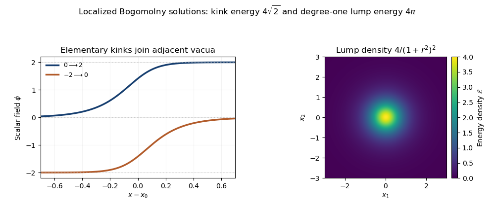

<h1 id="2/solution">Solution</h1>

↑ **Parent:** [2](../2.md)

A [nonlinear sigma model](../../../../../nonlinear-sigma-model.md) describes a field taking values in a Riemannian target rather than an unconstrained linear space. Its static configurations are [harmonic maps](../../../../../harmonic-map.md), critical points of the Dirichlet energy. The standard example for [sigma-model lumps](../../../../../sigma-model-lump.md) is the [O3 nonlinear sigma model](../../../../../o3-nonlinear-sigma-model.md) in two spatial dimensions: a unit vector $\mathbf n(x_1,x_2)\in S^2$ has

$$
E[\mathbf n]=\frac12\int_{\mathbb R^2}\bigl(|\partial_1\mathbf n|^2+|\partial_2\mathbf n|^2\bigr)\,d^2x.
$$

The same target is the [complex projective line](../../../../../complex-projective-line.md), giving the [CP1 nonlinear sigma model](../../../../../o3-nonlinear-sigma-model.md) description. A lump is a localized finite-energy static solution, whose existence and minimum energy are governed by the degree of its field map.

Impose a fixed angle-independent value $\mathbf n_\infty$ at spatial infinity and require the field to extend smoothly there. The [one-point compactification](../../../../../alexandroff-extension.md) of the plane is a sphere, so the configuration becomes a map $S^2\to S^2$. Its [topological degree](../../../../../topological-degree.md) is the integer

$$
N=\frac1{4\pi}\int_{\mathbb R^2}\mathbf n\cdot(\partial_1\mathbf n\times\partial_2\mathbf n)\,d^2x.
$$

This is the [degree charge of an O3 sigma-model lump](../../../../../degree-charge-of-an-o3-sigma-model-lump.md): the integrand is the pullback of the oriented unit-sphere area form, normalized by its area $4\pi$. Equivalently, the degree counts inverse images of a regular target point with orientation signs. It is unchanged under smooth [homotopy](../../../../../homotopy.md) with the prescribed boundary value. Consequently fields of different degree belong to distinct [topological sectors](../../../../../topological-sector.md).

Topology also determines an energy lower bound. The derivatives are tangent to the sphere, so $|\mathbf n\times\partial_2\mathbf n|=|\partial_2\mathbf n|$. Since  
$\partial_1\mathbf n\cdot(\mathbf n\times\partial_2\mathbf n)=-\mathbf n\cdot(\partial_1\mathbf n\times\partial_2\mathbf n)$, square completion gives

$$
E=\frac12\int|\partial_1\mathbf n\pm\mathbf n\times\partial_2\mathbf n|^2\,d^2x\pm4\pi N.
$$

Choosing the sign of $N$ proves the [Bogomolny degree bound for the O3 sigma model](../../../../../bogomolny-degree-bound-for-the-o3-sigma-model.md)

$$
\boxed{E\geq4\pi|N|.}
$$

For positive degree, equality holds precisely when $\partial_1\mathbf n+\mathbf n\times\partial_2\mathbf n=0$; for negative degree the opposite sign applies. These are the [Bogomolny equations](../../../../../bogomolny-equations.md) for the lump. A saturating field minimizes energy in its degree sector and hence solves the static field equation. Explicitly, that equation is $\Delta\mathbf n+|\nabla\mathbf n|^2\mathbf n=0$, obtained by varying under $\mathbf n^2=1$.

The first-order equations become especially simple in [stereographic projection](../../../../../stereographic-projection.md). Use $z=x_1+ix_2$ and

$$
\mathbf n=\frac{(2\operatorname{Re}w,\,2\operatorname{Im}w,\,1-|w|^2)}{1+|w|^2},\qquad \partial_z=\tfrac12(\partial_1-i\partial_2),\qquad\partial_{\bar z}=\tfrac12(\partial_1+i\partial_2).
$$

The round target metric is $4\,dw\,d\bar w/(1+|w|^2)^2$. In the one-half energy normalization used here, the [stereographic energy of the O3 sigma model](../../../../../stereographic-energy-of-the-o3-sigma-model.md) and degree are

$$
E=4\int\frac{|w_z|^2+|w_{\bar z}|^2}{(1+|w|^2)^2}\,d^2x,\qquad
N=\frac1\pi\int\frac{|w_z|^2-|w_{\bar z}|^2}{(1+|w|^2)^2}\,d^2x.
$$

Thus $E-4\pi N=8\int|w_{\bar z}|^2/(1+|w|^2)^2$. Positive-degree lumps are [holomorphic maps](../../../../../holomorphic-map.md), $w_{\bar z}=0$, and negative-degree lumps are [antiholomorphic maps](../../../../../antiholomorphic-function.md), $w_z=0$.

A holomorphic sphere map is meromorphic in a stereographic coordinate and hence a [rational map](../../../../../rational-map-complex-analysis.md) $w=p(z)/q(z)$ with coprime polynomials. To see why the rational form suffices, its finitely many coordinate poles can be removed by subtracting their principal parts, leaving a holomorphic function on the compact sphere and therefore a constant. The [degree of a rational map of the Riemann sphere](../../../../../degree-of-a-rational-map-of-the-riemann-sphere.md) is

$$
\boxed{N=\max(\deg p,\deg q)}
$$

after canceling common factors. A generic target value $c$ has inverse images solving $p-cq=0$, with the root at infinity counted in homogeneous coordinates when necessary; the number is $N$, and holomorphic local degrees are positive. Poles of $w$ do not make the physical field singular: the reciprocal target coordinate $1/w$ is regular there. Antiholomorphic rational maps have the opposite topological degree and the same minimum energy.

For example, the [unit sigma-model lump and size modulus](../../../../../unit-sigma-model-lump-and-size-modulus.md) is

$$
w(z)=\frac{\rho}{z-z_0},\qquad \rho\ne0,\qquad
\mathcal E(z)=\frac{4|\rho|^2}{(|z-z_0|^2+|\rho|^2)^2}.
$$

Its degree is one and radial integration gives $E=4\pi$. The complex center $z_0$ supplies two position parameters, while the magnitude and phase of $\rho$ give size and internal orientation. More generally, fixing $w(\infty)=0$ allows a monic degree-$N$ denominator and a numerator of degree at most $N-1$, with no common roots. Their $2N$ complex coefficients give the [based rational-map moduli of sigma-model lumps](../../../../../based-rational-map-moduli-of-sigma-model-lumps.md).

Two-dimensional [Derrick scaling](../../../../../derrick-scaling.md) leaves this pure-gradient energy unchanged, so degree fixes the minimum energy but not a preferred size. As $\rho\to0$, the unit-lump energy concentrates and the field limit is singular at its center. A degree cannot change through a smooth boundary-preserving deformation, but concentration can leave that smooth configuration space. Thus **topological degree protects the smooth sector and determines the Bogomolny energy, while not by itself stabilizing the lump size**. There is no contradiction with the scalar obstruction in Question 1: a curved-target harmonic map obeys a nonlinear constrained field equation, rather than having harmonic unconstrained components.

**[Figure 1](#2/image-adjacent-vacuum-phi-six-kink-profiles-and-the-localized-energy-density-of-a-degree-one-sigma-model-lump). Adjacent-vacuum phi-six kink profiles and the localized energy density of a degree-one sigma-model lump**.

The kink panel uses the normalization of Question 1. The lump panel has $z_0=0$ and $|\rho|=1$ in the [unit sigma-model lump and size modulus](../../../../../unit-sigma-model-lump-and-size-modulus.md); changing its size redistributes the density while keeping its total energy $4\pi$.

## ↑ Ancestors (10)

1. [2](../2.md)
2. [Paper 56](../../paper-56-split.md)
3. [Iii](../../split.md)
4. [2007](../../../split.md)
5. [Past exam of the mathematics course of the University of Cambridge](../../../../split.md)
6. [Mathematics course of the University of Cambridge](../../../../../mathematics-course-of-the-university-of-cambridge.md)
7. [Course of the University of Cambridge](../../../../../course-of-the-university-of-cambridge.md)
8. [University of Cambridge](../../../../../university-of-cambridge-split.md)
9. [List of universities](../../../../../list-of-universities.md)
10. [Codex Wiki](../../../../../split.md)
