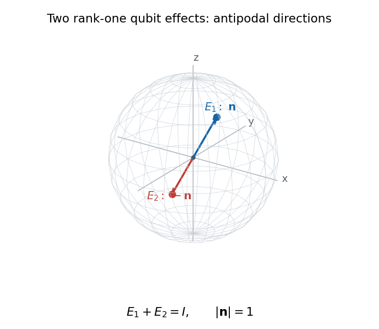

<h1 id="1/b/solution">Solution</h1>

↑ **Parent:** [B](../b.md)

Normalize the vector defining the first effect and write $E_1=\alpha|\psi\rangle\langle\psi|$. Since the two effects sum to $I$, the eigenvalues of $E_2=I-E_1$ are $1-\alpha$ along $\psi$ and $1$ on its orthogonal complement. For $E_2$ to have rank one, $\alpha=1$. Hence this [binary rank-one qubit POVM](../../../../../../binary-rank-one-qubit-povm.md) is a [projective measurement](../../../../../../projective-measurement.md):

$$
\boxed{E_1=\frac{I+\mathbf n\cdot\boldsymbol\sigma}{2},\qquad
E_2=\frac{I-\mathbf n\cdot\boldsymbol\sigma}{2},\quad|\mathbf n|=1.}
$$

The two [Bloch vectors](../../../../../../bloch-vector.md) are antipodal on the [Bloch sphere](../../../../../../bloch-sphere.md); the corresponding state vectors are orthogonal. The plot below chooses one representative unit vector. Rotating both directions gives every other case. The sphere represents the effect projectors' Bloch directions, rather than plotting their matrix entries.

**[Figure 1](#1/b/image-antipodal-bloch-directions-of-a-two-outcome-rank-one-qubit-povm). Antipodal Bloch directions of a two-outcome rank-one qubit POVM**.

## ↑ Ancestors (11)

1. [B](../b.md)
2. [1](../../1.md)
3. [Paper 58](../../../paper-58-split.md)
4. [Iii](../../../split.md)
5. [2007](../../../../split.md)
6. [Past exam of the mathematics course of the University of Cambridge](../../../../../split.md)
7. [Mathematics course of the University of Cambridge](../../../../../../mathematics-course-of-the-university-of-cambridge.md)
8. [Course of the University of Cambridge](../../../../../../course-of-the-university-of-cambridge.md)
9. [University of Cambridge](../../../../../../university-of-cambridge-split.md)
10. [List of universities](../../../../../../list-of-universities.md)
11. [Codex Wiki](../../../../../../split.md)
