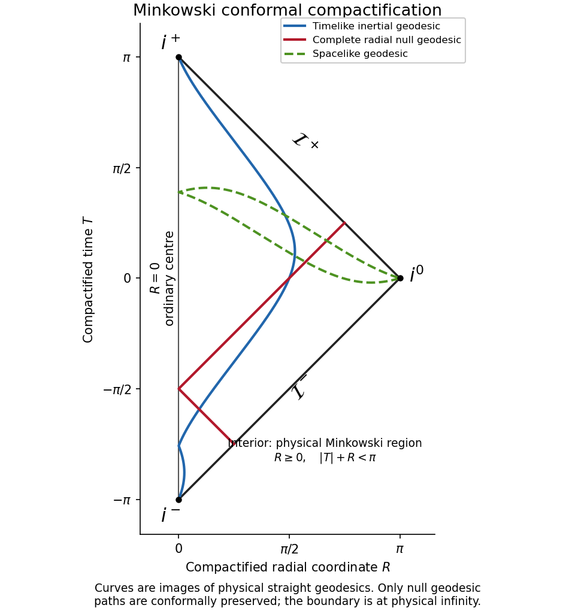

<h1 id="4/solution">Solution</h1>

↑ **Parent:** [4](../4.md)

The original spherical coordinates have $t\in\mathbb R$, $0\leq r<\infty$, $0\leq\theta\leq\pi$ and $0\leq\phi<2\pi$, with $\phi$ periodic. The angular coordinates degenerate at the polar axis and all angles identify at $r=0$; a regular spherical chart uses $r>0$, $0<\theta<\pi$ and suitable overlapping angular patches.

The [retarded time](../../../../../retarded-time.md) $u=t-r$ and advanced coordinate $v=t+r$ both range over $\mathbb R$, with the joint restriction $u\leq v$. Their inverse relations are $t=(u+v)/2$ and $r=(v-u)/2$, so

$$
d\widehat s^2=du\,dv-\frac14(v-u)^2d\Sigma^2.
$$

Set $p=\arctan u$, $q=\arctan v$. Then

$$
-\frac\pi2<p\leq q<\frac\pi2,\qquad du=\sec^2p\,dp,\qquad dv=\sec^2q\,dq.
$$

The [conformal factor](../../../../../conformal-factor.md) is $\Omega=2\cos p\cos q>0$. Since $(\tan q-\tan p)\cos p\cos q=\sin(q-p)$, multiplication by $\Omega^2$ gives

$$
ds^2=4dp\,dq-\sin^2(q-p)d\Sigma^2.
$$

Finally $T=p+q$ and $R=q-p$ give $4dp\,dq=dT^2-dR^2$. Hence

$$
\boxed{ds^2=dT^2-dR^2-\sin^2R\,d\Sigma^2.}
$$

This is a region of the [Einstein static universe](../../../../../einstein-static-universe.md), with positive time and negative spatial signature. The exact joint coordinate domain is

$$
\boxed{-\pi<T<\pi,\qquad 0\leq R<\pi-|T|,}
$$

or equivalently $R\geq0$ and $|T|+R<\pi$. The regular radial chart has $R>0$; $R=0$ is the ordinary centre. The angular ranges are unchanged. It is important not to treat the stated individual ranges of $T,R$ as independent. The inverse map and [conformal factor](../../../../../conformal-factor.md) provide a useful check:

$$
t=\frac{\sin T}{\cos T+\cos R},\qquad
r=\frac{\sin R}{\cos T+\cos R},\qquad
\Omega=\cos T+\cos R.
$$

The resulting [Minkowski conformal compactification](../../../../../minkowski-conformal-compactification.md) has a triangular radial [Penrose diagram](../../../../../penrose-diagram.md). The two sloping boundary edges are

$$
\mathcal I^+:\ T+R=\pi,\quad 0<R<\pi,\qquad
\mathcal I^-:\ T-R=-\pi,\quad 0<R<\pi.
$$

These are [future null infinity](../../../../../future-null-infinity.md) and [past null infinity](../../../../../past-null-infinity.md). The three vertices are [future timelike infinity](../../../../../future-timelike-infinity.md) $i^+=(\pi,0)$, [past timelike infinity](../../../../../past-timelike-infinity.md) $i^-=(-\pi,0)$ and [spacelike infinity](../../../../../spacelike-infinity.md) $i^0=(0,\pi)$. They are ideal boundary points, not events of physical [Minkowski spacetime](../../../../../minkowski-spacetime.md).

For a complete inertial [timelike geodesic](../../../../../timelike-geodesic.md), $\mathbf x=\mathbf b+\mathbf vt$ with $|\mathbf v|<1$. As $t\to+\infty$, both $t-r$ and $t+r$ tend to $+\infty$, so $p,q\to\pi/2$ and the curve ends at $i^+$. As $t\to-\infty$, both tend to $-\infty$, giving $i^-$. These endpoints occur at infinite physical [proper time](../../../../../proper-time.md).

For a complete [null geodesic](../../../../../null-geodesic.md), write $\mathbf x=\mathbf b+\mathbf nt$, $|\mathbf n|=1$. To the future, $r=t+\mathbf n\cdot\mathbf b+O(1/t)$, so $u\to-\mathbf n\cdot\mathbf b$ is finite and $v\to+\infty$. Thus $q\to\pi/2$ with $p$ finite: the endpoint lies on $\mathcal I^+$. To the past, $v\to-\mathbf n\cdot\mathbf b$ remains finite while $u\to-\infty$, giving $\mathcal I^-$. Physical [affine parameter](../../../../../affine-parameter.md) is infinite at both ends. Along a radial null path, $dT=\pm dR$, so the diagram represents its null directions at $45$ degrees.

For a complete [spacelike geodesic](../../../../../spacelike-geodesic.md), take $t=t_0+a\lambda$, $\mathbf x=\mathbf b+\mathbf w\lambda$ with $|\mathbf w|>|a|$. At either end $r>|t|$ asymptotically, so $u\to-\infty$, $v\to+\infty$ and $(T,R)\to(0,\pi)$. Both ends therefore reach $i^0$, again at infinite physical [affine parameter](../../../../../affine-parameter.md). These are the [geodesic endpoints in Minkowski conformal compactification](../../../../../geodesic-endpoints-in-minkowski-conformal-compactification.md).

**[Figure 1](#4/image-radial-conformal-compactification-of-minkowski-spacetime-with-images-of-complete-timelike-null-and-spacelike-geodesics). Radial conformal compactification of Minkowski spacetime with images of complete timelike, null and spacelike geodesics**.

Only [conformal preservation of null geodesic paths](../../../../../conformal-preservation-of-null-geodesic-paths.md) is guaranteed. The pictured timelike and spacelike curves are images of physical geodesics, not generally geodesics of the unphysical metric. For a null path, an unphysical affine parameter satisfies $d\widetilde\lambda/d\lambda\propto\Omega^2$. Since $\Omega=O(1/|\lambda|)$ near a generic null-infinity endpoint, the unphysical parameter can converge while the physical parameter diverges. At $i^\pm$ and $i^0$, the usual smooth-boundary condition $d\Omega\ne0$ degenerates; these vertices should not be treated as regular points of null infinity.

**Complete Minkowski spacetime has no black-hole event horizon.** Every physical event can send an outgoing null signal to $\mathcal I^+$, so the black-hole region $\mathcal M\setminus J^-(\mathcal I^+)$ is empty. There is likewise no particle or future event horizon for an eternal inertial observer: any finite event can eventually signal that observer. Null infinity is a conformal boundary, not a physical horizon. Uniformly accelerated observers can have [Rindler horizons](../../../../../rindler-horizon.md), but that is an observer-dependent restriction and is not a horizon of the full inertial [Minkowski spacetime](../../../../../minkowski-spacetime.md).

## ↑ Ancestors (10)

1. [4](../4.md)
2. [Paper 61](../../paper-61-split.md)
3. [Iii](../../split.md)
4. [2007](../../../split.md)
5. [Past exam of the mathematics course of the University of Cambridge](../../../../split.md)
6. [Mathematics course of the University of Cambridge](../../../../../mathematics-course-of-the-university-of-cambridge.md)
7. [Course of the University of Cambridge](../../../../../course-of-the-university-of-cambridge.md)
8. [University of Cambridge](../../../../../university-of-cambridge-split.md)
9. [List of universities](../../../../../list-of-universities.md)
10. [Codex Wiki](../../../../../split.md)
