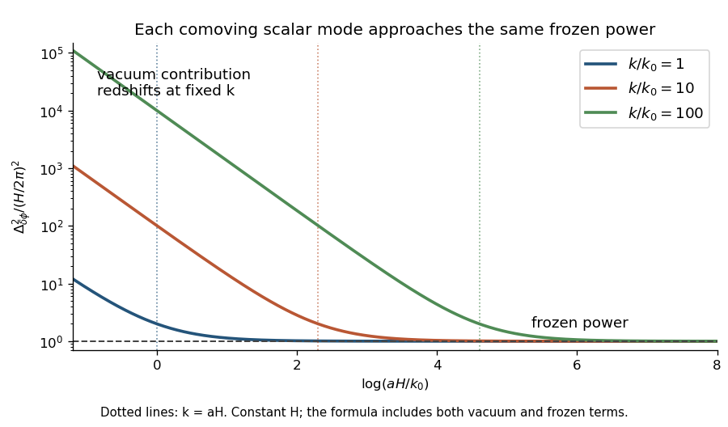

<h1 id="3/d/solution">Solution</h1>

↑ **Parent:** [D](../d.md)

In the incoming [Bunch-Davies vacuum](../../../../../../bunch-davies-vacuum.md), only $\langle a_{\mathbf k}a_{\mathbf q}^{\dagger}\rangle=\delta_{\mathbf k\mathbf q}$ contributes to the coincident [vacuum expectation value](../../../../../../vacuum-expectation-value.md). Thus

$$
\langle\delta\hat\phi^2\rangle=\sum_{\mathbf k}|\delta\phi_k^{(+)}|^2=\sum_{\mathbf k}\frac1{2k\mathcal V}\left(\frac1{a^2}+\frac{H^2}{k^2}\right).
$$

Replacing the box sum by $\mathcal V\int d^3k/(2\pi)^3$ gives

$$
\boxed{\langle\delta\hat\phi^2\rangle=\int\frac{d^3k}{(2\pi)^3}\frac1{2k}\left(\frac1{a^2}+\frac{H^2}{k^2}\right)=\frac1{4\pi^2}\int_0^\infty dk\left(\frac{k}{a^2}+\frac{H^2}{k}\right).}
$$

The [subhorizon vacuum contribution](../../../../../../subhorizon-vacuum-contribution-to-a-de-sitter-scalar-spectrum.md) is the flat-space zero-point term; at fixed comoving $k$ it redshifts as $a^{-2}$. The other term gives [frozen scalar power](../../../../../../frozen-contribution-to-a-de-sitter-scalar-spectrum.md) on [superhorizon scales](../../../../../../superhorizon-scale.md). Specifically, the [dimensionless cosmological power spectrum](../../../../../../dimensionless-cosmological-power-spectrum.md) per logarithmic interval is

$$
\Delta_{\delta\phi}^2(k,\tau)=\frac{k^2/a^2+H^2}{4\pi^2}\ \longrightarrow\ \boxed{\left(\frac H{2\pi}\right)^2}.
$$

Its late-time value is independent of $k$, producing a [scale-invariant inflationary power spectrum](../../../../../../scale-invariant-inflationary-power-spectrum.md). Each fixed [Fourier mode](../../../../../../fourier-mode.md) freezes separately as $\tau\to0$.

**[Figure 1](#3/d/image-vacuum-redshifting-and-frozen-power-of-massless-scalar-modes-during-de-sitter-expansion). Vacuum redshifting and frozen power of massless scalar modes during de Sitter expansion**.

The coincident integral is formal: the vacuum part diverges at large $k$, and an unlimited scale-invariant part diverges at small $k$. The conclusion concerns the power in each finite logarithmic band. A finite inflationary history supplies a largest generated wavelength, as described by the [infrared qualification of a scale-invariant covariance](../../../../../../infrared-qualification-of-a-scale-invariant-covariance.md); taking the late-time limit inside an unregulated integral would not be justified.

## ↑ Ancestors (11)

1. [D](../d.md)
2. [3](../../3.md)
3. [Paper 62](../../../paper-62-split.md)
4. [Iii](../../../split.md)
5. [2007](../../../../split.md)
6. [Past exam of the mathematics course of the University of Cambridge](../../../../../split.md)
7. [Mathematics course of the University of Cambridge](../../../../../../mathematics-course-of-the-university-of-cambridge.md)
8. [Course of the University of Cambridge](../../../../../../course-of-the-university-of-cambridge.md)
9. [University of Cambridge](../../../../../../university-of-cambridge-split.md)
10. [List of universities](../../../../../../list-of-universities.md)
11. [Codex Wiki](../../../../../../split.md)
