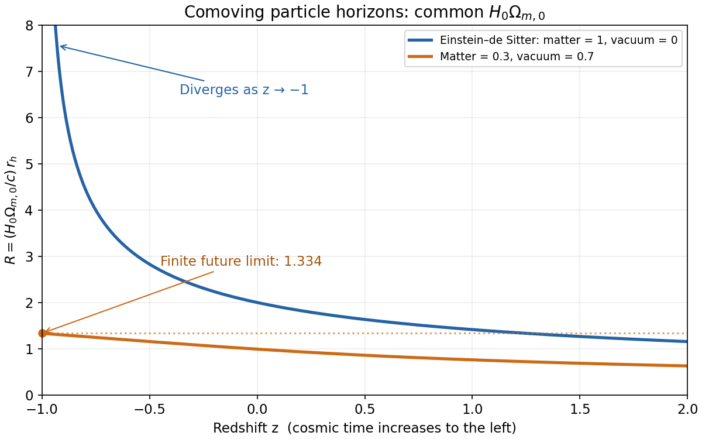

<h1 id="2/iii/solution">Solution</h1>

↑ **Parent:** [Iii](../iii.md)

Use the stipulated common normalization $A=H_0\Omega_{m,0}$ and plot $R=A r_h/c$. The [Einstein-de Sitter universe](../../../../../../einstein-de-sitter-universe.md) has $H_{0,E}=A$, whereas the $(\Omega_{m,0},\Omega_{\Lambda,0})=(0.3,0.7)$ model has $H_{0,\Lambda}=A/0.3$. Their [comoving particle horizons](../../../../../../comoving-particle-horizon.md) are therefore

$$
R_E(z)=\frac2{\sqrt{1+z}},\qquad
R_\Lambda(z)=0.3\int_z^\infty\frac{dz'}{\sqrt{0.3(1+z')^3+0.7}}.
$$

Both decrease with increasing $z$, or increase with cosmic time. The [Einstein-de Sitter universe](../../../../../../einstein-de-sitter-universe.md) curve diverges at $z=-1$ and has $R_E(0)=2$, $R_E(2)=2/\sqrt3$. The matter-plus-vacuum curve remains finite at $z=-1$: the integrand approaches a constant there, and its high-redshift tail is integrable. Moreover it lies below the Einstein-de Sitter curve for this particular normalization, since, with $u=1+z'>0$,

$$
\frac{0.3}{\sqrt{0.3u^3+0.7}}<\frac1{u^{3/2}}.
$$

The high-redshift ratio of the two curves tends to $\sqrt{0.3}$, not one. Holding $H_0\sqrt{\Omega_{m,0}}$ fixed would give a different comparison; it is $H_0\Omega_{m,0}$ that the original question specifies.

**[Figure 1](#2/iii/image-comoving-particle-horizons-with-the-same-value-of-hubble-parameter-times-matter-density-parameter). Comoving particle horizons with the same value of Hubble parameter times matter density parameter**.

A positive [cosmological constant](../../../../../../cosmological-constant.md) eventually makes the [scale factor](../../../../../../scale-factor-cosmology.md) grow exponentially. The future integral $\int_t^\infty c\,dt'/a(t')$ then converges, so the remaining [conformal time](../../../../../../conformal-time.md) is finite. The [comoving particle horizon](../../../../../../comoving-particle-horizon.md) approaches a finite limiting visibility radius; it does not shrink. The remaining distance to that limit is the comoving radius of the [cosmological event horizon](../../../../../../cosmological-event-horizon.md). Thus a signal emitted sufficiently far away today can never reach us, even though the proper particle-horizon radius continues to grow. This is the [total conformal lifetime of a flat matter-Lambda universe](../../../../../../total-conformal-lifetime-of-a-flat-matter-lambda-universe.md).

## ↑ Ancestors (11)

1. [Iii](../iii.md)
2. [2](../../2.md)
3. [Paper 67](../../../paper-67-split.md)
4. [Iii](../../../split.md)
5. [2007](../../../../split.md)
6. [Past exam of the mathematics course of the University of Cambridge](../../../../../split.md)
7. [Mathematics course of the University of Cambridge](../../../../../../mathematics-course-of-the-university-of-cambridge.md)
8. [Course of the University of Cambridge](../../../../../../course-of-the-university-of-cambridge.md)
9. [University of Cambridge](../../../../../../university-of-cambridge-split.md)
10. [List of universities](../../../../../../list-of-universities.md)
11. [Codex Wiki](../../../../../../split.md)
