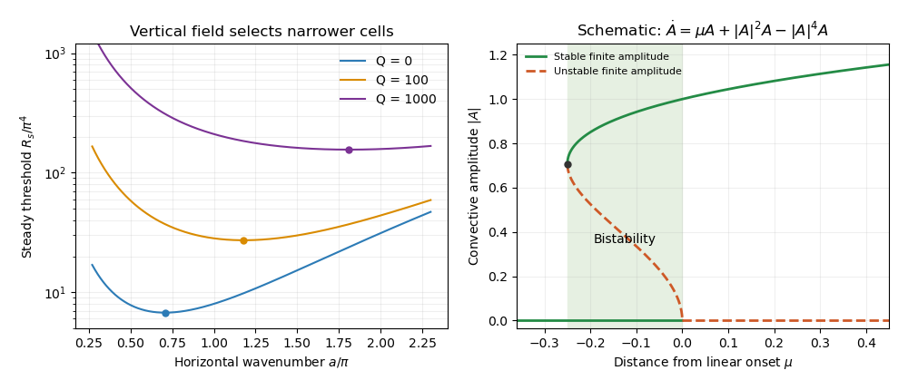

<h1 id="4/solution">Solution</h1>

↑ **Parent:** [4](../4.md)

[Magnetoconvection](../../../../../magnetoconvection.md) is the competition between thermally driven [convection](../../../../../convection.md) and the force and transport of a conducting fluid's [magnetic field](../../../../../magnetic-field.md). An imposed [magnetic field](../../../../../magnetic-field.md) resists motions that bend its field lines through [magnetic tension](../../../../../magnetic-tension.md), while [magnetic diffusion](../../../../../magnetic-diffusion.md) permits slippage. The competition changes the onset threshold, preferred spatial scale, temporal behaviour and finite-amplitude organization. The geometry matters: a disturbance nearly invariant along a horizontal imposed [magnetic field](../../../../../magnetic-field.md) can avoid much of its tension, whereas an impermeable layer with a vertical imposed [magnetic field](../../../../../magnetic-field.md) cannot generally avoid bending it.

A useful quantitative example is a nonrotating [Boussinesq](../../../../../boussinesq-approximation.md) layer of depth $d$, heated from below with temperature drop $\Delta T>0$ and threaded by a vertical [magnetic field](../../../../../magnetic-field.md) $B_0\widehat{\mathbf z}$. Let $\nu$, $\kappa$, $\eta$ denote [kinematic viscosity](../../../../../kinematic-viscosity.md), [thermal diffusivity](../../../../../thermal-diffusivity.md) and [magnetic diffusivity](../../../../../magnetic-diffusivity.md). In thermal-diffusion units define the [Rayleigh number](../../../../../rayleigh-number.md), [Prandtl number](../../../../../prandtl-number.md), [magnetic-to-thermal diffusivity ratio](../../../../../magnetic-to-thermal-diffusivity-ratio.md) and [Chandrasekhar number](../../../../../chandrasekhar-number.md) by

$$
R=\frac{g\alpha\Delta T d^3}{\nu\kappa},\qquad
P=\frac\nu\kappa,\qquad \zeta=\frac\eta\kappa,\qquad
Q=\frac{B_0^2d^2}{\mu_0\rho\nu\eta}.
$$

Use stress-free impermeable boundaries, fixed temperature perturbation zero, and magnetic boundary conditions keeping the field vertical. More explicitly, the normal modes below satisfy $w=\partial_z^2w=\theta=b_x=b_y=\partial_zb_z=0$ at $z=0,1$. For a horizontal [wavenumber](../../../../../wavenumber.md) $a>0$, take $w,\theta\propto\sin\pi z$, $b_z\propto\cos\pi z$, and put $s=a^2+\pi^2$. The linear temperature and [resistive induction equation](../../../../../resistive-induction-equation.md) give $(\lambda+s)\theta=w$ and $(\lambda+\zeta s)b_z=\partial_zw$. Applying the solenoidal projection to the [magnetohydrodynamic momentum equation](../../../../../magnetohydrodynamic-momentum-equation.md) removes [pressure](../../../../../pressure.md); the magnetic coupling is $Q\zeta\partial_z\mathbf b$, and the vertical projected buoyancy has coefficient $Ra^2/s$. Substituting the temperature and magnetic responses gives the [vertical-field magnetoconvection dispersion relation](../../../../../vertical-field-magnetoconvection-dispersion-relation.md)

$$
\left[\left(\frac\lambda P+s\right)(\lambda+\zeta s)+Q\zeta\pi^2\right](\lambda+s)
=\frac{Ra^2}{s}(\lambda+\zeta s).
$$

These stated boundary conditions make the single vertical mode exact in this model; other boundaries change numerical thresholds.

For steady marginal [convection](../../../../../convection.md), set $\lambda=0$. The threshold curve is

$$
\boxed{R_s(a)=\frac{s(s^2+Q\pi^2)}{a^2}}.
$$

The imposed [magnetic field](../../../../../magnetic-field.md) adds a positive penalty. Differentiating with respect to $x=a^2$ shows that the minimizing [wavenumber](../../../../../wavenumber.md) obeys

$$
(x+\pi^2)^2(2x-\pi^2)=Q\pi^4.
$$

At $Q=0$ this gives $a_c=\pi/\sqrt2$ and $R_c=27\pi^4/4$. With increasing $Q$, the root moves to larger $x$ because the left-hand side is strictly increasing for $x\ge\pi^2/2$. The [strong-field wavenumber selection in magnetoconvection](../../../../../strong-field-wavenumber-selection-in-magnetoconvection.md) limit is

$$
\boxed{a_c\sim\left(\frac{\pi^4Q}{2}\right)^{1/6},\qquad R_c\sim\pi^2Q}.
$$

Thus **a strong vertical imposed field raises the steady threshold and selects narrower convection cells**. At small horizontal [wavenumber](../../../../../wavenumber.md) the incompressibility constraint makes a given vertical motion require large horizontal displacement and magnetic bending. Increasing horizontal [wavenumber](../../../../../wavenumber.md) reduces this magnetic penalty, but increases viscous and thermal diffusion. Their balance selects the narrow cells. This statement is specific to the vertical-field geometry: [wavenumber selection in oblique-field magnetoconvection](../../../../../wavenumber-selection-in-oblique-field-magnetoconvection.md) can instead favour nearly field-invariant motions.

[Oscillatory marginality in vertical-field magnetoconvection](../../../../../oscillatory-marginality-in-vertical-field-magnetoconvection.md) occurs because magnetic and temperature perturbations need not relax at the same rate. To exhibit the phase balance, substitute $\lambda=i\omega$ with $\omega\ne0$ and write the neutral condition as

$$
R=\frac{s}{a^2}(s+i\omega)\left[s+\frac{i\omega}{P}+\frac{Q\zeta\pi^2}{\zeta s+i\omega}\right].
$$

The imaginary part must vanish because $R$ is real. Dividing that imaginary part by $\omega s$ gives

$$
1+\frac1P+\frac{Q\zeta\pi^2(\zeta-1)}{\zeta^2s^2+\omega^2}=0,
$$

so

$$
\boxed{\omega^2=\frac{P\zeta(1-\zeta)}{1+P}Q\pi^2-\zeta^2s^2}.
$$

A nonzero oscillation consequently requires $0<\zeta<1$ and a sufficiently strong imposed [magnetic field](../../../../../magnetic-field.md). In this regime thermal diffusion can erase the temperature anomaly faster than magnetic diffusion relaxes bent field lines. The magnetic restoring force can outlast the buoyant anomaly, reverse the motion, and maintain the phase lag needed for oscillatory instability. The real part gives the oscillatory neutral curve

$$
R_o(a)=\frac{s}{a^2}\left[\frac{(P+\zeta)(1+\zeta)}{P}s^2+
\frac{\zeta(P+\zeta)}{1+P}Q\pi^2\right].
$$

Only its portions with $\omega^2>0$ are physical. The first onset is the lower of the minimized steady and admissible oscillatory thresholds; the existence of an oscillatory neutral solution at a given [wavenumber](../../../../../wavenumber.md) alone does not establish that it is first. For example, at fixed $P>0$ and $0<\zeta<1$, both minimizing [wavenumbers](../../../../../wavenumber.md) grow like $Q^{1/6}$ for large $Q$, while $R_s\sim\pi^2Q$ and $R_o\sim D\pi^2Q$ with $D=\zeta(P+\zeta)/(1+P)<1$. At those oscillatory minima, the positive order-$Q$ contribution to $\omega^2$ dominates its order-$Q^{2/3}$ negative contribution, so the oscillatory branch is genuinely admissible and becomes the lower threshold. An [overstability](../../../../../overstability.md) therefore precedes steady onset in this limit. More generally nonlinear [convection](../../../../../convection.md) can oscillate even when linear onset is steady; the linear calculation is not a classification of every time-dependent state.

**[Figure 1](#4/image-vertical-field-scale-selection-and-a-schematic-subcritical-convective-branch). Vertical-field scale selection and a schematic subcritical convective branch**.

The nonlinear regime introduces a different feedback. The [magnetic Reynolds number](../../../../../magnetic-reynolds-number.md) $\operatorname{Rm}=Ud/\eta$ measures induction relative to diffusion for a finite convective velocity $U$. At large but finite $\operatorname{Rm}$, persistent [convection rolls](../../../../../convection-roll.md) can redistribute [magnetic flux](../../../../../magnetic-flux.md). In a two-dimensional incompressible roll, a flux function $\mathcal A$ obeys

$$
\partial_t\mathcal A+\mathbf u\cdot\nabla\mathcal A=\eta\nabla^2\mathcal A.
$$

Circulation repeatedly stretches the flux pattern, building gradients on which even small [magnetic diffusivity](../../../../../magnetic-diffusivity.md) acts efficiently. Over the flux-rearrangement time this permits [flux expulsion](../../../../../flux-expulsion.md): the interior of a vigorous roll becomes weakly magnetized, while [magnetic flux](../../../../../magnetic-flux.md) is concentrated near its edges. The weak-field interior then suffers less magnetic inhibition and can support broader, stronger [convection](../../../../../convection.md) than the linear narrow-cell prediction for the original uniform [magnetic field](../../../../../magnetic-field.md). Exact zero resistivity would preserve material flux and cannot by itself justify the relaxed flux-expelled state.

The weak interior field also follows from a steady leading-order balance for a coherent two-dimensional roll. Let $\psi$ be its streamfunction and suppose its interior streamlines are nested closed curves with $\nabla\psi\ne0$. In the small-diffusivity interior, $\mathbf u\cdot\nabla\mathcal A_0=0$ implies $\mathcal A_0=F(\psi)$. Integrate the full steady flux equation over the region enclosed by one streamline. Because $\mathbf u\cdot\mathbf n=0$ there, the advection integral vanishes; the [divergence theorem](../../../../../divergence-theorem.md) then gives $\oint\partial_n\mathcal A\,ds=0$. In a regular interior expansion this requires $F'(\psi)\oint\partial_n\psi\,ds=0$. The normal derivative of $\psi$ has one nonzero sign around a regular nested streamline, so $F'(\psi)=0$. Hence the leading interior flux function is constant, and its spatial [gradient](../../../../../gradient.md), which gives the two-dimensional [magnetic field](../../../../../magnetic-field.md), vanishes. The mismatch with external flux is accommodated by magnetic boundary layers. This argument assumes the coherent steady roll and a regular interior; it does not prove that every turbulent flow expels flux.

The mean imposed vertical [magnetic flux](../../../../../magnetic-flux.md) is conserved for horizontally periodic boundaries. In a schematic two-region picture, let a fraction $f$ have weak field $B_c$ in vigorous [convection](../../../../../convection.md) and the remainder have field $B_q$. Then

$$
fB_c+(1-f)B_q=B_0,\qquad B_c\ll B_0\ \Longrightarrow\ B_q\simeq\frac{B_0}{1-f}.
$$

The intensified field outside the active cells inhibits surrounding [convection](../../../../../convection.md). This gives [magnetic flux separation](../../../../../magnetic-flux-separation.md): vigorous weak-field patches coexist with strong-field regions whose motion is small or occurs on a finer scale. The redistribution is a consequence of nonlinear induction and back reaction, rather than disappearance of the net imposed flux.

This feedback can permit [subcritical magnetoconvection](../../../../../subcritical-magnetoconvection.md). Infinitesimal perturbations decay below the conductive state's linear threshold because they encounter the full imposed field. A finite-amplitude roll can nevertheless persist by first expelling enough flux to reduce its own magnetic restraint. A sufficient finite disturbance can then switch between the stable conductive state and a convective state, producing hysteresis. A schematic [amplitude equation](../../../../../amplitude-equation.md) makes the distinction between local linear stability and finite-amplitude persistence explicit:

$$
\dot A=\mu A+c|A|^2A-d|A|^4A,\qquad c,d>0.
$$

Here $\mu$ measures distance from linear onset; this is an illustrative normal form, not a claim that these coefficients have been derived for every magnetic layer. Writing $r=|A|^2$, the nonzero equilibria satisfy

$$
\mu+cr-dr^2=0,\qquad
r_\pm=\frac{c\pm\sqrt{c^2+4d\mu}}{2d}.
$$

They appear at a [saddle-node bifurcation](../../../../../saddle-node-bifurcation.md) at $\mu=-c^2/(4d)$. For $-c^2/(4d)<\mu<0$, the zero state is stable, the lower radial-amplitude branch is unstable, and the upper branch is stable because its radial derivative has sign $c-2dr_+<0$. Thus **finite-amplitude convection can coexist with a linearly stable conductive state below the onset threshold**. Large $\operatorname{Rm}$ facilitates the flux-expulsion mechanism but is not a universal sufficient condition: geometry, the imposed [magnetic field](../../../../../magnetic-field.md), the capacity to form coherent recirculating cells, and magnetic back reaction all matter. The broad nonlinear cells in weak-field regions can coexist with much narrower cells in magnetically dominated regions, linking the nonlinear flux distribution back to scale selection.

## ↑ Ancestors (10)

1. [4](../4.md)
2. [Paper 68](../../paper-68-split.md)
3. [Iii](../../split.md)
4. [2007](../../../split.md)
5. [Past exam of the mathematics course of the University of Cambridge](../../../../split.md)
6. [Mathematics course of the University of Cambridge](../../../../../mathematics-course-of-the-university-of-cambridge.md)
7. [Course of the University of Cambridge](../../../../../course-of-the-university-of-cambridge.md)
8. [University of Cambridge](../../../../../university-of-cambridge-split.md)
9. [List of universities](../../../../../list-of-universities.md)
10. [Codex Wiki](../../../../../split.md)
