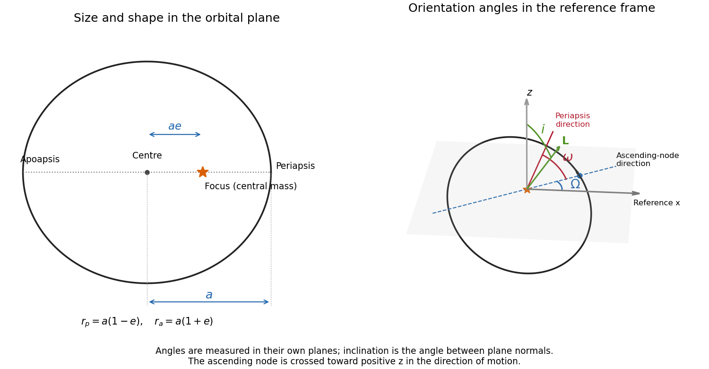

<h1 id="3/solution">Solution</h1>

↑ **Parent:** [3](../3.md)

For a bound [Kepler orbit](../../../../../kepler-orbit.md), the [semimajor axis](../../../../../semi-major-axis.md) is half the long diameter of the ellipse; if $r_p,r_{mathrm a}$ are its apsidal distances, $a=(r_p+r_{mathrm a})/2$. The [orbital eccentricity](../../../../../orbital-eccentricity.md) is $e=(r_{mathrm a}-r_p)/(r_{mathrm a}+r_p)$, with $0\leq e<1$ and semiminor axis $b=a\sqrt{1-e^2}$. The gravitating centre is a focus, displaced by $ae$ from the ellipse's geometric centre.

Choose a reference plane, a positive normal and a fixed reference direction in that plane. The [ascending node](../../../../../ascending-node.md) is where the orbit crosses toward positive normal displacement. The [longitude of ascending node](../../../../../longitude-of-ascending-node.md) $\Omega$ is the reference-plane angle from the fixed direction to that node. The [argument of periapsis](../../../../../argument-of-periapsis.md) $\omega$ is the angle from the ascending node to periapsis, measured in the [orbital plane](../../../../../orbital-plane.md) in the direction of motion. The [orbital inclination](../../../../../orbital-inclination.md) $i$ is the angle between the reference normal and the orbital angular-momentum normal, with $0\leq i\leq\pi$. The diagram separates the ellipse's shape from these orientation angles.

**[Figure 1](#3/image-size-and-shape-of-a-kepler-ellipse-and-the-node-periapsis-and-inclination-angles-in-a-fixed-reference-frame). Size and shape of a Kepler ellipse, and the node, periapsis and inclination angles in a fixed reference frame**.

Let $\mu=GM$ and use actions per unit test-particle mass. In the prograde spherical-action chart underlying the stated [Hamiltonian](../../../../../hamiltonian.md), $J_\phi=L_z$ and $J_\theta=L-L_z$, so $J_\theta+J_\phi=L$. The radial action then satisfies $J_r+L=\sqrt{\mu a}$, consistently with $H_K=-\mu/(2a)$. Define

$$
\boxed{J_1=J_r+J_\theta+J_\phi,\qquad J_2=J_\theta+J_\phi,\qquad J_3=J_\phi.}
$$

If $(w_r,w_\theta,w_\phi)$ are the old angles, a type-two generating function is

$$
F_2=(J_1-J_2)w_r+(J_2-J_3)w_\theta+J_3w_\phi.
$$

Differentiation with respect to the old angles recovers $J_r,J_\theta,J_\phi$, and differentiation with respect to the new actions gives the [canonical transformation](../../../../../canonical-transformation.md)

$$
\boxed{w_1=w_r,\qquad w_2=w_\theta-w_r,\qquad w_3=w_\phi-w_\theta.}
$$

Its triangular integer action matrix has determinant one, so it preserves the angle periodicities. In the new coordinates,

$$
\boxed{H_K=-\frac{\mu^2}{2J_1^2},\qquad
\dot w_1=\frac{\mu^2}{J_1^3}=\sqrt{\frac{\mu}{a^3}},\qquad \dot w_2=\dot w_3=0.}
$$

These are the [Delaunay variables](../../../../../delaunay-variables.md):

$$
J_1=\mathcal L=\sqrt{\mu a},\qquad
J_2=\mathcal G=\sqrt{\mu a(1-e^2)},\qquad
J_3=\mathcal H=\mathcal G\cos i.
$$

With the usual choices of angle origins, $w_1=\ell$ is [mean anomaly](../../../../../mean-anomaly.md), $w_2=\omega$ is [argument of periapsis](../../../../../argument-of-periapsis.md), and $w_3=\Omega$ is [longitude of ascending node](../../../../../longitude-of-ascending-node.md). The generator $\mathcal G=L$ rotates the orbit within its plane, whereas $\mathcal H=L_z$ rotates that plane about the reference normal; this explains the angular identification. The fast angle obeys [Kepler's equation](../../../../../kepler-s-equation.md) $\ell=\mathcal E-e\sin\mathcal E$, where $\mathcal E$ is [eccentric anomaly](../../../../../eccentric-anomaly.md).

For retrograde orbits, signed $J_\phi=L_z$ gives $J_\theta=L-|L_z|$ and the spherical Hamiltonian uses $J_r+J_\theta+|J_\phi|$. The stated plus-sign form is therefore a prograde chart, not a global signed-action formula. The [Delaunay variables](../../../../../delaunay-variables.md) still use $\mathcal H=L_z$; on the retrograde branch the generating function is $(\mathcal L-\mathcal G)w_r+(\mathcal G+\mathcal H)w_\theta+\mathcal H w_\phi$. At $e=0$, periapsis is undefined, and at $i=0$ or $\pi$ the node is undefined: these are angle-chart degeneracies, not physical singularities.

For the perturbed planet orbit, the radial and vertical frequencies mean small oscillations about a circular equatorial orbit of cylindrical radius $R$. Write $r=\sqrt{R^2+z^2}$ and retain the stated quadrupole potential. On the equator,

$$
\phi(R,0)=-\frac\mu R-\frac{\alpha^2\mu}{R^3},\qquad
\Omega_c^2=\frac1R\partial_R\phi=\frac\mu{R^3}+\frac{3\alpha^2\mu}{R^5}.
$$

At fixed axial [specific angular momentum](../../../../../specific-angular-momentum.md) $L_z$, the radial effective potential is $\phi(R,0)+L_z^2/(2R^2)$. Its second derivative at circular balance $L_z=R^2\Omega_c$ gives the [radial epicyclic frequency](../../../../../radial-epicyclic-frequency.md)

$$
\boxed{\kappa^2=\partial_R^2\phi+3\Omega_c^2
=R\frac{d\Omega_c^2}{dR}+4\Omega_c^2
=\frac\mu{R^3}-\frac{3\alpha^2\mu}{R^5}.}
$$

Reflection symmetry decouples vertical motion to first order. Expanding the potential in $z$ gives

$$
\phi(R,z)=\phi(R,0)+\frac12\left(\frac\mu{R^3}+\frac{9\alpha^2\mu}{R^5}\right)z^2+O(z^4),
$$

so the [vertical epicyclic frequency](../../../../../vertical-epicyclic-frequency.md) is

$$
\boxed{\nu^2=\frac\mu{R^3}+\frac{9\alpha^2\mu}{R^5}.}
$$

The circular orbit is radially stable only for $R^2>3\alpha^2$. For $\alpha\ne0$ in that domain, $\nu>\Omega_c>\kappa$. Vertical node crossings repeat at frequency $\nu$ while azimuth advances at $\Omega_c$, so the line of nodes has [nodal precession](../../../../../nodal-precession.md) rate $\Omega_c-\nu<0$. Radial periapsis passages repeat at $\kappa$, giving [apsidal precession](../../../../../apsidal-precession.md) rate $\Omega_c-\kappa>0$. To leading quadrupole order, with $n=\sqrt{\mu/R^3}$,

$$
\boxed{\dot\Omega_{\mathrm{node}}\simeq-3n\frac{\alpha^2}{R^2},\qquad
\dot\varpi\simeq+3n\frac{\alpha^2}{R^2}.}
$$

This is [oblate-quadrupole epicyclic precession](../../../../../oblate-quadrupole-epicyclic-precession.md). Here $\varpi$ denotes the nearly equatorial longitude of periapsis, not $\omega$ alone.

**The precession signs above have a small-eccentricity, small-inclination domain.** They are not a universal claim for every inclined Kepler ellipse. To see the distinction with the same [Delaunay variables](../../../../../delaunay-variables.md), average the perturbation over an unperturbed orbit. Since $z/r=\sin i\sin(\omega+f)$ and $dt=r^2df/\mathcal G$, the term linear in $e\cos f$ integrates to zero and the $\sin^2(\omega+f)$ average in the $r^{-3}$ integral is $1/2$. Thus

$$
\overline{H}_Q=\frac{\alpha^2\mu}{2a^3(1-e^2)^{3/2}}(1-3\cos^2i)
=\frac{\alpha^2\mu^4}{2\mathcal L^3\mathcal G^3}\left(1-\frac{3\mathcal H^2}{\mathcal G^2}\right).
$$

Differentiating at fixed other actions yields the first-order secular rates

$$
\dot\Omega=-\frac{3n\alpha^2\cos i}{a^2(1-e^2)^2},\qquad
\dot\omega=\frac{3n\alpha^2(5\cos^2i-1)}{2a^2(1-e^2)^2}.
$$

Their nearly equatorial sum reproduces the prograde $\dot\varpi$. For a polar orbit, however, the node is fixed and $\dot\omega<0$. This supplies a concrete counterexample to extending the requested forward periapsis precession beyond the intended epicyclic regime.

## ↑ Ancestors (10)

1. [3](../3.md)
2. [Paper 69](../../paper-69-split.md)
3. [Iii](../../split.md)
4. [2007](../../../split.md)
5. [Past exam of the mathematics course of the University of Cambridge](../../../../split.md)
6. [Mathematics course of the University of Cambridge](../../../../../mathematics-course-of-the-university-of-cambridge.md)
7. [Course of the University of Cambridge](../../../../../course-of-the-university-of-cambridge.md)
8. [University of Cambridge](../../../../../university-of-cambridge-split.md)
9. [List of universities](../../../../../list-of-universities.md)
10. [Codex Wiki](../../../../../split.md)
