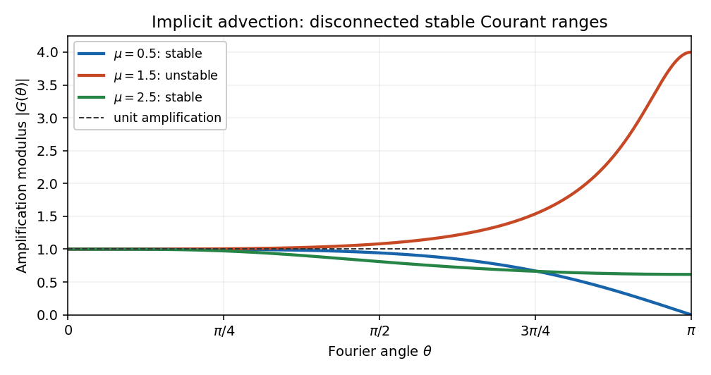

<h1 id="3/b/solution">Solution</h1>

↑ **Parent:** [B](../b.md)

For a [Fourier mode](../../../../../../fourier-mode.md) $U_j^n=G(\theta)^n e^{ij\theta}$, define

$$
N(\theta)=(2-\mu)+(1+\mu)e^{i\theta},\qquad L(\theta)=\frac{\mu(1+\mu)}2e^{-i\theta}+(1+\mu)(2-\mu)+\frac{(1-\mu)(2-\mu)}2e^{i\theta}.
$$

The [amplification factor](../../../../../../amplification-factor.md) is $G=N/L$. To derive its stability condition, use the coefficient abbreviations from the preceding solution and set $q=\cos\theta$. The squared moduli are

$$
|N|^2=d_0^2+e_0^2+2d_0e_0q,\qquad |L|^2=(a-c)^2+b^2+2b(a+c)q+4acq^2.
$$

Here $a+c=\mu^2-\mu+1$, $a-c=2\mu-1$, and $4ac=K(\mu)$. Subtraction and factorization give

$$
\boxed{|L(\theta)|^2-|N(\theta)|^2=\mu(\mu+1)(\mu-1)(\mu-2)(1-\cos\theta)^2.}
$$

Thus $|G|\leq1$ for every frequency exactly when $K(\mu)\geq0$, provided the implicit denominator does not vanish. For the physically nonnegative [Courant number](../../../../../../courant-number.md), this gives

$$
\boxed{\mu\in[0,1]\cup[2,\infty).}
$$

For a signed convention the full real range is $(-\infty,-1]\cup[0,1]\cup[2,\infty)$.

There is no hidden denominator failure in these ranges. If $K>0$ and $L=0$, the identity forces $N=0$ and $\cos\theta=1$; but $N(0)=3$. If $K=0$, then $|L|=|N|$, and $N$ could vanish only when its two real coefficients have equal magnitudes. Their sum is three, so equality requires $\mu=1/2$, which is not a root of $K$. Hence $L$ is nonzero for every frequency in the allowed ranges. On the compact frequency interval its inverse is bounded for each fixed allowed $\mu$.

When $K<0$, choose a small nonzero frequency. The denominator remains close to three, while the boxed identity gives $|N|>|L|$. Its fixed-frequency numerical mode grows geometrically, proving instability in the usual fixed-Courant refinement limit. Conversely, for $K\geq0$, the [Plancherel theorem](../../../../../../plancherel-theorem.md) converts the mode bound into a [discrete L2 norm](../../../../../../discrete-l2-norm.md) contraction on the whole-line or periodic grid. The large-Courant branch is possible because the scheme is implicit; stability alone does not promise small error at a large step.

**[Figure 1](#3/b/image-fourier-amplification-of-the-implicit-advection-stencil-for-courant-numbers-0-5-1-5-and-2-5). Fourier amplification of the implicit advection stencil for Courant numbers 0.5, 1.5 and 2.5**.

## ↑ Ancestors (11)

1. [B](../b.md)
2. [3](../../3.md)
3. [Paper 71](../../../paper-71-split.md)
4. [Iii](../../../split.md)
5. [2007](../../../../split.md)
6. [Past exam of the mathematics course of the University of Cambridge](../../../../../split.md)
7. [Mathematics course of the University of Cambridge](../../../../../../mathematics-course-of-the-university-of-cambridge.md)
8. [Course of the University of Cambridge](../../../../../../course-of-the-university-of-cambridge.md)
9. [University of Cambridge](../../../../../../university-of-cambridge-split.md)
10. [List of universities](../../../../../../list-of-universities.md)
11. [Codex Wiki](../../../../../../split.md)
