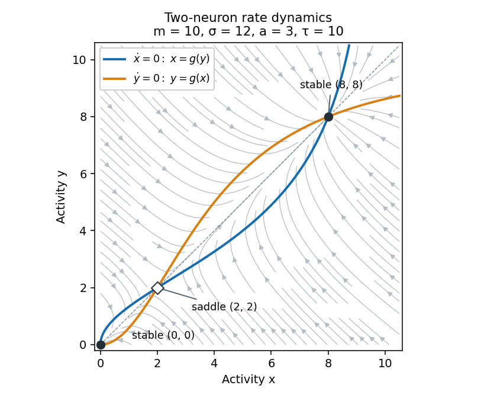

<h1 id="3/b/solution">Solution</h1>

↑ **Parent:** [B](../b.md)

Put $g(z)=s(az)=ma^2z^2/(\sigma^2+a^2z^2)$. The [nullclines](../../../../../../nullcline.md) are

$$
x=g(y),\qquad y=g(x).
$$

Any [steady state](../../../../../../steady-state.md) has nonnegative coordinates because $g\geq0$. For $a\ne0$, $g$ is strictly increasing on the positive half-line. If a steady state had $x>y$, then $x=g(y)<g(x)=y$, a contradiction. The case $y>x$ is identical, so all steady states lie on the diagonal. Write $x=y=z$. Besides $z=0$, the equation $z=g(z)$ gives

$$
a^2z^2-ma^2z+\sigma^2=0,
$$

and hence

$$
\boxed{z_\pm=\frac{m\pm\sqrt{m^2-4\sigma^2/a^2}}2.}
$$

Thus **three distinct steady states exist exactly when $|a|m>2\sigma$**, with $a\ne0$ and the positive parameter assumptions stated above. For positive excitatory coupling this is $am>2\sigma$. At equality the two positive states merge; below it only the origin remains. If $a=0$, the origin is again the only steady state.

Both nullclines begin at the origin and approach the limiting activity $m$ along their saturating direction; they are reflections of each other across $x=y$. Flow points to the right where $x<g(y)$ and to the left where $x>g(y)$. It points upwards where $y<g(x)$ and downwards where $y>g(x)$. The plot shows these nullclines and typical trajectories for the parameters of the next part.

**[Figure 1](#3/b/image-nullclines-and-flow-of-the-bistable-two-neuron-rate-network). Nullclines and flow of the bistable two-neuron rate network**.

The origin and upper diagonal state attract nearby trajectories, while the lower positive state is a saddle. Its [stable manifold](../../../../../../stable-manifold.md) separates the two attracting regions: trajectories in each [basin of attraction](../../../../../../basin-of-attraction.md) approach its stable node, giving [bistability](../../../../../../bistability.md). The diagonal is invariant, and on it the scalar activity increases between $z_-$ and $z_+$ and decreases between zero and $z_-$ or above $z_+$. Activities remain nonnegative and bounded because $0\leq g\leq m$. The vector field has constant negative divergence $-2/\tau$, so the [Bendixson-Dulac criterion](../../../../../../bendixson-dulac-theorem.md) also rules out periodic orbits in the physical quadrant. The network is a switch between persistent activity levels, rather than an oscillator.

## ↑ Ancestors (11)

1. [B](../b.md)
2. [3](../../3.md)
3. [Paper 73](../../../paper-73-split.md)
4. [Iii](../../../split.md)
5. [2007](../../../../split.md)
6. [Past exam of the mathematics course of the University of Cambridge](../../../../../split.md)
7. [Mathematics course of the University of Cambridge](../../../../../../mathematics-course-of-the-university-of-cambridge.md)
8. [Course of the University of Cambridge](../../../../../../course-of-the-university-of-cambridge.md)
9. [University of Cambridge](../../../../../../university-of-cambridge-split.md)
10. [List of universities](../../../../../../list-of-universities.md)
11. [Codex Wiki](../../../../../../split.md)
