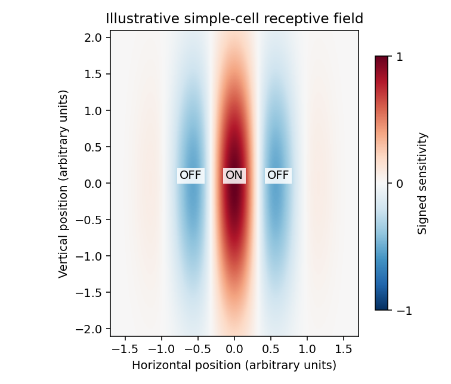

<h1 id="4/e/solution">Solution</h1>

↑ **Parent:** [E](../e.md)

A visual neuron's [receptive field](../../../../../../receptive-field.md) specifies the region of visual space and stimulus features whose changes affect its response, with the surrounding and temporal context held appropriately controlled. A linear receptive-field approximation is a signed spatial weighting kernel. A [simple cell](../../../../../../simple-cell.md) in [primary visual cortex](../../../../../../primary-visual-cortex.md) commonly has elongated alternating ON and OFF subregions and [orientation selectivity](../../../../../../orientation-selectivity.md). Brightening an ON region increases its drive; darkening an OFF region does likewise, while opposite contrasts oppose that drive in the linear approximation.

The original sketch below uses a Gaussian-windowed cosine to depict an elongated ON strip with OFF flanks. A bar aligned with these regions can produce strong net drive, whereas an orthogonal bar produces more cancellation. This is an illustrative signed filter, not a claim that every simple cell has exactly this analytical shape.

**[Figure 2](#4/e/image-illustrative-simple-cell-receptive-field-with-elongated-on-and-off-subregions). Illustrative simple-cell receptive field with elongated ON and OFF subregions**.

Different [unsupervised learning](../../../../../../unsupervised-learning.md) models address different developmental aspects. [Oja's rule](../../../../../../oja-s-rule.md) can select a dominant direction of correlated input and provides normalization that a bare Hebbian update lacks. By itself, one linear principal component need not be localized, nor does it create a cortical map. Additional spatial constraints and competition are needed to explain a collection of spatially organized selective cells.

Competitive [Hebbian learning](../../../../../../hebbian-learning.md) among correlated ON and OFF inputs can separate those input types into adjacent subregions and generate [orientation selectivity](../../../../../../orientation-selectivity.md). Competition among inputs from the two eyes can similarly contribute to eye-specific preference and [ocular dominance columns](../../../../../../ocular-dominance-column.md); spatial interactions between cortical units are needed for an organized map rather than merely one cell choosing one input pool. These models connect developmental organization to input correlations and normalization constraints. [The ON/OFF competition model](https://pmc.ncbi.nlm.nih.gov/articles/PMC6576834/) gives a concrete orientation-development example.

A different approach is [sparse coding](../../../../../../sparse-coding.md): learn features that reconstruct natural images while limiting simultaneous activity. This can yield localized, oriented, band-pass filters resembling simple-cell receptive fields, because it uses structure in natural-image statistics beyond the covariance alone. [The original sparse-code model](https://www.rctn.org/bruno/papers/sparse-coding.pdf) demonstrates this functional account. It does not by itself establish an exact developmental mechanism.

**Correlated input, competition and normalization can produce selectivity; the objective and network constraints determine which aspect of cortical organization is explained.** Anatomical constraints, spontaneous activity and experience must still be tested experimentally. A final receptive-field resemblance is weaker evidence than accurate predictions about its development and responses to altered input statistics.

## ↑ Ancestors (11)

1. [E](../e.md)
2. [4](../../4.md)
3. [Paper 73](../../../paper-73-split.md)
4. [Iii](../../../split.md)
5. [2007](../../../../split.md)
6. [Past exam of the mathematics course of the University of Cambridge](../../../../../split.md)
7. [Mathematics course of the University of Cambridge](../../../../../../mathematics-course-of-the-university-of-cambridge.md)
8. [Course of the University of Cambridge](../../../../../../course-of-the-university-of-cambridge.md)
9. [University of Cambridge](../../../../../../university-of-cambridge-split.md)
10. [List of universities](../../../../../../list-of-universities.md)
11. [Codex Wiki](../../../../../../split.md)
