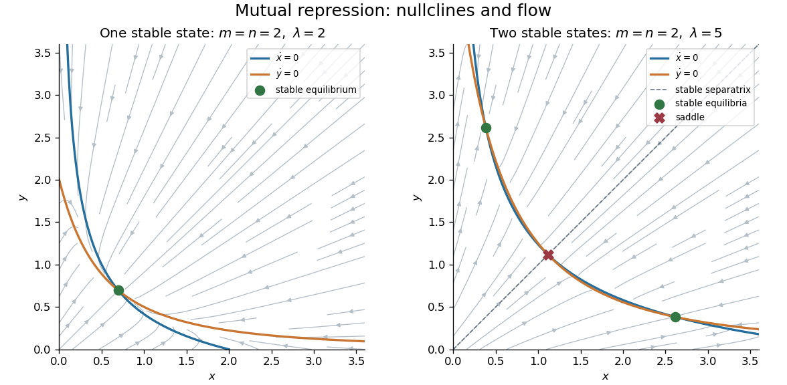

<h1 id="1/a/solution">Solution</h1>

↑ **Parent:** [A](../a.md)

Assume the decreasing functions are continuously differentiable so their local gains are defined. In the positive quadrant, the [nullclines](../../../../../../nullcline.md) are $x=f(y)$ and $y=g(x)$, both decreasing. The [phase plane](../../../../../../phase-plane.md) arrows point right when $x<f(y)$ and left when $x>f(y)$; they point up when $y<g(x)$ and down when $y>g(x)$. Both axes point into the quadrant. Since $f,g$ are bounded, sufficiently large $x$ or $y$ decreases, giving a bounded forward-invariant rectangle containing all equilibria and eventually containing each trajectory. Thus [mutual repression](../../../../../../mutual-repression.md) can have one attracting intersection or several intersections separating different [basins of attraction](../../../../../../basin-of-attraction.md).

An equilibrium obeys $x_*=f(y_*)$, $y_*=g(x_*)$. Its [Jacobian matrix](../../../../../../jacobian-matrix.md) and eigenvalues are

$$
J=\begin{pmatrix}-1&f'(y_*)\\g'(x_*)&-1\end{pmatrix},\qquad
\rho_\pm=-1\pm\sqrt{f'(y_*)g'(x_*)}.
$$

The product is nonnegative. Hence an intersection is a [stable equilibrium](../../../../../../stable-equilibrium.md) with two negative real eigenvalues when $f'g'<1$, a [saddle equilibrium](../../../../../../saddle-equilibrium.md) when $f'g'>1$, and nonhyperbolic when $f'g'=1$. This is the [mutual repression stability criterion](../../../../../../mutual-repression-stability-criterion.md). To see why an intervening saddle normally accompanies [multistability](../../../../../../multistability.md), eliminate $y$ and set $F(x)=f(g(x))-x$. Bounded positivity gives $F(0)>0$ and $F(x)<0$ for large $x$, while

$$
F'(x_*)=f'(g(x_*))g'(x_*)-1.
$$

Two downward, stable crossings require an upward crossing between them. For simple roots that middle crossing has $f'g'>1$ and is a [saddle equilibrium](../../../../../../saddle-equilibrium.md). Its stable manifold separates the attracting states. Thus **robust multistability requires the loop gain to exceed one at an intervening equilibrium**, with the stable equilibria themselves having gain below one. A tangency at gain one is the threshold where equilibria can merge; degenerate crossings require higher-order analysis. A gain exceeding one somewhere is necessary for multiple intersections, but by itself does not prove that a particular pair of nullclines has multiple stable intersections.

Define the logarithmic repression sensitivities

$$
\epsilon_f=\frac{\partial\log f}{\partial\log y}=\frac{yf'(y)}{f(y)},\qquad
\epsilon_g=\frac{\partial\log g}{\partial\log x}=\frac{xg'(x)}{g(x)}.
$$

Both are negative. At equilibrium $f(y_*)=x_*$ and $g(x_*)=y_*$, so their product is exactly $f'(y_*)g'(x_*)$. The condition can therefore be expressed as

$$
\boxed{\epsilon_f\epsilon_g<1\ \text{at stable intersections},\qquad
\epsilon_f\epsilon_g>1\ \text{at an intervening saddle}.}
$$

Equivalently, the product of the magnitudes of the two negative logarithmic gains must exceed one at that [saddle equilibrium](../../../../../../saddle-equilibrium.md). The divergence of the [vector field](../../../../../../vector-field.md) is identically $-2$, so the [Bendixson-Dulac criterion](../../../../../../bendixson-dulac-theorem.md) excludes periodic orbits in the positive quadrant. The relevant stable long-time states in this bounded [phase plane](../../../../../../phase-plane.md) are thus equilibria, rather than attracting limit cycles. The following sketches illustrate the single-attractor and two-attractor possibilities; the saddle in the second panel lies on the diagonal, with its stable diagonal separating the two basins.

**[Figure 1](#1/a/image-mutual-repression-phase-planes-one-stable-equilibrium-and-two-stable-equilibria-separated-by-a-saddle-equilibrium). Mutual repression phase planes: one stable equilibrium and two stable equilibria separated by a saddle equilibrium**.

## ↑ Ancestors (11)

1. [A](../a.md)
2. [1](../../1.md)
3. [Paper 74](../../../paper-74-split.md)
4. [Iii](../../../split.md)
5. [2007](../../../../split.md)
6. [Past exam of the mathematics course of the University of Cambridge](../../../../../split.md)
7. [Mathematics course of the University of Cambridge](../../../../../../mathematics-course-of-the-university-of-cambridge.md)
8. [Course of the University of Cambridge](../../../../../../course-of-the-university-of-cambridge.md)
9. [University of Cambridge](../../../../../../university-of-cambridge-split.md)
10. [List of universities](../../../../../../list-of-universities.md)
11. [Codex Wiki](../../../../../../split.md)
