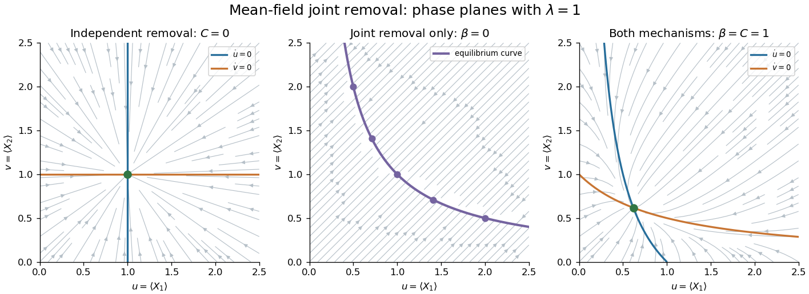

<h1 id="3/b/solution">Solution</h1>

↑ **Parent:** [B](../b.md)

Use the approximate [reaction-rate equations](../../../../../../rate-equation.md) from part (a), with axes $u=\mu_1$ and $v=\mu_2$. In every case the positive quadrant is forward invariant, since the drift on either zero-concentration axis points inward. The [nullclines](../../../../../../nullcline.md) specify the arrow signs: right if $\lambda>u(\beta+Cv)$, left if the inequality is reversed; up if $\lambda>v(\beta+Cu)$, down otherwise.

For $C=0$ and $\beta>0$, the [nullclines](../../../../../../nullcline.md) are the vertical line $u=\lambda/\beta$ and the horizontal line $v=\lambda/\beta$. The two components relax independently:

$$
u(t)=\frac\lambda\beta+\left(u(0)-\frac\lambda\beta\right)e^{-\beta t},\qquad
v(t)=\frac\lambda\beta+\left(v(0)-\frac\lambda\beta\right)e^{-\beta t}.
$$

Every nonstationary trajectory is a straight ray towards **the unique stable equilibrium $(\lambda/\beta,\lambda/\beta)$**, whose [Jacobian matrix](../../../../../../jacobian-matrix.md) is $-\beta I$.

For $\beta=0$ and $C>0$, both derivatives equal $\lambda-Cuv$, so the two [nullclines](../../../../../../nullcline.md) coincide on

$$
\boxed{uv=\lambda/C.}
$$

Every point of this hyperbola is an equilibrium. The difference $u-v=d$ is conserved, and trajectories therefore run along straight lines of slope one. Below the hyperbola they point up and right; above it they point down and left. Each such line converges to its own intersection with the hyperbola,

$$
u_* =\frac{d+\sqrt{d^2+4\lambda/C}}2,\qquad
v_* =\frac{-d+\sqrt{d^2+4\lambda/C}}2.
$$

At this point the [Jacobian matrix](../../../../../../jacobian-matrix.md) is $-C\begin{pmatrix}v_*&u_*\\v_*&u_*\end{pmatrix}$, with eigenvalues $0$ and $-C(u_*+v_*)$. Thus **the equilibrium curve attracts transversely but has no restoring drift along its tangent**. Its points are not individually asymptotically stable, because arbitrarily close initial states on different constant-difference lines converge to different equilibria.

For $\beta>0$ and $C>0$, the [nullclines](../../../../../../nullcline.md) are the decreasing curves $u=\lambda/(\beta+Cv)$ and $v=\lambda/(\beta+Cu)$, reflected in the diagonal. At an intersection, subtracting the two stationary equations gives $u=v=\mu$. Hence there is exactly one intersection, where

$$
\boxed{\mu=\frac{\sqrt{\beta^2+4C\lambda}-\beta}{2C}
=\frac{2\lambda}{\beta+\sqrt{\beta^2+4C\lambda}}.}
$$

The [Jacobian matrix](../../../../../../jacobian-matrix.md) at this point is

$$
A=-\begin{pmatrix}\beta+C\mu&C\mu\\C\mu&\beta+C\mu\end{pmatrix}.
$$

Its symmetric eigenvector $(1,1)$ has eigenvalue $-(\beta+2C\mu)$, and the antisymmetric eigenvector $(1,-1)$ has eigenvalue $-\beta$. Both are negative, so **the symmetric equilibrium is a stable node**. All trajectories are bounded because each component above $\lambda/\beta$ decreases. The divergence $-2\beta-C(u+v)<0$ excludes periodic orbits by the [Bendixson-Dulac criterion](../../../../../../bendixson-dulac-theorem.md), and the unique interior equilibrium attracts the positive-quadrant trajectories. As $\beta$ becomes small, the drift restoring the difference becomes slow, so paths first approach the near-hyperbolic nullclines and then drift towards the symmetric intersection. These sketches show the three cases printed in the PDF; the middle case is $\beta=0$, not the different cases introduced by the converted TeX.

**[Figure 2](#3/b/image-mean-field-phase-planes-with-independent-removal-exclusive-joint-removal-and-both-removal-mechanisms). Mean-field phase planes with independent removal, exclusive joint removal, and both removal mechanisms**.

## ↑ Ancestors (11)

1. [B](../b.md)
2. [3](../../3.md)
3. [Paper 74](../../../paper-74-split.md)
4. [Iii](../../../split.md)
5. [2007](../../../../split.md)
6. [Past exam of the mathematics course of the University of Cambridge](../../../../../split.md)
7. [Mathematics course of the University of Cambridge](../../../../../../mathematics-course-of-the-university-of-cambridge.md)
8. [Course of the University of Cambridge](../../../../../../course-of-the-university-of-cambridge.md)
9. [University of Cambridge](../../../../../../university-of-cambridge-split.md)
10. [List of universities](../../../../../../list-of-universities.md)
11. [Codex Wiki](../../../../../../split.md)
