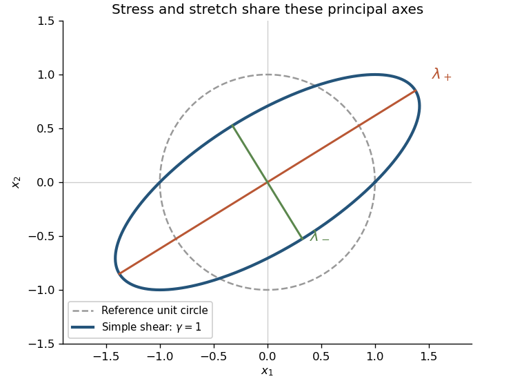

<h1 id="1/solution">Solution</h1>

↑ **Parent:** [1](../1.md)

Use both [material isotropy](../../../../../material-isotropy.md) and [material frame indifference](../../../../../material-frame-indifference.md). The [polar decomposition in continuum mechanics](../../../../../polar-decomposition-in-continuum-mechanics.md) writes $F=VR$, where $V$ is the [left stretch tensor](../../../../../left-stretch-tensor.md). Isotropy removes the reference rotation: $\sigma(F)=\sigma(V)$. Choose an [orthonormal eigenbasis](../../../../../orthonormal-eigenbasis.md) of $V$. A half-turn about any principal axis leaves $V$ fixed but reverses appropriate off-diagonal entries of $\sigma(V)$. Frame indifference therefore makes those entries zero. If a [principal stretch](../../../../../principal-stretch.md) is repeated, rotations in its [eigenspace](../../../../../eigenspace.md) additionally force the stress to be isotropic there. Thus the [principal stresses](../../../../../principal-stress.md) share the stretch axes: this proves [coaxiality of isotropic elastic stress](../../../../../coaxiality-of-isotropic-elastic-stress.md) with $V$ and with $B=V^2=FF^T$.

For [simple shear](../../../../../simple-shear.md), the [left Cauchy-Green deformation tensor](../../../../../left-cauchy-green-deformation-tensor.md) is

$$
B=\begin{pmatrix}1+\gamma^2&\gamma\\\gamma&1\end{pmatrix}.
$$

Its principal axes make an angle $\vartheta$ with the coordinate axes satisfying $2\cot(2\vartheta)=\gamma$ when $\gamma\ne0$. If the two [principal stresses](../../../../../principal-stress.md) are $s_1,s_2$, rotating their diagonal matrix back gives

$$
\sigma_{11}-\sigma_{22}=(s_1-s_2)\cos2\vartheta,\qquad \sigma_{12}=\frac{s_1-s_2}{2}\sin2\vartheta.
$$

Consequently the [universal simple-shear normal-stress identity](../../../../../universal-simple-shear-normal-stress-identity.md) is

$$
\boxed{\sigma_{11}-\sigma_{22}=\gamma\sigma_{12}.}
$$

Equivalently, it follows immediately from the off-diagonal entry of $\sigma B-B\sigma=0$. At $\gamma=0$, the undeformed material has isotropic stress, so the identity holds there too. No particular elastic [constitutive equation](../../../../../constitutive-equation.md) has been used.

**[Figure 1](#1/image-principal-stress-and-stretch-axes-of-an-isotropic-elastic-material-under-simple-shear). Principal stress and stretch axes of an isotropic elastic material under simple shear**.

## ↑ Ancestors (10)

1. [1](../1.md)
2. [Paper 76](../../paper-76-split.md)
3. [Iii](../../split.md)
4. [2007](../../../split.md)
5. [Past exam of the mathematics course of the University of Cambridge](../../../../split.md)
6. [Mathematics course of the University of Cambridge](../../../../../mathematics-course-of-the-university-of-cambridge.md)
7. [Course of the University of Cambridge](../../../../../course-of-the-university-of-cambridge.md)
8. [University of Cambridge](../../../../../university-of-cambridge-split.md)
9. [List of universities](../../../../../list-of-universities.md)
10. [Codex Wiki](../../../../../split.md)
