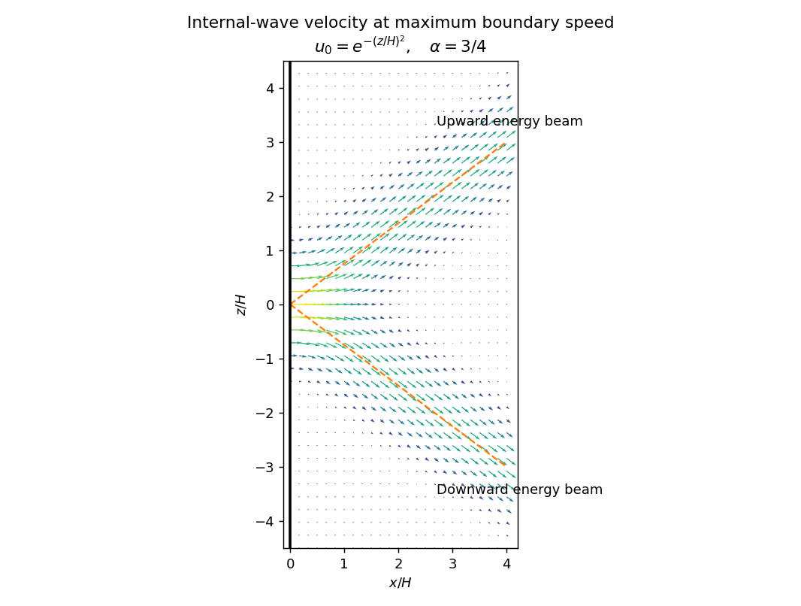

<h1 id="1/solution">Solution</h1>

↑ **Parent:** [1](../1.md)

In the [Boussinesq approximation](../../../../../boussinesq-approximation.md), [density](../../../../../density.md) departures from a constant reference [density](../../../../../density.md) $\rho_0$ are small enough to neglect in inertia and mass continuity, but their gravitational effect is retained. Write the total [buoyancy](../../../../../buoyancy.md) acceleration as $b=-g(\rho-\rho_0)/\rho_0$, choose a hydrostatic background $\bar b(z)$, and set $\sigma=b-\bar b$. Thus $\sigma$ is the [buoyancy perturbation](../../../../../buoyancy-perturbation.md), positive for a parcel lighter than the background at its present height. The squared [buoyancy frequency](../../../../../buoyancy-frequency.md) is

$$
N^2(z)=\bar b_z=-\frac{g}{\rho_0}\bar\rho_z.
$$

Stable stratification has $N^2>0$. A small vertical displacement $\xi$ of a parcel conserving its [buoyancy](../../../../../buoyancy.md) gives $\sigma=-N^2\xi$, explaining the restoring acceleration and the name of $N$.

Let $P=p'/\rho_0$ be [pressure](../../../../../pressure.md) with the background [hydrostatic pressure](../../../../../hydrostatic-pressure.md) removed, $\boldsymbol u=(u,v,w)$, and $D/Dt=\partial_t+\boldsymbol u\cdot\nabla$ the [material derivative](../../../../../material-derivative.md). The ideal, nonrotating [Boussinesq equations](../../../../../boussinesq-equations.md) are

$$
\boxed{\frac{D\boldsymbol u}{Dt}=-\nabla P+\sigma\hat{\boldsymbol z},\qquad \nabla\cdot\boldsymbol u=0,\qquad \frac{D\sigma}{Dt}+N^2(z)w=0.}
$$

The last equation is equivalent to $Db/Dt=0$. There is neither viscosity nor [buoyancy](../../../../../buoyancy.md) diffusion. The reference [density](../../../../../density.md) occurs in the [pressure](../../../../../pressure.md) normalization, while the small [density](../../../../../density.md) anomaly occurs only through [buoyancy](../../../../../buoyancy.md).

For the two-dimensional disturbance, [linearization](../../../../../linearization.md) about rest gives

$$
u_t=-P_x,\qquad w_t=-P_z+\sigma,\qquad \sigma_t+N^2w=0,\qquad u_x+w_z=0.
$$

A [plane internal gravity wave](../../../../../plane-internal-gravity-wave.md) proportional to $e^{i(kx+mz-\omega t)}$ therefore satisfies

$$
w=-\frac{k}{m}u,\qquad P=\frac{\omega}{k}u,\qquad \sigma=-\frac{iN^2}{\omega}w,\qquad \boxed{\omega^2=\frac{N^2k^2}{k^2+m^2}.}
$$

These [internal-wave polarization](../../../../../internal-wave-polarization.md) relations and the [dispersion relation](../../../../../dispersion-relation.md) determine the individual responses in parts i and ii. A radiating response has no incoming [internal gravity wave](../../../../../internal-wave.md) from $x=+\infty$; an evanescent response is bounded there. The harmonic solutions describe the response after excluding arbitrary initial transients.

For the localized oscillatory boundary, define $\alpha=\omega/\sqrt{N^2-\omega^2}$ and $I(z)=\epsilon\int_0^\infty\hat u_0(m)e^{imz}\,dm=f(z)+ig(z)$. Both signs of vertical [wavenumber](../../../../../wavenumber.md) must radiate into $x>0$. Their horizontal [wavenumber](../../../../../wavenumber.md) is $k=\alpha|m|$, so the positive-$m$ contribution involves $Z_1=z+\alpha x$ and the negative-$m$ contribution involves $Z_2=z-\alpha x$. Consequently the complex horizontal [velocity](../../../../../velocity.md) is

$$
u_{\mathrm c}=e^{-i\omega t}\bigl(I(Z_1)+I(Z_2)^*\bigr).
$$

Taking its real part proves

$$
\boxed{u=(f(Z_1)+f(Z_2))\cos\omega t+(g(Z_1)-g(Z_2))\sin\omega t.}
$$

The positive-$m$ [internal-wave polarization](../../../../../internal-wave-polarization.md) has $w=-\alpha u$ and the negative-$m$ one has $w=+\alpha u$. Hence

$$
w=\alpha\bigl((f(Z_2)-f(Z_1))\cos\omega t-(g(Z_1)+g(Z_2))\sin\omega t\bigr).
$$

In particular, $2f(z)=\epsilon u_0(z)$, so the [boundary condition](../../../../../boundary-condition.md) is recovered exactly. This is [two-beam radiation from a localized oscillating boundary](../../../../../two-beam-radiation-from-a-localized-oscillating-boundary.md).

Take a smooth localized profile, for example $u_0(z)=e^{-z^2/H^2}$. Its effective support is a neighbourhood of width a few $H$; increasing that neighbourhood makes the tails arbitrarily small. The boundary displacement is $\epsilon u_0(z)\sin\omega t/\omega$ to first order, so at $t=0$ it is flat and moving at maximum speed. At that instant,

$$
(u,w)=\bigl(f(Z_1)+f(Z_2),\ \alpha(f(Z_2)-f(Z_1))\bigr),\qquad f(z)=\frac{\epsilon}{2}e^{-z^2/H^2}.
$$

There are two narrow oblique beams centered on $z=-\alpha x$ and $z=+\alpha x$. Away from their overlap, the [velocity](../../../../../velocity.md) is parallel to the relevant beam, in the directions $(1,-\alpha)$ and $(1,+\alpha)$. The figure uses $\alpha=3/4$ and measures velocities in units of $\epsilon$.

**[Figure 1](#1/image-velocity-in-two-internal-wave-beams-when-the-oscillating-boundary-is-flat-and-moving-fastest). Velocity in two internal-wave beams when the oscillating boundary is flat and moving fastest**.

At other phases the $g$ terms contribute. For the positive-frequency convention above, $g$ is the [Hilbert transform](../../../../../hilbert-transform.md) of $f$; it generally has longer tails than $f$. Thus even when the boundary is nearly stationary, the interior need not be stationary or confined to the bright cores shown here. Half a period later all velocities reverse. The beam directions remain the same, but the instantaneous [velocity](../../../../../velocity.md) profile and its quadrature component change.

A short pulse has a broad [frequency](../../../../../frequency.md) spectrum. Frequencies below $N$ produce outgoing [internal gravity wave](../../../../../internal-wave.md) packets with frequency-dependent ray slopes $\pm\omega/\sqrt{N^2-\omega^2}$; frequencies above $N$ contribute an evanescent near-boundary response. Moreover the [group velocity](../../../../../group-velocity.md) depends on [wavelength](../../../../../wavelength.md) as well as direction. The radiated packet therefore spreads into a dispersive fan or wake, with different frequencies traveling at different angles and different scales separating along those directions. After the forcing ends the propagating packet travels away, rather than maintaining the two permanently driven monochromatic beams.

## ↑ Ancestors (10)

1. [1](../1.md)
2. [Paper 77](../../paper-77-split.md)
3. [Iii](../../split.md)
4. [2007](../../../split.md)
5. [Past exam of the mathematics course of the University of Cambridge](../../../../split.md)
6. [Mathematics course of the University of Cambridge](../../../../../mathematics-course-of-the-university-of-cambridge.md)
7. [Course of the University of Cambridge](../../../../../course-of-the-university-of-cambridge.md)
8. [University of Cambridge](../../../../../university-of-cambridge-split.md)
9. [List of universities](../../../../../list-of-universities.md)
10. [Codex Wiki](../../../../../split.md)
