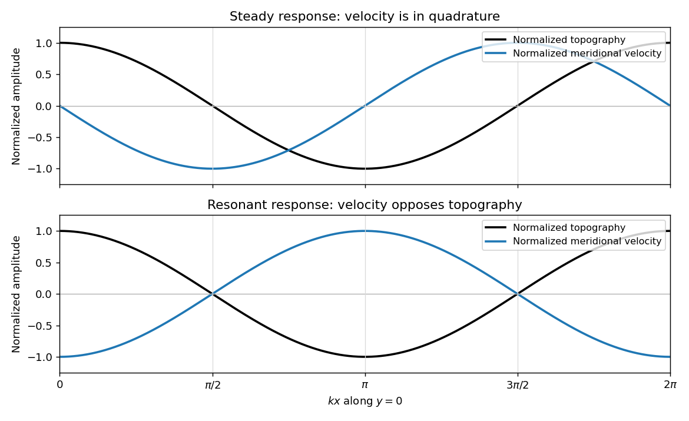

<h1 id="4/solution">Solution</h1>

↑ **Parent:** [4](../4.md)

Define the [quasi-geostrophic streamfunction](../../../../../quasi-geostrophic-streamfunction.md) by $p'/\rho_0=f_0\psi$. Leading horizontal [geostrophic balance](../../../../../geostrophic-balance.md), $f_0\hat{\boldsymbol z}\times\boldsymbol u_g=-\nabla_HP$, gives $(u_g,v_g)=(-\psi_y,\psi_x)$. The [hydrostatic approximation](../../../../../hydrostatic-approximation.md) gives $P_z=\sigma$, hence

$$
\boxed{\sigma=f_0\psi_z,\qquad D_g=\partial_t-\psi_y\partial_x+\psi_x\partial_y.}
$$

Thus $D_g$ is the [material derivative](../../../../../material-derivative.md) along the leading [geostrophic flow](../../../../../geostrophic-flow.md), and the vertical derivative of [pressure](../../../../../pressure.md) determines the [buoyancy perturbation](../../../../../buoyancy-perturbation.md). This also gives [thermal wind](../../../../../thermal-wind.md): $u_{gz}=-\sigma_y/f_0$ and $v_{gz}=\sigma_x/f_0$.

The balanced regime is favored by small [Rossby number](../../../../../rossby-number.md), a shallow aspect ratio, and a [Burger number](../../../../../burger-number.md) $N^2H^2/(f_0^2L^2)$ of order one. Equivalently the stratified [Froude number](../../../../../froude-number.md) $U/(NH)=\mathrm{Ro}/\sqrt{\mathrm{Bu}}$ is small. On a [beta plane](../../../../../beta-plane.md), require $\beta L/|f_0|=O(\mathrm{Ro})$, and take slow, initially balanced motion away from the equator. Under the [traditional approximation](../../../../../traditional-approximation-geophysical-fluid-dynamics.md), the horizontal [Coriolis force](../../../../../coriolis-force.md) generated by vertical [velocity](../../../../../velocity.md) is small because vertical [velocity](../../../../../velocity.md) is small, while the vertical rotational force is small compared with the leading [hydrostatic pressure](../../../../../hydrostatic-pressure.md) and gravity terms. Strong stratification and small aspect ratio justify retaining only the vertical component of Earth's rotation in this regime; this argument is not uniform near the equator.

Put $A(z)=f_0^2/N^2(z)$. The [buoyancy](../../../../../buoyancy.md) equation gives $w=-f_0D_g\psi_z/N^2$. Substitution into the vertical [vorticity equation](../../../../../vorticity-equation.md) yields

$$
D_g\nabla_H^2\psi+\beta\psi_x=-\partial_z(A D_g\psi_z).
$$

There is an important commutator cancellation. With $J_{xy}(a,b)=a_xb_y-a_yb_x$,

$$
\partial_z(A D_g\psi_z)=D_g\partial_z(A\psi_z)+A J_{xy}(\psi_z,\psi_z)=D_g\partial_z(A\psi_z).
$$

Also $D_gf=\beta\psi_x$ for $f=f_0+\beta y$. Adding terms therefore proves [potential-vorticity conservation](../../../../../potential-vorticity-conservation.md):

$$
\boxed{D_gQ=0,\qquad Q=f+\nabla_H^2\psi+\partial_z\left(\frac{f_0^2}{N^2}\psi_z\right).}
$$

This is the [three-dimensional quasi-geostrophic potential vorticity](../../../../../three-dimensional-quasi-geostrophic-potential-vorticity.md).

At an impermeable stationary lower boundary $z=b(x,y)$, the kinematic condition is $w=\boldsymbol u_H\cdot\nabla_Hb=D_gb$. For small elevation and slope, evaluate this at the reference level $z=0$ to leading order. Combining it with the [buoyancy](../../../../../buoyancy.md) equation gives the [rigid-boundary buoyancy condition for quasi-geostrophic waves](../../../../../rigid-boundary-buoyancy-condition-for-quasi-geostrophic-waves.md)

$$
\boxed{D_g\left(\frac{f_0}{N^2}\psi_z+b\right)=0\quad\text{at }z=0.}
$$

The quantity in parentheses is the boundary displacement plus its buoyancy-equivalent displacement.

Now take constant $N,f$ and the mean [quasi-geostrophic streamfunction](../../../../../quasi-geostrophic-streamfunction.md) $\bar\psi=-(U_0+\Lambda z)y$. Its mean [buoyancy perturbation](../../../../../buoyancy-perturbation.md) is $-f\Lambda y$, consistent with [thermal wind](../../../../../thermal-wind.md), and its interior [potential vorticity](../../../../../potential-vorticity.md) is constant. In the [boundary condition](../../../../../boundary-condition.md), the perturbation [velocity](../../../../../velocity.md) $v'=\psi'_x$ advects the mean boundary [buoyancy](../../../../../buoyancy.md) gradient. Keeping this contribution gives

$$
\boxed{(\partial_t+U_0\partial_x)\psi'_z-\Lambda\psi'_x+\frac{N^2U_0}{f}b_x=0\quad\text{at }z=0.}
$$

In particular the $-\Lambda\psi'_x$ term must not be omitted.

The linear interior [potential-vorticity equation](../../../../../potential-vorticity-evolution-equation.md) is $(\partial_t+U(z)\partial_x)Q'=0$. Starting with zero interior perturbation [potential vorticity](../../../../../potential-vorticity.md), and with forcing only through the boundary, it remains zero. For a steady solution this is also the regular zero-interior-PV choice, continued through any isolated zero of $U$. The inversion equation for a horizontal mode is

$$
\psi'_{zz}-K^2\psi'=0,\qquad K=\frac{N\sqrt{k^2+\ell^2}}{f}>0.
$$

The printed convention $K>0$ takes $f>0$; for either hemisphere the decay rate is defined using $|f|$. Boundedness aloft selects the decaying mode. Write

$$
\psi'=A(t)\cos(\ell y)e^{ikx}e^{-Kz}
$$

with real part understood. The linear [boundary condition](../../../../../boundary-condition.md) becomes

$$
\boxed{A'+ik\left(U_0+\frac{\Lambda}{K}\right)A=\frac{ik\epsilon N^2U_0}{Kf}.}
$$

For $KU_0+\Lambda\ne0$, a steady [quasi-geostrophic mountain wave](../../../../../quasi-geostrophic-mountain-wave.md) is therefore

$$
\boxed{\psi'_{\mathrm s}=\frac{\epsilon N^2U_0}{f(KU_0+\Lambda)}\cos(\ell y)e^{-Kz}e^{ikx}.}
$$

On $y=0$, its real meridional [velocity](../../../../../velocity.md) is

$$
v'_{\mathrm s}=-\frac{k\epsilon N^2U_0}{f(KU_0+\Lambda)}e^{-Kz}\sin(kx),\qquad b(x,0)=\epsilon\cos(kx).
$$

For the positive-parameter convention $k,\epsilon,f,U_0>0$ and $KU_0+\Lambda>0$, the [velocity](../../../../../velocity.md) minimum lies one quarter [wavelength](../../../../../wavelength.md) downstream of each topographic maximum; its maximum lies one quarter [wavelength](../../../../../wavelength.md) downstream of each topographic minimum. If the [velocity](../../../../../velocity.md) prefactor changes sign, maxima and minima interchange. The condition $KU_0+\Lambda>0$ alone does not fix that prefactor if $U_0$ is allowed to be negative. The upper panel shows the positive-current convention.

**[Figure 2](#4/image-meridional-velocity-relative-to-topography-for-a-steady-mountain-wave-and-a-resonantly-growing-edge-wave). Meridional velocity relative to topography for a steady mountain wave and a resonantly growing edge wave**.

At $KU_0+\Lambda=0$, the free boundary [Eady edge wave](../../../../../eady-edge-wave.md) has zero [frequency](../../../../../frequency.md) in the ground frame. If $k\epsilon U_0\ne0$, a steady amplitude cannot satisfy the forced amplitude equation. With $A(0)=0$, integration gives

$$
\boxed{A(t)=\frac{ik\epsilon N^2U_0}{Kf}t,\qquad \psi'(t)=\frac{ik\epsilon N^2U_0}{Kf}t\cos(\ell y)e^{-Kz}e^{ikx}.}
$$

Consequently

$$
\boxed{\psi'_t=\frac{ik\epsilon N^2U_0}{Kf}\cos(\ell y)e^{-Kz}e^{ikx}.}
$$

The symbol multiplying $i$ here is the horizontal [wavenumber](../../../../../wavenumber.md) $k$, as in the PDF. Taking the real part and differentiating in $x$ gives

$$
\psi'_{\mathrm{real}}=-\frac{k\epsilon N^2U_0t}{Kf}\cos(\ell y)e^{-Kz}\sin(kx),\qquad v'=-\frac{k^2\epsilon N^2U_0t}{Kf}\cos(\ell y)e^{-Kz}\cos(kx).
$$

For $U_0=-\Lambda/K>0$, positive $\epsilon,f$, and $t>0$, **the meridional-velocity minima coincide with topographic maxima, and its maxima with topographic minima**. This is the lower panel. The change from quadrature to opposition is the [phase of a resonantly forced topographic edge wave](../../../../../phase-of-a-resonantly-forced-topographic-edge-wave.md).

The stationary relief continuously excites a boundary [Rossby wave](../../../../../rossby-wave.md) whose intrinsic propagation exactly cancels mean [advection](../../../../../advection.md). The forcing therefore remains coherent with that wave; with no damping or radiation loss for this trapped mode, its linear amplitude grows secularly. This is a [resonant topographic quasi-geostrophic wave](../../../../../resonant-topographic-quasi-geostrophic-wave.md). Unlimited growth is a conclusion of the linear idealization: eventually the small-disturbance approximation fails.

The assertion that resonance must be unsteady needs **nonzero forcing**. If $k=0$, then $b_x=0$ and the boundary current does not cross the relief; if $U_0=0$, the forcing also vanishes. In either case the zero disturbance is a steady solution even if $KU_0+\Lambda=0$. For example, choose $k=0$, $\ell\ne0$, and $\Lambda=-KU_0$; this is a concrete exception to an unconditional resonance claim. When both horizontal [wavenumbers](../../../../../wavenumber.md) vanish, $K=0$ and the stated decaying-wave ansatz itself does not apply.

## ↑ Ancestors (10)

1. [4](../4.md)
2. [Paper 77](../../paper-77-split.md)
3. [Iii](../../split.md)
4. [2007](../../../split.md)
5. [Past exam of the mathematics course of the University of Cambridge](../../../../split.md)
6. [Mathematics course of the University of Cambridge](../../../../../mathematics-course-of-the-university-of-cambridge.md)
7. [Course of the University of Cambridge](../../../../../course-of-the-university-of-cambridge.md)
8. [University of Cambridge](../../../../../university-of-cambridge-split.md)
9. [List of universities](../../../../../list-of-universities.md)
10. [Codex Wiki](../../../../../split.md)
