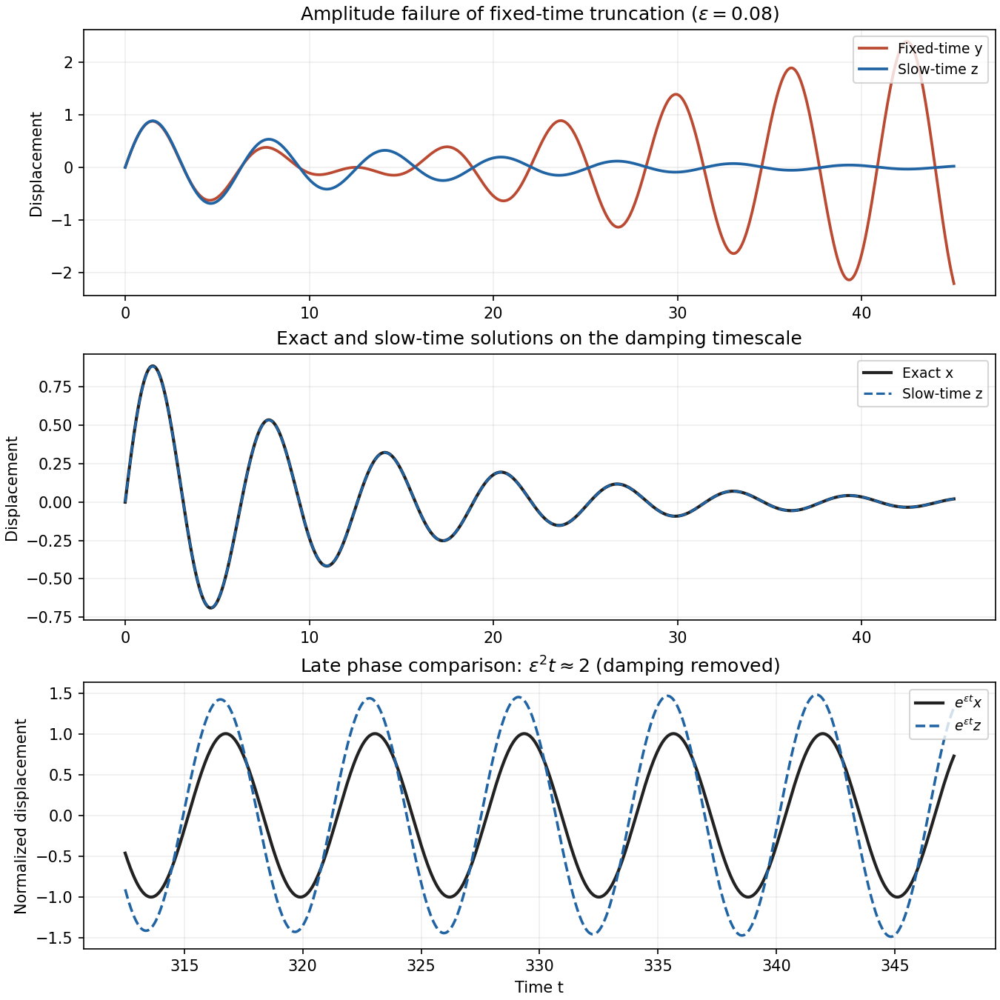

<h1 id="2/b/solution">Solution</h1>

↑ **Parent:** [B](../b.md)

Retain the exact damping factor and expand only the slowly accumulating phase. With $T=\epsilon t$ bounded,

$$
\omega t=t-\tfrac12\epsilon^2t+O(\epsilon^4t),\qquad
\frac{\sin(\omega t)}\omega=\sin t-\tfrac12\epsilon^2t\cos t+O(\epsilon^2).
$$

The resulting [two-time expansion of a weakly damped linear oscillator](../../../../../../two-time-expansion-of-a-weakly-damped-linear-oscillator.md) is

$$
\boxed{z(\epsilon,t)=e^{-\epsilon t}\left(\sin t-\frac{\epsilon^2t}{2}\cos t\right),\qquad x-z=O(\epsilon^2)\quad(\epsilon t=O(1)).}
$$

In slow-time notation the second term in parentheses is $-\epsilon T\cos t/2$, an order-$\epsilon$ correction. Simply retaining $e^{-\epsilon t}\sin t$ would have order-$\epsilon$ rather than order-$\epsilon^2$ error on this scale, and would not meet the requested accuracy.

When $\epsilon^2t=O(1)$, the phase shift is order one: Taylor-expanding its sine and cosine is no longer an ordered asymptotic expansion of the oscillatory factor. The exact solution and $z$ acquire visibly different phases after removing their common exponential damping. In contrast, for $\epsilon t=O(1)$ the main difference between $y$ and $z$ is their amplitude envelope: $1-\epsilon t$ versus $e^{-\epsilon t}$.

**[Figure 2](#2/b/image-fixed-time-and-slow-time-linear-oscillator-approximations-with-a-damping-normalized-late-time-phase-comparison). Fixed-time and slow-time linear oscillator approximations, with a damping-normalized late-time phase comparison**.

**The phrase “not valid” on the later scale needs an error convention.** For fixed positive damping, the absolute displacement of both $x$ and $z$ is exponentially small when $\epsilon^2t$ is a positive order-one number. Indeed Taylor's theorem gives, for small positive $\epsilon$,

$$
|x-z|\le C e^{-\epsilon t}\left(\epsilon^2+\epsilon^4t+\epsilon^4t^2\right).
$$

The supremum of the right side over $t\ge0$ is $O(\epsilon^2)$. Thus $z$ loses phase accuracy on $t=O(\epsilon^{-2})$, but does not lose an absolute $O(\epsilon^2)$ error bound there. The last plot displays $e^{\epsilon t}x$ and $e^{\epsilon t}z$ to show that phase failure honestly; multiplying by the damping factor would make the difference extremely small. Relative pointwise error also becomes singular near zeros, so accuracy of the oscillatory factor is the meaningful late-time comparison.

## ↑ Ancestors (11)

1. [B](../b.md)
2. [2](../../2.md)
3. [Paper 79](../../../paper-79-split.md)
4. [Iii](../../../split.md)
5. [2007](../../../../split.md)
6. [Past exam of the mathematics course of the University of Cambridge](../../../../../split.md)
7. [Mathematics course of the University of Cambridge](../../../../../../mathematics-course-of-the-university-of-cambridge.md)
8. [Course of the University of Cambridge](../../../../../../course-of-the-university-of-cambridge.md)
9. [University of Cambridge](../../../../../../university-of-cambridge-split.md)
10. [List of universities](../../../../../../list-of-universities.md)
11. [Codex Wiki](../../../../../../split.md)
