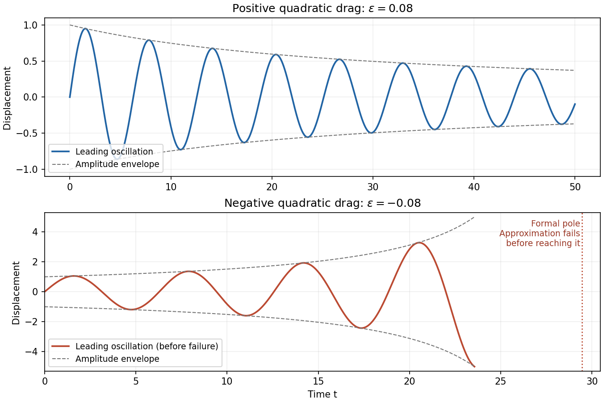

<h1 id="2/solution">Solution</h1>

↑ **Parent:** [2](../2.md)

The linear [damped harmonic oscillator](../../../../../damped-harmonic-oscillator.md) has characteristic exponents $-\epsilon\pm i\sqrt{1-\epsilon^2}$. Imposing both initial conditions gives, for $|\epsilon|<1$,

$$
\boxed{x(t)=e^{-\epsilon t}\frac{\sin(\omega t)}\omega,\qquad\omega=\sqrt{1-\epsilon^2}.}
$$

For completeness, at $|\epsilon|=1$ its continuous limiting form is $te^{-\epsilon t}$; for $|\epsilon|>1$ replace $\sin(\omega t)/\omega$ by $\sinh(\sqrt{\epsilon^2-1}\,t)/\sqrt{\epsilon^2-1}$. The initial derivative is one, as the original PDF specifies; the converted TeX loses this derivative and corrupts the time derivatives in both oscillator equations.

The separate nonlinear oscillator has [quadratic drag](../../../../../quadratic-drag.md). Introduce the [slow time](../../../../../slow-time.md) $T=\epsilon t$ and use the [method of multiple scales](../../../../../method-of-multiple-scales.md),

$$
x=x_0(t,T)+\epsilon x_1(t,T)+\cdots,\qquad x_0=A(T)\sin(t+\phi(T)).
$$

The order-$\epsilon$ equation is

$$
(\partial_t^2+1)x_1=-2\partial_t\partial_Tx_0-|\partial_tx_0|\partial_tx_0.
$$

For positive amplitude, write $\vartheta=t+\phi$. Its right side is $-2A_T\cos\vartheta+2A\phi_T\sin\vartheta-A^2|\cos\vartheta|\cos\vartheta$. The cosine coefficient of the last angular function is

$$
\frac1\pi\int_0^{2\pi}|\cos\vartheta|\cos^2\vartheta\,d\vartheta=\frac8{3\pi},
$$

while its sine coefficient is zero. The [solvability condition in the method of multiple scales](../../../../../solvability-condition-in-the-method-of-multiple-scales.md) removes the resonant harmonics, giving

$$
A_T=-\frac4{3\pi}A^2,\qquad\phi_T=0.
$$

The leading initial conditions select $A(0)=1$, $\phi(0)=0$. Therefore the [quadratically damped oscillator](../../../../../quadratically-damped-oscillator.md) has

$$
\boxed{x(t)\simeq\frac{\sin t}{1+4\epsilon t/(3\pi)}.}
$$

The same sign follows from the exact energy balance $d[(\dot x^2+x^2)/2]/dt=-\epsilon|\dot x|^3$. Averaging $|\cos\vartheta|^3$ gives $4/(3\pi)$, consistent with the amplitude equation.

**[Figure 1](#2/image-leading-multiple-scales-oscillations-with-positive-quadratic-drag-and-negative-quadratic-drag). Leading multiple-scales oscillations with positive quadratic drag and negative quadratic drag**.

For $\epsilon>0$, the amplitude decays algebraically and stays at most one. On each fixed interval $0\le\epsilon t\le T_*$, the omitted displacement correction is **$O(\epsilon)$**, so this approximation is valid through times of order $\epsilon^{-1}$. The effective drag strength $\epsilon A$ decreases rather than increases, and the envelope predicts $A\sim3\pi/(4\epsilon t)$ at later times. There is no finite-time pole in the positive-drag approximation. A uniform error assertion for arbitrarily long intervals is stronger than the finite-slow-time expansion just derived; the stated $O(\epsilon)$ estimate applies to the specified $\epsilon t=O(1)$ range.

For $\epsilon<0$, write $\delta=1-4|\epsilon|t/(3\pi)$. The amplitude grows as $1/\delta$, with a formal pole at

$$
t_*=\frac{3\pi}{4|\epsilon|}.
$$

On fixed slow-time intervals strictly before that pole, the displacement error remains **$O(|\epsilon|)$**. This estimate is not uniform as $\delta\to0$: nonresonant corrections have size comparable to $|\epsilon|A^2$, and the required weak-drag condition is $|\epsilon|A=|\epsilon|/\delta\ll1$. Thus the approximation necessarily fails when $\delta=O(|\epsilon|)$, corresponding to a distance of order one in fast time from the formal pole, and may require additional error control when approaching it. The plot therefore stops short of the pole. Its position is a prediction of the leading amplitude equation, not an exact blow-up time for the original nonlinear equation; continuing the formula past it is invalid.

## ↑ Ancestors (10)

1. [2](../2.md)
2. [Paper 79](../../paper-79-split.md)
3. [Iii](../../split.md)
4. [2007](../../../split.md)
5. [Past exam of the mathematics course of the University of Cambridge](../../../../split.md)
6. [Mathematics course of the University of Cambridge](../../../../../mathematics-course-of-the-university-of-cambridge.md)
7. [Course of the University of Cambridge](../../../../../course-of-the-university-of-cambridge.md)
8. [University of Cambridge](../../../../../university-of-cambridge-split.md)
9. [List of universities](../../../../../list-of-universities.md)
10. [Codex Wiki](../../../../../split.md)
