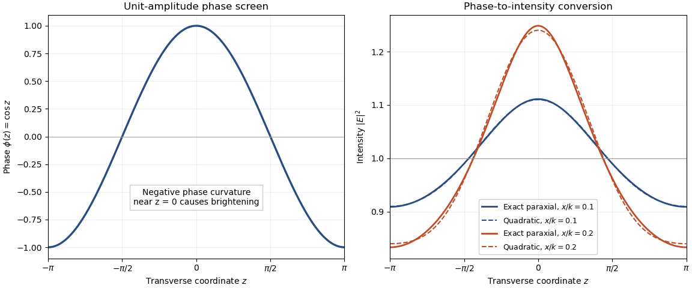

# Paper 80

↑ **Parent:** [Iii](../iii.md)

[https://www.maths.cam.ac.uk/postgrad/part-iii/files/pastpapers/2007/Paper80.pdf](https://www.maths.cam.ac.uk/postgrad/part-iii/files/pastpapers/2007/Paper80.pdf)

**Table of contents**

- [1](#1)
  - [a](#1/a)
    - [Solution](#1/a/solution)
  - [b](#1/b)
    - [Solution](#1/b/solution)
- [2](#2)
  - [a](#2/a)
    - [Solution](#2/a/solution)
  - [b](#2/b)
    - [Solution](#2/b/solution)
  - [c](#2/c)
    - [Solution](#2/c/solution)
- [3](#3)
  - [a](#3/a)
    - [Solution](#3/a/solution)
  - [b](#3/b)
    - [i](#3/b/i)
      - [Solution](#3/b/i/solution)
    - [ii](#3/b/ii)
      - [Solution](#3/b/ii/solution)
  - [c](#3/c)
    - [Solution](#3/c/solution)
- [4](#4)
  - [a](#4/a)
    - [Solution](#4/a/solution)
  - [b](#4/b)
    - [i](#4/b/i)
      - [Solution](#4/b/i/solution)
    - [ii](#4/b/ii)
      - [Solution](#4/b/ii/solution)
  - [c](#4/c)
    - [Solution](#4/c/solution)

## 1

↑ **Parent:** [Paper 80](paper-80.md)

<h3 id="1/a">a</h3>

↑ **Parent:** [1](#1)

<h4 id="1/a/solution">Solution</h4>

↑ **Parent:** [A](#1/a)

Use time dependence $e^{-i\omega t}$, positive [wavenumber](../../../wave-equation.md#wavenumber) $k$ and [aperture](../../../optics.md#aperture) normal $\mathbf n=\mathbf e_x$. Write $F(y',z')=E_{{\rm inc},y}(0,y',z')$ on the [aperture](../../../optics.md#aperture) and extend $F$ by zero outside it. Define

$$
\widehat F(\nu,\eta)=\int_A F(y',z')e^{-i(\nu y'+\eta z')}\,dy'\,dz',\qquad
\kappa=\sqrt{k^2-\nu^2-\eta^2},\qquad \mathbf q=(\kappa,\nu,\eta).
$$

The outgoing branch has $\kappa\ge0$ for propagating components and $\operatorname{Im}\kappa>0$ for [evanescent](../../../continuum-mechanics.md#evanescent-wave) components.

Fix the [Green function](../../../analysis.md#green-s-function) normalization by $G_0(\mathbf r)=e^{ik|\mathbf r|}/(4\pi|\mathbf r|)$, so $(\Delta+k^2)G_0=-\delta$. Its transverse [Fourier transform](../../../analysis.md#fourier-transform) satisfies $(\partial_x^2+\kappa^2)\widehat G_0=-\delta(x)$. An outgoing solution on both sides is proportional to $e^{i\kappa|x|}$, and its [derivative](../../../calculus.md#derivative) jump fixes $\widehat G_0=i e^{i\kappa|x|}/(2\kappa)$. Thus the [Weyl plane-wave representation](../../../partial-differential-equation.md#weyl-plane-wave-representation) for observation at $x>0$ is

$$
G_0=\frac{i}{2(2\pi)^2}\int_{\mathbb R^2}
\frac{e^{i\kappa x+i\nu(y-y')+i\eta(z-z')}}\kappa\,d\nu\,d\eta.
$$

Since $\mathbf n\times\mathbf E_{\rm inc}=F\mathbf e_z$, the given [aperture](../../../optics.md#aperture) integral becomes a superposition of [curls](../../../calculus.md#curl) of $\mathbf e_z e^{i\mathbf q\cdot\mathbf r}$. Each [curl](../../../calculus.md#curl) supplies $i\mathbf q\times\mathbf e_z=i(\nu,-\kappa,0)$. Therefore, with the unit prefactor in that integral,

$$
\boxed{\mathbf E(x,y,z)=\frac1{2(2\pi)^2}\int_{\mathbb R^2}
\widehat F(\nu,\eta)\left(-\frac\nu\kappa,1,0\right)
e^{i\kappa x+i\nu y+i\eta z}\,d\nu\,d\eta}.
$$

Every vector amplitude is transverse to $\mathbf q$, as [Maxwell's equations](../../../electromagnetism.md#maxwell-equations) require. The [polarizer](../../../electromagnetism.md#polarizer) specifies the incident [aperture](../../../optics.md#aperture) field; [diffraction](../../../quantum-mechanics.md#diffraction) can regenerate an $x$ component outside the [aperture](../../../optics.md#aperture). In contrast, its $z$ component remains zero in this representation. [Evanescent](../../../continuum-mechanics.md#evanescent-wave) [plane waves](../../../quantum-mechanics.md#plane-wave) are needed for the complete near field, not just the propagating disk $\nu^2+\eta^2\le k^2$.

The factor $1/2$ follows explicitly from the standard [outgoing Green function for the three-dimensional Helmholtz equation](../../../partial-differential-equation.md#outgoing-green-function-for-the-three-dimensional-helmholtz-equation) and the printed unit [curl](../../../calculus.md#curl) prefactor. If the intended kernel is the doubled half-space kernel $2G_0$, or the [aperture](../../../optics.md#aperture) formula carries the usual compensating factor $2$, delete that $1/2$. The latter normalization makes the tangential output trace equal to $F$. Keeping the convention explicit avoids silently changing the supplied representation; the angular dependence and [transversality of an electromagnetic plane wave](../../../electromagnetism.md#transversality-of-an-electromagnetic-plane-wave) are the same in either normalization. Reversing the specified normal also reverses the overall sign.

<h3 id="1/b">b</h3>

↑ **Parent:** [1](#1)

<h4 id="1/b/solution">Solution</h4>

↑ **Parent:** [B](#1/b)

Let the two tangential [aperture](../../../optics.md#aperture) fields be $F_y(y,z)$ and $F_z(y,z)$, extended by zero off the [aperture](../../../optics.md#aperture). The normal component does not enter $\mathbf n\times\mathbf E_{\rm inc}$, which equals $-F_z\mathbf e_y+F_y\mathbf e_z$. Apply the [Weyl plane-wave representation](../../../partial-differential-equation.md#weyl-plane-wave-representation) and [curl](../../../calculus.md#curl) to both components. With the same kernel normalization as part (a),

$$
\boxed{\mathbf E(\mathbf r)=\frac1{2(2\pi)^2}\int_{\mathbb R^2}
\left[\widehat F_y\left(\mathbf e_y-\frac\nu\kappa\mathbf e_x\right)
+\widehat F_z\left(\mathbf e_z-\frac\eta\kappa\mathbf e_x\right)\right]
e^{i\mathbf q\cdot\mathbf r}\,d\nu\,d\eta}.
$$

This is the [electromagnetic aperture angular spectrum](../../../electromagnetism.md#electromagnetic-aperture-angular-spectrum). The two [electromagnetic polarization](../../../electromagnetism.md#polarization-of-an-electromagnetic-wave) vectors are linearly independent and both orthogonal, bilinearly, to $\mathbf q$; they need not be orthogonal to each other. Arbitrary tangential [electromagnetic polarization](../../../electromagnetism.md#polarization-of-an-electromagnetic-wave) is therefore represented, with its outgoing longitudinal component fixed by $\kappa E_x+\nu E_y+\eta E_z=0$ rather than independently prescribed. Away from grazing components one could equally express the spectrum in a transverse-electric and transverse-magnetic basis. The same limiting outgoing branch handles grazing and [evanescent](../../../continuum-mechanics.md#evanescent-wave) components.

For each component the magnetic amplitude follows from [Faraday's law](../../../electromagnetism.md#faraday-s-law-of-induction) as $\mathbf B=\mathbf q\times\mathbf E/\omega$. Together with $\mathbf q^2=k^2$ and [transversality of an electromagnetic plane wave](../../../electromagnetism.md#transversality-of-an-electromagnetic-plane-wave), this verifies the source-free [Maxwell equations](../../../electromagnetism.md#maxwell-equations). If the doubled-kernel [aperture](../../../optics.md#aperture) convention is used, multiply the entire expression by two, exactly as in part (a).

## 2

↑ **Parent:** [Paper 80](paper-80.md)

<h3 id="2/a">a</h3>

↑ **Parent:** [2](#2)

<h4 id="2/a/solution">Solution</h4>

↑ **Parent:** [A](#2/a)

Use $\widehat\psi_{\rm sc}(\nu)=\int\psi_{\rm sc}(x,0)e^{-i\nu x}dx$, inverse factor $1/(2\pi)$, and $k=\omega/c$. [Fourier transform](../../../analysis.md#fourier-transform) the homogeneous [Helmholtz equation](../../../partial-differential-equation.md#helmholtz-equation) gives

$$
\partial_z^2\widehat\psi_{\rm sc}+(k^2-\nu^2)\widehat\psi_{\rm sc}=0.
$$

An upward radiating field has no incoming component from $z=+\infty$. For $q(\nu)=\sqrt{k^2-\nu^2}$, take the nonnegative real root when $|\nu|<k$ and the positive imaginary root when $|\nu|>k$. Consequently the [outgoing angular spectrum](../../../physics.md#outgoing-angular-spectrum) is

$$
\boxed{\psi_{\rm sc}(x,z)=\frac1{2\pi}\int_{\mathbb R}
\widehat\psi_{\rm sc}(\nu)e^{i\nu x+iq(\nu)z}\,d\nu}.
$$

The propagating terms go upward; the [evanescent](../../../continuum-mechanics.md#evanescent-wave) terms decay with increasing $z$. Grazing values are understood by a radiation limit.

There is a reference-plane qualification in the question. For an arbitrary rough surface the full line $z=0$ need not lie in the medium: already $f(x)=h>0$ puts it in vacuum. In that case the stated physical trace is undefined without continuation. The exact representation is obtained instead on a plane $z=z_*>\sup f$,

$$
\psi_{\rm sc}(x,z)=\frac1{2\pi}\int
\widehat\psi_*(\nu)e^{i\nu x+iq(\nu)(z-z_*)}\,d\nu,\qquad z\ge z_*.
$$

One can formally set $\widehat\psi_{\rm sc}=\widehat\psi_*e^{-iqz_*}$, but convergence of that continued spectrum down to the rough boundary is an additional assumption. This is the [reference-plane validity of a rough-surface angular spectrum](../../../physics.md#reference-plane-validity-of-a-rough-surface-angular-spectrum). The first boxed formula is exact in an appropriate homogeneous upper half-space; it is not automatically an exact representation at every point of a completely arbitrary rough domain. Small-height [perturbation theory](../../../analysis.md#perturbation-theory) in part (c) uses the mean plane order by order.

<h3 id="2/b">b</h3>

↑ **Parent:** [2](#2)

<h4 id="2/b/solution">Solution</h4>

↑ **Parent:** [B](#2/b)

For a complex harmonic field use [complex conjugation](../../../complex-analysis.md#complex-conjugation) in its [wave-field correlation](../../../physics.md#uncentered-wave-field-correlation): $m=\langle\psi_{\rm sc}(x_1,z)\psi_{\rm sc}(x_2,z)^*\rangle$. Put $A(\nu)=\widehat\psi_{\rm sc}(\nu)$ and let $C(\nu,\nu')=\langle A(\nu)A(\nu')^*\rangle$. Direct substitution of part (a), before imposing any homogeneity, gives

$$
\langle\psi_{\rm sc}(x_1,z)\psi_{\rm sc}(x_2,z)^*\rangle
=\frac1{(2\pi)^2}\iint C(\nu,\nu')
e^{i\nu x_1-i\nu'x_2+i[q(\nu)-q(\nu')^*]z}\,d\nu\,d\nu'.
$$

This is the general answer. It need not depend only on $\xi=x_1-x_2$: even a deterministic sum of two distinct outgoing [plane waves](../../../quantum-mechanics.md#plane-wave) has cross terms depending on the midpoint. The requested separation-only [wave-field correlation](../../../physics.md#uncentered-wave-field-correlation) therefore presumes translation-homogeneous two-point statistics.

Under that assumption define the uncentered spectrum by $C(\nu,\nu')=2\pi S(\nu)\delta(\nu-\nu')$. Then the [height propagation of an angular-spectrum correlation](../../../physics.md#height-propagation-of-an-angular-spectrum-correlation) is

$$
\boxed{m(\xi,z)=\frac1{2\pi}\int_{\mathbb R}
S(\nu)e^{i\nu\xi-2\operatorname{Im}q(\nu)z}\,d\nu}.
$$

Equivalently, for the [spectral measure of a stationary random field](../../../time-series.md#spectral-measure-of-a-stationary-random-field) $F(d\nu)=S(\nu)d\nu/(2\pi)$, write $m=\int e^{i\nu\xi-2\operatorname{Im}qz}F(d\nu)$. This version includes coherent spectral atoms and avoids squaring [Dirac delta functions](../../../distribution-theory.md#dirac-delta-function). The propagating spectrum $|\nu|\le k$ is independent of height, while an [evanescent](../../../continuum-mechanics.md#evanescent-wave) contribution is multiplied by $e^{-2\sqrt{\nu^2-k^2}z}$. At $\xi=0$ the formula gives the [mean wave intensity](../../../physics.md#ensemble-averaged-wave-intensity).

If the brackets instead mean the spatial autocorrelation of a finite-energy deterministic field, define $m_L(\xi,z)=\int\psi_{\rm sc}(x+\xi,z)\psi_{\rm sc}(x,z)^*dx$. [Parseval's identity](../../../fourier-analysis.md#parseval-identity) gives the same integral with $S(\nu)=|\widehat\psi_{\rm sc}(\nu)|^2$. That finite-energy formula must not be applied unmodified to an infinite stationary field or an infinite [plane wave](../../../quantum-mechanics.md#plane-wave), whose transforms require a spectral-measure convention.

<h3 id="2/c">c</h3>

↑ **Parent:** [2](#2)

<h4 id="2/c/solution">Solution</h4>

↑ **Parent:** [C](#2/c)

Write the unit-amplitude incident [plane wave](../../../quantum-mechanics.md#plane-wave) as $\psi_i=e^{ip_ix-iq_iz}$, with $q_i=\sqrt{k^2-p_i^2}>0$. The flat Dirichlet reflected field is $\psi_s^{[0]}=-e^{ip_ix+iq_iz}$, so the flat total field vanishes at $z=0$ and has [derivative](../../../calculus.md#derivative) $\partial_z\psi^{[0]}(x,0)=-2iq_ie^{ip_ix}$.

For a controlled height expansion take $f=\varepsilon h$ with fixed regular bounded shape $h$. [Taylor expansion](../../../calculus.md#taylor-expansion) at the moving boundary yields

$$
0=\psi^{[0]}(x,0)+f(x)\partial_z\psi^{[0]}(x,0)+\psi_s^{[1]}(x,0)+O(\varepsilon^2).
$$

Thus the first-order scattered trace is $\psi_s^{[1]}(x,0)=2iq_if(x)e^{ip_ix}$, and its transform follows by the [Translation property of the Fourier transform](../../../fourier-analysis.md#translation-property-of-the-fourier-transform):

$$
\boxed{\widehat\psi_s^{[1]}(\nu)=2iq_i\widehat f(\nu-p_i),\qquad
\widehat\psi_{\rm sc}(\nu)=-2\pi\delta(\nu-p_i)+2iq_i\widehat f(\nu-p_i)+O(\varepsilon^2)}.
$$

The first formula is the roughness correction; the second includes the zeroth-order reflection. The small-height assumption controls the [Taylor expansion](../../../calculus.md#taylor-expansion) for a fixed profile; arbitrarily fine surface scales can require additional [derivative](../../../calculus.md#derivative) control, not merely a small height at fixed $k$.

If the mean roughness height is a constant $\bar f$, as for stationary roughness, then $\langle\widehat f(\nu-p_i)\rangle=2\pi\bar f\delta(\nu-p_i)$. Consequently the [specular first-order mean reflection](../../../physics.md#specular-first-order-mean-reflection) is

$$
\boxed{\langle\psi_{\rm sc}(x,z)\rangle
=(-1+2iq_i\bar f)e^{ip_ix+iq_iz}+O(\varepsilon^2)}.
$$

Its tangential [wavenumber](../../../wave-equation.md#wavenumber) is unchanged and its normal [wavenumber](../../../wave-equation.md#wavenumber) is reversed relative to incidence, which is precisely [specular reflection](../../../optics.md#specular-reflection). For zero mean height the first-order mean correction is zero, but the full mean reflected field is not zero: it still contains the flat reflection.

Small height alone does not imply the statistical conclusion. For example, deterministic mean height $\bar f(x)=a\cos Kx$ with $|ka|\ll1$ produces first-order mean sidebands at $p_i\pm K$ and is not purely specular. Constant mean is sufficient at first order; [stationarity](../../../time-series.md#stationary-process) supplies it and, with suitable translation-invariant statistics, constrains higher-order coherent reflection as well.

## 3

↑ **Parent:** [Paper 80](paper-80.md)

<h3 id="3/a">a</h3>

↑ **Parent:** [3](#3)

<h4 id="3/a/solution">Solution</h4>

↑ **Parent:** [A](#3/a)

Use positive carrier [wavenumber](../../../wave-equation.md#wavenumber) $k$ and retain waves traveling mainly in the positive $x$ direction. Factor out their rapid [wave phase](../../../physics.md#phase-waves) by writing $\psi=e^{ikx}E(x,z)$. Substitution into the [Helmholtz equation](../../../partial-differential-equation.md#helmholtz-equation) is exact and gives

$$
E_{xx}+2ikE_x+E_{zz}=0.
$$

For a transverse [Fourier mode](../../../fourier-analysis.md#fourier-mode) $e^{i\nu z}$ at a small angle, $|\nu|/k\ll1$ and its forward longitudinal [wavenumber](../../../wave-equation.md#wavenumber) is

$$
k_x=\sqrt{k^2-\nu^2}=k-\frac{\nu^2}{2k}+O(\nu^4/k^3).
$$

Thus the envelope varies along $x$ on scale $k/\nu^2$, much more slowly than the carrier wavelength, and $|E_{xx}|/|kE_x|=O(\nu^2/k^2)$. Dropping this smaller term derives the [parabolic wave equation](../../../partial-differential-equation.md#parabolic-wave-equation),

$$
\boxed{2ikE_x+E_{zz}=0,\qquad E_x=\frac{i}{2k}E_{zz}}.
$$

With transform $\widehat E(x,\nu)=\int E(x,z)e^{-i\nu z}dz$, its free propagation is

$$
\widehat E(x,\nu)=\widehat E(0,\nu)e^{-i\nu^2x/(2k)},\qquad
E(x,z)=\frac1{2\pi}\int\widehat E(0,\nu)e^{i\nu z-i\nu^2x/(2k)}d\nu.
$$

This is a one-way [paraxial approximation](../../../partial-differential-equation.md#paraxial-approximation), not a replacement for backward waves or large-angle Helmholtz components. Its [Fourier multiplier](../../../analysis.md#fourier-multiplier) has unit [modulus](../../../complex-analysis.md#modulus) and therefore does not attenuate any admitted component.

<h3 id="3/b">b</h3>

↑ **Parent:** [3](#3)

<h4 id="3/b/i">i</h4>

↑ **Parent:** [B](#3/b)

<h5 id="3/b/i/solution">Solution</h5>

↑ **Parent:** [I](#3/b/i)

Represent the thin layer by its [wave phase](../../../physics.md#phase-waves) jump at the exit $x=0$ and take the incident envelope to have amplitude one. Then $E(0,z)=e^{i\phi(z)}$. [Stationarity](../../../time-series.md#stationary-process) makes the [wave phase](../../../physics.md#phase-waves) mean a constant $\mu$; it need not be zero, since the question specifies only the [variance](../../../variance.md). For a [normal distribution](../../../probability-theory.md#normal-distribution) marginal, write $\phi=\mu+\sigma Z$ with $Z\sim N(0,1)$. If $F(t)=\mathbb E[e^{itZ}]$, integration by parts in the Gaussian density gives $F'(t)=-tF(t)$ and $F(0)=1$, hence $F(t)=e^{-t^2/2}$. Thus its [characteristic function](../../../probability-theory.md#characteristic-function) gives

$$
\langle E(0,z)\rangle=\langle e^{i\phi(z)}\rangle=e^{i\mu-\sigma^2/2}\equiv M.
$$

The [Fourier transform](../../../analysis.md#fourier-transform) of this constant is $2\pi M\delta(\nu)$, interpreted distributionally for the infinite [plane wave](../../../quantum-mechanics.md#plane-wave). Applying the propagator from part (a),

$$
\boxed{\langle\widehat E(x,\nu)\rangle
=2\pi e^{i\mu-\sigma^2/2}\delta(\nu)e^{-i\nu^2x/(2k)}
=2\pi e^{i\mu-\sigma^2/2}\delta(\nu)}.
$$

If the [wave phase](../../../physics.md#phase-waves) has zero mean, omit $e^{i\mu}$. A nonunit incident amplitude simply multiplies the expression. Only the one-point [Gaussian distribution](../../../probability-theory.md#normal-distribution) is needed for this [expected value](../../../probability-theory.md#expected-value); no assumption about joint [Gaussian distributions](../../../probability-theory.md#normal-distribution) at separated points is needed.

<h4 id="3/b/ii">ii</h4>

↑ **Parent:** [B](#3/b)

<h5 id="3/b/ii/solution">Solution</h5>

↑ **Parent:** [Ii](#3/b/ii)

Inverse [Fourier transform](../../../analysis.md#fourier-transform) of the [expected value](../../../probability-theory.md#expected-value) gives

$$
\boxed{\langle E(x,z)\rangle=e^{i\mu-\sigma^2/2}},
$$

independent of both coordinates. Its squared [modulus](../../../complex-analysis.md#modulus) is the coherent [scalar wave intensity](../../../physics.md#scalar-wave-intensity) $e^{-\sigma^2}$, which must not be confused with the [mean wave intensity](../../../physics.md#ensemble-averaged-wave-intensity).

For the latter use the stationary two-point statistics. Let $F_0(d\nu)$ be the uncentered [spectral measure of a stationary random field](../../../time-series.md#spectral-measure-of-a-stationary-random-field) of $E(0,z)$, normalized by

$$
\langle E(0,z+\zeta)E(0,z)^*\rangle=\int e^{i\nu\zeta}F_0(d\nu).
$$

Since $|E(0,z)|=1$, its total mass is $\int F_0(d\nu)=1$. Under free [paraxial propagation](../../../partial-differential-equation.md#paraxial-approximation) each spectral component is multiplied by $e^{-i\nu^2x/(2k)}$; in its [wave-field correlation](../../../physics.md#uncentered-wave-field-correlation) this [wave phase](../../../physics.md#phase-waves) multiplies its [complex conjugate](../../../complex-analysis.md#complex-conjugate) and cancels. The [stationary intensity under free paraxial propagation](../../../partial-differential-equation.md#stationary-intensity-under-free-paraxial-propagation) is consequently

$$
\boxed{\langle I(x,z)\rangle=\int F_0(d\nu)=1}.
$$

[Stationarity](../../../time-series.md#stationary-process) is essential to this pointwise statement: it makes the spectral covariance diagonal. Conservation of integrated power alone would not show that a particular spatial point keeps the same [scalar wave intensity](../../../physics.md#scalar-wave-intensity).

The same result follows locally from $I_x+J_z=0$, where $J=\operatorname{Im}(E^*E_z)/k$. Taking [expectations](../../../probability-theory.md#expected-value) makes $\langle J\rangle$ independent of $z$, so $\partial_x\langle I\rangle=0$. Thus coherent [scalar wave intensity](../../../physics.md#scalar-wave-intensity) and [mean wave intensity](../../../physics.md#ensemble-averaged-wave-intensity) are both constant in propagation, with different values. The incoherent contribution has mean $1-e^{-\sigma^2}$. Individual realizations can show focusing and changing [scalar wave intensity](../../../physics.md#scalar-wave-intensity) even though the [expected value](../../../probability-theory.md#expected-value) remains constant. All these propagation statements concern the free [parabolic wave equation](../../../partial-differential-equation.md#parabolic-wave-equation) from part (a).

<h3 id="3/c">c</h3>

↑ **Parent:** [3](#3)

<h4 id="3/c/solution">Solution</h4>

↑ **Parent:** [C](#3/c)

Take transverse length units in which the [wave phase](../../../physics.md#phase-waves) modulation has [wavenumber](../../../wave-equation.md#wavenumber) one. Set $E_0(z)=e^{i\cos z}$. A [Taylor expansion](../../../calculus.md#taylor-expansion) of the free parabolic propagator gives

$$
E(x,z)=E_0+\frac{ix}{2k}E_0''-\frac{x^2}{8k^2}E_0''''+O(x^3).
$$

For a general real [wave phase](../../../physics.md#phase-waves) $\phi$,

$$
\frac{E_0''}{E_0}=i\phi''-(\phi')^2,\qquad
\frac{E_0''''}{E_0}=i\phi''''-4\phi'\phi'''-3(\phi'')^2-6i(\phi')^2\phi''+(\phi')^4.
$$

Multiplying the envelope expansion by its [complex conjugate](../../../complex-analysis.md#complex-conjugate) and collecting powers of $x$ gives the [phase-to-intensity conversion near a deterministic phase screen](../../../partial-differential-equation.md#phase-to-intensity-conversion-near-a-deterministic-phase-screen),

$$
I=1-\frac{x}{k}\phi''+\frac{x^2}{k^2}\left[(\phi'')^2+\phi'\phi'''\right]+O(x^3).
$$

For $\phi=\cos z$, $\phi'=-\sin z$, $\phi''=-\cos z$ and $\phi'''=\sin z$, hence

$$
\boxed{I(x,z)=1+\frac{x}{k}\cos z+\frac{x^2}{k^2}\cos2z+O(x^3)}.
$$

The first-order brightening occurs where the [wave phase](../../../physics.md#phase-waves) curvature is negative. Both correction terms average to zero over a transverse period, in agreement with power conservation. If a dimensional modulation $\cos(qz)$ is used instead, the two terms are $(q^2x/k)\cos(qz)$ and $(q^4x^2/k^2)\cos(2qz)$.

**[Figure 1](#3/c/image-phase-curvature-converts-a-unit-amplitude-sinusoidal-phase-screen-into-intensity-variations-exact-paraxial-propagation-is-compared-with-its-quadratic-near-screen-approximation). Phase curvature converts a unit-amplitude sinusoidal phase screen into intensity variations; exact paraxial propagation is compared with its quadratic near-screen approximation**.

## 4

↑ **Parent:** [Paper 80](paper-80.md)

<h3 id="4/a">a</h3>

↑ **Parent:** [4](#4)

<h4 id="4/a/solution">Solution</h4>

↑ **Parent:** [A](#4/a)

[Hadamard well-posedness](../../../inverse-problem.md#well-posed-problem) requires existence of a solution for every admissible datum, uniqueness, and continuous dependence of the solution on the datum in the specified [normed spaces](../../../functional-analysis.md#normed-vector-space). **An [inverse problem](../../../inverse-problem.md) is [ill-posed](../../../partial-differential-equation.md#ill-posed-problem) if any of these requirements fails.** The choice of spaces and [norms](../../../functional-analysis.md#norm) is part of this assertion: [continuity](../../../calculus.md#continuous-function) in one [norm](../../../functional-analysis.md#norm) does not establish [continuity](../../../calculus.md#continuous-function) in a stronger [norm](../../../functional-analysis.md#norm).

For a [bounded linear operator](../../../topological-vector-space.md#continuous-linear-operator) $A$, existence requires $y\in\operatorname{ran}A$, and uniqueness requires $\ker A=\{0\}$. Even when both hold for exact data, inversion can be unstable. For example, if $\|x_N\|_X=1$ but $\|Ax_N\|_Y\to0$, data $Ax_N$ approach zero while their solutions do not approach zero. Thus $A^{-1}$ on its range is not continuous. Perturbed data can also leave the range entirely, so an exact solution need not exist after measurement error. These are distinct mechanisms of [ill-posedness](../../../partial-differential-equation.md#ill-posed-problem); the [inverse scattering problem](../../../inverse-problem.md#inverse-scattering-problem) below exhibits unstable continuation even on data for which an outgoing continuation exists.

<h3 id="4/b">b</h3>

↑ **Parent:** [4](#4)

<h4 id="4/b/i">i</h4>

↑ **Parent:** [B](#4/b)

<h5 id="4/b/i/solution">Solution</h5>

↑ **Parent:** [I](#4/b/i)

Write $r=|\mathbf x|$, $\theta=\mathbf x/r$, and choose $R$ so that the sphere $r=R$ strictly encloses the scatterer. Normalize the [spherical harmonics](../../../analysis.md#spherical-harmonic) to be an [orthonormal basis](../../../linear-algebra.md#orthonormal-basis) of $L^2(S^2)$, with surface measure on the unit sphere. The outgoing [spherical Hankel function](../../../analysis.md#spherical-hankel-function) is denoted here by $h_n^{(1)}$, corresponding to the printed $H_n^{(1)}$. For fixed $n$, its large-argument behavior is

$$
h_n^{(1)}(kr)=(-i)^{n+1}\frac{e^{ikr}}{kr}\bigl(1+O(r^{-1})\bigr).
$$

Consequently the coefficient of $Y_n^m$ in the outgoing expansion is asymptotic to $a_n^m e^{ikr}/r$: the factors satisfy $i^{n+1}(-i)^{n+1}=1$. With the [far-field pattern](../../../inverse-problem.md#far-field-pattern) defined by $u_s(r\theta)=e^{ikr}u_\infty(\theta)/r+O(r^{-2})$, we obtain

$$
\boxed{u_\infty(\theta)=\sum_{n=0}^{\infty}\sum_{m=-n}^{n}a_n^mY_n^m(\theta).}
$$

One can first project onto each [spherical harmonic](../../../analysis.md#spherical-harmonic) and then take the large-$r$ limit. This avoids assuming that the fixed-order asymptotic is uniform in $n$. The [Sommerfeld radiation condition](../../../inverse-problem.md#sommerfeld-radiation-condition) selects the outgoing [spherical Hankel functions](../../../analysis.md#spherical-hankel-function) rather than their incoming counterparts.

Let $g(\theta)=u_s(R\theta)$. Its coefficients are $g_n^m=d_na_n^m$, where $d_n=ki^{n+1}h_n^{(1)}(kR)$. Since the field is smooth on a sphere outside the scatterer, $g\in L^2(S^2)$; [Parseval's identity](../../../fourier-analysis.md#parseval-identity) gives

$$
\|g\|_{L^2(S^2)}^2=k^2\sum_{n=0}^{\infty}|h_n^{(1)}(kR)|^2\sum_{m=-n}^{n}|a_n^m|^2<\infty.
$$

The required coefficient condition uses [fixed-argument growth of spherical Hankel functions](../../../analysis.md#fixed-argument-growth-of-spherical-hankel-functions), a different limit from the far-field limit. For fixed $t>0$,

$$
y_n(t)\sim-\frac{(2n-1)!!}{t^{n+1}},\qquad j_n(t)=O\!\left(\frac{t^n}{(2n+1)!!}\right),\qquad h_n^{(1)}(t)=j_n(t)+iy_n(t).
$$

For completeness, the series of the ordinary [Bessel function](../../../analysis.md#bessel-function) gives $J_{-n-1/2}(t)\sim(t/2)^{-n-1/2}/\Gamma(1/2-n)$. The identities $y_n(t)=(-1)^{n+1}\sqrt{\pi/(2t)}J_{-n-1/2}(t)$ and $\Gamma(1/2-n)=(-4)^nn!\sqrt\pi/(2n)!$ give the first formula; the corresponding positive-order series gives the estimate for $j_n$. The successive series corrections at fixed $t$ are $O(1/n)$. Applying [Stirling's approximation](../../../real-analysis.md#stirling-formula) to the factorial ratio yields

$$
(2n-1)!!=\frac{(2n)!}{2^nn!}\sim\sqrt2\left(\frac{2n}{e}\right)^n,\qquad
|h_n^{(1)}(t)|\sim\frac{\sqrt2}{t}\left(\frac{2n}{et}\right)^n.
$$

In particular there are positive constants giving upper and lower bounds by the last weight for all sufficiently large $n$. The finite trace [norm](../../../functional-analysis.md#norm) is therefore equivalent to the [spherical far-field range condition](../../../inverse-problem.md#spherical-far-field-range-condition)

$$
\boxed{\sum_{n=0}^{\infty}\left(\frac{2n}{ekR}\right)^{2n}\sum_{m=-n}^{n}|a_n^m|^2<\infty,}
$$

where the $n=0$ weight is defined to be one. The same conclusion holds at every larger sphere on which the outgoing field is defined.

The printed comparison with $\infty$ must mean **a finite sum**: a literal non-strict inequality allows a divergent sum. Also, the supplied one-sided big-$O$ bound alone does not imply this necessary condition from a finite trace [norm](../../../functional-analysis.md#norm); a lower bound is needed in that direction. The two-sided asymptotic above supplies it. Conversely, its upper bound makes the weighted condition sufficient for an $L^2$ trace at the chosen sphere. This is a condition on exterior-field continuation, not a sufficient condition that the coefficients come from a particular Dirichlet obstacle.

<h4 id="4/b/ii">ii</h4>

↑ **Parent:** [B](#4/b)

<h5 id="4/b/ii/solution">Solution</h5>

↑ **Parent:** [Ii](#4/b/ii)

Use the $L^2(S^2)$ data [norm](../../../functional-analysis.md#norm). The coefficients of the measurement error are $e_n^m=b_n^m-a_n^m$, so [Parseval's identity](../../../fourier-analysis.md#parseval-identity) gives

$$
\sum_{n,m}|e_n^m|^2\le\delta^2.
$$

An unregularized continuation of these measurements to $r=R$ replaces $a_n^m$ by $b_n^m$ in the outgoing [spherical harmonic](../../../analysis.md#spherical-harmonic) expansion. Whenever this continuation has a finite trace, its error is

$$
\|g^\delta-g\|^2=k^2\sum_{n,m}|h_n^{(1)}(kR)|^2|e_n^m|^2.
$$

Choose a measurement error supported on a single normalized [spherical harmonic](../../../analysis.md#spherical-harmonic), with $e_N^0=\delta$ and all other coefficients zero. The data error has [norm](../../../functional-analysis.md#norm) exactly $\delta$, but

$$
\boxed{\|g^\delta-g\|=\delta k|h_N^{(1)}(kR)|\longrightarrow\infty\quad(N\to\infty).}
$$

This [perturbation theory](../../../analysis.md#perturbation-theory) is a finite expansion, so it defines an actual outgoing solution of the [Helmholtz equation](../../../partial-differential-equation.md#helmholtz-equation) outside any sphere of positive radius. It is not merely an example of nonconvergent formal coefficients. Taking instead $e_N^0=|d_N|^{-1}$ gives data errors tending to zero and trace errors of [norm](../../../functional-analysis.md#norm) one, which directly proves discontinuity of inversion. General square-summable measurement noise can even violate the [spherical far-field range condition](../../../inverse-problem.md#spherical-far-field-range-condition), leaving no $L^2$ continuation to the chosen sphere.

For obstacle reconstruction one would continue the field toward the unknown boundary and look for a surface on which $u_i+u_s=0$, the [Dirichlet boundary condition](../../../differential-equation.md#dirichlet-boundary-condition). The [unbounded spherical far-to-near-field continuation](../../../inverse-problem.md#unbounded-spherical-far-to-near-field-continuation) shows why small far-field errors can cause arbitrarily large errors in the field used to estimate that surface. Locally, a differentiable normal displacement $\eta$ of a candidate boundary must obey the linearized condition $\Delta u_s+\eta\,\partial_n(u_i+u_s)=0$. Thus a large continued-field error, or a small [normal derivative](../../../differential-geometry.md#normal-derivative), defeats an uncontrolled boundary estimate.

There is a necessary qualification to the wording about errors in the scatterer itself. The calculation proves an unbounded **field-continuation error**. An arbitrary perturbed outgoing field need not correspond to any Dirichlet obstacle, and no admissible class or metric on obstacle shapes is specified. It therefore does not by itself prove an arbitrarily large geometric error in every constrained reconstruction method. Such a claim requires a shape model and an analysis of the boundary-extraction step. The instability displayed here is exactly the mechanism that an unregularized reconstruction must control.

<h3 id="4/c">c</h3>

↑ **Parent:** [4](#4)

<h4 id="4/c/solution">Solution</h4>

↑ **Parent:** [C](#4/c)

To illustrate [Tikhonov regularization](../../../inverse-problem.md#tikhonov-regularization) precisely, take the unknown to be the trace $g$ on a chosen enclosing sphere of radius $R$. Use [Hilbert spaces](../../../hilbert-space.md) $X=Y=L^2(S^2)$ and the forward [linear operator](../../../vector-space.md#linear-operator)

$$
(Ag)_n^m=\frac{g_n^m}{d_n},\qquad d_n=ki^{n+1}h_n^{(1)}(kR).
$$

At real positive $kR$, $d_n\ne0$, because the real [Spherical Bessel functions](../../../analysis.md#spherical-bessel-function) $j_n,y_n$ have a nonzero [Wronskian](../../../differential-equation.md#wronskian) and cannot vanish simultaneously. Moreover $|d_n|\to\infty$. Thus $A$ is an injective [compact operator](../../../compact-operator.md): truncating to finitely many harmonic orders approximates it in [operator norm](../../../continuous-dual-space.md#operator-norm), since the remaining diagonal entries tend uniformly to zero. Its inverse is unbounded. This is a linear field reconstruction; estimating the obstacle from the reconstructed field remains a further nonlinear step.

Given coefficients $b_n^m$ of measured data $y^\delta$, minimize the quadratic functional

$$
\|Ag-y^\delta\|^2+\alpha\|g\|^2,\qquad\alpha>0.
$$

Varying $g$ in every direction gives $(A^*A+\alpha I)g_\alpha^\delta=A^*y^\delta$. The operator $A^*A+\alpha I$ is bounded below by $\alpha I$, so it is invertible and the minimizer is unique. In coefficients the minimization is separable: $A^*y$ has coefficient $b_n^m/\overline{d_n}$ and $A^*A$ has multiplier $|d_n|^{-2}$. Hence the [Tikhonov regularization of spherical far-field continuation](../../../inverse-problem.md#tikhonov-regularization-of-spherical-far-field-continuation) is

$$
\boxed{(g_\alpha^\delta)_n^m=\frac{d_n b_n^m}{1+\alpha|d_n|^2}.}
$$

The implied regularized far-field coefficients are $b_n^m/(1+\alpha|d_n|^2)$. This suppresses precisely the high-order coefficients that make backward continuation unstable.

Let $g^\dagger$ be the exact trace and $y=Ag^\dagger$, with $\|y^\delta-y\|\le\delta$. The [noise-bias decomposition for linear regularization](../../../inverse-problem.md#noise-bias-decomposition-for-linear-regularization) is

$$
g_\alpha^\delta-g^\dagger=(A^*A+\alpha I)^{-1}A^*(y^\delta-y)-\alpha(A^*A+\alpha I)^{-1}g^\dagger.
$$

For a [singular value](../../../linear-algebra.md#singular-value) $s=|d_n|^{-1}$, the noise multiplier is $s/(s^2+\alpha)$. Since $s^2+\alpha\ge2s\sqrt\alpha$, its supremum is at most $1/(2\sqrt\alpha)$. Consequently

$$
\boxed{\|g_\alpha^\delta-g^\dagger\|\le\frac{\delta}{2\sqrt\alpha}+B(\alpha),\qquad
B(\alpha)=\left\|\alpha(A^*A+\alpha I)^{-1}g^\dagger\right\|.}
$$

This [Tikhonov stability bound](../../../inverse-problem.md#tikhonov-stability-bound) measures the trace [norm](../../../functional-analysis.md#norm), not a distance between obstacle boundaries. The bias coefficient is $\alpha/(|d_n|^{-2}+\alpha)$ times the exact coefficient. It tends to zero for each fixed $n,m$, is bounded by one, and $\sum|g_n^{\dagger,m}|^2<\infty$. Splitting off a finite sum and bounding its tail therefore proves $B(\alpha)\to0$ as $\alpha\to0$.

A convergent [regularization parameter choice](../../../inverse-problem.md#regularization-parameter-choice) thus satisfies

$$
\boxed{\alpha(\delta)\to0,\qquad\frac{\delta}{\sqrt{\alpha(\delta)}}\to0.}
$$

In nondimensionalized variables, $\alpha=\delta^p$ with $0<p<2$ is one such rule. Without a smoothness assumption on the exact trace there is no universal bias rate and no universal optimal value of $\alpha$. For a concrete [normal-operator source condition](../../../inverse-problem.md#normal-operator-source-condition), suppose $g^\dagger=A^*Aw$ and $\|w\|\le C$. Each bias multiplier on $w$ is $\alpha s^2/(s^2+\alpha)\le\alpha$, so $B(\alpha)\le C\alpha$. Minimizing the resulting bound gives, for $C>0$,

$$
\frac{d}{d\alpha}\left(C\alpha+\frac{\delta}{2\sqrt\alpha}\right)=C-\frac{\delta}{4\alpha^{3/2}},\qquad
\boxed{\alpha=\left(\frac{\delta}{4C}\right)^{2/3},\quad\|g_\alpha^\delta-g^\dagger\|=O(C^{1/3}\delta^{2/3}).}
$$

This optimizes the displayed worst-case bound under that additional source condition, rather than guaranteeing an exact optimum for every datum.

If only the effect of measurement error is minimized, the multiplier bound decreases when $\alpha$ increases. Indeed $\|(A^*A+\alpha I)^{-1}A^*\|\le\|A\|/\alpha\to0$ as $\alpha\to\infty$. But the reconstruction then approaches zero and its bias approaches $\|g^\dagger\|$. **Suppressing noise alone does not optimize reconstruction: $\alpha$ must balance noise amplification against regularization bias.** A geometrically accurate obstacle estimate additionally needs justified shape constraints and a stable procedure for extracting a boundary from the regularized field.

## ↑ Ancestors (8)

1. [Iii](../iii.md)
2. [2007](../../2007.md)
3. [Past exam of the mathematics course of the University of Cambridge](../../../past-exam-of-the-mathematics-course-of-the-university-of-cambridge.md)
4. [Mathematics course of the University of Cambridge](../../../university-of-cambridge.md#mathematics-course-of-the-university-of-cambridge)
5. [Course of the University of Cambridge](../../../university-of-cambridge.md#course-of-the-university-of-cambridge)
6. [University of Cambridge](../../../university-of-cambridge.md)
7. [List of universities](../../../README.md#list-of-universities)
8. [Codex Wiki](../../../README.md)
