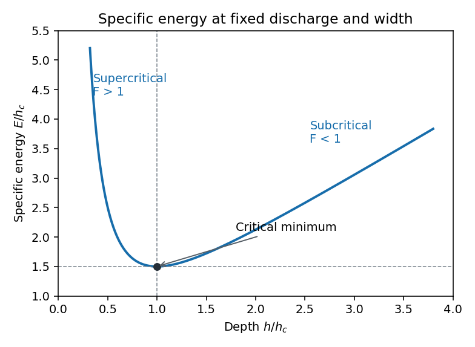

<h1 id="1/a/solution">Solution</h1>

↑ **Parent:** [A](../a.md)

Assume a steady, incompressible, [inviscid flow](../../../../../../inviscid-flow.md) with a nearly uniform [velocity](../../../../../../velocity.md) $u(x)$ across each water section. The channel varies slowly enough for vertical accelerations to be negligible, [pressure](../../../../../../pressure.md) to be hydrostatic and the water surface to be nearly horizontal across the width. Atmospheric [pressure](../../../../../../pressure.md) is uniform; neglect [surface tension](../../../../../../surface-tension.md), wall friction and energy losses. The hydraulic equations apply away from jumps and short nonhydrostatic regions.

The [Euler equation](../../../../../../euler-equations-for-an-inviscid-fluid.md) for horizontal momentum, with [hydrostatic pressure](../../../../../../hydrostatic-pressure.md), gives

$$
u\frac{du}{dx}=-g\frac{d(H+h)}{dx}.
$$

Integrating gives a constant [Bernoulli equation](../../../../../../bernoulli-equation.md) head $\mathcal B=H+h+u^2/(2g)$. [Conservation of mass](../../../../../../mass-conservation.md) gives the constant volume discharge $Q=bhu$. Thus the [shallow-water specific energy](../../../../../../shallow-water-specific-energy.md), measured above the local bed, is

$$
\boxed{E(h;x)=h+\frac{Q^2}{2gb(x)^2h^2},\qquad H(x)+E(h;x)=\mathcal B.}
$$

Define the [Froude number](../../../../../../froude-number.md) by $F=u/\sqrt{gh}$ for the positive flow direction. Then

$$
\boxed{E=h(1+F^2/2),\qquad \left.\frac{\partial E}{\partial h}\right|_{Q,b}=1-F^2.}
$$

At fixed discharge and width, energy tends to infinity at both zero and infinite depth. It has a unique minimum at

$$
\boxed{h_c=\left(\frac{Q^2}{gb^2}\right)^{1/3},\quad F=1,\quad E_c=\frac32h_c.}
$$

Indeed $E_{hh}=3Q^2/(gb^2h^4)>0$. Above the minimum there are two depth branches: the shallower one is [supercritical flow](../../../../../../supercritical-flow.md) and the deeper one is [subcritical flow](../../../../../../subcritical-flow.md).

**[Figure 1](#1/a/image-specific-energy-minimum-and-the-subcritical-and-supercritical-depth-branches). Specific-energy minimum and the subcritical and supercritical depth branches**.

The local long-wave propagation speeds from the [shallow water equations](../../../../../../shallow-water-equations.md) are $u\pm\sqrt{gh}$. In subcritical positive flow, one wave family travels upstream and one downstream. In [supercritical flow](../../../../../../supercritical-flow.md) both travel downstream. At critical flow the upstream-directed speed is zero, so the flow can provide [hydraulic control](../../../../../../hydraulic-control.md) separating upstream adjustment from downstream conditions. This statement concerns long waves in the slowly varying hydraulic approximation, rather than all short-wave disturbances.

## ↑ Ancestors (11)

1. [A](../a.md)
2. [1](../../1.md)
3. [Paper 83](../../../paper-83-split.md)
4. [Iii](../../../split.md)
5. [2007](../../../../split.md)
6. [Past exam of the mathematics course of the University of Cambridge](../../../../../split.md)
7. [Mathematics course of the University of Cambridge](../../../../../../mathematics-course-of-the-university-of-cambridge.md)
8. [Course of the University of Cambridge](../../../../../../course-of-the-university-of-cambridge.md)
9. [University of Cambridge](../../../../../../university-of-cambridge-split.md)
10. [List of universities](../../../../../../list-of-universities.md)
11. [Codex Wiki](../../../../../../split.md)
