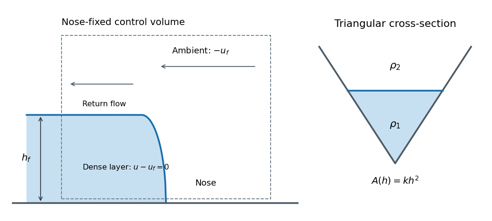

<h1 id="2/b/solution">Solution</h1>

↑ **Parent:** [B](../b.md)

The layer equations describe long-wave adjustment behind the nose, but do not resolve the short region where the dense fluid pushes aside the ambient. A finite-height front cannot be determined by simply adjoining a vacuum solution of the one-layer momentum equation. The ambient [pressure](../../../../../../pressure.md) and turning flow provide additional nose physics.

In the nose frame, the material condition makes the adjacent current [velocity](../../../../../../velocity.md) equal to the front speed in the laboratory frame. The two interior [characteristic speeds](../../../../../../characteristic-speed.md) relative to that front are then $\pm c_f$: one characteristic brings information from the body and one brings a boundary condition from the nose. This is why a [gravity-current front condition](../../../../../../gravity-current-front-condition.md) is needed. With a deep ambient, fixed channel shape and negligible viscosity, the local [buoyancy](../../../../../../buoyancy.md) depth supplies the [velocity](../../../../../../velocity.md) scale $\sqrt{g'h_f}$. A dimensionless closure therefore has the form

$$
\boxed{u_f=F\sqrt{g'h_f},}
$$

where a constant $F$ is an idealization for a fixed geometry and chosen nose model. Dimensional analysis identifies the form but does not determine the coefficient.

**[Figure 2](#2/b/image-nose-fixed-control-volume-and-triangular-cross-section-for-a-gravity-current-front-condition). Nose-fixed control volume and triangular cross-section for a gravity-current front condition**.

To determine an appropriate coefficient theoretically, take a control volume moving with the nose and bounded by sections far enough ahead and behind for [hydrostatic pressure](../../../../../../hydrostatic-pressure.md) and approximately uniform section velocities to apply. Use the actual triangular wetted areas and integrated pressures. Conservation of fluid volume fixes the ambient return-flow velocities; integrated horizontal momentum balances the incoming and outgoing momentum fluxes against the [pressure](../../../../../../pressure.md) forces. A Bernoulli relation on an ambient streamline, with an explicit nose-loss assumption if needed, supplies the [pressure](../../../../../../pressure.md) or energy closure. The density-anomaly [pressure](../../../../../../pressure.md) contribution of the lower layer contains the integral $g'kh_f^3/3$ derived above. Solving those balances gives $u_f^2/(g'h_f)$ and hence $F^2$.

Alternatively, measured front speeds and consistently defined adjacent heights in a geometrically similar experiment can calibrate the closure. A rectangular-channel numerical coefficient must not be transferred to a triangular channel without checking those balances. The height definition and dissipative nose structure also matter; [a primary study of gravity-current front conditions](https://paul-linden.com/wp-content/uploads/2017/05/104mtl05.pdf) explains why different height conventions can lead to different inferred coefficients. No numerical value of $F$ is required for the following solution.

## ↑ Ancestors (11)

1. [B](../b.md)
2. [2](../../2.md)
3. [Paper 83](../../../paper-83-split.md)
4. [Iii](../../../split.md)
5. [2007](../../../../split.md)
6. [Past exam of the mathematics course of the University of Cambridge](../../../../../split.md)
7. [Mathematics course of the University of Cambridge](../../../../../../mathematics-course-of-the-university-of-cambridge.md)
8. [Course of the University of Cambridge](../../../../../../course-of-the-university-of-cambridge.md)
9. [University of Cambridge](../../../../../../university-of-cambridge-split.md)
10. [List of universities](../../../../../../list-of-universities.md)
11. [Codex Wiki](../../../../../../split.md)
