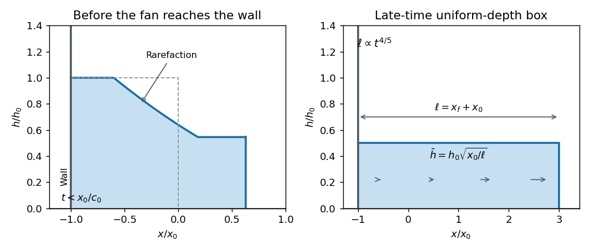

<h1 id="2/d/solution">Solution</h1>

↑ **Parent:** [D](../d.md)

Initially the same expansion fan and constant-speed front apply. Its left edge reaches the closed rear wall at $t_w=x_0/c_0$. After that, the infinite-reservoir solution would give a nonzero [velocity](../../../../../../velocity.md) at the wall and violates the no-through-flow condition. A reflected disturbance adjusts the interior while the finite initial volume is progressively spread over a longer, shallower current.

The nose does not respond instantaneously when the fan reaches the wall. Its first return signal follows a $+$ characteristic from $(x,t)=(-x_0,t_w)$ through the undisturbed fan. There $u+c=(8c_0+3x/t)/5$, so integrating $dx/dt=u+c$ gives

$$
x(t)=4c_0t-5c_0t_w^{2/5}t^{3/5}.
$$

It reaches the uniform nose-adjacent region at $t_n=t_w(c_0/c_f)^{5/2}$, where $x=(u_f-c_f)t_n$. Crossing that region at speed $u_f+c_f$, it catches the front at $2t_n$. Thus the initial nose remains uninformed about the rear wall until this return time. Subsequently its speed must adjust rather than remain constant indefinitely.

**[Figure 3](#2/d/image-early-finite-lock-rarefaction-and-the-late-time-uniform-depth-triangular-channel-box-model). Early finite-lock rarefaction and the late-time uniform-depth triangular-channel box model**.

For late times use a [prismatic triangular-channel gravity-current box model](../../../../../../prismatic-triangular-channel-gravity-current-box-model.md) with uniform representative depth $\bar h$ over length $\ell=x_f+x_0$. The initial volume is $V=kh_0^2x_0$. With no entrainment or loss,

$$
\boxed{k\bar h^2\ell=kh_0^2x_0,\qquad
\bar h=h_0\sqrt{\frac{x_0}{\ell}}.}
$$

Apply the same front closure using that representative depth:

$$
\dot\ell=F\sqrt{g'\bar h}=F\sqrt{g'h_0}\,x_0^{1/4}\ell^{-1/4}.
$$

Starting from a matching late-time state $(t_b,\ell_b)$, integration gives [finite-volume inertial spreading in a triangular channel](../../../../../../finite-volume-inertial-spreading-in-a-triangular-channel.md):

$$
\boxed{\ell(t)=\left[\ell_b^{5/4}+\frac54F\sqrt{g'h_0}\,x_0^{1/4}(t-t_b)\right]^{4/5},\qquad
x_f=\ell-x_0,\quad\bar h=h_0\sqrt{x_0/\ell}.}
$$

Hence $\ell\propto t^{4/5}$, $\bar h\propto t^{-2/5}$ and the nose speed decays like $t^{-1/5}$. A simple initialized box approximation can instead set $\ell_b=x_0$ and $t_b=0$, but it then deliberately replaces the exact early rarefaction rather than reproducing it.

The box's volume equation is compatible with a [velocity](../../../../../../velocity.md) increasing linearly from zero at the rear wall to the nose speed: $u(x,t)=\dot\ell(x+x_0)/\ell$. A flat-depth box with this [velocity](../../../../../../velocity.md) is not an exact solution of the full momentum equation during deceleration. It is an integral approximation that leaves the interior shape and nose dynamics unresolved while predicting late-time bulk scaling.

## ↑ Ancestors (11)

1. [D](../d.md)
2. [2](../../2.md)
3. [Paper 83](../../../paper-83-split.md)
4. [Iii](../../../split.md)
5. [2007](../../../../split.md)
6. [Past exam of the mathematics course of the University of Cambridge](../../../../../split.md)
7. [Mathematics course of the University of Cambridge](../../../../../../mathematics-course-of-the-university-of-cambridge.md)
8. [Course of the University of Cambridge](../../../../../../course-of-the-university-of-cambridge.md)
9. [University of Cambridge](../../../../../../university-of-cambridge-split.md)
10. [List of universities](../../../../../../list-of-universities.md)
11. [Codex Wiki](../../../../../../split.md)
