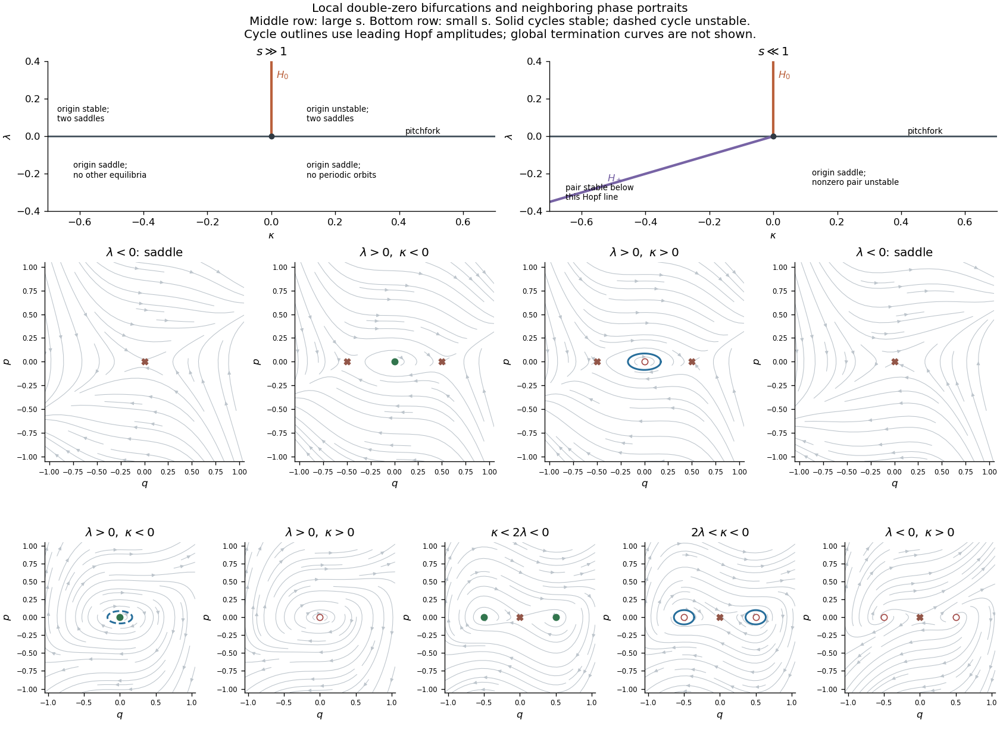

<h1 id="1/b/solution">Solution</h1>

↑ **Parent:** [B](../b.md)

Set $A=s-1\ne0$ and rescale $q=\sqrt{|A|}u$, $p=\dot q$. The [reflection-symmetric cubic double-zero normal form](../../../../../../reflection-symmetric-cubic-double-zero-normal-form.md) becomes

$$
\dot q=p,\qquad \dot p=-\lambda q+\kappa p+\sigma q^3-2\sigma q^2p,
\qquad \sigma=\operatorname{sgn}(A).
$$

It is invariant under $(q,p)\mapsto(-q,-p)$. Thus the large-$s$ case has $\sigma=1$ and the small-$s$ case $\sigma=-1$. At the origin the [Jacobian matrix](../../../../../../jacobian-matrix.md) has determinant $\lambda$ and trace $\kappa$: it is a saddle for $\lambda<0$, stable for $\lambda>0,\kappa<0$, and unstable for $\lambda>0,\kappa>0$. In the latter two cases the discriminant $\kappa^2-4\lambda$ distinguishes nodes from foci; its zero is not an [equilibrium](../../../../../../equilibrium-point-of-a-dynamical-system.md)-creation [bifurcation](../../../../../../bifurcation.md).

The nonzero [equilibria](../../../../../../equilibrium-point-of-a-dynamical-system.md) satisfy $p=0$, $q^2=\lambda/\sigma$. At either of them the determinant is $-2\lambda$ and the trace is $\kappa-2\lambda$. Therefore **for $s\gg1$, a pair of saddles exists when $\lambda>0$**, while **for $s\ll1$, a pair of attracting [equilibria](../../../../../../equilibrium-point-of-a-dynamical-system.md) exists when $\lambda<0,\kappa<2\lambda$, and a repelling pair when $\lambda<0,\kappa>2\lambda$**. The repelling or attracting points may be nodes or foci. Their origin collision occurs on the [pitchfork bifurcation](../../../../../../pitchfork-bifurcation-normal-form.md) line $\lambda=0$, away from $\kappa=0$. For fixed $\kappa\ne0$, the scalar centre equation there begins

$$
\dot q=\frac\lambda\kappa q-\frac\sigma\kappa q^3+\cdots.
$$

For $\kappa<0$, the large-$s$ case is a subcritical pitchfork and the small-$s$ case a supercritical pitchfork. For $\kappa>0$, the scalar criticality reverses, but there is already an unstable transverse [eigenvalue](../../../../../../eigenvalue.md), so the full-plane branches have the stability just listed.

At the origin, $\kappa=0$, $\lambda>0$ is a [Hopf bifurcation](../../../../../../hopf-bifurcation.md) with frequency $\sqrt\lambda$. Averaging the leading weakly nonlinear oscillator gives the amplitude equation

$$
\dot r=\frac\kappa2r-\frac\sigma4r^3+\cdots.
$$

Consequently

$$
\boxed{\sigma=1:\ \text{stable cycle for }\kappa>0,\ r^2\sim2\kappa;\qquad
\sigma=-1:\ \text{unstable cycle for }\kappa<0,\ r^2\sim-2\kappa.}
$$

These are respectively a [supercritical Hopf bifurcation](../../../../../../supercritical-hopf-bifurcation.md) and a [subcritical Hopf bifurcation](../../../../../../subcritical-hopf-bifurcation.md), with $\lambda>0$ fixed and the cycle sufficiently small. The portraits change from a stable focus to an unstable focus surrounded by a stable cycle in the first case; in the second, a stable focus is surrounded by an unstable cycle before the focus becomes unstable and that cycle disappears.

The small-$s$ case has an additional pair of [Hopf bifurcations](../../../../../../hopf-bifurcation.md) at the nonzero [equilibria](../../../../../../equilibrium-point-of-a-dynamical-system.md):

$$
\boxed{\kappa=2\lambda,\quad\lambda<0,\qquad \omega_H=\sqrt{-2\lambda}.}
$$

Their criticality includes quadratic terms and is not read off from the positive $q^2p$ term alone. Set $q=a+x$, $a^2=-\lambda$, and $\delta=\kappa-2\lambda$. Then

$$
\ddot x=-2a^2x-3ax^2-x^3+\delta\dot x+4ax\dot x+2x^2\dot x.
$$

For an oscillator $\ddot x=-\omega_H^2x+A_2x^2+B_2x\dot x+C_3x^3+D_3x^2\dot x$, the cubic radial coefficient is $D_3/8+A_2B_2/(8\omega_H^2)$. Here it is $2/8+(-3a)(4a)/(8\cdot2a^2)=-1/2$. Thus both nonzero [Hopf bifurcations](../../../../../../hopf-bifurcation.md) are supercritical: for small $\delta>0$, each newly unstable well [equilibrium](../../../../../../equilibrium-point-of-a-dynamical-system.md) is surrounded by a stable small cycle with $r^2\sim\delta$.

To constrain [periodic orbits](../../../../../../periodic-orbit.md), use either the [divergence](../../../../../../divergence.md) or the energy

$$
\mathcal H=\frac{p^2}2+\frac\lambda2q^2-\frac\sigma4q^4,\qquad
\dot{\mathcal H}=(\kappa-2\sigma q^2)p^2,\qquad
\operatorname{div}F=\kappa-2\sigma q^2.
$$

For $\sigma=1,\kappa\le0$, the [divergence](../../../../../../divergence.md) has one strict sign except on a line, and the [Bendixson-Dulac criterion](../../../../../../bendixson-dulac-theorem.md) excludes every nonconstant [periodic orbit](../../../../../../periodic-orbit.md). For $\sigma=-1,\kappa\ge0$, the same reasoning excludes every [periodic orbit](../../../../../../periodic-orbit.md). When the [divergence](../../../../../../divergence.md) changes sign, this criterion makes no such exclusion; the Hopf cycles above are consistent with that restriction. In the large-$s$ case a [periodic orbit](../../../../../../periodic-orbit.md) also requires $\lambda>0$: if $\lambda\le0$, a positive maximum of $q$ would have $\ddot q=-\lambda q+q^3>0$, or a negative minimum would have negative acceleration, both impossible. For $\lambda>0$ the same extremum argument confines a cycle to $|q|<\sqrt\lambda$, between the two saddle locations. The local [bifurcation](../../../../../../bifurcation.md) lines and representative portraits on both sides are summarized below; their global completion requires part (c).

**[Figure 1](#1/b/image-local-bifurcation-lines-and-representative-phase-portraits-for-the-two-signs-of-the-cubic-double-zero-normal-form). Local bifurcation lines and representative phase portraits for the two signs of the cubic double-zero normal form**.

## ↑ Ancestors (11)

1. [B](../b.md)
2. [1](../../1.md)
3. [Paper 85](../../../paper-85-split.md)
4. [Iii](../../../split.md)
5. [2007](../../../../split.md)
6. [Past exam of the mathematics course of the University of Cambridge](../../../../../split.md)
7. [Mathematics course of the University of Cambridge](../../../../../../mathematics-course-of-the-university-of-cambridge.md)
8. [Course of the University of Cambridge](../../../../../../course-of-the-university-of-cambridge.md)
9. [University of Cambridge](../../../../../../university-of-cambridge-split.md)
10. [List of universities](../../../../../../list-of-universities.md)
11. [Codex Wiki](../../../../../../split.md)
