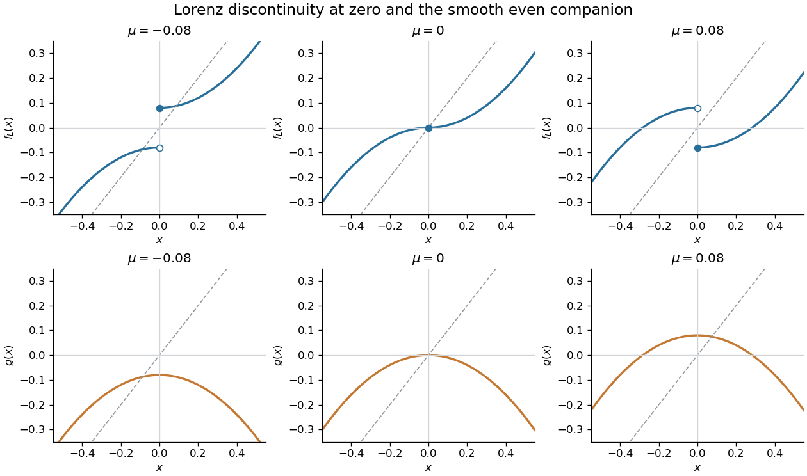

<h1 id="2/a/solution">Solution</h1>

↑ **Parent:** [A](../a.md)

The associated even map is simply $g(x)=\mu-x^2$. For nonzero $x$, the [odd quadratic Lorenz map](../../../../../../odd-quadratic-lorenz-map.md) has the two branches $f_L(x)=x^2-\mu$ on the positive side and $f_L(x)=\mu-x^2$ on the negative side. Their limiting values at zero are $-\mu$ and $+\mu$, while the prescribed point value is $f_L(0)=-\mu$. Thus the branches join continuously only at $\mu=0$, where the origin is a [fixed point](../../../../../../fixed-point.md) and $f_L(x)=x|x|$.

The small [fixed point](../../../../../../fixed-point.md) of $g$ is

$$
r(\mu)=\frac{-1+\sqrt{1+4\mu}}2=\mu+O(\mu^2),\qquad g'(r)=-2r.
$$

For small negative $\mu$, $r<0$ and the [odd quadratic Lorenz map](../../../../../../odd-quadratic-lorenz-map.md) has two stable [fixed points](../../../../../../fixed-point.md) $r,-r$. Their [periodic-orbit multiplier](../../../../../../multiplier-of-a-periodic-orbit-of-an-iteration.md) is $2|r|<1$. As $\mu\uparrow0$ these [fixed points](../../../../../../fixed-point.md) collide at zero. For small positive $\mu$, $r>0$ and

$$
f_L(r)=-r,\qquad f_L(-r)=r,
$$

so a stable symmetric two-cycle is present, with [periodic-orbit multiplier](../../../../../../multiplier-of-a-periodic-orbit-of-an-iteration.md) $4r^2<1$. Hence the global transition is

$$
\boxed{\mu<0:\text{ two stable fixed points};\quad\mu=0:\text{ the zero fixed point};\quad
\mu>0:\text{ one stable two-cycle}.}
$$

The large [fixed points](../../../../../../fixed-point.md) $\pm(1+r)$ remain unstable near this transition and are not created or destroyed there. The parabola $g$ itself is smooth as $\mu$ passes zero; its [fixed point](../../../../../../fixed-point.md) crosses the critical point and changes the sign of its [periodic-orbit multiplier](../../../../../../multiplier-of-a-periodic-orbit-of-an-iteration.md). The change of orbit type occurs in the sign-lifted [discrete dynamical system](../../../../../../discrete-dynamical-system.md), whose discontinuity switches orientation.

**[Figure 2](#2/a/image-the-two-lorenz-map-branches-and-their-even-quadratic-companion-as-the-parameter-crosses-zero). The two Lorenz-map branches and their even quadratic companion as the parameter crosses zero**.

## ↑ Ancestors (11)

1. [A](../a.md)
2. [2](../../2.md)
3. [Paper 85](../../../paper-85-split.md)
4. [Iii](../../../split.md)
5. [2007](../../../../split.md)
6. [Past exam of the mathematics course of the University of Cambridge](../../../../../split.md)
7. [Mathematics course of the University of Cambridge](../../../../../../mathematics-course-of-the-university-of-cambridge.md)
8. [Course of the University of Cambridge](../../../../../../course-of-the-university-of-cambridge.md)
9. [University of Cambridge](../../../../../../university-of-cambridge-split.md)
10. [List of universities](../../../../../../list-of-universities.md)
11. [Codex Wiki](../../../../../../split.md)
