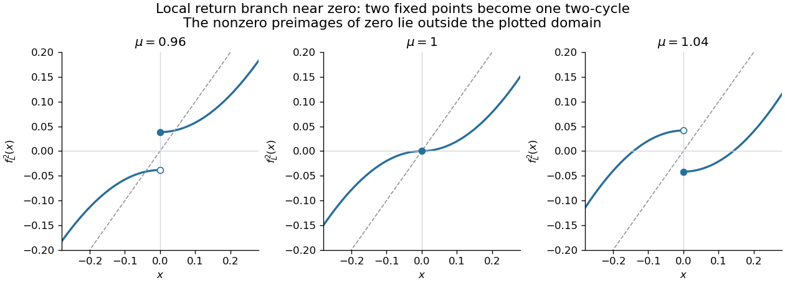

<h1 id="2/e/solution">Solution</h1>

↑ **Parent:** [E](../e.md)

The positive [fixed point](../../../../../../fixed-point.md) $r=(-1+\sqrt{1+4\mu})/2$ of $g$ has [periodic-orbit multiplier](../../../../../../multiplier-of-a-periodic-orbit-of-an-iteration.md) $-2r$. At $\mu=3/4$, $r=1/2$ and the [periodic-orbit multiplier](../../../../../../multiplier-of-a-periodic-orbit-of-an-iteration.md) crosses $-1$. Factoring the second-iterate fixed-point equation gives

$$
g^2(x)-x=-(x^2+x-\mu)(x^2-x+1-\mu).
$$

The second factor yields a two-cycle

$$
p=\frac{1+\sqrt{4\mu-3}}2,\qquad q=\frac{1-\sqrt{4\mu-3}}2,\qquad
g(p)=q,\quad g(q)=p.
$$

It exists for $\mu>3/4$ and has [periodic-orbit multiplier](../../../../../../multiplier-of-a-periodic-orbit-of-an-iteration.md) $4pq=4(1-\mu)$. Its stability range is $3/4<\mu<5/4$, so **$g$ undergoes a supercritical period-doubling [bifurcation](../../../../../../bifurcation.md) at $\mu=3/4$**. At $\mu=1$ the two-cycle is $\{0,1\}$ and its [periodic-orbit multiplier](../../../../../../multiplier-of-a-periodic-orbit-of-an-iteration.md) is zero, making it superstable.

For positive $\mu$ and $0<|x|<\sqrt\mu$, direct composition gives the local second iterate

$$
F_\mu(x)=f_L^2(x)=\operatorname{sgn}(x)\bigl(\mu-\mu^2+2\mu x^2-x^4\bigr),\qquad
F_\mu(0)=\mu-\mu^2.
$$

The one-sided limits at zero are opposite, and agree with zero exactly when $\mu=1$ in this neighborhood. There $F_1(x)=\operatorname{sgn}(x)(2x^2-x^4)$ is continuous at zero and fixes it. Thus the local return branch has the same discontinuity-closing transition as the map in part (a), with effective parameter $\mu^2-\mu$ crossing zero.

**[Figure 3](#2/e/image-local-second-iterate-lorenz-return-maps-near-zero-showing-the-discontinuity-close-and-reverse-at-parameter-one). Local second-iterate Lorenz return maps near zero, showing the discontinuity close and reverse at parameter one**.

For $3/4<\mu<1$, both $p,q$ are positive and the [period transfer from a quadratic map to its Lorenz sign lift](../../../../../../period-transfer-from-a-quadratic-map-to-its-lorenz-sign-lift.md) gives the two stable cycles

$$
\{p,-q\},\qquad\{q,-p\}.
$$

For $1<\mu<5/4$, $p>0$ and $q<0$, so the [periodic-orbit multiplier](../../../../../../multiplier-of-a-periodic-orbit-of-an-iteration.md) of the $g$ cycle is negative and the lifted orbit is

$$
p\longmapsto-q\longmapsto-p\longmapsto q\longmapsto p.
$$

It is one stable four-cycle. Hence the [gluing of cycles in an iterated Lorenz map](../../../../../../gluing-of-cycles-in-an-iterated-lorenz-map.md) gives

$$
\boxed{\mu<1:\text{ two stable two-cycles of }f_L;\qquad
\mu>1:\text{ one stable four-cycle of }f_L.}
$$

Equivalently, $F_\mu$ changes from two small stable [fixed points](../../../../../../fixed-point.md) $\pm q$ to a stable small two-cycle $\pm(-q)$. At the critical value itself, the actual convention gives $f_L(0)=-1$, $f_L(-1)=0$, $f_L(1)=0$: the surviving critical two-cycle is $\{0,-1\}$, and $+1$ is preperiodic. This critical itinerary must be evaluated directly, not with part (b)'s noncritical sign product.

There is also a precise qualification to the printed use of “continuous”. The whole second iterate is not continuous everywhere at $\mu=1$: $F_1(1)=-1$, while $\lim_{x\to1^-}F_1(x)=1$ and $\lim_{x\to1^+}F_1(x)=-1$. Jumps persist at the nonzero preimages of the original discontinuity. Therefore the stated global-[bifurcation](../../../../../../bifurcation.md) criterion holds for the return map restricted to a neighborhood of zero, as in the sketches; if continuity on all of $\mathbb R$ is demanded literally, the claim about $f_L^2$ needs that restriction. The orbit creation and destruction above is unaffected.

## ↑ Ancestors (11)

1. [E](../e.md)
2. [2](../../2.md)
3. [Paper 85](../../../paper-85-split.md)
4. [Iii](../../../split.md)
5. [2007](../../../../split.md)
6. [Past exam of the mathematics course of the University of Cambridge](../../../../../split.md)
7. [Mathematics course of the University of Cambridge](../../../../../../mathematics-course-of-the-university-of-cambridge.md)
8. [Course of the University of Cambridge](../../../../../../course-of-the-university-of-cambridge.md)
9. [University of Cambridge](../../../../../../university-of-cambridge-split.md)
10. [List of universities](../../../../../../list-of-universities.md)
11. [Codex Wiki](../../../../../../split.md)
