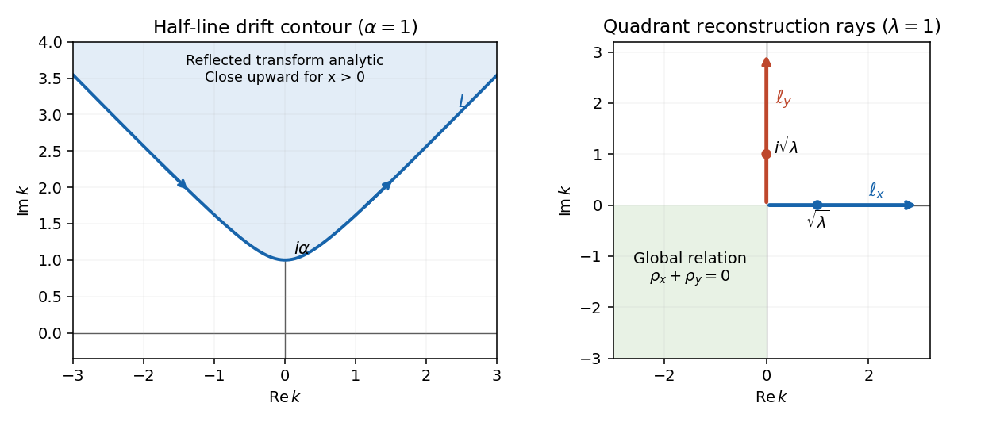

<h1 id="2/b/solution">Solution</h1>

↑ **Parent:** [B](../b.md)

The [modified Helmholtz closed spectral one-form](../../../../../../modified-helmholtz-closed-spectral-one-form.md) is exact in the simply connected quadrant. Writing its primitive as $\mu E$ gives the compatible first-order equations

$$
\mu_z-ik\mu=q_z+ikq,\qquad\mu_{\bar z}-\frac\lambda{ik}\mu=-q_{\bar z}-\frac\lambda{ik}q.
$$

Their compatibility is precisely the PDE already proved in part (a). Set $H=E^{-1}=e^{ia(k)x-b(k)y}$. Construct three primitives: $\mu_0$ starts at the corner, $\mu_x$ starts at the infinite end of a horizontal line through the point, and $\mu_y$ starts at the infinite end of a vertical line. More explicitly,

$$
\begin{aligned}
\mu_0(z,k)&=H(z,k)\int_0^z W,\\
\mu_x(x,y,k)&=-i\int_x^\infty e^{-ia(k)(s-x)}\left[b(k)q(s,y)-q_y(s,y)\right]ds,\\
\mu_y(x,y,k)&=-\int_y^\infty e^{b(k)(s-y)}\left[iq_x(x,s)-a(k)q(x,s)\right]ds.
\end{aligned}
$$

Path independence follows from closedness. The two infinite primitives exist in the lower and left spectral half-planes respectively. In their common third quadrant they coincide, because the [global relation](../../../../../../global-relation-for-a-linear-boundary-value-problem.md) makes the difference of the two basepoint integrals zero.

Choose a sectionally analytic spectral function by using $\mu_0$ in quadrant I, $\mu_y$ in quadrant II and $\mu_x$ in quadrants III and IV. It has no jump across the negative axes. Let $\ell_x=(0,\infty)$ and $\ell_y=(0,i\infty)$, both oriented outward. With plus denoting the left side of an oriented ray, the two remaining jumps are

$$
\mu_+-\mu_-=H\rho_x\quad\hbox{on }\ell_x,\qquad\mu_+-\mu_-=H\rho_y\quad\hbox{on }\ell_y.
$$

For example, on $\ell_x$ the jump is $\mu_0-\mu_x$, the primitive around the bottom boundary; on $\ell_y$ it is $\mu_y-\mu_0$, the left boundary traversed downward. This fixes both orientations and signs of the [Riemann-Hilbert problem](../../../../../../riemann-hilbert-problem.md).

Integration by parts in the infinite primitive formulas, or in the finite primitive with its decaying basepoint contribution, gives

$$
\mu=-q+O(k^{-1})\quad(k\to\infty),\qquad\mu=q+O(k)\quad(k\to0).
$$

For instance the horizontal formula has leading value $-bq/a$, which tends to $-q$ at infinity and $q$ at zero; the vertical formula has leading value $-aq/b$ with the same limits. These expansions hold in closed subsectors, with the boundary limits obtained by oscillatory regularization. Along $\ell_x$, $H$ damps with $y>0$ at both spectral ends; along $\ell_y$, it damps with $x>0$. Thus the ray integrals converge in the interior and small and large spectral circles can be removed.

Solve the additive [Riemann-Hilbert problem](../../../../../../riemann-hilbert-problem.md) by a [Cauchy integral formula](../../../../../../cauchy-integral-formula.md), normalized at infinity:

$$
\mu(k)=-q+\frac1{2\pi i}\left[\int_{\ell_x}\frac{H(s)\rho_x(s)}{s-k}ds+\int_{\ell_y}\frac{H(s)\rho_y(s)}{s-k}ds\right].
$$

The [Sokhotski–Plemelj theorem](../../../../../../sokhotski-plemelj-theorem.md) gives the stated jumps. The difference between this expression and the constructed primitive is analytic across both rays, bounded at zero and vanishes at infinity; the [Liouville theorem](../../../../../../liouville-theorem.md) makes that difference zero. Evaluate at zero, where $\mu(0)=q$. The difference between the two spectral normalizations is $2q$, hence the [quadrant modified Helmholtz spectral reconstruction](../../../../../../quadrant-modified-helmholtz-spectral-reconstruction.md) is

$$
\boxed{q(x,y)=\frac1{4\pi i}\left[\int_0^\infty e^{ia(k)x-b(k)y}\rho_x(k)\frac{dk}{k}+\int_0^{i\infty}e^{ia(k)x-b(k)y}\rho_y(k)\frac{dk}{k}\right].}
$$

The factor $1/(4\pi i)$ is essential. A useful independent normalization check is to write $p=a(k)$ on the real ray, so $b=\sqrt{p^2+4\lambda}=B(p)$ and $dk/k=dp/B$. On the imaginary ray write $k=ir$, $p=r-\lambda/r$ and $a=iB(p)$. The formula becomes

$$
\begin{aligned}
q(x,y)={}&\frac1{4\pi}\int_{\mathbb R}e^{ipx-B(p)y}\left[\widehat h_2(p)-\frac{\widehat n_2(p)}{B(p)}\right]dp\\
&+\frac1{4\pi}\int_{\mathbb R}e^{-B(p)x-ipy}\left[\widehat h_1(-p)-\frac{\widehat n_1(-p)}{B(p)}\right]dp.
\end{aligned}
$$

Each hat here is a half-line Fourier transform. This is exactly the spectral form of [Green second identity](../../../../../../green-second-identity.md) with the decaying full-plane [fundamental solution](../../../../../../fundamental-solution-of-a-linear-differential-operator.md). The representation still contains both value and derivative traces; the next part eliminates the latter.

**[Figure 1](#2/b/image-oriented-half-line-drift-contour-and-quadrant-modified-helmholtz-reconstruction-rays-with-their-analytic-and-global-relation-domains). Oriented half-line drift contour and quadrant modified Helmholtz reconstruction rays with their analytic and global-relation domains**.

## ↑ Ancestors (11)

1. [B](../b.md)
2. [2](../../2.md)
3. [Paper 86](../../../paper-86-split.md)
4. [Iii](../../../split.md)
5. [2007](../../../../split.md)
6. [Past exam of the mathematics course of the University of Cambridge](../../../../../split.md)
7. [Mathematics course of the University of Cambridge](../../../../../../mathematics-course-of-the-university-of-cambridge.md)
8. [Course of the University of Cambridge](../../../../../../course-of-the-university-of-cambridge.md)
9. [University of Cambridge](../../../../../../university-of-cambridge-split.md)
10. [List of universities](../../../../../../list-of-universities.md)
11. [Codex Wiki](../../../../../../split.md)
