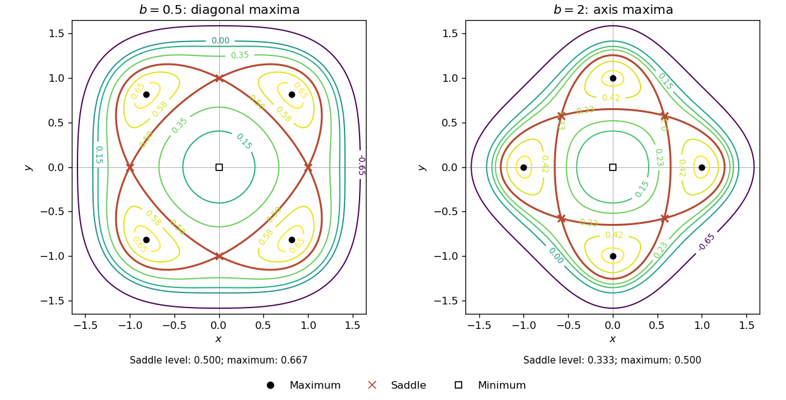

<h1 id="8a/solution">Solution</h1>

↑ **Parent:** [8A](../8a.md)

For this [quartic potential with fourfold symmetry](../../../../../quartic-potential-with-fourfold-symmetry.md), the first [derivatives](../../../../../derivative.md) factor:

$$
f_x=2x(1-x^2-by^2),\qquad f_y=2y(1-y^2-bx^2).
$$

The [critical points](../../../../../critical-point.md) are the origin, the four axis points $(\pm1,0),(0,\pm1)$, and four points with both coordinates nonzero. At the latter, $x^2+by^2=y^2+bx^2=1$. Subtracting and using $b\ne1$ gives $x^2=y^2=1/(1+b)$. Thus the complete list is

$$
\boxed{(0,0),\quad(\pm1,0),(0,\pm1),\quad
\left(\pm\frac1{\sqrt{1+b}},\pm\frac1{\sqrt{1+b}}\right),}
$$

where the two signs in the final group are chosen separately.

The [Hessian](../../../../../hessian-matrix.md) is

$$
D^2f=\begin{pmatrix}2-6x^2-2by^2&-4bxy\\-4bxy&2-6y^2-2bx^2\end{pmatrix}.
$$

At the origin it is $2I$, so there is a strict [local minimum](../../../../../local-minimum.md) with value zero. At an axis point its [eigenvalues](../../../../../eigenvalue.md) are $-4$ and $2(1-b)$, giving a [saddle point of a scalar function](../../../../../saddle-point-of-a-scalar-function.md) if $b<1$ and a strict [local maximum](../../../../../local-maximum.md) if $b>1$. All four axis values are $1/2$.

At a diagonal point the [Hessian](../../../../../hessian-matrix.md) has [eigenvalues](../../../../../eigenvalue.md)

$$
-4,\qquad-\frac{4(1-b)}{1+b}.
$$

Hence these four points are strict [local maxima](../../../../../local-maximum.md) for $b<1$ and [saddle points of a scalar function](../../../../../saddle-point-of-a-scalar-function.md) for $b>1$. Their value is $1/(1+b)$. None of these [critical points](../../../../../critical-point.md) is degenerate when $b\ne1$.

To describe the [level curves](../../../../../level-curve.md) precisely, use [polar coordinates](../../../../../polar-coordinates.md) and write

$$
f=r^2-\frac12q(\theta)r^4,\qquad
q(\theta)=1+\frac{b-1}{2}\sin^2(2\theta)>0.
$$

For a level $f=c$, the possible radii satisfy

$$
\boxed{r^2=\frac{1\pm\sqrt{1-2q(\theta)c}}{q(\theta)},}
$$

retaining only real, nonnegative values. This formula, together with reflection in each axis and interchange of the coordinates, determines the [level curves](../../../../../level-curve.md). The radial maximum in a direction is $1/(2q)$, attained at $r^2=1/q$. It also proves that the [local maxima](../../../../../local-maximum.md) identified above are global: the largest directional value is $1/(1+b)$ on the diagonals if $b<1$, and $1/2$ on the axes if $b>1$.

For negative $c$ only the plus sign gives a positive radius, producing one outer closed [level curve](../../../../../level-curve.md). At $c=0$ there is the isolated origin and the outer curve $r^2=2/q$. For $0<c<c_s$, where $c_s$ is the saddle value, both radial branches exist in every direction, giving an inner loop around the origin and an outer loop. At $c=c_s$ they meet at the four [saddle points of a scalar function](../../../../../saddle-point-of-a-scalar-function.md). Above the saddle value, four separate loops surround the four maxima; they shrink to those points at the maximum value. There are no [level curves](../../../../../level-curve.md) above it.

For **$0<b<1$**, the saddle value is $c_s=1/2$ and the four high-level loops lie along the diagonals. For **$b>1$**, $c_s=1/(1+b)$ and the four high-level loops lie along the coordinate axes. The sketches show representative values in both regimes; the highlighted [level curve](../../../../../level-curve.md) is the saddle level.

**[Figure 1](#8a/image-contours-of-the-fourfold-quartic-potential-with-diagonal-maxima-for-b-less-than-one-and-axis-maxima-for-b-greater-than-one). Contours of the fourfold quartic potential, with diagonal maxima for b less than one and axis maxima for b greater than one**.

Finally, at $b=1$ the expression depends only on radius:

$$
f=r^2-\frac12r^4=\frac12-\frac12(r^2-1)^2.
$$

Consequently $\boxed{\max f=1/2\text{, attained exactly on }x^2+y^2=1.}$ The maximum set is the whole unit circle, not merely four isolated points.

## ↑ Ancestors (10)

1. [8A](../8a.md)
2. [Paper 2](../../paper-2-split.md)
3. [Ia](../../split.md)
4. [2008](../../../split.md)
5. [Past exam of the mathematics course of the University of Cambridge](../../../../split.md)
6. [Mathematics course of the University of Cambridge](../../../../../mathematics-course-of-the-university-of-cambridge.md)
7. [Course of the University of Cambridge](../../../../../course-of-the-university-of-cambridge.md)
8. [University of Cambridge](../../../../../university-of-cambridge-split.md)
9. [List of universities](../../../../../list-of-universities.md)
10. [Codex Wiki](../../../../../split.md)
