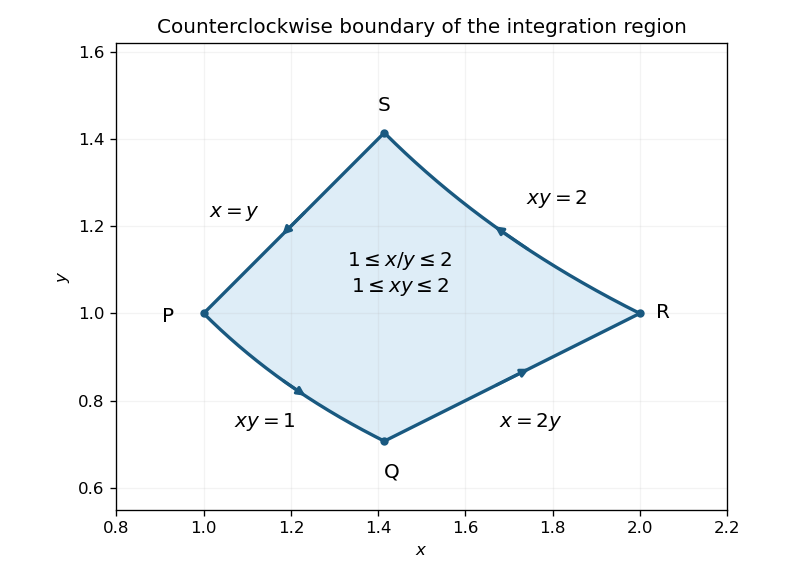

<h1 id="12c/ii/solution">Solution</h1>

↑ **Parent:** [Ii](../ii.md)

Take the usual positive, counterclockwise [boundary orientation](../../../../../../boundary-orientation.md); the printed question does not specify one, and reversing it negates the answer. Write the successive corner points as $P=(1,1)$, $Q=(\sqrt2,1/\sqrt2)$, $R=(2,1)$, $S=(\sqrt2,\sqrt2)$. Traverse $P\to Q\to R\to S\to P$, keeping the region on the left.

**[Figure 1](#12c/ii/image-counterclockwise-boundary-of-the-region-between-two-rays-and-two-hyperbolas). Counterclockwise boundary of the region between two rays and two hyperbolas**.

On $PQ$, use $y=1/x$ with $1\le x\le\sqrt2$. Here $dy=-dx/x^2$, so the [line integral](../../../../../../line-integral.md) is

$$
I_{PQ}=\int_1^{\sqrt2}\left(-\frac{x}{2}-1\right)dx=\frac34-\sqrt2.
$$

On $QR$, use $y=x/2$ with $\sqrt2\le x\le2$:

$$
I_{QR}=\int_{\sqrt2}^{2}\left(\frac{x}{2}-1\right)dx=\sqrt2-\frac32.
$$

On $RS$, use $y=2/x$ with $x$ decreasing from $2$ to $\sqrt2$:

$$
I_{RS}=\int_2^{\sqrt2}\left(-\frac{x}{2}-1\right)dx=\frac52-\sqrt2.
$$

Finally, on $SP$, use $y=x$ with $x$ decreasing from $\sqrt2$ to $1$:

$$
I_{SP}=\int_{\sqrt2}^{1}\left(\frac{x}{2}-1\right)dx=\sqrt2-\frac54.
$$

Adding all four [line integrals](../../../../../../line-integral.md) gives **$\oint_C(x^2/(2y))\,dy-dx=1/2$** for the positive orientation, or **$-1/2$** for the reverse orientation.

## ↑ Ancestors (11)

1. [Ii](../ii.md)
2. [12C](../../12c.md)
3. [Paper 3](../../../paper-3-split.md)
4. [Ia](../../../split.md)
5. [2008](../../../../split.md)
6. [Past exam of the mathematics course of the University of Cambridge](../../../../../split.md)
7. [Mathematics course of the University of Cambridge](../../../../../../mathematics-course-of-the-university-of-cambridge.md)
8. [Course of the University of Cambridge](../../../../../../course-of-the-university-of-cambridge.md)
9. [University of Cambridge](../../../../../../university-of-cambridge-split.md)
10. [List of universities](../../../../../../list-of-universities.md)
11. [Codex Wiki](../../../../../../split.md)
