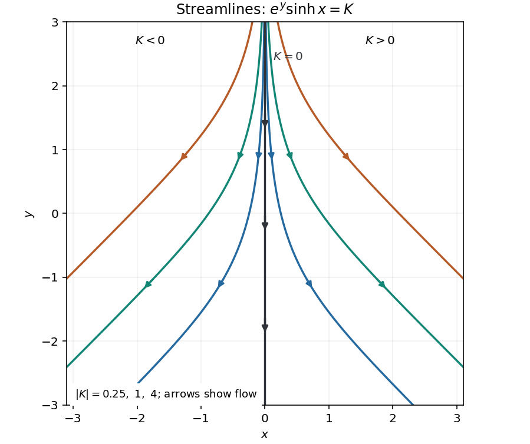

<h1 id="5b/solution">Solution</h1>

↑ **Parent:** [5B](../5b.md)

The [divergence](../../../../../divergence.md) is $\partial_x(e^y\sinh x)+\partial_y(-e^y\cosh x)=e^y\cosh x-e^y\cosh x=0$, proving [incompressibility](../../../../../incompressible-flow.md). Use the [stream function](../../../../../stream-function.md) convention $u_x=\psi_y$, $u_y=-\psi_x$. Integration of either component then gives

$$
\boxed{\psi(x,y)=e^y\sinh x+C.}
$$

The [streamlines](../../../../../streamline.md) are its level curves. Setting the irrelevant constant to zero, a nonzero level $K$ has

$$
y=\ln|K|-\ln|\sinh x|,
$$

with $x>0$ for $K>0$ and $x<0$ for $K<0$. Each curve rises to $y=+\infty$ as $x\to0$ from its side and approaches $y=\ln(2|K|)-|x|$ at large $|x|$. The zero [streamline](../../../../../streamline.md) is $x=0$. Flow is downward everywhere, outward to the right when $x>0$ and outward to the left when $x<0$; on $x=0$ it is vertically downward.

**[Figure 1](#5b/image-streamlines-and-flow-direction-for-the-exponential-hyperbolic-flow). Streamlines and flow direction for the exponential hyperbolic flow**.

## ↑ Ancestors (10)

1. [5B](../5b.md)
2. [Paper 1](../../paper-1-split.md)
3. [Ib](../../split.md)
4. [2008](../../../split.md)
5. [Past exam of the mathematics course of the University of Cambridge](../../../../split.md)
6. [Mathematics course of the University of Cambridge](../../../../../mathematics-course-of-the-university-of-cambridge.md)
7. [Course of the University of Cambridge](../../../../../course-of-the-university-of-cambridge.md)
8. [University of Cambridge](../../../../../university-of-cambridge-split.md)
9. [List of universities](../../../../../list-of-universities.md)
10. [Codex Wiki](../../../../../split.md)
