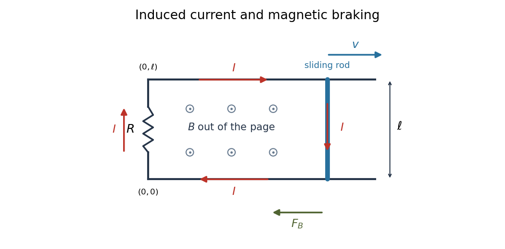

<h1 id="17b/i/solution">Solution</h1>

↑ **Parent:** [I](../i.md)

The bar's motion increases positive $z$-directed [magnetic flux](../../../../../../magnetic-flux.md) at rate $B\ell v$. By [Lenz's law](../../../../../../lenz-s-law.md), induced current circulates clockwise as viewed from positive $z$, producing a field into the page. Equivalently $\mathbf v\times\mathbf B=-vB\hat{\mathbf y}$ drives positive charge down the moving bar. The [motional electromotive force](../../../../../../motional-electromotive-force.md) has magnitude $B\ell v$, so

$$
\boxed{I=\frac{B\ell v}{R}.}
$$

The current flows downward in the bar, left along the lower rail, upward through the resistor, and right along the upper rail. The ideal circuit approximation neglects self-inductance and the bar's resistance.

**[Figure 1](#17b/i/image-clockwise-induced-current-and-magnetic-braking-for-a-rod-moving-right-through-an-outward-magnetic-field). Clockwise induced current and magnetic braking for a rod moving right through an outward magnetic field**.

## ↑ Ancestors (11)

1. [I](../i.md)
2. [17B](../../17b.md)
3. [Paper 2](../../../paper-2-split.md)
4. [Ib](../../../split.md)
5. [2008](../../../../split.md)
6. [Past exam of the mathematics course of the University of Cambridge](../../../../../split.md)
7. [Mathematics course of the University of Cambridge](../../../../../../mathematics-course-of-the-university-of-cambridge.md)
8. [Course of the University of Cambridge](../../../../../../course-of-the-university-of-cambridge.md)
9. [University of Cambridge](../../../../../../university-of-cambridge-split.md)
10. [List of universities](../../../../../../list-of-universities.md)
11. [Codex Wiki](../../../../../../split.md)
