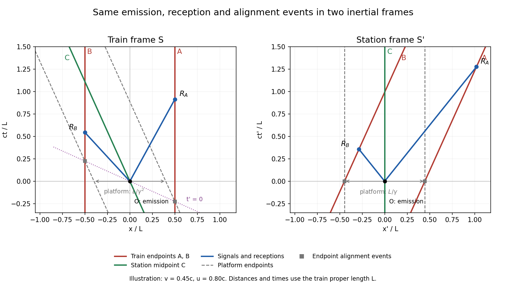

<h1 id="17c/a/solution">Solution</h1>

↑ **Parent:** [A](../a.md)

The [world lines](../../../../../../world-line.md) in the train frame are $x_A=L/2$, $x_B=-L/2$ and $x_C=-vt$. In the station frame, [length contraction](../../../../../../length-contraction.md) gives

$$
x'_A=vt'+\frac{L}{2\gamma},\qquad x'_B=vt'-\frac{L}{2\gamma},\qquad x'_C=0.
$$

The emission event is $O=(0,0)$ in both frames. The signal [world lines](../../../../../../world-line.md) in $S'$ are $x'=ut'$ and $x'=-ut'$; their intersections with the train endpoints define the reception events $R_A,R_B$. Their velocities in $S$, from the [relativistic velocity-addition formula](../../../../../../velocity-addition-formula.md), are $(u-v)/(1-uv/c^2)$ and $-(u+v)/(1+uv/c^2)$.

The two platform-alignment events occur at $(x',t')=(\pm L/(2\gamma),0)$ in $S'$. The [Lorentz transformation](../../../../../../lorentz-transformation.md) puts them at $(x,t)=(\pm L/2,\mp vL/(2c^2))$ in $S$, on the tilted simultaneity line $t=-vx/c^2$. The [spacetime diagrams](../../../../../../spacetime-diagram.md) show all three observers, both signals, their receptions, and these distinct endpoint-alignment events:

**[Figure 1](#17c/a/image-train-and-station-spacetime-diagrams-with-signal-receptions-and-simultaneous-platform-alignments). Train and station spacetime diagrams with signal receptions and simultaneous platform alignments**.

## ↑ Ancestors (11)

1. [A](../a.md)
2. [17C](../../17c.md)
3. [Paper 4](../../../paper-4-split.md)
4. [Ib](../../../split.md)
5. [2008](../../../../split.md)
6. [Past exam of the mathematics course of the University of Cambridge](../../../../../split.md)
7. [Mathematics course of the University of Cambridge](../../../../../../mathematics-course-of-the-university-of-cambridge.md)
8. [Course of the University of Cambridge](../../../../../../course-of-the-university-of-cambridge.md)
9. [University of Cambridge](../../../../../../university-of-cambridge-split.md)
10. [List of universities](../../../../../../list-of-universities.md)
11. [Codex Wiki](../../../../../../split.md)
