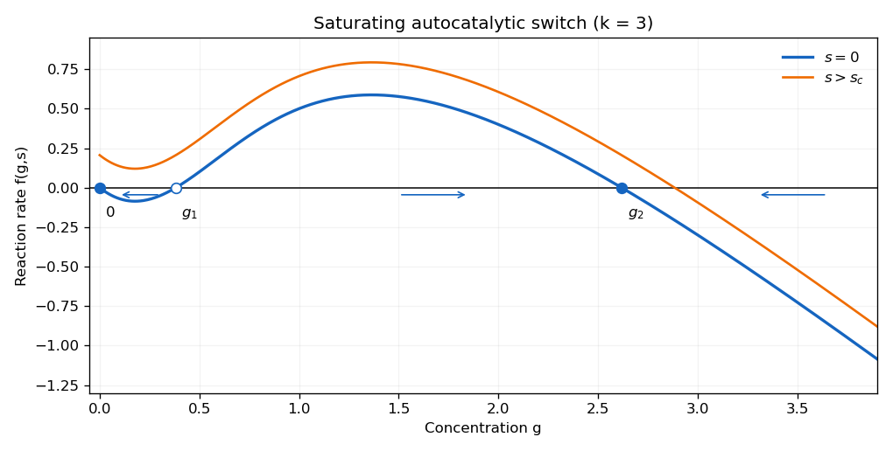

<h1 id="6b/solution">Solution</h1>

↑ **Parent:** [6B](../6b.md)

Continue in the bistable regime $k>2$. At $s=0$ the reaction function factors as $f(g,0)=g(kg-1-g^2)/(1+g^2)$. Besides $g=0$, its positive equilibria are

$$
\boxed{g_1=\frac{k-\sqrt{k^2-4}}2<1,\qquad g_2=\frac{k+\sqrt{k^2-4}}2>1.}
$$

At zero, $f_g=-1$, so it is stable. At a positive equilibrium, use $k=(1+g^2)/g$ to obtain $f_g=(1-g^2)/(1+g^2)$. Therefore $g_1$ is unstable and $g_2$ stable. The sign of $f$ is negative on $(0,g_1)$, positive on $(g_1,g_2)$ and negative beyond $g_2$; these signs determine the requested reaction-rate sketch.

The stationary points of $f(g,0)$ obey $(1+g^2)^2=2kg$. For $k>2$ its smaller solution $g_c<1$ is the local minimum, and its larger solution lies above one and is the local maximum. Since increasing $s$ translates the whole graph upward, the low and middle equilibria collide when

$$
\boxed{s_c=-f(g_c,0)=\frac{g_c(1-g_c^2)}2,\qquad (1+g_c^2)^2=2kg_c.}
$$

For $s>s_c$, both stationary values of $f$ are positive, while $f(g,s)\to-\infty$ as $g\to\infty$; there is exactly one nonnegative equilibrium, on the descending high branch. At equality a double low equilibrium remains, so the uniqueness assertion requires strict exceedance.

For completeness, if the later positive-input request is considered for arbitrary $k>0$, the derivative is $f_g=2kg/(1+g^2)^2-1$. Its maximum is $9k/(8\sqrt3)-1$, attained at $g=1/\sqrt3$. For $k\leq8\sqrt3/9$, the reaction graph is decreasing and every $s>0$ already has a unique steady state, so take $s_c=0$. For $k>8\sqrt3/9$, the smaller positive stationary point gives the same $s_c=g_c(1-g_c^2)/2$; above it the graph crosses zero only on its final descending branch. Persistent robust switching after input is removed uses the previously assumed bistable regime $k>2$.

Starting near zero, raise $s$ past $s_c$ and keep it there long enough for $g$ to pass the unstable threshold and approach the high branch. Decrease $s$ back to zero slowly, or after ensuring $g>g_1$. The trajectory then stays in the basin of the high [stable equilibrium](../../../../../stable-equilibrium.md) and ends at the displayed $g_2$. **The persistent switched state is $g_2=(k+\sqrt{k^2-4})/2$.** This is the [saturating autocatalytic switch](../../../../../saturating-autocatalytic-switch.md); the conclusion presupposes $k>2$ and enough forcing duration, not merely an arbitrarily short pulse of large amplitude.

**[Figure 1](#6b/image-feedback-production-and-degradation-curves-showing-bistability-and-a-sustained-switching-pulse). Feedback production and degradation curves showing bistability and a sustained switching pulse**.

## ↑ Ancestors (10)

1. [6B](../6b.md)
2. [Paper 1](../../paper-1-split.md)
3. [Ii](../../split.md)
4. [2008](../../../split.md)
5. [Past exam of the mathematics course of the University of Cambridge](../../../../split.md)
6. [Mathematics course of the University of Cambridge](../../../../../mathematics-course-of-the-university-of-cambridge.md)
7. [Course of the University of Cambridge](../../../../../course-of-the-university-of-cambridge.md)
8. [University of Cambridge](../../../../../university-of-cambridge-split.md)
9. [List of universities](../../../../../list-of-universities.md)
10. [Codex Wiki](../../../../../split.md)
