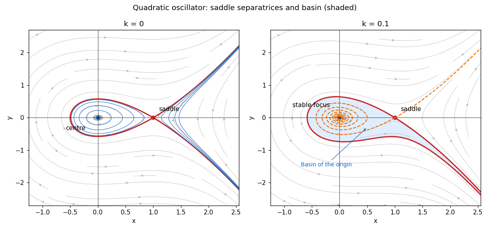

<h1 id="7a/i/solution">Solution</h1>

↑ **Parent:** [I](../i.md)

For $k=0$, the [first integral](../../../../../../first-integral.md)

$$
E(x,y)=\frac{y^2}{2}+\frac{x^2}{2}-\frac{x^3}{3}
$$

has $\dot E=0$. The [equilibrium points](../../../../../../equilibrium-point-of-a-dynamical-system.md) are $(0,0)$ and $(1,0)$. The [linearization](../../../../../../linearization.md) has [eigenvalues](../../../../../../eigenvalue.md) $\pm i$ at the origin and $\pm1$ at $(1,0)$. The origin is a [center equilibrium](../../../../../../center-equilibrium.md): the sufficiently small positive [level sets](../../../../../../level-set.md) of $E$ are closed curves, since its [Hessian matrix](../../../../../../hessian-matrix.md) there is [positive-definite](../../../../../../positive-definite-bilinear-form.md). The other equilibrium is a [saddle equilibrium](../../../../../../saddle-equilibrium.md).

At the saddle, $E=1/6$, and the [separatrix](../../../../../../separatrix.md) satisfies

$$
y^2=\frac{(x-1)^2(2x+1)}3.
$$

Its two branches with $-1/2\leq x\leq1$ form a [homoclinic orbit](../../../../../../homoclinic-orbit.md) through the saddle; its remaining branches extend to $x>1$. Inside the loop, the closed trajectories run clockwise: above the horizontal axis $\dot x=y>0$. The saddle directions have slopes $+1$ and $-1$. Outside the loop there are unbounded trajectories. The left panel shows the closed orbits and all saddle branches.

**[Figure 2](#7a/i/image-conservative-phase-portrait-and-the-attracting-basin-after-adding-weak-damping). Conservative phase portrait and the attracting basin after adding weak damping**.

## ↑ Ancestors (11)

1. [I](../i.md)
2. [7A](../../7a.md)
3. [Paper 1](../../../paper-1-split.md)
4. [Ii](../../../split.md)
5. [2008](../../../../split.md)
6. [Past exam of the mathematics course of the University of Cambridge](../../../../../split.md)
7. [Mathematics course of the University of Cambridge](../../../../../../mathematics-course-of-the-university-of-cambridge.md)
8. [Course of the University of Cambridge](../../../../../../course-of-the-university-of-cambridge.md)
9. [University of Cambridge](../../../../../../university-of-cambridge-split.md)
10. [List of universities](../../../../../../list-of-universities.md)
11. [Codex Wiki](../../../../../../split.md)
