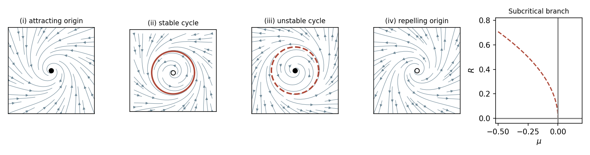

# Paper 2

↑ **Parent:** [Ii](../ii.md)

[https://www.maths.cam.ac.uk/undergrad/pastpapers/files/2008/PaperII_2.pdf](https://www.maths.cam.ac.uk/undergrad/pastpapers/files/2008/PaperII_2.pdf)

**Table of contents**

- [1H](#1h)
  - [Solution](#1h/solution)
- [2F](#2f)
  - [a](#2f/a)
    - [Solution](#2f/a/solution)
  - [b](#2f/b)
    - [Solution](#2f/b/solution)
- [3G](#3g)
  - [Solution](#3g/solution)
- [4G](#4g)
  - [Solution](#4g/solution)
- [5J](#5j)
  - [Solution](#5j/solution)
- [6B](#6b)
  - [Solution](#6b/solution)
- [7A](#7a)
  - [Solution](#7a/solution)
- [8C](#8c)
  - [Solution](#8c/solution)
- [9A](#9a)
  - [Solution](#9a/solution)
- [10E](#10e)
  - [Solution](#10e/solution)
- [11F](#11f)
  - [Solution](#11f/solution)
- [12G](#12g)
  - [Solution](#12g/solution)
- [13B](#13b)
  - [a](#13b/a)
    - [Solution](#13b/a/solution)
  - [b](#13b/b)
    - [Solution](#13b/b/solution)
  - [c](#13b/c)
    - [Solution](#13b/c/solution)
- [14C](#14c)
  - [i](#14c/i)
    - [Solution](#14c/i/solution)
  - [ii](#14c/ii)
    - [Solution](#14c/ii/solution)
- [15B](#15b)
  - [Solution](#15b/solution)
- [16G](#16g)
  - [i](#16g/i)
    - [Solution](#16g/i/solution)
  - [ii](#16g/ii)
    - [Solution](#16g/ii/solution)
  - [iii](#16g/iii)
    - [Solution](#16g/iii/solution)
- [17F](#17f)
  - [Solution](#17f/solution)
- [18H](#18h)
  - [i](#18h/i)
    - [Solution](#18h/i/solution)
  - [ii](#18h/ii)
    - [Solution](#18h/ii/solution)
  - [iii](#18h/iii)
    - [Solution](#18h/iii/solution)
- [19G](#19g)
  - [Solution](#19g/solution)
- [20G](#20g)
  - [a](#20g/a)
    - [Solution](#20g/a/solution)
  - [b](#20g/b)
    - [Solution](#20g/b/solution)
- [21F](#21f)
  - [Solution](#21f/solution)
- [22F](#22f)
  - [Solution](#22f/solution)
- [23H](#23h)
  - [Solution](#23h/solution)
- [24H](#24h)
  - [a](#24h/a)
    - [Solution](#24h/a/solution)
  - [b](#24h/b)
    - [Solution](#24h/b/solution)
  - [c](#24h/c)
    - [Solution](#24h/c/solution)
- [25J](#25j)
  - [Solution](#25j/solution)
- [26I](#26i)
  - [a](#26i/a)
    - [Solution](#26i/a/solution)
  - [b](#26i/b)
    - [Solution](#26i/b/solution)
  - [c](#26i/c)
    - [Solution](#26i/c/solution)
  - [d](#26i/d)
    - [Solution](#26i/d/solution)
  - [e](#26i/e)
    - [Solution](#26i/e/solution)
  - [f](#26i/f)
    - [Solution](#26i/f/solution)
  - [g](#26i/g)
    - [Solution](#26i/g/solution)
- [27I](#27i)
  - [Solution](#27i/solution)
- [28J](#28j)
  - [a](#28j/a)
    - [Solution](#28j/a/solution)
  - [b](#28j/b)
    - [Solution](#28j/b/solution)
  - [c](#28j/c)
    - [Solution](#28j/c/solution)
  - [d](#28j/d)
    - [Solution](#28j/d/solution)
- [29I](#29i)
  - [Solution](#29i/solution)
- [30C](#30c)
  - [i](#30c/i)
    - [Solution](#30c/i/solution)
  - [ii](#30c/ii)
    - [Solution](#30c/ii/solution)
  - [iii](#30c/iii)
    - [Solution](#30c/iii/solution)
- [31C](#31c)
  - [Solution](#31c/solution)
- [32D](#32d)
  - [Solution](#32d/solution)
- [33E](#33e)
  - [Solution](#33e/solution)
- [34E](#34e)
  - [Solution](#34e/solution)
- [35E](#35e)
  - [Solution](#35e/solution)
- [36A](#36a)
  - [Solution](#36a/solution)
- [37B](#37b)
  - [Solution](#37b/solution)
- [38C](#38c)
  - [a](#38c/a)
    - [Solution](#38c/a/solution)
  - [b](#38c/b)
    - [Solution](#38c/b/solution)

## 1H

↑ **Parent:** [Paper 2](paper-2.md)

<h3 id="1h/solution">Solution</h3>

↑ **Parent:** [1H](#1h)

For an integral [binary quadratic form](../../../number-theory.md#binary-quadratic-form) $[a,b,c]=ax^2+bxy+cy^2$ with $a>0$ and $D=b^2-4ac<0$, the [reduced positive definite binary quadratic form](../../../number-theory.md#reduced-positive-definite-binary-quadratic-form) convention is $|b|\le a\le c$, with $b\ge0$ on either boundary $|b|=a$ or $a=c$. Since $|D|=4ac-b^2\ge3a^2$, the [enumeration of reduced binary quadratic forms](../../../number-theory.md#enumeration-of-reduced-binary-quadratic-forms) for $D=-23$ has $a\le\sqrt{23/3}<3$. The integer $b$ is odd. For $a=1$, only $b=1$ is retained and $c=6$; for $a=2$, both $b=\pm1$ give $c=3$. Thus the complete list is

$$
\boxed{x^2+xy+6y^2,\qquad2x^2+xy+3y^2,\qquad2x^2-xy+3y^2.}
$$

A proper representation of a prime uses a primitive representing vector. Completing that vector to a matrix in $\operatorname{SL}_2(\mathbb Z)$ transforms a representing form to $[p,b,c]$, so its [discriminant of a binary quadratic form](../../../number-theory.md#discriminant-of-a-binary-quadratic-form) gives $b^2\equiv-23\pmod p$. Conversely, choose an odd $b$ satisfying this congruence and put $c=(b^2+23)/(4p)$. This is integral, and $[p,b,c]$ is positive definite and represents $p$ at $(1,0)$. This proves the [discriminant criterion for prime representation by a binary quadratic form](../../../number-theory.md#discriminant-criterion-for-prime-representation-by-a-binary-quadratic-form) here.

For $p\ne23$, [quadratic reciprocity](../../../number-theory.md#quadratic-reciprocity) gives $(-23/p)=(p/23)$. Including the ramified prime, the answer is therefore

$$
\boxed{p=23\quad\text{or}\quad p\bmod23\in\{1,2,3,4,6,8,9,12,13,16,18\}.}
$$

For example $[23,23,6]$ supplies a proper representation of $23$. Reduction transfers every such representation to one of the three displayed forms.

## 2F

↑ **Parent:** [Paper 2](paper-2.md)

<h3 id="2f/a">a</h3>

↑ **Parent:** [2F](#2f)

<h4 id="2f/a/solution">Solution</h4>

↑ **Parent:** [A](#2f/a)

The planar [Brouwer fixed-point theorem](../../../topological-analysis.md#brouwer-fixed-point-theorem) says that every continuous map from the closed disk $D$ to itself has a [fixed point](../../../function.md#fixed-point). If a [retraction](../../../topology.md#retraction) $r:D\to\partial D$ existed, $x\mapsto-r(x)$ would be a continuous self-map of $D$. At a [fixed point](../../../function.md#fixed-point) $x=-r(x)$, $x$ lies on the boundary, where $r(x)=x$; this would give $x=-x$, impossible on the unit circle.

Conversely, suppose a continuous self-map $f:D\to D$ has no [fixed point](../../../function.md#fixed-point). For each $x$, take the ray starting at $f(x)$ through $x$, and let $r(x)$ be its exit point on $\partial D$. The denominator $|x-f(x)|$ never vanishes, and solving the quadratic intersection with the circle shows that the exit point depends continuously on $x$. More explicitly, with $v=x-f(x)$,

$$
r(x)=f(x)+\lambda(x)v,\qquad \lambda(x)=\frac{-f(x)\cdot v+\sqrt{(f(x)\cdot v)^2+(1-|f(x)|^2)|v|^2}}{|v|^2}.
$$

The ray exits beyond or at $x$, so $\lambda\ge1$, and when $x\in\partial D$ its exit point is $x$. Hence $r$ is a [retraction](../../../topology.md#retraction). **Nonexistence of a boundary retraction and the planar fixed-point theorem are equivalent.**

<h3 id="2f/b">b</h3>

↑ **Parent:** [2F](#2f)

<h4 id="2f/b/solution">Solution</h4>

↑ **Parent:** [B](#2f/b)

Define the continuous map $T(z)=-(z^6-z^5+2z^2+1)/6$. For $|z|\le1$, the [triangle inequality](../../../topological-analysis.md#triangle-inequality) gives $|T(z)|\le(1+1+2+1)/6=5/6$. Thus $T$ maps the closed unit disk into itself. By the [Brouwer fixed-point theorem](../../../topological-analysis.md#brouwer-fixed-point-theorem), some $z$ has $T(z)=z$, which rearranges to

$$
\boxed{z^6-z^5+2z^2+6z+1=0,\qquad |z|\le5/6.}
$$

This supplies the requested existence and even places a root strictly inside the unit disk.

## 3G

↑ **Parent:** [Paper 2](paper-2.md)

<h3 id="3g/solution">Solution</h3>

↑ **Parent:** [3G](#3g)

Every discrete additive subgroup of $\mathbb R^2$ has the form $\mathbb Zv_1+\cdots+\mathbb Zv_r$ for linearly independent vectors, with $r=0,1,$ or $2$. A full [translation lattice](../../../riemannian-geometry.md#translation-lattice) has $r=2$, and conversely every such integer span is a discrete cocompact subgroup. This classifies planar lattices up to a choice of basis.

A [frieze group](../../../riemannian-geometry.md#frieze-group) is a discrete group of planar [Euclidean isometries](../../../riemannian-geometry.md#euclidean-isometry) whose [translation subgroup](../../../riemannian-geometry.md#translation-subgroup) is infinite cyclic and has finite index. Consider the [glide reflection](../../../riemannian-geometry.md#glide-reflection) $g(x,y)=(x+1,-y)$. Its square is translation by $(2,0)$, whereas every odd power reverses orientation. Therefore $\langle g\rangle\cong\mathbb Z$, but none of its translation elements generates the whole group: they form the index-two subgroup $\langle g^2\rangle$.

To realize exactly this [frieze group](../../../riemannian-geometry.md#frieze-group), repeat a small scalene triangular motif at the points $(n,(-1)^n)$, reflecting the motif when $n$ is odd. Choose the motif with three distinct side lengths and no internal symmetry. The displayed pattern has [glide reflection](../../../riemannian-geometry.md#glide-reflection) symmetry $g$ and translation period $2$, but no pure horizontal reflection or vertical mirror. Distinct side lengths force any symmetry to preserve corresponding vertices, which rules out extra motif permutations; the sequence of heights then leaves exactly the powers of $g$.

**[Figure 1](#3g/image-alternating-reflected-scalene-motifs-with-a-glide-reflection-generator-and-translation-period-two). Alternating reflected scalene motifs with a glide-reflection generator and translation period two**.

## 4G

↑ **Parent:** [Paper 2](paper-2.md)

<h3 id="4g/solution">Solution</h3>

↑ **Parent:** [4G](#4g)

For [Shannon-Fano coding](../../../coding-theory.md#shannon-fano-coding), order the symbols by decreasing probability and recursively split each current list into two contiguous groups with total probabilities as close as possible. Label the two branches $0$ and $1$; the path to a symbol is its [prefix code](../../../coding-theory.md#prefix-code) word. Here the first split is $\{a\}$ of weight $.4$ against $\{b,c,d\}$ of weight $.6$. The latter splits into $\{b\}$ and $\{c,d\}$, each of weight $.3$. One answer is

$$
\boxed{a:0,\qquad b:10,\qquad c:110,\qquad d:111.}
$$

For [Huffman coding](../../../information-theory.md#huffman-coding), repeatedly merge the two least-probable nodes and then read the resulting binary tree from the root. Merge $c,d$ to weight $.3$, merge this node with $b$ to weight $.6$, and merge with $a$. The same displayed [prefix code](../../../coding-theory.md#prefix-code) results. Its mean length is $.4+2(.3)+3(.2)+3(.1)=\boxed{1.9\text{ bits per symbol}}$. Choices at ties and exchange of binary labels yield other equivalent codes. [Huffman coding](../../../information-theory.md#huffman-coding) minimizes mean length among binary [prefix codes](../../../coding-theory.md#prefix-code); the top-down Shannon-Fano construction does not have that general optimality guarantee.

## 5J

↑ **Parent:** [Paper 2](paper-2.md)

<h3 id="5j/solution">Solution</h3>

↑ **Parent:** [5J](#5j)

Under independent [normal distributions](../../../probability-theory.md#normal-distribution), [maximum likelihood estimation](../../../statistical-modelling.md#maximum-likelihood-estimation) minimizes $(y_A-\alpha)^2+(y_B-\beta)^2+(y_C-\gamma)^2$ subject to $\alpha+\beta+\gamma=\pi$. A [Lagrange multiplier](../../../mathematical-optimization.md#lagrange-multiplier) gives the same correction at every corner. Writing $s=y_A+y_B+y_C$, the interior estimates are

$$
\boxed{\widehat\alpha=y_A+\frac{\pi-s}{3},\quad\widehat\beta=y_B+\frac{\pi-s}{3},\quad\widehat\gamma=y_C+\frac{\pi-s}{3}.}
$$

The result is unchanged if the common [variance](../../../variance.md) is unknown, since profiling it still minimizes the residual sum of squares. If physical positivity of the three angles is imposed and this projection gives a negative component, the constrained estimate over the closed simplex is instead $\widehat\theta_i=\max(y_i-\lambda,0)$, with $\lambda$ chosen to make the components sum to $\pi$. If only strictly nondegenerate triangles are admitted, a boundary optimum is merely an unattained likelihood supremum.

The normal-error model is a useful small-error approximation, but its unbounded tails assign positive probability to impossible measured angles. Periodicity or a measurement convention may matter for large errors, and equal [variance](../../../variance.md) and independence require experimental justification. The exact sum constraint on the true angles does not itself invalidate independence of three raw measurement errors. After imposing that constraint, however, the fitted-angle errors are correlated: the covariance of the interior estimator is $\sigma^2(I-\boldsymbol1\boldsymbol1^T/3)$.

## 6B

↑ **Parent:** [Paper 2](paper-2.md)

<h3 id="6b/solution">Solution</h3>

↑ **Parent:** [6B](#6b)

The [Ricker population map](../../../mathematical-biology.md#ricker-population-map) has equilibria $N=0$ and $N=K$. Since $f'(N)=e^{r(1-N/K)}(1-rN/K)$, their linearization multipliers are

$$
\boxed{f'(0)=e^r>1,\qquad f'(K)=1-r.}
$$

Thus extinction is unstable and the positive equilibrium is locally asymptotically stable for $0<r<2$, becoming unstable for $r>2$.

To verify an actual [period-doubling bifurcation](../../../dynamical-systems.md#period-doubling-bifurcation), rather than only a multiplier crossing, put $N/K=1+x$ and $r=2+\varepsilon$. The centered map is

$$
x\mapsto-(1+\varepsilon)x+O(\varepsilon x^2)+\frac23x^3+O(\varepsilon x^3+x^4).
$$

Its second iterate minus $x$ is $2\varepsilon x-\tfrac43x^3$ to leading order. After rescaling $x=\sqrt{\varepsilon}y$, the limiting nonzero roots are simple, so the [implicit function theorem](../../../calculus.md#implicit-function-theorem) continues them. Besides $x=0$, two nearby points therefore appear for $\varepsilon>0$, with $x_\pm=\pm\sqrt{3\varepsilon/2}+O(\varepsilon)$. The map exchanges these points, and the derivative of its second iterate there is $1-4\varepsilon+O(\varepsilon^{3/2})$, so the emerging two-cycle is attracting. **The bifurcation at $r=2$ is supercritical period doubling.**

For nonnegative populations, $f$ increases up to $N=K/r$ and decreases thereafter to zero. Hence every update after the initial time satisfies

$$
\boxed{0\le N_t\le f(K/r)=\frac Kr e^{r-1},\qquad t\ge1.}
$$

The bound is attained by choosing $N_0=K/r$; it is not a bound on an arbitrary initial population.

**[Figure 2](#6b/image-unimodal-ricker-update-with-its-maximum-at-k-divided-by-r-and-the-positive-fixed-point-at-k). Unimodal Ricker update with its maximum at K divided by r and the positive fixed point at K**.

## 7A

↑ **Parent:** [Paper 2](paper-2.md)

<h3 id="7a/solution">Solution</h3>

↑ **Parent:** [7A](#7a)

At a [stationary bifurcation](../../../dynamical-systems.md#stationary-bifurcation), a real [eigenvalue](../../../linear-operator-theory.md#eigenvalue) of the equilibrium linearization crosses zero; the critical motion has zero frequency. At a [Hopf bifurcation](../../../dynamical-systems.md#hopf-bifurcation), a conjugate pair crosses the imaginary axis at $\pm i\omega$ with $\omega>0$, permitting a nearby [limit cycle](../../../dynamical-systems.md#limit-cycle).

The [Hopf normal form](../../../dynamical-systems.md#hopf-normal-form) has a small cycle when $R^2=\mu/a+O(\mu^2)>0$. Its radial multiplier exponent is $\partial_r\dot r|_R=-2\mu+O(\mu^2)$, while the origin's radial exponent is $\mu$. Thus: for $\mu<0

**[Figure 3](#7a/image-four-local-hopf-phase-portraits-and-the-unstable-subcritical-radius-branch). Four local Hopf phase portraits and the unstable subcritical radius branch**.

The [subcritical bifurcation](../../../dynamical-systems.md#subcritical-bifurcation) has $a<0$ and the unstable radius branch $R=\sqrt{\mu/a}+O(|\mu|^{3/2})$ on $\mu<0$, meeting the origin at $\mu=0$. On either existing branch, the angular speed is $\omega+(c-b/a)\mu+O(\mu^2)$, so

$$
T=\frac{2\pi}{\omega+(c-b/a)\mu+O(\mu^2)},\qquad \boxed{\frac{dT}{d\mu}=-\frac{2\pi}{\omega^2}\left(c-\frac ba\right)+O(\mu).}
$$

## 8C

↑ **Parent:** [Paper 2](paper-2.md)

<h3 id="8c/solution">Solution</h3>

↑ **Parent:** [8C](#8c)

For the [beta function](../../../complex-analysis.md#beta-function), split $1=t+(1-t)$ inside the integral to obtain $B(z,q)=B(z,q+1)+B(z+1,q)$. Integrating the derivative of $t^q(1-t)^z$ over $(0,1)$ gives $qB(z+1,q)=zB(z,q+1)$, since both endpoint terms vanish in the initial domain. Combining these identities yields

$$
\boxed{B(z,q)=\frac{z+q}{z}B(z+1,q).}
$$

Repeatedly apply this recurrence until $\operatorname{Re}(z+n)>0$. Each resulting expression agrees with the original integral on overlap, so it gives its unique [analytic continuation](../../../complex-analysis.md#analytic-continuation). Possible singularities are only $z=0,-1,-2,\ldots$.

Near $z=0$, $zB(z,q)\to qB(1,q)=1$. Continuing the recurrence downwards gives

$$
\boxed{\operatorname{Res}_{z=-n}B(z,q)=\frac{(-1)^n}{n!}(q-1)(q-2)\cdots(q-n),\qquad n\ge0,}
$$

where the empty product is $1$. The recurrence shows that each singularity is at most a [simple pole](../../../isolated-singularity.md#simple-pole). If $q$ is not a positive integer, all these residues are nonzero and all the listed points are poles. If $q=m$ is a positive integer, poles occur only for $0\le n<m$; the later candidates are removable, as is also clear from $B(z,m)=(m-1)!/[z(z+1)\cdots(z+m-1)]$. This qualification matters when claiming a pole at every nonpositive integer.

## 9A

↑ **Parent:** [Paper 2](paper-2.md)

<h3 id="9a/solution">Solution</h3>

↑ **Parent:** [9A](#9a)

Varying the [Lagrangian](../../../calculus-of-variations.md#lagrangian) gives, with the cyclic angle conventions,

$$
\boxed{m_i a^2\ddot\theta_i=k(\theta_{i+1}-2\theta_i+\theta_{i-1}).}
$$

All successive angular gaps are $2\pi/N$ in equilibrium, so their two contributions cancel. Because the potential depends only on gaps, a uniform change of all angles costs no energy. Its Hessian therefore annihilates $(1,\ldots,1)$, giving a zero-frequency [normal mode](../../../wave-equation.md#normal-mode). The corresponding motion is rigid rotation, $\theta_i(t)=\theta_i^{(0)}+A+Bt$, including a constant common angular shift.

For two particles write $\theta_2-\theta_1=\pi+\delta_2-\delta_1$. Both cyclic gaps contribute, so the quadratic potential is $k(\delta_2-\delta_1)^2$. With the specified masses, the mass matrix is $km\operatorname{diag}(1,2)$ and the stiffness matrix is $2k\left(\begin{smallmatrix}1&-1\\-1&1\end{smallmatrix}\right)$. The [generalized eigenvalue problem](../../../linear-operator-theory.md#generalized-eigenvalue-problem) gives

$$
\boxed{\omega_0=0,\quad(\delta_1,\delta_2)\propto(1,1);\qquad \omega_1=\sqrt{3/m},\quad(\delta_1,\delta_2)\propto(2,-1).}
$$

The finite-frequency [normal mode](../../../wave-equation.md#normal-mode) keeps the mass-weighted mean angle fixed and changes the angular separation sinusoidally. Together with the two rigid-rotation constants, it spans all small motions about equilibrium.

## 10E

↑ **Parent:** [Paper 2](paper-2.md)

<h3 id="10e/solution">Solution</h3>

↑ **Parent:** [10E](#10e)

For a regular spherical star, [mass conservation](../../../continuum-mechanics.md#mass-conservation) gives $m'=4\pi r^2\rho$. Multiplying the [hydrostatic equilibrium](../../../statistical-physics.md#hydrostatic-equilibrium) equation by $r^2/\rho$ and differentiating therefore yields

$$
\boxed{\frac{d}{dr}\left(\frac{r^2}{\rho}\frac{dP}{dr}\right)=-4\pi G r^2\rho.}
$$

At the center, finite density implies $m(r)=O(r^3)$, so a regular pressure satisfies $P(0)=P_c<\infty$ and $P'(0)=0$. At a free outer boundary in vacuum, $P(R)=0$; a surrounding medium would instead prescribe its external pressure.

Differentiate the auxiliary function, using both equations:

$$
F'=-\frac{Gm\rho}{r^2}+\frac{Gmm'}{4\pi r^4}-\frac{Gm^2}{2\pi r^5}=-\frac{Gm^2}{2\pi r^5}<0
$$

where enclosed mass is nonzero. Since $m^2/r^4\to0$ at the regular center, $F(0)=P_c$, whereas $F(R)=GM^2/(8\pi R^4)$. Integrating the strictly negative derivative gives

$$
\boxed{P_c>\frac{GM^2}{8\pi R^4}.}
$$

With nonzero external pressure, the corresponding bound is $P_c>P(R)+GM^2/(8\pi R^4)$.

## 11F

↑ **Parent:** [Paper 2](paper-2.md)

<h3 id="11f/solution">Solution</h3>

↑ **Parent:** [11F](#11f)

Let $1$ be the constant function and define $h=L1\in C([0,1])$. Positivity gives $h\ge0$. Fix any $x$ and any continuous $f$. The function $g=f-f(x)1$ vanishes at $x$, so the zero-preserving assumption gives $Lg(x)=0$. By linearity this is $Lf(x)-f(x)L1(x)=0$. Since $x$ was arbitrary,

$$
\boxed{Lf=hf\quad\text{for every }f\in C([0,1]),\qquad h=L1\ge0.}
$$

This proves the [zero-preserving linear operator on continuous functions](../../../topological-vector-space.md#zero-preserving-linear-operator-on-continuous-functions) representation. Zero preservation and linearity determine the [multiplication operator](../../../vector-space.md#multiplication-operator); positivity is needed only for the multiplier's sign. The three numbered conditions in the source are hypotheses of this one request, rather than three separate subquestions.

## 12G

↑ **Parent:** [Paper 2](paper-2.md)

<h3 id="12g/solution">Solution</h3>

↑ **Parent:** [12G](#12g)

In the [Rabin cryptosystem](../../../coding-theory.md#rabin-cryptosystem), choose distinct large odd primes $p,q$, publish $N=pq$, and encrypt $m$ as $c=m^2\bmod N$. Usually $p,q\equiv3\pmod4$, so a square root modulo each prime is obtained by exponentiating to $(p+1)/4$ or $(q+1)/4$. Combine the two independent choices of signs by the [Chinese remainder theorem](../../../mathematics.md#chinese-remainder-theorem) to obtain the four roots modulo $N$ for a message coprime to $N$. Redundancy or a specified encoding distinguishes the intended message. Factoring $N$ makes decryption easy; a general square-root oracle conversely factors $N$ by obtaining two roots not congruent up to sign and taking their greatest common divisor with $N$.

For the [Repeated-message attack on the Rabin cryptosystem](../../../coding-theory.md#repeated-message-attack-on-the-rabin-cryptosystem), first compute $d=\gcd(N,N')$. If $d=1$, use the two ciphertexts to reconstruct $s\in[0,NN')$ with $s\equiv m^2\pmod N$ and $s\equiv m^2\pmod{N'}$. Since $0<m<\min(N,N')$, we have $m^2<NN'$, so this reconstruction is the ordinary integer $m^2$. Therefore

$$
\boxed{m=\sqrt{s}.}
$$

If distinct semiprime moduli have $d>1$, they share a prime; the gcd instead exposes their factors, allowing ordinary Rabin decryption with the usual encoding check. The two cases cover the stated protocol with distinct standard moduli.

In the coprime case, learning this message does not normally reveal the factors or a decryption key, so other messages encrypted only once remain protected by the square-root problem. Exceptional messages with $\gcd(m,N)>1$ do reveal a factor, and the shared-prime-modulus case compromises other messages too. Repetition under fresh coprime moduli is the vulnerability used here, rather than a universal attack on every ciphertext.

## 13B

↑ **Parent:** [Paper 2](paper-2.md)

<h3 id="13b/a">a</h3>

↑ **Parent:** [13B](#13b)

<h4 id="13b/a/solution">Solution</h4>

↑ **Parent:** [A](#13b/a)

For spatially homogeneous solutions, the [bistable cubic reaction-diffusion equation](../../../diffusion-equation.md#bistable-cubic-reaction-diffusion-equation) reduces to $\dot u=f(u)=u(1-u)(u-r)$. Its equilibria are $0,r,1$, and

$$
\boxed{f'(0)=-r<0,\qquad f'(r)=r(1-r)>0,\qquad f'(1)=-(1-r)<0.}
$$

Thus $0$ and $1$ are asymptotically stable, while $r$ is unstable. Small spatial Fourier perturbations have growth rates $f'(u_*)-mk^2$, so diffusion also leaves the two outer uniform states linearly stable.

<h3 id="13b/b">b</h3>

↑ **Parent:** [13B](#13b)

<h4 id="13b/b/solution">Solution</h4>

↑ **Parent:** [B](#13b/b)

At $r=1/2$, write $F(u)=-u^2(1-u)^2/4$, so $F'=f$. Multiplying the stationary equation $mU''+F'(U)=0$ by $U'$ gives $m(U')^2/2+F(U)=C$. The endpoint values and vanishing endpoint derivatives make $C=0$. For the decreasing connection,

$$
U'=-\frac{U(1-U)}{\sqrt{2m}}.
$$

Separate variables and absorb the integration constant into a translation $x_0$. The [logistic front of a bistable cubic equation](../../../diffusion-equation.md#logistic-front-of-a-bistable-cubic-equation) is

$$
\boxed{U(x)=\frac{1}{1+e^{(x-x_0)/\sqrt{2m}}}.}
$$

It approaches $1$ on the left and $0$ on the right and satisfies the stationary differential equation directly.

<h3 id="13b/c">c</h3>

↑ **Parent:** [13B](#13b)

<h4 id="13b/c/solution">Solution</h4>

↑ **Parent:** [C](#13b/c)

A [travelling wave](../../../analysis.md#travelling-wave) $u(x,t)=U(x-vt)$ obeys $mU''+vU'+f(U)=0$, so the mechanical potential in the requested form is $V=F$, up to an additive constant. Here

$$
F(U)=-\frac14U^2(1-U)^2+\frac16(r-\tfrac12)U^2(2U-3).
$$

Its stationary points are maxima at $0,1$ and a minimum at $r$. Since $F(0)=0$ and $F(1)=(1-2r)/12$, the two maxima have equal height at $r=1/2$; the maximum at $1$ is lower for $r>1/2$ and higher for $r<1/2$.

**[Figure 4](#13b/c/image-bistable-front-potentials-with-equal-and-unequal-endpoint-maximum-heights). Bistable front potentials with equal and unequal endpoint maximum heights**.

Multiply the wave equation by $U'$ and integrate along the [heteroclinic orbit](../../../dynamical-systems.md#heteroclinic-orbit). The endpoint derivatives vanish, and $U(-\infty)=1$, $U(\infty)=0$, so

$$
0=\frac m2[(U')^2]_{-\infty}^{\infty}+v\int_{-\infty}^{\infty}(U')^2dz+F(0)-F(1).
$$

Consequently

$$
\boxed{v\int_{-\infty}^{\infty}(U')^2dz=\frac{1-2r}{12},\qquad \operatorname{sgn}v=\operatorname{sgn}(1-2r).}
$$

The integral is positive for a nonconstant front. In fact substitution of the same logistic shape from part (b) gives the exact velocity $v=\sqrt{m/2}(1-2r)$. Thus the $u=1$ phase invades rightwards when $r<1/2$, the zero phase invades leftwards when $r>1/2$, and the balanced front is stationary.

## 14C

↑ **Parent:** [Paper 2](paper-2.md)

<h3 id="14c/i">i</h3>

↑ **Parent:** [14C](#14c)

<h4 id="14c/i/solution">Solution</h4>

↑ **Parent:** [I](#14c/i)

Parametrize the continued branch by $t=re^{i\theta}$, $0\le\theta\le2\pi$. Then $t^{z-1}dt=ir^z e^{iz\theta}d\theta$, giving

$$
\boxed{f(z)=r^z\frac{e^{2\pi iz}-1}{z}\quad(z\ne0),\qquad f(0)=2\pi i.}
$$

The apparent singularity at zero is removable, so $f$ is an [entire function](../../../complex-analysis.md#entire-function). The factor $r^z=e^{z\log r}$ shows its dependence on the contour radius; for instance $f(1/2)=-4\sqrt r$. The integrand is continued along the contour and generally returns on a different branch, so this is not an ordinary integral of a single-valued holomorphic function around a closed loop.

<h3 id="14c/ii">ii</h3>

↑ **Parent:** [14C](#14c)

<h4 id="14c/ii/solution">Solution</h4>

↑ **Parent:** [Ii](#14c/ii)

There is a branch-phase discrepancy in the printed identity. Set $K(z)=\int_{-1}^1e^t(1-t^2)^zdt$ using the positive real base. Shrink the anticlockwise loop at $1$. The outward interval carries phase $e^{-i\pi z}$ and its return phase $e^{i\pi z}$; their difference gives $-2i\sin(\pi z)\int_0^1e^t(1-t^2)^zdt$. The clockwise loop at $-1$ starts with phase $e^{i\pi z}$ and returns with $e^{-i\pi z}$, giving the same coefficient on $(-1,0)$. Small endpoint circles vanish for $\operatorname{Re}z>-1$. Thus the [branch phase in a figure-eight analytic continuation integral](../../../complex-analysis.md#branch-phase-in-a-figure-eight-analytic-continuation-integral) is

$$
\boxed{J(z)=-2i\sin(\pi z)K(z).}
$$

If the printed interval integral uses the prescribed argument $-\pi$, then $I(z)=e^{-i\pi z}K(z)$, and the corrected formula is instead

$$
\boxed{J(z)=-2i e^{i\pi z}\sin(\pi z)I(z).}
$$

For example at $z=1/2$, $K>0$, $I=-iK$ and $J=-2iK$; the printed right side without the phase would be the real number $-2K$. Interpreting its interval integrand as $(1-t^2)^z$ restores the intended identity.

On the fixed contour away from its branch points, the continued logarithm is bounded and $e^t\exp[z\log(t^2-1)]$ is entire in $z$, uniformly on compact sets. Hence $J$ is an [entire function](../../../complex-analysis.md#entire-function). Division by the sine gives a [meromorphic continuation](../../../complex-analysis.md#meromorphic-continuation) of $K$, and multiplication by $e^{-i\pi z}$ gives the continuation of the specified $I$. The only candidate singularities are integers, at most simple. All $0,1,2,\ldots$ are removable because the interval integral is already holomorphic on $\operatorname{Re}z>-1$.

The negative integers $z=-n$, $n\ge1$, are genuine [simple poles](../../../isolated-singularity.md#simple-pole). At such a point the contour integrand is single-valued and

$$
J(-n)=2\pi i\left[\operatorname{Res}_{t=1}\frac{e^t}{(t^2-1)^n}-\operatorname{Res}_{t=-1}\frac{e^t}{(t^2-1)^n}\right].
$$

The first residue is $e$ times a rational number. The second is $e^{-1}$ times a nonzero rational number: expand $e^s(-2+s)^{-n}$ at $s=0$, whose degree-$n-1$ coefficient has sign $(-1)^n$ and nonzero magnitude. They cannot be equal because $e^2$ is irrational. Therefore $J(-n)\ne0$, and the simple sine zero creates a [simple pole](../../../isolated-singularity.md#simple-pole). In particular $\operatorname{Res}_{z=-n}K=-J(-n)/[2\pi i(-1)^n]$.

A circle enclosing both branch points has total logarithmic change $4\pi i$, rather than zero as for the figure eight. For a circle based at $t=2$ with initial real logarithm, shrinking it leaves a connector from $1$ to $2$ as well as the two banks of the interval. Explicitly its integral is

$$
J_C(z)=2i e^{2\pi iz}\sin(\pi z)K(z)+(e^{4\pi iz}-1)\int_1^2e^t(t^2-1)^zdt.
$$

Thus it is not just a known sine factor times $K$: an additional endpoint-singular integral remains. The figure-eight contour eliminates precisely that connector term. This explains why replacing it by the large circle does not give the same direct continuation method.

## 15B

↑ **Parent:** [Paper 2](paper-2.md)

<h3 id="15b/solution">Solution</h3>

↑ **Parent:** [15B](#15b)

Put $\boldsymbol\pi=\boldsymbol p-e\boldsymbol A/c=m\dot{\boldsymbol q}$. From [Hamilton's equations](../../../classical-mechanics.md#hamilton-s-equations),

$$
\dot q_i=\frac{\pi_i}{m},\qquad \dot p_i=\frac e{mc}\pi_j\partial_iA_j.
$$

For the stated time-independent [vector potential](../../../calculus.md#vector-potential), differentiating $\pi_i$ gives $m\ddot q_i=(e/c)\dot q_j(\partial_iA_j-\partial_jA_i)$, or

$$
\boxed{m\ddot{\boldsymbol q}=\frac ec\dot{\boldsymbol q}\times\boldsymbol B,\qquad\boldsymbol B=\nabla\times\boldsymbol A.}
$$

Use the [Poisson bracket](../../../classical-mechanics.md#poisson-bracket) convention $[F,G]=\sum_i(F_{q_i}G_{p_i}-F_{p_i}G_{q_i})$. Then direct differentiation gives

$$
\boxed{[\pi_i,q_j]=-\delta_{ij},\qquad[\pi_i,\pi_j]=\frac ec(\partial_iA_j-\partial_jA_i).}
$$

For $\boldsymbol A=(0,0,F(r))$ with $r=\sqrt{x_1^2+x_2^2}$, the Hamiltonian is independent of $x_3$, so $\dot p_3=0$. The radial force in the horizontal plane is $\dot p_r=e(p_3-eF/c)F'/(mc)$. For circular motion the radial acceleration is $-r\Omega^2$, and $p_r$ is the mechanical radial momentum because the horizontal [vector potential](../../../calculus.md#vector-potential) vanishes. Thus

$$
\boxed{\Omega^2=-\left(p_3-\frac{eF}{c}\right)\frac e{m^2cr}\frac{dF}{dr}.}
$$

A circular orbit at that radius is possible when the right side is nonnegative; positive values give either sense of horizontal rotation, and the longitudinal velocity is the constant $(p_3-eF(r)/c)/m$ along that orbit.

## 16G

↑ **Parent:** [Paper 2](paper-2.md)

<h3 id="16g/i">i</h3>

↑ **Parent:** [16G](#16g)

<h4 id="16g/i/solution">Solution</h4>

↑ **Parent:** [I](#16g/i)

The [Godel completeness theorem](../../../mathematical-logic.md#godel-s-completeness-theorem) for [first-order logic](../../../mathematical-logic.md#first-order-logic) states that $\Gamma\models\phi$ implies $\Gamma\vdash\phi$; together with soundness, semantic consequence and derivability coincide. Equivalently, every syntactically consistent first-order theory has a model. The [compactness theorem](../../../mathematical-logic.md#compactness-theorem) states that a set of first-order sentences has a model if and only if every finite subset has a model. These statements use nonempty first-order structures.

<h3 id="16g/ii">ii</h3>

↑ **Parent:** [16G](#16g)

<h4 id="16g/ii/solution">Solution</h4>

↑ **Parent:** [Ii](#16g/ii)

For each $n$, let $\sigma_n$ assert the existence of $n$ distinct elements. If a theory $T$ has arbitrarily large finite models, every finite subset of $T\cup\{\sigma_n:n\ge1\}$ has a model. By the [compactness theorem](../../../mathematical-logic.md#compactness-theorem), this extended theory has a model, necessarily infinite. Since fields of size $2^j$ are arbitrarily large, no [first-order theory](../../../mathematical-logic.md#first-order-theory) can have exactly the finite fields of characteristic two as its models.

Suppose instead a finite conjunction $\chi$ axiomatized exactly the infinite fields of characteristic two. Let $T_2$ be the field axioms with $1+1=0$. Then $T_2\cup\{\neg\chi\}$ would have exactly the finite characteristic-two fields as models, contradicting the preceding conclusion. Equivalently, compactness of $T_2\cup\{\sigma_n\}\models\chi$ would force some finite size threshold, but arbitrarily large finite fields still fail $\chi$. **The infinite characteristic-two fields are not finitely axiomatizable.**

<h3 id="16g/iii">iii</h3>

↑ **Parent:** [16G](#16g)

<h4 id="16g/iii/solution">Solution</h4>

↑ **Parent:** [Iii](#16g/iii)

The intended [closed-term witness property for quantifier-free existential sentences](../../../mathematical-logic.md#closed-term-witness-property-for-quantifier-free-existential-sentences) needs at least one closed term. Under this hypothesis, suppose the set $\Gamma=\{\neg\phi(t):t\text{ a closed term}\}$ were consistent. By the [Godel completeness theorem](../../../mathematical-logic.md#godel-s-completeness-theorem), it has a model $M$. Take the [substructure](../../../mathematical-logic.md#substructure-of-a-first-order-structure) $M_0$ whose elements are the interpretations of closed terms. It is nonempty and closed under every function symbol. Atomic formulas and their negations have the same truth values in $M_0$ as in $M$, and induction extends this to every [quantifier-free formula](../../../mathematical-logic.md#quantifier-free-formula).

The provable sentence $\exists x\,\phi(x)$ is true in $M_0$ by soundness. Its witness is $t^{M_0}$ for some closed term $t$, so $M\models\phi(t)$, contradicting $M\models\Gamma$. Hence $\Gamma$ is inconsistent. The [compactness theorem](../../../mathematical-logic.md#compactness-theorem) gives a finite inconsistent subset, so completeness and classical propositional reasoning yield

$$
\boxed{\vdash\phi(t_1)\lor\cdots\lor\phi(t_n).}
$$

Without a constant or nullary function, the printed assertion is false as written: in the equality-only language there are no closed terms, but $\exists x\,(x=x)$ is provable. Then $\Gamma$ is empty and consistent. One may repair the usual theorem by assuming a nonempty set of closed terms or adjoining a fresh constant; the latter proves a witness disjunction in the enlarged language, not the missing closed terms in the original one.

## 17F

↑ **Parent:** [Paper 2](paper-2.md)

<h3 id="17f/solution">Solution</h3>

↑ **Parent:** [17F](#17f)

Here graphs are finite and simple. To prove [Dirac theorem](../../../graph-theory.md#dirac-s-theorem), take a longest path $v_1,\ldots,v_\ell$. All neighbours of either endpoint lie on the path. Among indices $1\le i<\ell$, let $S=\{i:v_1v_{i+1}\text{ is an edge}\}$ and $T=\{i:v_iv_\ell\text{ is an edge}\}$. Since $|S|+|T|=d(v_1)+d(v_\ell)\ge n>\ell-1$, some $i$ lies in both. Following the path forward to $v_i$, jumping to $v_\ell$, and following it backwards to $v_{i+1}$ closes a cycle containing every vertex of the path. The degree condition makes the graph connected: two components would each have at least $\delta+1>n/2$ vertices. If $\ell<n$, connectedness gives an edge from an outside vertex to the cycle, and breaking the cycle there makes a longer path. This contradiction proves a [Hamiltonian cycle](../../../graph-theory.md#hamilton-cycle).

For even $n=2m$, the [complete bipartite graph](../../../graph-theory.md#complete-bipartite-graph) $K_{m-1,m+1}$ has minimum degree $m-1$ and no [Hamiltonian cycle](../../../graph-theory.md#hamilton-cycle). For odd $n=2m+1$, $K_{m,m+1}$ has minimum degree $m$ and likewise fails: a bipartite cycle uses equal numbers from its two parts. These examples include the smallest applicable $n$.

Adding one universal vertex gives $n+1$ vertices and minimum degree at least $(n+1)/2$ when the original minimum degree is at least $(n-1)/2$. Apply the proved theorem and remove the universal vertex from its cycle. The remaining sequence is a [Hamiltonian path](../../../graph-theory.md#hamiltonian-path) in the original graph.

A necessary condition for a [Hamiltonian cycle](../../../graph-theory.md#hamilton-cycle) is that deleting a nonempty vertex set $S$ leaves at most $|S|$ components, since deleting those vertices breaks a spanning cycle into at most that many path pieces. For any $k\ge1$, take the connected star $G=K_{1,k+2}$. In $G_k$, deleting its center and the $k$ new vertices leaves $k+2$ components, more than $k+1$. Even two-connectivity does not suffice: take $G=K_{2,k+3}$, which is two-connected. Deleting its two-vertex part and the $k$ new vertices from $G_k$ leaves $k+3$ components, more than $k+2$. **Both connectivity requirements admit counterexamples for every $k$.**

## 18H

↑ **Parent:** [Paper 2](paper-2.md)

<h3 id="18h/i">i</h3>

↑ **Parent:** [18H](#18h)

<h4 id="18h/i/solution">Solution</h4>

↑ **Parent:** [I](#18h/i)

If $\theta=0$, the [splitting field](../../../galois-theory.md#splitting-field) is $K$ and its [Galois group](../../../galois-theory.md#galois-group) is trivial, hence cyclic. Otherwise choose $\alpha$ with $\alpha^n=\theta$. The roots are $\alpha\zeta_n^j$, so the [splitting field](../../../galois-theory.md#splitting-field) is $K(\alpha)$ because $\zeta_n\in K$. The roots are distinct since the characteristic does not divide $n$, making this a [Galois extension](../../../galois-theory.md#finite-galois-extension). Each automorphism satisfies $\sigma(\alpha)=c_\sigma\alpha$ with $c_\sigma\in\langle\zeta_n\rangle$. Because that root-of-unity group is fixed by all automorphisms, $c_{\sigma\tau}=c_\sigma c_\tau$. Thus $\sigma\mapsto c_\sigma$ is an injective homomorphism into a cyclic group. **The splitting-field [Galois group](../../../galois-theory.md#galois-group) is cyclic, of order dividing $n$.**

<h3 id="18h/ii">ii</h3>

↑ **Parent:** [18H](#18h)

<h4 id="18h/ii/solution">Solution</h4>

↑ **Parent:** [Ii](#18h/ii)

An automorphism of $L(\zeta_n)$ fixing $K(\zeta_n)$ fixes $K$. Because $L/K$ is a normal extension, it preserves $L$, so restriction gives a homomorphism

$$
\operatorname{Aut}(L(\zeta_n)/K(\zeta_n))\longrightarrow\operatorname{Aut}(L/K).
$$

Its kernel fixes both $L$ and $\zeta_n$, hence every element of their compositum. Therefore restriction is injective, proving the asserted [subgroup](../../../group.md#subgroup) identification. Normality is the key reason the restriction maps into automorphisms of $L$ rather than just embeddings into a larger field.

<h3 id="18h/iii">iii</h3>

↑ **Parent:** [18H](#18h)

<h4 id="18h/iii/solution">Solution</h4>

↑ **Parent:** [Iii](#18h/iii)

A primitive sixth root of unity satisfies

$$
\boxed{\Phi_6(x)=x^2-x+1,}
$$

which is irreducible over $\mathbb Q$ because its discriminant is $-3$. For the other polynomial choose $\alpha=i\,3^{1/6}$, so $\alpha^6=-3$ and $\alpha^3=-i\sqrt3$. Then $\zeta_6=(1-\alpha^3)/2\in\mathbb Q(\alpha)$, so this field already contains all six roots. The [Eisenstein criterion](../../../commutative-algebra.md#eisenstein-criterion) at $3$ proves $x^6+3$ irreducible, giving a [splitting field](../../../galois-theory.md#splitting-field) of degree six.

Put $r(\alpha)=\zeta_6^2\alpha$ and $s(\alpha)=\zeta_6\alpha$. The first automorphism fixes $\zeta_6$ and has order three. The second sends $\alpha^3$ to its negative, so sends $\zeta_6$ to $\zeta_6^{-1}$; hence $s^2=1$ and $srs=r^{-1}$. These six distinct transformations exhaust the [Galois group](../../../galois-theory.md#galois-group). Therefore

$$
\boxed{\operatorname{Gal}(x^6+3/\mathbb Q)\cong S_3.}
$$

The presence of sixth roots of unity inside the [splitting field](../../../galois-theory.md#splitting-field) is why this particular binomial has degree six rather than a generic twelve-degree [splitting field](../../../galois-theory.md#splitting-field).

## 19G

↑ **Parent:** [Paper 2](paper-2.md)

<h3 id="19g/solution">Solution</h3>

↑ **Parent:** [19G](#19g)

There are seven [irreducible characters](../../../representation-theory.md#irreducible-character), one for each [conjugacy class](../../../group-theory.md#conjugacy-class). Besides the trivial character and the four supplied rows, let the remaining degrees be $d,e$. The sum of squared degrees gives $d^2+e^2=360-(1+25+64+64+100)=106$, whose positive integer solutions are $\{d,e\}=\{5,9\}$. Complex conjugation permutes [irreducible characters](../../../representation-theory.md#irreducible-character) while preserving degree; the known rows are real and each unknown degree occurs just once among the remaining characters, so the two missing characters are real.

Call their entries $x_j,y_j$, with degrees five and nine. Orthogonality with the regular character gives $5x_j+9y_j=-\sum_{\rm known}\chi(1)\chi(C_j)$ for $j>1$. Column norms give $x_j^2+y_j^2=360/|C_j|-\sum_{\rm known}\chi(C_j)^2$. These equations yield two possible rational pairs in some columns. For this [integral character reconstruction from column orthogonality](../../../representation-theory.md#integral-character-reconstruction-from-column-orthogonality), a further constraint is essential: character values are [algebraic integers](../../../algebraic-number-theory.md#algebraic-integer), so rational candidates must be integers. For example at $C_6$, $5x+9y=-9$ and $x^2+y^2=1$ allow $(0,-1)$ and $(-45/53,-28/53)$; the second pair is not integral. The integral choices complete the table:

$$
\boxed{\begin{array}{c|rrrrrrr}
& C_1&C_2&C_3&C_4&C_5&C_6&C_7\\\hline
1&1&1&1&1&1&1&1\\
5&5&1&2&-1&-1&0&0\\
5&5&1&-1&2&-1&0&0\\
8&8&0&-1&-1&0&(1-\sqrt5)/2&(1+\sqrt5)/2\\
8&8&0&-1&-1&0&(1+\sqrt5)/2&(1-\sqrt5)/2\\
9&9&1&0&0&1&-1&-1\\
10&10&-2&1&1&0&0&0
\end{array}}
$$

Every nontrivial row has $\chi(g)\ne\chi(1)$ for $g\ne1$. In a unitary realization, $\chi(g)=\chi(1)$ exactly when all eigenvalues of the representing matrix are one, so each nontrivial irreducible representation is faithful. If a nontrivial proper [normal subgroup](../../../group-theory.md#normal-subgroup) existed, a nontrivial irreducible representation of the nontrivial quotient would pull back to a nontrivial representation with that subgroup in its kernel. This contradicts faithfulness. **The group is simple.**

## 20G

↑ **Parent:** [Paper 2](paper-2.md)

<h3 id="20g/a">a</h3>

↑ **Parent:** [20G](#20g)

<h4 id="20g/a/solution">Solution</h4>

↑ **Parent:** [A](#20g/a)

Put $s=\sqrt{30}$. Since $30\equiv2\pmod4$, the [ring of integers](../../../algebraic-number-theory.md#ring-of-integers) is $\mathbb Z[s]$ and its [field discriminant](../../../algebraic-number-theory.md#field-discriminant) is $120$. All three primes ramify:

$$
\boxed{(p)=\mathfrak p_p^2,\qquad\mathfrak p_p=(p,s),\qquad N\mathfrak p_p=p,\quad p=2,3,5.}
$$

For example $\mathfrak p_p^2\subseteq(p)$ and both ideals have norm $p^2$, proving equality. The [Minkowski bound for ideal classes](../../../algebraic-number-theory.md#minkowski-s-bound) is $\sqrt{120}/2=\sqrt{30}<6$. Thus the [ideal class group](../../../algebraic-number-theory.md#ideal-class-group) is generated by the classes of these prime ideals; an ideal of norm four contributes only the already principal $\mathfrak p_2^2$.

The elements $6+s$ and $5+s$ have norms $6$ and $-5$. Their ideal factorizations give $\mathfrak p_2\mathfrak p_3=(6+s)$ and $\mathfrak p_5=(5+s)$. This also explains the printed hint: $N((6+s)/2)=3/2$, a fraction, not the integer $32$. Therefore $[\mathfrak p_3]=[\mathfrak p_2]$ and $[\mathfrak p_5]=1$, leaving at most two ideal classes. The class of $\mathfrak p_2$ is nontrivial: a principal generator would have norm $\pm2$, but $x^2-30y^2=\pm2$ would require $x^2\equiv2$ or $3\pmod5$, impossible. Hence

$$
\boxed{\operatorname{Cl}(\mathbb Q(\sqrt{30}))\cong\mathbb Z/2\mathbb Z.}
$$

<h3 id="20g/b">b</h3>

↑ **Parent:** [20G](#20g)

<h4 id="20g/b/solution">Solution</h4>

↑ **Parent:** [B](#20g/b)

Units have norm $\pm1$. Norm $-1$ is impossible modulo three. The least positive unit greater than one is

$$
\boxed{\varepsilon=11+2\sqrt{30}.}
$$

Indeed its norm is one. A smaller positive norm-one unit would have $0<y=(\varepsilon'-1/\varepsilon')/(2\sqrt{30})<2$, forcing $y=1$, but then $x^2=31$. Multiplying an arbitrary positive unit by powers of $\varepsilon$ reduces it to $[1,\varepsilon)$, so minimality proves that all units are $\pm\varepsilon^n$.

The equation with right side $+5$ is impossible modulo three, since it would require $x^2\equiv2\pmod3$. For norm $-5$, let $\beta=5+\sqrt{30}$, so $\beta^2=5\varepsilon$ and $\beta/\varepsilon=\sqrt{30}-5$. For [unit reduction for quadratic norm equations](../../../number-theory.md#unit-reduction-for-quadratic-norm-equations), change the sign of $x+y\sqrt{30}$ if necessary to make it positive, then multiply by a power of the [fundamental unit](../../../algebraic-number-theory.md#fundamental-unit-number-theory) to place it in $[\beta/\varepsilon,\beta)$. Its conjugate is $-5$ divided by itself, so

$$
y=\frac{a+5/a}{2\sqrt{30}}\le1,\qquad y>0.
$$

The maximum on this interval occurs at its endpoints. Thus $y=1$, and $x^2=25$; only $x=-5$ lies in the half-open interval. Reversing the reduction gives all solutions:

$$
\boxed{x+y\sqrt{30}=\pm(5+\sqrt{30})(11+2\sqrt{30})^n,\qquad n\in\mathbb Z.}
$$

Every displayed element has norm $-5$, and the reduction proves completeness, including both signs of $x$ and $y$.

## 21F

↑ **Parent:** [Paper 2](paper-2.md)

<h3 id="21f/solution">Solution</h3>

↑ **Parent:** [21F](#21f)

Suppose an odd continuous map $f:S^2\to S^1$ existed. Restrict to the equator, parametrized by $e^{i\theta}$. Choose a continuous real lift $F$ with $f(e^{i\theta})=e^{iF(\theta)}$. Oddness gives $F(\theta+\pi)-F(\theta)=\pi+2\pi k$ for a fixed integer $k$, since the integer-valued difference is continuous. Thus $F(\theta+2\pi)-F(\theta)=2\pi(1+2k)$, and the equatorial map has odd [degree of a continuous mapping](../../../homology.md#degree-of-a-continuous-mapping), hence nonzero degree. But it extends over a hemisphere, which is a disk, so the equatorial loop is null-homotopic and has degree zero. This contradiction proves the dimension-two [Borsuk-Ulam theorem](../../../algebraic-topology.md#borsuk-ulam-theorem) in the stated form.

If a continuous injection $h:S^2\to\mathbb R^2$ existed, then $h(x)-h(-x)$ would never vanish. Normalization would define

$$
f(x)=\frac{h(x)-h(-x)}{|h(x)-h(-x)|}\in S^1,
$$

a continuous odd map, already ruled out. In particular **the sphere cannot be homeomorphic to any planar subset**.

## 22F

↑ **Parent:** [Paper 2](paper-2.md)

<h3 id="22f/solution">Solution</h3>

↑ **Parent:** [22F](#22f)

The [Uniform boundedness principle](../../../banach-space.md#uniform-boundedness-principle) states that a pointwise bounded family $\mathcal T$ of bounded [linear maps](../../../vector-space.md#linear-map) from a [Banach space](../../../banach-space.md) $X$ to a normed space $Y$ is uniformly bounded in [operator norm](../../../continuous-dual-space.md#operator-norm). Define closed sets $E_n=\{x:\sup_{T\in\mathcal T}\|Tx\|\le n\}$. Pointwise boundedness makes their union $X$. The [Baire category theorem](../../../topological-analysis.md#baire-category-theorem) gives a ball $B(x_0,r)\subset E_n$ for some $n$. For $\|v\|<r$, both $x_0+v$ and $x_0$ lie in $E_n$, so $\|Tv\|\le2n$ for every $T$. Scaling yields $\sup_T\|T\|\le2n/r$, proving the principle.

For the separately continuous [bilinear map](../../../linear-algebra.md#bilinear-map), consider $T_x(y)=F(x,y)$ with $\|x\|\le1$. Each $T_x$ is bounded and linear. For fixed $y$, continuity of the other [linear map](../../../vector-space.md#linear-map) gives $\sup_{\|x\|\le1}\|F(x,y)\|<\infty$. Apply the [Uniform boundedness principle](../../../banach-space.md#uniform-boundedness-principle) to this family to get

$$
\boxed{\|F(x,y)\|\le M\|x\|\|y\|.}
$$

Bilinearity then gives $F(x,y)-F(x_0,y_0)=F(x-x_0,y)+F(x_0,y-y_0)$; the bound proves joint continuity.

For the trilinear map, fix $w$. The just-proved bilinear result bounds $G(\cdot,\cdot,w)$. Thus the bounded [linear maps](../../../vector-space.md#linear-map) $T_{x,y}:w\mapsto G(x,y,w)$, for $\|x\|,\|y\|\le1$, are pointwise bounded. Apply the [Uniform boundedness principle](../../../banach-space.md#uniform-boundedness-principle) once more to obtain $\|G(x,y,w)\|\le C\|x\|\|y\|\|w\|$. Expansion of the difference in three slots proves joint continuity. **Separate continuity suffices for these multilinear maps.**

Without linearity it does not suffice. On $\mathbb R^2$ set $H(x,y)=xy/(x^2+y^2)$ away from the origin and $H(0,0)=0$. Each coordinate section is continuous, but $H(t,t)=1/2$ for $t\ne0$, so $H$ is not continuous at the origin.

## 23H

↑ **Parent:** [Paper 2](paper-2.md)

<h3 id="23h/solution">Solution</h3>

↑ **Parent:** [23H](#23h)

A [divisor](../../../number-theory.md#divisor) on a compact connected [Riemann surface](../../../complex-analysis.md#riemann-surfaces) is a finite formal sum $D=\sum_pn_pp$ with integer coefficients; its degree is $\sum_pn_p$. A [canonical divisor](../../../algebraic-geometry.md#canonical-divisor) is the divisor of zeros and poles of a nonzero meromorphic differential. Two divisors are linearly equivalent when their difference is the divisor of a nonzero [meromorphic function](../../../isolated-singularity.md#meromorphic-function). Such [principal divisors](../../../algebraic-geometry.md#principal-divisor-on-an-algebraic-curve) have degree zero, but equal degree does not generally imply [linear equivalence of divisors](../../../algebraic-geometry.md#linear-equivalence-of-divisors).

For example take distinct points $p,q$ on a genus-one surface. If $p-q$ were principal, its function would define a degree-one meromorphic map to the sphere, since it has just one [simple pole](../../../isolated-singularity.md#simple-pole). A degree-one map between compact [Riemann surfaces](../../../complex-analysis.md#riemann-surfaces) is a biholomorphism, contradicting their different genera. Thus these degree-one divisors are not equivalent.

Define $L(D)=\{f\text{ meromorphic}: (f)+D\ge0\}\cup\{0\}$ and $\ell(D)=\dim_{\mathbb C}L(D)$. The [Riemann-Roch theorem](../../../algebraic-geometry.md#riemann-roch-theorem) states

$$
\ell(D)-\ell(K-D)=\deg D+1-g.
$$

Since all holomorphic functions on the compact surface are constant, $\ell(0)=1$. Setting $D=0$ gives $\ell(K)=g$. Multiplication by a fixed meromorphic differential identifies $L(K)$ with holomorphic differentials, so their dimension is $g$. Setting $D=K$ then gives

$$
\boxed{\dim H^0(S,\Omega^1)=g,\qquad\deg K=2g-2.}
$$

For $g=2$, choose a nonzero holomorphic differential, whose effective [canonical divisor](../../../algebraic-geometry.md#canonical-divisor) has degree two. Since $\ell(K)=2$, $L(K)$ contains a nonconstant [meromorphic function](../../../isolated-singularity.md#meromorphic-function). Its pole divisor is bounded by that effective $K$, proving **existence of a nonconstant function with total pole multiplicity at most two**.

## 24H

↑ **Parent:** [Paper 2](paper-2.md)

<h3 id="24h/a">a</h3>

↑ **Parent:** [24H](#24h)

<h4 id="24h/a/solution">Solution</h4>

↑ **Parent:** [A](#24h/a)

Parametrize the regular curve by arclength $s$. Its unit tangent is $T=\gamma'$, and its [curvature](../../../differential-geometry.md#curvature) is $\kappa=|T'|$. Where $\kappa>0$, define the principal normal $N=T'/\kappa$ and binormal $B=T\times N$. The [torsion of a space curve](../../../differential-geometry.md#torsion-of-a-curve) is $\tau=-B'\cdot N$. Orthonormality and differentiation give the [Frenet-Serret formulas](../../../differential-geometry.md#frenet-serret-formulas)

$$
\boxed{T'=\kappa N,\qquad N'=-\kappa T+\tau B,\qquad B'=-\tau N.}
$$

For a general parameter, $\kappa=|\dot\gamma\times\ddot\gamma|/|\dot\gamma|^3$ and $\tau=\det(\dot\gamma,\ddot\gamma,\dddot\gamma)/|\dot\gamma\times\ddot\gamma|^2$. The normal and torsion formulas require nonzero [curvature](../../../differential-geometry.md#curvature); at zero-[curvature](../../../differential-geometry.md#curvature) points this particular Frenet frame need not be defined.

<h3 id="24h/b">b</h3>

↑ **Parent:** [24H](#24h)

<h4 id="24h/b/solution">Solution</h4>

↑ **Parent:** [B](#24h/b)

The planar [planar isoperimetric inequality](../../../geometry-and-topology.md#planar-isoperimetric-inequality) is $4\pi|\Omega|\le|\partial\Omega|^2$, with equality exactly for a disk. For one boundary component of length $L$, take its unit-speed periodic parametrization $\gamma=(x,y)$ and subtract its mean position. Green's area formula and the [Cauchy-Schwarz inequality](../../../probability-and-statistics.md#cauchy-schwarz-inequality) give

$$
|A_{\rm signed}|=\frac12\left|\int_0^L(xy'-yx')ds\right|\le\frac12\left(\int_0^L|\gamma|^2ds\right)^{1/2}\left(\int_0^L|\gamma'|^2ds\right)^{1/2}.
$$

Apply the periodic [Wirtinger inequality](../../../calculus-of-variations.md#wirtinger-inequality) to each mean-zero coordinate: $\int|\gamma|^2\le(L/2\pi)^2\int|\gamma'|^2$. Since unit speed gives the final integral $L$, it follows that $|A_{\rm signed}|\le L^2/(4\pi)$. For several boundary components, orient each with the domain on its left. Green's formula, followed by the [triangle inequality](../../../topological-analysis.md#triangle-inequality), gives

$$
|\Omega|\le\frac1{4\pi}\sum_jL_j^2\le\frac1{4\pi}\left(\sum_jL_j\right)^2.
$$

This proves the stated inequality, including disconnected domains or holes. Equality permits only one component; equality in the two integral inequalities makes its coordinates first sine-cosine harmonics with the corresponding orthogonal rotation relation. Unit speed then makes the curve a circle, so its domain is a disk. Conversely disks attain equality.

<h3 id="24h/c">c</h3>

↑ **Parent:** [24H](#24h)

<h4 id="24h/c/solution">Solution</h4>

↑ **Parent:** [C](#24h/c)

Let $c$ be the center of the containing disk and take arclength around the closed curve. The periodic function $\Phi(s)=|\gamma(s)-c|^2/2$ has a maximum. At a maximum $s_0$,

$$
0\ge\Phi''(s_0)=1+(\gamma(s_0)-c)\cdot\gamma''(s_0).
$$

By the [Cauchy-Schwarz inequality](../../../probability-and-statistics.md#cauchy-schwarz-inequality) and the containing radius, $1\le|\gamma(s_0)-c|\,|\gamma''(s_0)|\le r|k(s_0)|$. Therefore

$$
\boxed{|k(s_0)|\ge r^{-1}.}
$$

Closedness provides an interior maximum on the periodic parameter domain. Without it, the straight segment $\gamma(s)=(s,0)$ for $-r<s<r$ lies in the disk but has signed [curvature](../../../differential-geometry.md#curvature) identically zero, giving the required counterexample.

## 25J

↑ **Parent:** [Paper 2](paper-2.md)

<h3 id="25j/solution">Solution</h3>

↑ **Parent:** [25J](#25j)

A [simple function](../../../measure-theory.md#simple-function) is a [measurable function](../../../measure-theory.md#measurable-function) taking finitely many values, expressible as $s=\sum_{j=1}^ma_j1_{A_j}$ for disjoint measurable sets. For nonnegative coefficients define $\int s\,d\mu=\sum_ja_j\mu(A_j)$. The [Lebesgue integral](../../../measure-theory.md#lebesgue-integral) of a nonnegative measurable $f$ is

$$
\boxed{\int f\,d\mu=\sup\{\int s\,d\mu:0\le s\le f,\ s\text{ simple}\}.}
$$

Suppose $0\le g_n\uparrow f$ with each $g_n$ simple. Their integrals increase and are bounded above by $\int f$. For the reverse bound, fix any simple $0\le s\le f$ and $0<c<1$. The sets $E_n=\{g_n\ge cs\}$ increase to a set containing $\{s>0\}$. Hence $\int g_n\ge c\int s1_{E_n}$, whose right side tends to $c\int s$ by continuity from below of the measure on the finitely many level sets of $s$. Let $c\uparrow1$ and then take the supremum over $s$. This proves $\int g_n\uparrow\int f$, including infinite limiting integrals.

The [monotone convergence theorem](../../../measure-theory.md#monotone-convergence-theorem) states the same conclusion for any nonnegative measurable sequence $f_n\uparrow f$, without simplicity. The preceding lower-bound argument works unchanged: $E_n=\{f_n\ge cs\}$ and monotonicity of the integral give $\int f_n\ge c\int s1_{E_n}$. Taking limits and the same two suprema proves

$$
\boxed{\lim_n\int f_n\,d\mu=\int\lim_n f_n\,d\mu.}
$$

The upper bound follows from $f_n\le f$. Finiteness of the measure makes all bounded simple integrals finite in this proof; the theorem in fact extends to arbitrary measure spaces.

## 26I

↑ **Parent:** [Paper 2](paper-2.md)

<h3 id="26i/a">a</h3>

↑ **Parent:** [26I](#26i)

<h4 id="26i/a/solution">Solution</h4>

↑ **Parent:** [A](#26i/a)

The arrows in the PDF give $C_i\to C_{i+1}$ at rate $\lambda$, $W_i\to W_{i-1}$ at rate $\mu$ for $i\ge1$, and switches $C_i\to W_i$ and $W_i\to C_i$ at rates $\alpha$ and $\beta$. All rates are positive. One can travel upwards in level in the $C$ phase and downwards in the $W$ phase, switching at either end. Hence any state reaches any other through a finite positive-rate path: **the [continuous-time Markov chain](../../../markov-process.md#continuous-time-markov-chain) is irreducible**. Its total jump rates are uniformly bounded, so it is also nonexplosive.

<h3 id="26i/b">b</h3>

↑ **Parent:** [26I](#26i)

<h4 id="26i/b/solution">Solution</h4>

↑ **Parent:** [B](#26i/b)

Condition on the first jump, putting $h_{W_0}=1$. The [hitting probabilities](../../../markov-process.md#hitting-probability) obey

$$
(\lambda+\alpha)h_{C_i}=\lambda h_{C_{i+1}}+\alpha h_{W_i}\quad(i\ge0),\qquad(\mu+\beta)h_{W_i}=\mu h_{W_{i-1}}+\beta h_{C_i}\quad(i\ge1).
$$

The relevant characterization is that a [hitting probability is the minimal nonnegative harmonic extension](../../../markov-process.md#hitting-probability-is-the-minimal-nonnegative-harmonic-extension) of its target-boundary value. Thus among nonnegative solutions of these equations with $h_{W_0}=1$, choose the componentwise least one. Other harmonic solutions need not be probabilities. This also identifies the solution without imposing an unjustified boundary condition at infinity.

<h3 id="26i/c">c</h3>

↑ **Parent:** [26I](#26i)

<h4 id="26i/c/solution">Solution</h4>

↑ **Parent:** [C](#26i/c)

Use the $C$ equation at level $i-1$ to express $h_{C_i}$ in terms of the preceding level, then substitute it into the $W$ equation at level $i$. This yields

$$
\boxed{h^{(i)}=Ah^{(i-1)},\qquad A=\begin{pmatrix}
1+\alpha/\lambda&-\alpha/\lambda\\
\dfrac{\beta(1+\alpha/\lambda)}{\mu+\beta}&\dfrac{\mu-\beta\alpha/\lambda}{\mu+\beta}
\end{pmatrix}.}
$$

The standard eigenpair is $\boxed{1,\ (1,1)^T}$. Each row sums to one because constant functions are harmonic for every Markov generator. This recurrence matrix need not have nonnegative entries; it encodes a harmonic equation, rather than a transition matrix. The superscript $(i)$ labels the level vector and is not an additional printed subpart.

<h3 id="26i/d">d</h3>

↑ **Parent:** [26I](#26i)

<h4 id="26i/d/solution">Solution</h4>

↑ **Parent:** [D](#26i/d)

Since one eigenvalue is one, the other is the determinant. Direct calculation gives

$$
\boxed{\vartheta=\frac{\mu(\lambda+\alpha)}{\lambda(\mu+\beta)},\qquad v_\vartheta=\begin{pmatrix}b\\1\end{pmatrix},\qquad b=\frac{\alpha(\mu+\beta)}{\beta(\lambda+\alpha)}>0.}
$$

Indeed the first row requires $(1+\alpha/\lambda-\vartheta)b=\alpha/\lambda$, and the second row then follows from the characteristic equation. At $\vartheta=1$, $b=1$ and the eigenvectors coincide; the nonidentity matrix has a repeated eigenvalue and a Jordan block.

<h3 id="26i/e">e</h3>

↑ **Parent:** [26I](#26i)

<h4 id="26i/e/solution">Solution</h4>

↑ **Parent:** [E](#26i/e)

If $\vartheta>1$, the general level solution is a constant multiple of $(1,1)^T$ plus a multiple of $\vartheta^i(b,1)^T$. Boundedness of probabilities removes the growing component, and $h_{W_0}=1$ then fixes the constant to one. If $\vartheta=1$, the nonzero Jordan part produces linear growth unless the initial vector lies in the one-dimensional eigenspace; the same conclusion follows. Thus

$$
\boxed{h_{C_i}=h_{W_i}=1\quad\text{for all }i.}
$$

Starting at $W_0$, the chain leaves to $C_0$ and returns with probability one. An irreducible chain with a recurrent state has all states recurrent, so **the chain is recurrent** in both cases.

<h3 id="26i/f">f</h3>

↑ **Parent:** [26I](#26i)

<h4 id="26i/f/solution">Solution</h4>

↑ **Parent:** [F](#26i/f)

Here $\vartheta<1$ is equivalent to $\mu\alpha<\lambda\beta$, which gives $b<1$ from its explicit formula. Any nonnegative solution is of the form

$$
h^{(i)}=a\begin{pmatrix}1\\1\end{pmatrix}+(1-a)\vartheta^i\begin{pmatrix}b\\1\end{pmatrix},
$$

since its second component at level zero must be one. Letting $i\to\infty$ forces $a\ge0$ for nonnegativity. The choice $a=0$ is nonnegative, and subtracting it from any other such solution gives $a[(1,1)^T-\vartheta^i(b,1)^T]\ge0$. Therefore minimality selects

$$
\boxed{h_{C_i}=b\vartheta^i,\qquad h_{W_i}=\vartheta^i.}
$$

In particular the return probability after leaving $W_0$ is $b<1$, so **the irreducible chain is transient**. These formulas are the [hitting probabilities for a velocity-switching Markov ladder](../../../markov-process.md#hitting-probabilities-for-a-velocity-switching-markov-ladder).

<h3 id="26i/g">g</h3>

↑ **Parent:** [26I](#26i)

<h4 id="26i/g/solution">Solution</h4>

↑ **Parent:** [G](#26i/g)

Combining the eigenvalue cases gives

$$
\boxed{\text{recurrent}\iff\mu\alpha\ge\lambda\beta,\qquad\text{transient}\iff\mu\alpha<\lambda\beta.}
$$

This agrees with the interior drift: the switching phase spends proportions $\beta/(\alpha+\beta)$ and $\alpha/(\alpha+\beta)$ in $C$ and $W$, giving level drift $(\lambda\beta-\mu\alpha)/(\alpha+\beta)$. The harmonic calculation establishes recurrence even at the zero-drift boundary, rather than inferring it from drift alone.

## 27I

↑ **Parent:** [Paper 2](paper-2.md)

<h3 id="27i/solution">Solution</h3>

↑ **Parent:** [27I](#27i)

Interpret $\phi(x)$ as the conditional rejection probability. The [Type I error](../../../information-theory.md#type-i-and-type-ii-errors) is $\alpha=E_0\phi(X)$, the [Type II error](../../../information-theory.md#type-i-and-type-ii-errors) is $\beta=E_1[1-\phi(X)]$, the size is $\alpha$, and the power is $1-\beta$. Their weighted sum is

$$
c\alpha+\beta=1+\int\phi(x)[cp_0(x)-p_1(x)]dx.
$$

Pointwise minimization over $0\le\phi\le1$ forces rejection where $p_1>cp_0$ and acceptance where $p_1<cp_0$, with arbitrary randomization on equality. Conversely those choices minimize every integrand. The equivalence holds almost everywhere, since changing a test on a common null set cannot change its errors. With both weights strictly positive, any simultaneous improvement of the two errors, strict in at least one, would lower this weighted sum. **Every such positive-threshold [likelihood ratio](../../../statistical-modelling.md#likelihood-ratio) test is admissible for the two simple hypotheses.**

For the specified densities the [likelihood ratio](../../../statistical-modelling.md#likelihood-ratio) is

$$
R_\theta(x)=\begin{cases}0,&0<x<\theta,\\\dfrac{x-\theta}{x(1-\theta)^2},&\theta\le x\le1.\end{cases}
$$

It increases strictly on $(\theta,1)$ from zero to $1/(1-\theta)$. For $0<c<1/(1-\theta)$, the [likelihood-ratio test](../../../statistical-modelling.md#likelihood-ratio-test) rejects when $x>\theta/[1-c(1-\theta)^2]$. Larger thresholds accept almost surely. Threshold zero rejects everywhere above $\theta$ and permits arbitrary rejection below $\theta$, where both weighted choices tie; values at individual endpoints do not affect errors. These describe all nonnegative-threshold [likelihood ratio](../../../statistical-modelling.md#likelihood-ratio) tests, including their limiting accept-all and reject-all cases.

The upper-tail test $\phi_k$ has size $1-k^2$. If $\theta<k$, it is a positive-threshold [likelihood ratio](../../../statistical-modelling.md#likelihood-ratio) test and is admissible. If $\theta=k$, it rejects exactly the alternative's support, with power one; no test can retain power one with smaller size, so it remains admissible. If $\theta>k$, it still has power one but wastes rejection probability on $(k,\theta)$, where the alternative density vanishes. The test $\phi_\theta$ has the same power and smaller size, so

$$
\boxed{\phi_k\text{ is admissible against fixed }\theta\iff\theta\le k.}
$$

Nevertheless $\phi_k$ is a [uniformly most powerful test](../../../statistical-modelling.md#uniformly-most-powerful-test) at size $1-k^2$ against all $0<\theta<1$: for $\theta<k$, apply the [Neyman-Pearson lemma](../../../statistical-modelling.md#neyman-pearson-lemma); for $\theta\ge k$, its power is already the maximum one. It is also admissible against the composite alternative. Indeed choose any $0<\theta<k$. Strict monotonicity of its [likelihood ratio](../../../statistical-modelling.md#likelihood-ratio) makes $\phi_k$ the unique positive-threshold minimizer up to null sets. A test dominating it for the composite problem would either improve the weighted simple risk at this $\theta$, impossible, or tie that risk and coincide almost everywhere. Since $p_0>0$ throughout $(0,1)$, such coincidence also precludes improvement at any other $\theta$.

## 28J

↑ **Parent:** [Paper 2](paper-2.md)

<h3 id="28j/a">a</h3>

↑ **Parent:** [28J](#28j)

<h4 id="28j/a/solution">Solution</h4>

↑ **Parent:** [A](#28j/a)

The independent Gaussian increments of [Brownian motion](../../../brownian-motion.md) give $E[Y_t\mid\mathcal F_s]=Y_s e^{\mu(t-s)}$; the exponential is integrable at every finite time. Therefore

$$
\boxed{Y\text{ is a supermartingale}\iff\mu\le0,\qquad Y\text{ is a martingale}\iff\mu=0.}
$$

Similarly $E[Y_t^{-1}\mid\mathcal F_s]=Y_s^{-1}e^{(\sigma^2-\mu)(t-s)}$, so $\boxed{Y^{-1}\text{ is a martingale}\iff\mu=\sigma^2}$. This uses actual conditional expectations, not only the local stochastic differential equation.

<h3 id="28j/b">b</h3>

↑ **Parent:** [28J](#28j)

<h4 id="28j/b/solution">Solution</h4>

↑ **Parent:** [B](#28j/b)

The Dollar bank account is a tradable asset whose Euro value is $Y_t e^{r_Dt}$. Under the Euro [equivalent martingale measure](../../../mathematical-finance.md#risk-neutral-measure), discount this value by $e^{r_Et}$. The result is a [martingale](../../../martingale.md) precisely when $\mu+r_D-r_E=0$, giving

$$
\boxed{\mu=r_E-r_D\quad\text{under }Q_E.}
$$

When the rates coincide, $\mu=0$ and part (a) proves that the exchange rate itself is a [martingale](../../../martingale.md) under $Q_E$.

<h3 id="28j/c">c</h3>

↑ **Parent:** [28J](#28j)

<h4 id="28j/c/solution">Solution</h4>

↑ **Parent:** [C](#28j/c)

For a Dollar investor, the Euro bank account has Dollar value $e^{r_Et}/Y_t$. After Dollar discounting, it is $e^{(r_E-r_D)t}/Y_t$. Its conditional mean growth exponent is $r_E-r_D+\sigma^2-\mu$, so the [martingale](../../../martingale.md) requirement gives

$$
\boxed{\mu=r_E-r_D+\sigma^2\quad\text{under }Q_D.}
$$

With equal rates, $Y^{-1}$ is a [martingale](../../../martingale.md) under $Q_D$ by part (a), whereas $Y$ has positive drift $\sigma^2$ and is not a [martingale](../../../martingale.md) when $\sigma\ne0$. In the degenerate zero-volatility case, both exchange rates are constant and both are [martingales](../../../martingale.md); the asserted nonmartingale conclusion implicitly requires a genuinely risky exchange rate.

<h3 id="28j/d">d</h3>

↑ **Parent:** [28J](#28j)

<h4 id="28j/d/solution">Solution</h4>

↑ **Parent:** [D](#28j/d)

For equal rates, the [change of numeraire](../../../mathematical-finance.md#change-of-numeraire) from the Euro bank account to the Dollar account has density process $Z_t=Y_t/Y_0$, a strictly positive mean-one [martingale](../../../martingale.md) under $Q_E$ by part (b). Conditional [change of measure](../../../measure-theory.md#change-of-measure) gives

$$
E_{Q_D}\left[\frac1{Y_t}\mid\mathcal F_s\right]=\frac1{Z_s}E_{Q_E}\left[\frac{Z_t}{Y_t}\mid\mathcal F_s\right]=\frac1{Z_sY_0}=\boxed{\frac1{Y_s}}.
$$

Thus the reciprocal is a genuine [martingale](../../../martingale.md) under $Q_D$, directly from the Euro-measure [martingale](../../../martingale.md) property, without recalculating its stochastic differential equation.

## 29I

↑ **Parent:** [Paper 2](paper-2.md)

<h3 id="29i/solution">Solution</h3>

↑ **Parent:** [29I](#29i)

The average-cost [Bellman equation](../../../mathematical-optimization.md#bellman-equation) is

$$
\boxed{g+\theta(x)=\inf_{a\in A}\left[c(x,a)+\sum_y p_{xy}(a)\theta(y)\right].}
$$

If a constant $g$ and bounded relative cost function $\theta$ solve this equation and a stationary control attains the infimum in each state, that control is optimal and its long-run expected average cost is $g$. Indeed the Bellman inequality telescopes along any controlled trajectory; dividing by the number of steps removes the bounded endpoint terms and gives a lower bound $g$. The attaining policy makes the inequalities equalities. An unbounded $\theta$ requires the corresponding endpoint/transversality justification, which the question permits for this example.

To maximize occupation of zero, minimize $c(x,u)=-1_{\{x=0\}}$ and try $\theta(x)=\mu|x|$ with $\mu>0$. For $x>0$, the expected increment of $\theta$ is $\mu(2u-1)$, minimized at $u=\alpha$; for $x<0$, it is $\mu(1-2u)$, minimized at $u=1-\alpha$. At zero its expected next value is $\mu$, independent of $u$. Thus $g=\mu(2\alpha-1)$ away from zero and $g=-1+\mu$ at zero. Solving gives

$$
\boxed{\mu=\frac1{2(1-\alpha)},\qquad g=-\frac{1-2\alpha}{2(1-\alpha)},\qquad\pi_{\max}=-g=\frac{1-2\alpha}{2(1-\alpha)}.}
$$

An optimal control always biases a nonzero position towards zero: $u=\alpha$ on positive integers, $u=1-\alpha$ on negative integers, and any allowed $u$ at zero.

As an independent occupation check, fix the choice $u_0$ at zero. The stationary positive tail begins at $\pi_1=\pi_0u_0/(1-\alpha)$ and has common ratio $\alpha/(1-\alpha)$; the negative tail begins at $\pi_{-1}=\pi_0(1-u_0)/(1-\alpha)$ with the same ratio. Summing these geometric tails gives $1=\pi_0[1+1/(1-2\alpha)]$, reproducing the boxed optimum. The chain has period two, but its time-averaged occupation still converges to this stationary proportion.

## 30C

↑ **Parent:** [Paper 2](paper-2.md)

<h3 id="30c/i">i</h3>

↑ **Parent:** [30C](#30c)

<h4 id="30c/i/solution">Solution</h4>

↑ **Parent:** [I](#30c/i)

A [fundamental solution of a linear differential operator](../../../distribution-theory.md#fundamental-solution-of-a-linear-differential-operator) $P(D)$ is a distribution $E$ satisfying $P(D)E=\delta_0$. For the three-dimensional negative Laplacian,

$$
\boxed{E(x)=\frac1{4\pi|x|},\qquad-\Delta E=\delta_0.}
$$

Away from zero the function is harmonic. For a test function $\phi$, integrate $E(-\Delta\phi)$ outside a ball of radius $\varepsilon$ and use Green's identity. The small inner sphere contributes $\phi(0)+o(1)$ because the normal derivative of $E$ has total outward-from-the-ball flux $-1$; the other boundary term is $O(\varepsilon)$. Letting $\varepsilon\to0$ verifies the distributional equation and its normalization.

<h3 id="30c/ii">ii</h3>

↑ **Parent:** [30C](#30c)

<h4 id="30c/ii/solution">Solution</h4>

↑ **Parent:** [Ii](#30c/ii)

The [mean value property for harmonic functions](../../../partial-differential-equation.md#mean-value-property-for-harmonic-functions) states that if $u$ is harmonic on a neighborhood of a closed ball, then its average on the ball or its boundary sphere equals its value at the center. To prove it in three dimensions, define $M(r)=(4\pi)^{-1}\int_{S^2}u(x+r\omega)d\omega$. Differentiation and the [divergence theorem](../../../calculus.md#divergence-theorem) give

$$
M'(r)=\frac1{4\pi r^2}\int_{\partial B(x,r)}\partial_nu\,dS=\frac1{4\pi r^2}\int_{B(x,r)}\Delta u\,dy=0.
$$

Since $M(r)\to u(x)$ as $r\to0$, the spherical average equals $u(x)$. Integrating $4\pi r^2M(r)$ from zero to the ball radius gives the volume version,

$$
\boxed{u(x)=\frac1{|B(x,R)|}\int_{B(x,R)}u(y)dy.}
$$

For balls merely contained in the open harmonicity domain, apply the result first to smaller radii and pass to the radius of interest by continuity.

<h3 id="30c/iii">iii</h3>

↑ **Parent:** [30C](#30c)

<h4 id="30c/iii/solution">Solution</h4>

↑ **Parent:** [Iii](#30c/iii)

Apply the volume [mean value property](../../../partial-differential-equation.md#mean-value-property-for-harmonic-functions) to the two balls and use nonnegativity together with inclusion:

$$
u(w)=\frac1{|B(w,R)|}\int_{B(w,R)}u\ge\frac1{|B(w,R)|}\int_{B(z,r)}u=\boxed{\left(\frac rR\right)^3u(z).}
$$

For any $w,z\in B(x,r)$, the [triangle inequality](../../../topological-analysis.md#triangle-inequality) gives $B(z,r)\subset B(w,3r)\subset B(x,4r)\subset\Omega$. Taking $R=3r$ in the previous bound therefore gives $u(w)\ge u(z)/27$. Take the infimum over $w$ and supremum over $z$ to obtain

$$
\boxed{\inf_{B(x,r)}u\ge3^{-3}\sup_{B(x,r)}u.}
$$

No positivity stronger than nonnegativity is needed; if a value vanishes, this argument forces every value in the smaller ball to vanish too.

## 31C

↑ **Parent:** [Paper 2](paper-2.md)

<h3 id="31c/solution">Solution</h3>

↑ **Parent:** [31C](#31c)

Use the rapidly decaying real-potential normalization $u_t-6uu_x+u_{xxx}=0$. Let $D=\partial_x$, $L=-D^2+u$ and $A=4D^3-3(uD+Du)=4D^3-6uD-3u_x$. Expanding the commutator cancels its derivative terms and gives

$$
[L,A]=6uu_x-u_{xxx},\qquad \boxed{L_t=[L,A].}
$$

Thus the [KdV equation](../../../integrable-systems.md#korteweg-de-vries-equation) is the compatibility condition of the [Lax pair](../../../integrable-systems.md#lax-pair) $L\psi=\lambda\psi$, $\psi_t=-A\psi$. The operator $A$ is skew-adjoint on decaying functions. Its evolution transports normalized eigenfunctions unitarily, so the spectrum of $L$ is fixed; alternatively differentiating $L\psi=\lambda\psi$ and using the two equations gives $\lambda_t\psi=0$.

At each time solve the [KdV Schrodinger spectral problem](../../../integrable-systems.md#kdv-schrodinger-spectral-problem). For $\lambda=k^2>0$, use the left [Jost solution](../../../integrable-systems.md#jost-solution) $f_-$, normalized as $e^{-ikx}$ at $x\to-\infty$, and write $f_-\sim a(k,t)e^{-ikx}+b(k,t)e^{ikx}$ at $+\infty$. The right reflection coefficient is $R=b/a$, and transmission is $1/a$. Because $-A$ tends to $-4D^3$ at infinity, maintaining this Jost normalization gives $f_{-,t}=-Af_-+4ik^3f_-$. Substitution of its two asymptotic waves yields $a_t=0$ and $b_t=8ik^3b$. The negative discrete eigenvalues are $-\kappa_j^2$, fixed in time. A unit-normalized bound state with right tail $c_j(t)e^{-\kappa_jx}$ obeys $c_j'=4\kappa_j^3c_j$. Consequently the [Time evolution of KdV scattering data](../../../integrable-systems.md#time-evolution-of-kdv-scattering-data) is

$$
\boxed{R(k,t)=R(k,0)e^{8ik^3t},\quad\kappa_j(t)=\kappa_j(0),\quad c_j(t)=c_j(0)e^{4\kappa_j^3t}.}
$$

These signs follow from the specified right-reflection convention; reversing which infinity defines reflection reverses the continuous-data phase convention.

The [inverse scattering transform](../../../integrable-systems.md#inverse-scattering-transform) now solves the nonlinear evolution in three steps. Compute $R(k,0)$, the discrete eigenvalues and the norming constants from $u(x,0)$; evolve this [KdV scattering data](../../../integrable-systems.md#kdv-scattering-data) by the simple formulas above; reconstruct $u$ by the [Gelfand-Levitan-Marchenko equation](../../../integrable-systems.md#marchenko-equation). Explicitly set

$$
F(s,t)=\frac1{2\pi}\int_{\mathbb R}R(k,t)e^{iks}dk+\sum_jc_j(t)^2e^{-\kappa_js}
$$

and solve, for $y\ge x$,

$$
K(x,y,t)+F(x+y,t)+\int_x^\infty K(x,z,t)F(z+y,t)dz=0.
$$

The recovered potential is $\boxed{u(x,t)=-2\,dK(x,x,t)/dx}$. Each fixed discrete eigenvalue produces a soliton component, whereas the continuous scattering data encode the dispersive part. The inverse transform, rather than a linear superposition of the potentials, accounts for their nonlinear interaction.

## 32D

↑ **Parent:** [Paper 2](paper-2.md)

<h3 id="32d/solution">Solution</h3>

↑ **Parent:** [32D](#32d)

Let $H|n\rangle=E_n|n\rangle$, with nondegenerate eigenvalues, and expand the perturbed state as $|n\rangle+\lambda|n^{(1)}\rangle+\cdots$, choosing $\langle n|n^{(1)}\rangle=0$. The first-order eigenvalue equation gives $E_n^{(1)}=V_{nn}$ and, after projection onto $m\ne n$, $\langle m|n^{(1)}\rangle=V_{mn}/(E_n-E_m)$. Projecting the second-order equation onto $n$ then gives the [second-order nondegenerate perturbation theory](../../../quantum-mechanics.md#second-order-nondegenerate-perturbation-theory) result

$$
\boxed{E_n(\lambda)=E_n+\lambda V_{nn}+\lambda^2\sum_{m\ne n}\frac{|V_{mn}|^2}{E_n-E_m}+O(\lambda^3).}
$$

For [angular momentum](../../../classical-mechanics.md#angular-momentum), $j=0,1/2,1,\ldots$, $m=-j,-j+1,\ldots,j$, and $J^2|jm\rangle=j(j+1)|jm\rangle$, $J_3|jm\rangle=m|jm\rangle$ in units $\hbar=1$.

Take $H_0=-\gamma B_3J_3$ with $\gamma B_3\ne0$ and perturbation $-\gamma B_1J_1$. The diagonal matrix element of $J_1=(J_++J_-)/2$ vanishes. Only $m\pm1$ contribute at second order. Their squared matrix elements are $[j(j+1)-m(m\pm1)]/4$, and their unperturbed energy denominators are respectively $\gamma B_3$ and $-\gamma B_3$. Thus

$$
\Delta E_m^{(2)}=\frac{\gamma B_1^2}{4B_3}\{[j(j+1)-m(m+1)]-[j(j+1)-m(m-1)]\}=-\frac{\gamma mB_1^2}{2B_3}.
$$

Hence $\boxed{E_m=-\gamma B_3m-\gamma mB_1^2/(2B_3)+O(B_1^4)}$. Rotating the quantization axis to the field gives exact energies $-\gamma m_B\sqrt{B_3^2+B_1^2}$. Labeling each branch continuously from its original $m$ gives $E_m=-\gamma mB_3\sqrt{1+B_1^2/B_3^2}$, whose expansion agrees, including negative $B_3$. If $B_3=0$, the nondegenerate starting point fails and this expansion cannot be used.

## 33E

↑ **Parent:** [Paper 2](paper-2.md)

<h3 id="33e/solution">Solution</h3>

↑ **Parent:** [33E](#33e)

For an electron of charge $-e$, [magnetic minimal coupling](../../../quantum-theory.md#magnetic-minimal-coupling) gives $H=(\boldsymbol p+e\boldsymbol A)^2/(2m)$. In [Landau gauge](../../../quantum-theory.md#landau-gauge-for-a-uniform-magnetic-field), $\boldsymbol A=(0,Bx,0)$, and fixing the conserved $p_y$ turns the Hamiltonian into a harmonic oscillator centered at $x=-p_y/(eB)$. The [Landau levels](../../../quantum-theory.md#landau-level) are therefore

$$
\boxed{E_n=\hbar\omega_c(n+\tfrac12),\qquad\omega_c=eB/m,\qquad n=0,1,2,\ldots.}
$$

In a rectangle of dimensions $L_x,L_y$, consecutive momenta differ by $2\pi\hbar/L_y$, so consecutive oscillator centers differ by $2\pi\hbar/(eBL_y)$. Centers lying in the sample supply $eBA/(2\pi\hbar)$ orbitals per level. Neglecting the spin-field interaction leaves two degenerate spin states, rather than removing spin from Pauli counting. Thus each level holds $D=eBA/(\pi\hbar)$ electrons, to leading order for a large sample.

In the specified field range, $N\le D\le2N$. At zero temperature fill the lowest level with $D$ electrons and the next with $2N-D$. This [ground-state filling of two spin-degenerate Landau levels](../../../quantum-theory.md#ground-state-filling-of-two-spin-degenerate-landau-levels) gives

$$
\boxed{E_{\rm total}=\frac{\hbar eB}{m}(3N-D)=\frac{3N\hbar eB}{m}-\frac{e^2AB^2}{\pi m}.}
$$

At the lower endpoint the first two levels are exactly full; at the upper endpoint only the lowest level is full. Both give

$$
\boxed{E_{\rm endpoints}=\frac{2\pi\hbar^2N^2}{mA}.}
$$

Between them the total energy is a concave quadratic and is larger than this common endpoint value. Filling reorganizes as the magnetic degeneracy increases; ignoring spin splitting still requires retaining the twofold spin degeneracy in this calculation.

## 34E

↑ **Parent:** [Paper 2](paper-2.md)

<h3 id="34e/solution">Solution</h3>

↑ **Parent:** [34E](#34e)

In the [canonical ensemble](../../../statistical-physics.md#canonical-ensemble), put $\beta=(k_BT)^{-1}$ and $Z=\sum_j e^{-\beta E_j}$. For a temperature-independent observable $A$, differentiating its normalized expectation gives $\partial_\beta\langle A\rangle=-\langle AE\rangle+\langle A\rangle\langle E\rangle$. Taking $A=E$ yields $\partial_\beta\langle E\rangle=-\operatorname{Var}E$. Since $\partial_\beta=-k_BT^2\partial_T$ at fixed volume,

$$
\boxed{\langle(E-\langle E\rangle)^2\rangle=k_BT^2C_V.}
$$

Differentiating $\langle E^2\rangle-\langle E\rangle^2$ with the same rule gives minus $\langle E^3\rangle-3\langle E\rangle\langle E^2\rangle+2\langle E\rangle^3$, namely minus the third [central moment](../../../probability-theory.md#central-moment). Thus

$$
\boxed{\langle(E-\langle E\rangle)^3\rangle=k_B^2\left[T^4\left(\frac{\partial C_V}{\partial T}\right)_V+2T^3C_V\right].}
$$

These identities exhibit the second and third energy [cumulants](../../../probability-theory.md#cumulant) as successive derivatives of $\log Z$.

For the monatomic [ideal gas](../../../thermodynamics.md#ideal-gas), $\langle E\rangle=3Nk_BT/2$, $C_V=3Nk_B/2$ and $\partial_TC_V=0$. The [variance](../../../variance.md) is $3N(k_BT)^2/2$ and the third [central moment](../../../probability-theory.md#central-moment) is $3N(k_BT)^3$. Division by the corresponding mean-energy powers gives

$$
\boxed{\frac{\langle(E-\langle E\rangle)^2\rangle}{\langle E\rangle^2}=\frac2{3N},\qquad\frac{\langle(E-\langle E\rangle)^3\rangle}{\langle E\rangle^3}=\frac8{9N^2}.}
$$

## 35E

↑ **Parent:** [Paper 2](paper-2.md)

<h3 id="35e/solution">Solution</h3>

↑ **Parent:** [35E](#35e)

An affinely parametrized [geodesic](../../../riemannian-geometry.md#geodesic) satisfies $d^2x^a/d\lambda^2+\Gamma^a{}_{bc}T^bT^c=0$, which is exactly $\nabla_TT=0$. The [Levi-Civita connection](../../../general-relativity.md#levi-civita-connection) is metric-compatible, so

$$
\frac d{d\lambda}g(X,Y)=(\nabla_Tg)(X,Y)+g(\nabla_TX,Y)+g(X,\nabla_TY)=0
$$

when both vectors are parallel transported. **Their inner product is constant**, including their lengths; this preservation in fact holds along any path with parallel vectors, not only a [geodesic](../../../riemannian-geometry.md#geodesic).

For the two-parameter family, mixed partial derivatives commute and $\Gamma^a{}_{bc}$ is symmetric in its lower indices. Consequently

$$
\nabla_TS^a=\partial_\lambda\partial_\mu x^a+\Gamma^a{}_{bc}S^bT^c=\nabla_ST^a.
$$

Using this equality and the supplied [curvature](../../../differential-geometry.md#curvature)-commutator convention,

$$
\nabla_T^2S=\nabla_T\nabla_ST=\nabla_S\nabla_TT+[\nabla_T,\nabla_S]T=R(T,S)T.
$$

In components the [geodesic deviation](../../../general-relativity.md#geodesic-deviation) equation is

$$
\boxed{\nabla_T^2S^a=R^a{}_{bcd}T^bT^cS^d.}
$$

It describes the relative acceleration of nearby freely falling worldlines. A freely falling observer can remove the connection at an event by choosing a local inertial frame, but cannot remove the [curvature](../../../differential-geometry.md#curvature)-dependent tidal acceleration of neighboring freely falling particles. Measuring their separation and relative acceleration therefore measures the local gravitational tidal field.

## 36A

↑ **Parent:** [Paper 2](paper-2.md)

<h3 id="36a/solution">Solution</h3>

↑ **Parent:** [36A](#36a)

The [lubrication approximation](../../../viscous-fluid-flow.md#lubrication-theory) requires depth $h$ small compared with the horizontal variation scale $L$, small bottom slopes, and negligible inertia on the scale $\rho U h^2/(\mu L)\ll1$. Treat the prescribed flat surface as steady and impermeable to leading order. The leading [Stokes equations](../../../stokes-flow.md#stokes-equation) give $p_z=0$ and $\mu\partial_z^2\boldsymbol u_H=\nabla_Hp$. No slip at $z=-h$ and the imposed shear $\mu\partial_z\boldsymbol u_H|_0=\boldsymbol S$ yield

$$
\boldsymbol u_H(z)=\frac{z^2-h^2}{2\mu}\nabla_Hp+\frac{z+h}{\mu}\boldsymbol S.
$$

Integration and depth-integrated [incompressibility](../../../fluid-mechanics.md#incompressible-flow) now give

$$
\boxed{\nabla_H\cdot\boldsymbol q=0,\qquad\mu\boldsymbol q=-\frac{h^3}{3}\nabla_Hp+\frac{h^2}{2}\boldsymbol S.}
$$

The surface value is $\boldsymbol u_0=-h^2\nabla_Hp/(2\mu)+h\boldsymbol S/\mu$. Eliminate the pressure gradient with the flux relation to obtain

$$
\boxed{\boldsymbol u_0=\frac{3\boldsymbol q}{2h}+\frac{h\boldsymbol S}{4\mu}.}
$$

For the circular container, write $\boldsymbol q=\nabla\psi\times\hat z=(\psi_y,-\psi_x)$. Curl the relation $\mu\boldsymbol q/h^3=-\nabla p/3+\boldsymbol S/(2h)$ for $\boldsymbol S=(S_0,0)$. Its vertical component gives

$$
\boxed{\nabla\cdot\left(\frac{\nabla\psi}{h^3}\right)=-\frac{S_0}{2\mu h^2}h_y.}
$$

The wall condition $\boldsymbol q\cdot\boldsymbol n=0$ says $\psi$ is constant on the boundary; choose that constant zero. If $h=h_0$, the equation is Laplace's equation with zero Dirichlet data. The [strong maximum principle for harmonic functions](../../../partial-differential-equation.md#strong-maximum-principle-for-harmonic-functions) gives $\psi=0$ and $\boldsymbol q=0$, though there is a sheared return flow through the depth. Its surface velocity is $\boxed{\boldsymbol u_0=(h_0S_0/(4\mu),0)}$.

For $h=h_0(1+\varepsilon y/a)$, the first-order equation is $h_0^{-3}\Delta\psi=-\varepsilon S_0/(2\mu h_0a)+O(\varepsilon^2)$. The zero-boundary quadratic solution is

$$
\boxed{\psi=\varepsilon C(x^2+y^2-a^2)+O(\varepsilon^2),\qquad C=-\frac{S_0h_0^2}{8\mu a}.}
$$

Thus $\boldsymbol q=2\varepsilon C(y,-x)+O(\varepsilon^2)$. Inserting this and the varying depth into the surface formula gives

$$
\boxed{\boldsymbol u_0=\frac{S_0h_0}{4\mu}\left(1-\frac{\varepsilon y}{2a},\ \frac{3\varepsilon x}{2a}\right)+O(\varepsilon^2).}
$$

The circulation is first order in the bottom slope, while its wall-normal flux remains zero.

## 37B

↑ **Parent:** [Paper 2](paper-2.md)

<h3 id="37b/solution">Solution</h3>

↑ **Parent:** [37B](#37b)

For [isentropic flow](../../../compressible-flow.md#isentropic-flow) of a perfect gas, $p=K\rho^\gamma$ with $\gamma>1$ and $c^2=dp/d\rho$. The mass and momentum equations imply

$$
c_t+u c_x+\frac{\gamma-1}{2}cu_x=0,\qquad u_t+uu_x+\frac{2c}{\gamma-1}c_x=0.
$$

Adding and subtracting the appropriate multiples therefore proves

$$
\boxed{\left[\partial_t+(u\pm c)\partial_x\right]\left[u\pm\frac{2(c-c_0)}{\gamma-1}\right]=0.}
$$

These are the [Riemann invariants for one-dimensional isentropic flow](../../../compressible-flow.md#riemann-invariants-for-one-dimensional-isentropic-flow).

In the piston-driven [rarefaction wave](../../../partial-differential-equation.md#rarefaction-wave), the incoming minus invariant has its initial value zero. Thus $c=c_0+(\gamma-1)u/2$. At the piston $u_p=-ft$, giving $c_p=c_0-(\gamma-1)ft/2$. A plus characteristic emitted at time $\tau$ has constant $u=-f\tau$ and $c=c_0-(\gamma-1)f\tau/2$, so its straight trajectory is

$$
x(t;\tau)=-\frac12f\tau^2+\left[c_0-\frac{\gamma+1}{2}f\tau\right](t-\tau).
$$

The first characteristic is $x=c_0t$, ahead of which the gas is undisturbed. Later characteristics have decreasing propagation speed and spread into a rarefaction. More explicitly $\partial_\tau x=-c_0-(\gamma+1)ft/2+\gamma f\tau<0$ for $\tau\le t<t_v$, with equality only at the vacuum endpoint. They never intersect, so no compressive shock forms.

**[Figure 5](#37b/image-withdrawing-piston-outgoing-rarefaction-characteristics-incoming-characteristics-and-the-vacuum-gap). Withdrawing piston, outgoing rarefaction characteristics, incoming characteristics and the vacuum gap**.

Since $p/p_0=(c/c_0)^{2\gamma/(\gamma-1)}$, the [vacuum formation at an accelerating withdrawing piston](../../../compressible-flow.md#vacuum-formation-at-an-accelerating-withdrawing-piston) gives

$$
\boxed{p_p(t)=p_0(1-t/t_v)^{2\gamma/(\gamma-1)}\quad(0\le t<t_v),\qquad t_v=\frac{2c_0}{f(\gamma-1)}.}
$$

At $t_v$, density, [sound speed](../../../compressible-flow.md#speed-of-sound) and pressure at the gas edge vanish, and the piston velocity is $\boxed{\dot X(t_v)=-2c_0/(\gamma-1)}$. Its speed is the positive magnitude $2c_0/(\gamma-1)$. Afterwards the gas edge continues at this limiting velocity, while the piston keeps accelerating away; a vacuum gap of width $f(t-t_v)^2/2$ opens and the gas pressure on the piston stays zero.

## 38C

↑ **Parent:** [Paper 2](paper-2.md)

<h3 id="38c/a">a</h3>

↑ **Parent:** [38C](#38c)

<h4 id="38c/a/solution">Solution</h4>

↑ **Parent:** [A](#38c/a)

Substitute the exact smooth solution into the [leapfrog advection scheme](../../../finite-difference.md#leapfrog-advection-scheme) and expand the centered differences. With $\tau=\Delta t$ and $h=\Delta x$, the normalized [local truncation error](../../../numerical-analysis.md#local-truncation-error) is

$$
\frac{u(x,t+\tau)-u(x,t-\tau)}{2\tau}-\frac{u(x+h,t)-u(x-h,t)}{2h}=\frac{\tau^2}{6}u_{ttt}-\frac{h^2}{6}u_{xxx}+O(\tau^4+h^4).
$$

Because $u_t=u_x$, repeated differentiation gives $u_{ttt}=u_{xxx}$. Hence

$$
\boxed{\mathcal T=\frac{\tau^2-h^2}{6}u_{xxx}+O(\tau^4+h^4).}
$$

Equivalently the unnormalized one-update residual is $\tau(\tau^2-h^2)u_{xxx}/3+O(\tau^5+\tau h^4)$. Thus the scheme is second order in space and time. When $\tau=h$, the exact translating solution $u(x,t)=F(x+t)$ satisfies the grid recurrence exactly; initialization still matters for the independent computational branch.

<h3 id="38c/b">b</h3>

↑ **Parent:** [38C](#38c)

<h4 id="38c/b/solution">Solution</h4>

↑ **Parent:** [B](#38c/b)

Insert the [Fourier mode](../../../fourier-analysis.md#fourier-mode) $u_m^n=g^ne^{im\theta}$ into the [leapfrog advection scheme](../../../finite-difference.md#leapfrog-advection-scheme). The amplification roots satisfy

$$
g^2-2i\mu\sin\theta\,g-1=0,\qquad g_\pm=i\mu\sin\theta\pm\sqrt{1-\mu^2\sin^2\theta}.
$$

For $0<\mu<1$, both roots have modulus one and remain uniformly separated by at least $2\sqrt{1-\mu^2}$. The two-level Fourier amplification matrices are therefore uniformly diagonalizable, and their powers stay bounded. The [Parseval identity](../../../fourier-analysis.md#parseval-identity) gives stability in the discrete two-norm. For $\mu>1$, some frequencies have $|\mu\sin\theta|>1$ and one root has modulus greater than one, giving instability.

For [two-level stability at the leapfrog Courant boundary](../../../finite-difference.md#two-level-stability-at-the-leapfrog-courant-boundary), at $\mu=1$ and $\theta=\pi/2$, the repeated root is $i$ and the recurrence has solutions $a_n=(A+Bn)i^n$. For example $a_0=0,a_1=1$ gives $a_n=ni^{n-1}$. Thus arbitrary two-level perturbations grow without a uniform power bound. The precise answer for unrestricted starting data is

$$
\boxed{0<\mu<1\text{ is stable};\quad\mu>1\text{ is unstable};\quad\mu=1\text{ is a repeated-root boundary case}.}
$$

The often-used root-modulus CFL condition is $\mu\le1$, but by itself it misses this boundary Jordan growth. A startup that selects the exact translating branch at $\mu=1$ removes that growth for the selected data; it does not make the unrestricted two-level update power-bounded.

## ↑ Ancestors (8)

1. [Ii](../ii.md)
2. [2008](../../2008.md)
3. [Past exam of the mathematics course of the University of Cambridge](../../../past-exam-of-the-mathematics-course-of-the-university-of-cambridge.md)
4. [Mathematics course of the University of Cambridge](../../../university-of-cambridge.md#mathematics-course-of-the-university-of-cambridge)
5. [Course of the University of Cambridge](../../../university-of-cambridge.md#course-of-the-university-of-cambridge)
6. [University of Cambridge](../../../university-of-cambridge.md)
7. [List of universities](../../../README.md#list-of-universities)
8. [Codex Wiki](../../../README.md)
