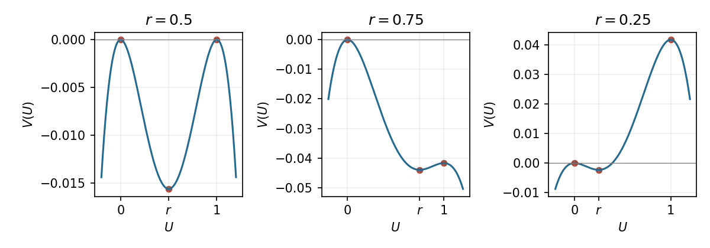

<h1 id="13b/c/solution">Solution</h1>

↑ **Parent:** [C](../c.md)

A [travelling wave](../../../../../../travelling-wave.md) $u(x,t)=U(x-vt)$ obeys $mU''+vU'+f(U)=0$, so the mechanical potential in the requested form is $V=F$, up to an additive constant. Here

$$
F(U)=-\frac14U^2(1-U)^2+\frac16(r-\tfrac12)U^2(2U-3).
$$

Its stationary points are maxima at $0,1$ and a minimum at $r$. Since $F(0)=0$ and $F(1)=(1-2r)/12$, the two maxima have equal height at $r=1/2$; the maximum at $1$ is lower for $r>1/2$ and higher for $r<1/2$.

**[Figure 4](#13b/c/image-bistable-front-potentials-with-equal-and-unequal-endpoint-maximum-heights). Bistable front potentials with equal and unequal endpoint maximum heights**.

Multiply the wave equation by $U'$ and integrate along the [heteroclinic orbit](../../../../../../heteroclinic-orbit.md). The endpoint derivatives vanish, and $U(-\infty)=1$, $U(\infty)=0$, so

$$
0=\frac m2[(U')^2]_{-\infty}^{\infty}+v\int_{-\infty}^{\infty}(U')^2dz+F(0)-F(1).
$$

Consequently

$$
\boxed{v\int_{-\infty}^{\infty}(U')^2dz=\frac{1-2r}{12},\qquad \operatorname{sgn}v=\operatorname{sgn}(1-2r).}
$$

The integral is positive for a nonconstant front. In fact substitution of the same logistic shape from part (b) gives the exact velocity $v=\sqrt{m/2}(1-2r)$. Thus the $u=1$ phase invades rightwards when $r<1/2$, the zero phase invades leftwards when $r>1/2$, and the balanced front is stationary.

## ↑ Ancestors (11)

1. [C](../c.md)
2. [13B](../../13b.md)
3. [Paper 2](../../../paper-2-split.md)
4. [Ii](../../../split.md)
5. [2008](../../../../split.md)
6. [Past exam of the mathematics course of the University of Cambridge](../../../../../split.md)
7. [Mathematics course of the University of Cambridge](../../../../../../mathematics-course-of-the-university-of-cambridge.md)
8. [Course of the University of Cambridge](../../../../../../course-of-the-university-of-cambridge.md)
9. [University of Cambridge](../../../../../../university-of-cambridge-split.md)
10. [List of universities](../../../../../../list-of-universities.md)
11. [Codex Wiki](../../../../../../split.md)
